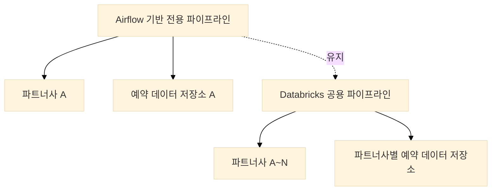
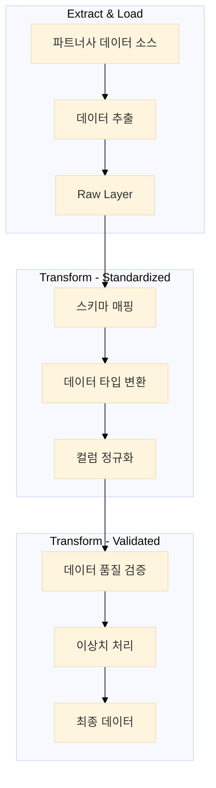

# 파트너사 확장에 따른 데이터 수집 파이프라인 설계 사례

## 1. 배경
기존에는 Airflow 기반의 전용 데이터 수집 파이프라인을 운영하고 있었습니다.  
해당 파이프라인은 특정 파트너사의 예약 데이터를 `.tar.gz` 형식으로 수신하여, 내부의 `.csv` 테이블 데이터를 정제 및 병합한 후 저장하는 구조였습니다.  
파일 구조와 테이블 스키마가 고정되어 있었기 때문에 안정적으로 운영할 수 있었습니다.

그러나 파트너사 수가 증가하면서 다양한 포맷의 예약 데이터가 유입되었고, 기존 구조로는 확장에 한계가 발생하였습니다. 데이터 형식이 서로 달랐고, 필수 컬럼이 누락된 경우도 있었으며, 컬럼 이름이 중복되는 경우도 있었습니다.
이러한 상황에서는 모델 학습이 어려웠고, 신규 파트너사 연동에도 많은 시간이 소요되었습니다.

그래서 **"모델 학습에 쓸 수 있을 만큼 품질 좋은 데이터를 자동으로 모을 수 있는 공용 ELT 파이프라인"**을 만들기로 했습니다.

이에 따라 파이프라인의 스키마 정리, 주요 처리 흐름 설계, 핵심 모듈 구현을 담당하여 Databricks 기반의 공용 데이터 수집 파이프라인을 신규로 설계 및 구축하게 되었습니다.

## 2. 요구사항

### 2.1 기능 요구사항
- **다양한 포맷 지원**: `.csv`, `.json`, `.parquet` 등 다양한 포맷의 데이터를 수집할 수 있어야 함
- **스키마 자동 감지**: 데이터 포맷에 따라 스키마를 자동으로 감지하고, 컬럼 타입을 적절히 변환해야 함
- **데이터 품질 검증**: 필수 컬럼 존재 여부, 데이터 타입, 값 범위 등을 검증하고, 문제가 있는 경우 로그를 남겨야 함
- **확장성**: 새로운 파트너사가 추가될 때, 코드 수정 없이 설정 파일만으로 연동할 수 있어야 함
- **모니터링**: 각 단계별 처리 현황과 오류를 실시간으로 모니터링할 수 있어야 함

### 2.2 비기능 요구사항
- **성능**: 대용량 데이터를 처리할 수 있어야 함 (일일 수백 GB)
- **안정성**: 장애 발생 시 자동 복구가 가능해야 함
- **보안**: 데이터 암호화 및 접근 제어가 필요함

## 3. 구현

### 3.1 구조 설계
여러 파트너의 데이터를 하나의 파이프라인에서 처리하려면 유연하면서도 일관된 구조가 필요했습니다.
설계한 구조는 다음과 같습니다:

1. **Raw Layer**: 수집한 데이터를 원본 그대로 저장 (Load)
2. **Standardized Layer**: 컬럼 이름 정리, 타입 변환 등 스키마 통일 (Transform)
3. **Validated Layer**: 결측치, 중복, 논리 오류 검증 후 최종 저장 (Transform)

각 단계는 Databricks Job으로 구성했고, JSON 기반 스키마 정의 파일을 읽어 처리 흐름을 자동으로 제어하게 했습니다.

#### 3.1.1 ETL vs ELT 선택 배경

현재 파이프라인은 ELT(Extract, Load, Transform) 방식으로 설계되었습니다. 이는 다음과 같은 이유 때문입니다:

1. **데이터 소스의 다양성**
   - 여러 파트너사로부터 다양한 포맷의 데이터가 유입됨
   - 각 파트너사마다 스키마가 다르고, 컬럼명이 다르며, 데이터 품질도 상이
   - 이런 경우, 모든 데이터를 먼저 로드한 후 변환하는 것이 더 효율적

2. **현재 아키텍처 구조**
   - Raw → Standardized → Validated의 3단계 구조는 ELT 패턴에 더 적합
   - Raw Layer: 데이터를 원본 그대로 저장 (Load)
   - Standardized Layer: 스키마 통일 및 변환 (Transform)
   - Validated Layer: 데이터 품질 검증 (Transform)

3. **확장성 고려**
   - 파트너사 확장이라는 요구사항을 고려할 때, ELT가 더 유연
   - 새로운 파트너사가 추가될 때마다 변환 로직을 수정하는 것보다, 원본 데이터를 먼저 저장하고 나중에 변환하는 것이 더 안전

4. **데이터 품질 관리**
   - 현재 구현된 데이터 품질 검증 로직은 ELT 방식에서 더 효과적
   - 원본 데이터를 보존하면서 변환 및 검증을 수행할 수 있어, 문제 발생 시 원인 파악이 용이

5. **기술 스택 적합성**
   - Databricks와 Delta Lake를 사용하는 현재 기술 스택은 ELT에 더 적합
   - Delta Lake의 ACID 트랜잭션과 파티셔닝 기능은 대용량 데이터의 변환 작업에 최적화

### 3.2 Workflow 구성
ELT 파이프라인의 각 단계는 다음과 같이 구성되었습니다:

1. **Extract & Load 단계**
   - 파트너사별 데이터 소스에서 데이터를 추출
   - Raw Layer에 원본 데이터를 그대로 저장
   - 데이터 포맷에 따른 자동 스키마 감지

2. **Transform 단계 (Standardized Layer)**
   - 스키마 정의 파일을 기반으로 컬럼 매핑
   - 데이터 타입 변환 및 정규화
   - 중복 컬럼 처리 및 이름 충돌 해결

3. **Transform 단계 (Validated Layer)**
   - 데이터 품질 검증 규칙 적용
   - 이상치 및 오류 데이터 식별
   - 검증 결과 로깅 및 리포트 생성

### 3.3 핵심 모듈 구현

#### 3.3.1 스키마 관리
- JSON 기반의 스키마 정의 파일 사용
- 파트너사별 스키마 매핑 규칙 정의
- 동적 스키마 감지 및 변환 로직 구현

#### 3.3.2 데이터 품질 검증
- 필수 컬럼 존재 여부 확인
- 데이터 타입 및 값 범위 검증
- 비즈니스 규칙 기반 검증

#### 3.3.3 모니터링 및 알림
- 각 단계별 처리 현황 추적
- 오류 발생 시 실시간 알림
- 처리 결과 리포트 자동 생성

## 4. 결론
ELT 방식의 파이프라인을 통해 다음과 같은 이점을 얻을 수 있었습니다:

1. **유연한 데이터 처리**
   - 다양한 포맷의 데이터를 효율적으로 처리
   - 파트너사 확장이 용이한 구조

2. **데이터 품질 향상**
   - 원본 데이터 보존으로 문제 추적 용이
   - 체계적인 데이터 검증 프로세스

3. **운영 효율성**
   - 자동화된 처리 흐름
   - 실시간 모니터링 및 알림

앞으로도 지속적인 개선을 통해 더욱 안정적이고 확장 가능한 ELT 파이프라인을 구축할 계획입니다.

## 5. 마무리

이번 글에서는 데이터 수집부터 스키마 정리까지 다뤘습니다.
다음 글에서는 데이터 품질 검증 로직, 테스트 자동화, 운영 구조에 대해 조금 더 자세히 소개해볼 생각입니다.

이번 프로젝트를 통해 공용 파이프라인 설계와 운영의 기반을 마련할 수 있었습니다.
이후에는 Transformation 및 DQA 체계를 포함한 전반적인 데이터 파이프라인의 자동화와 통합 운영을 목표로, 구조를 지속적으로 개선해 나갈 예정입니다.