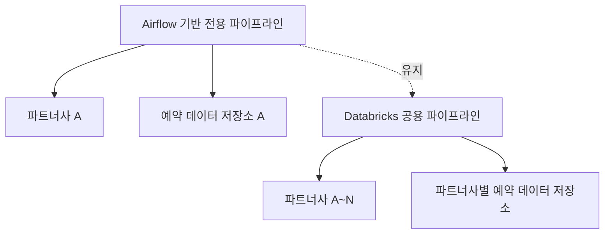

## 1. 도입

파트너 확장에 따라 예약 데이터를 수집·정제하는 기존 파이프라인의 한계가 명확해졌습니다. 초기에는 Airflow 기반의 전용 파이프라인으로 특정 파트너사의 `.csv` 데이터를 안정적으로 처리하고 있었지만, 파트너 수가 증가하면서 상황은 복잡해졌습니다.

다양한 데이터 포맷과 스키마, 누락 컬럼, 중복 컬럼 등으로 인해 기존 구조로는 확장이 어려워졌고, 신규 파트너 연동에 지나치게 많은 리소스가 투입되고 있었습니다.

이에 따라, **모델 학습에 활용할 수 있을 정도로 품질 높은 데이터를 자동으로 수집·정제할 수 있는 공용 ELT 파이프라인**을 기획하게 되었습니다.

> 현재 데이터 구조는 파악되어 있으며, 실제 수집을 위한 접근(SFTP 기반)은 내부 논의 중입니다.  
> 본 글은 파이프라인 구조 설계 및 처리 흐름 정의를 중심으로 정리한 내용이며, 구현 과정 및 데이터 처리 이슈는 후속 글에서 다룰 예정입니다.

## 2. 구조 개요

기존 파이프라인은 파트너 단위 전용 구조였으며, 신규 설계는 설정 기반의 확장 가능한 구조로 방향을 전환하였습니다.

핵심 변화는 파트너마다 분리된 수집 구조를, 설정 중심의 통합 수집 구조로 전환한 점입니다.

## 3. 요구사항 정리

### 3.1 기능적 요구사항
- **다양한 포맷 지원**: `.csv`, `.json`, `.parquet` 등 다양한 형식의 예약 데이터 수집
- **스키마 자동 감지**: 유입되는 데이터에 대한 스키마 자동 추론 및 컬럼 정규화
- **데이터 품질 검증**: 필수 컬럼, 데이터 타입, 값 범위 등 사전 검증 로직
- **확장성**: 신규 파트너 연동 시 코드 변경 없이 설정만으로 연결 가능
- **모니터링**: 단계별 처리 현황과 오류 추적, 알림 시스템 연동

### 3.2 비기능적 요구사항
- **성능**: 일일 수백 GB 규모 데이터 처리
- **안정성**: 장애 발생 시 자동 재처리 및 복구 메커니즘
- **보안**: 전송 및 저장 구간 암호화, 접근 제어 포함

## 4. 설계 방향

데이터 수집부터 정제·검증까지의 흐름을 다음과 같은 3단계 구조로 정의하였습니다:

1. **Raw Layer**: 수집된 데이터를 가공 없이 저장
2. **Standardized Layer**: 컬럼 이름 통일, 타입 정리 등 표준화 처리
3. **Validated Layer**: 품질 검증 및 이상치 처리 후 최종 저장

ELT(Extract, Load, Transform) 구조를 선택한 이유는 다음과 같습니다:
- 다양한 스키마로 인한 복잡도를 로드 후 변환 구조로 대응
- 원본 데이터 보존 및 변환 이력 관리가 용이
- Delta Lake 기반 처리 구조가 ELT 패턴과 잘 맞음

## 5. 주요 설계 포인트 및 향후 계획

현재는 전체 구조 및 처리 흐름에 대한 설계가 완료된 상태이며, 실제 모듈 구현은 내부 논의 및 정제 기준 확정 이후 진행될 예정입니다. 핵심적으로 고려 중인 설계 포인트는 다음과 같습니다:

- **스키마 관리 자동화**: JSON 기반 매핑 파일 활용 → 향후 Delta Lake의 Schema Evolution 적용
- **데이터 검증 규칙 표준화**: 공통 품질 규칙 셋 정의 → 파트너별 예외 설정 지원
- **파티션 전략 수립**: repartition, coalesce 기반의 효율적 리소스 사용 설계

## 6. 마무리

현재까지는 전체 ELT 파이프라인의 구조와 방향성을 정립하는 데 중점을 두었습니다. 실제 구현은 단계적으로 진행될 예정이며, 다음 글에서는 다음 항목들을 다룰 계획입니다:

- 실제 구현 시 고려한 품질 검증 로직
- 테스트 자동화 전략
- 모니터링 및 알림 구성 방식

논의와 검토가 생각보다 많은 시간이 걸리고 있지만, 구조를 명확히 설계해 두는 것이 이후 운영 효율성에 중요한 기반이 된다고 믿으며 꼼꼼히 진행하고 있습니다.