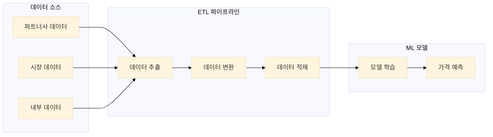
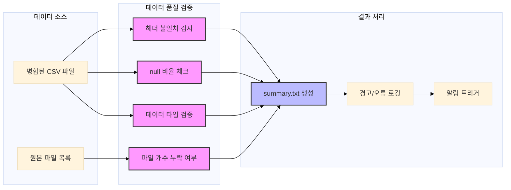

## 1. 개요 및 배경

작년에 저희 팀은 여행 예약 플랫폼에 다이나믹 프라이싱 서비스를 런칭했고, 올해 저는 파이프라인 구축 담당으로 투입되었습니다. 다이나믹 프라이싱이란 시장 상황, 수요 변화, 경쟁사 가격 등 다양한 요소를 실시간으로 분석하여 최적의 가격을 자동으로 책정하는 시스템입니다. 현재는 해외 파트너사 하나의 데이터만 처리하고 있지만, 곧 국내외 파트너사가 추가로 합류할 예정입니다. 문제는 각 파트너마다 데이터 구조와 형식이 제각각이라, 이를 효율적으로 통합 처리할 수 있는 표준화된 파이프라인이 필요했습니다.

그동안 저는 주로 사내 툴 개발만 해왔기 때문에, 하루에 수만 개의 파일을 처리하는 빅데이터 환경은 완전히 새로운 세계였습니다. 분산 처리 시스템을 구축하고, 작업을 병렬화하며, 대용량 파일을 병합하는 등 실제 문제를 해결하면서 이론으로만 알고 있던 빅데이터 개념들을 직접 구현해보는 재미를 느낄 수 있었습니다. 특히 책이나 강의에서 배웠던 분산 컴퓨팅 원리가 실제 환경에서 어떻게 적용되는지 경험하고, 그 과정에서 발생하는 다양한 도전 과제들을 해결하며 데이터 엔지니어링에 대한 실전 역량을 키울 수 있었습니다.

> 이 글은 완성된 솔루션을 제시하는 것이 아니라, 대규모 데이터 엔지니어링과 배치 프로세싱 도입 과정에서 겪은 시행착오와 교훈을 기록한 학습 여정입니다.

## 2. 프로젝트 배경 상세

여행 예약 플랫폼의 핵심 서비스인 다이나믹 프라이싱 시스템을 운영하고 있습니다. 이 서비스는 실시간으로 시장 상황과 경쟁사 가격을 분석하여 최적의 가격을 결정하는 시스템으로, 향후 다양한 파트너사로 서비스 제공을 확대할 계획입니다.

기존 데이터 파이프라인의 주요 문제점:
1. **스키마 종속성**: 레거시 시스템 전용 스키마로 타 파트너사 데이터 재활용 불가
2. **스토리지 비용 상승**: 지속적인 원본 데이터 적재로 관리 비용과 스토리지 비용 증가
3. **비효율적인 인제스트 방식**: 변경 감지 메커니즘 부재로 중복 적재 및 리소스 낭비
4. **DQA 체계 부재**: 실시간/배치 기반 데이터 품질 검증 체계 미흡

현재 파트너사의 데이터는 CSV 파일로 단편화되어 있고, 테이블명과 컬럼이 불명확하여 의미를 파악하기 어렵습니다. NULL 값과 중복 레코드가 다수 존재하며, 프라이머리 키 충돌이 빈번하여 데이터 무결성이 떨어져 증분 적재(incremental append)도 불가능하고 일일 스냅샷으로 전체 데이터를 오버라이트하고 있는 상황입니다.

### 1.5 Dynamic Pricing Solution 구조


Dynamic Pricing Solution은 실시간으로 시장 상황과 경쟁사 가격을 분석하여 최적의 가격을 결정하는 시스템입니다. 시스템의 핵심은 정확하고 신뢰할 수 있는 데이터입니다.

### 1.6 ETL 파이프라인의 필요성


다이나믹 프라이싱 모델이 정확한 가격을 예측하려면 여러 소스의 데이터를 깔끔하게 정리해서 합쳐야 합니다. 이 모델은 크게 세 종류의 데이터를 활용합니다:

| 데이터 종류   | 설명                                                         |
|--------------|--------------------------------------------------------------|
| 파트너사 데이터 | 고객의 실제 예약 내역, 검색 패턴, 예약 취소율 등 고객 행동 데이터 |
| 시장 데이터   | 지역별 수요 동향, 경쟁 호텔 가격 정보, 계절적 특성, 이벤트 정보 등 |
| 내부 데이터   | 호텔 정보(등급, 시설, 객실 타입), 과거 가격 책정 전략과 실적 데이터 등 |

이런 다양한 데이터는 각기 다른 형식과 구조를 가지고 있어서, 이를 ML 모델이 학습할 수 있는 형태로 변환하는 과정이 필요합니다. 바로 이 작업을 자동화하고 효율적으로 처리하기 위해 ETL(Extract, Transform, Load) 파이프라인을 구축하게 되었습니다. 이 파이프라인을 통해 데이터 품질을 일관되게 유지하고, 최종적으로 모델의 가격 예측 정확도를 높일 수 있었습니다.

## 3. 단계적 접근 전략

이 프로젝트는 규모와 복잡성을 고려하여 다음과 같이 4단계 로드맵으로 계획했습니다:

| Phase | 설명 |
|------|------|
| **Phase 1** | SFTP → S3 → 병합 파이프라인 마이그레이션<br>- 기존 Airflow 기반 SFTP 수신 및 S3 저장 파이프라인을 Databricks로 마이그레이션<br>- 수만 개의 파일을 효율적으로 처리하는 병합 작업 구현 |
| **Phase 2** | 데이터 인제스트, 스키마 정규화, 스토리지 최적화<br>- 다양한 파트너사의 데이터 인제스트 방식을 수용할 수 있도록 파이프라인 리팩토링<br>- 스키마 처리 로직을 유연하게 설계하여 이기종 데이터 구조 대응 |
| **Phase 3** | DQA(Data Quality Assurance) 및 데이터 인제스트 표준화<br>- 데이터 품질 검증 프로세스 구현 및 자동화<br>- 다양한 파트너사의 데이터 인제스트 방식을 표준화된 방식으로 통합 |
| **Phase 4** | 스키마 통합 및 최적화<br>- 파트너사별 상이한 스키마를 통합된 형태로 정규화<br>- 데이터 사이언티스트들과 협력하여 최적의 스키마 설계 |

각 단계는 이전 단계의 성과를 기반으로 하며, 단계별로 명확한 목표와 결과물을 정의하여 점진적으로 시스템을 개선해 나갈 계획입니다. 현재는 Phase 1을 진행 중이며, 이 글에서는 Phase 1에서 겪은 경험과 배운 점을 중점적으로 공유합니다.

## 4. 현재 파트너사의 데이터 특성

현재 해외 파트너사로부터 수신하는 데이터는 다음과 같은 특성을 갖고 있습니다:

- **데이터 볼륨**
  - 일일 수만 개의 `.tar.gz` 압축 파일 수신
  - 각 압축 파일은 수백 MB 크기
  - 압축 파일 내부에는 테이블별 `.csv` 파일 다수 포함

- **데이터 스키마**
- 파일명 패턴: `{table_name}_{date}_{batch_id}.csv` 형식으로 제공
  - 테이블마다 스키마와 컬럼 수가 상이 → 병합시 스키마 불일치 이슈
  - 일부 테이블은 일자별 스키마 변동 가능성으로 다이나믹 스키마 핸들링 필요

- **데이터 품질 관리 요건**
  - 데이터 누락/오류 발생 시 ML 파이프라인에 치명적 영향
  - 데이터 정합성과 처리 효율성을 위한 표준화된 프로세싱 필요

## 5. 문제 정의와 구조 개선 과정

### 5.1 초기 접근의 실패

초기에는 데이터 처리 과정을 너무 단순하게 바라보았습니다. "파일을 읽고 병합하는 정도면 충분할 것 같다"라는 안일한 생각으로 시작했지만, 실제 구현 과정에서 여러 기술적 장벽에 부딪혔습니다.

로컬 개발 환경에서 Python 스크립트로 첫 시도를 했을 때는, 수만 개의 `.tar.gz` 파일을 처리하려다 보니 메모리 부족으로 프로세스가 강제 종료되는 상황이 반복적으로 발생했습니다. 특히 `pandas`를 사용한 데이터 병합 과정에서 32GB RAM 환경에서도 OOM(Out of Memory) 에러가 빈번하게 발생했습니다. 

이후 `multiprocessing`을 도입해 병렬 처리를 시도했지만, 프로세스 간 메모리 공유의 제약으로 인해 실제 성능 향상은 미미했습니다. 코드의 복잡성만 증가하는 상황이었습니다.

### 5.2 Databricks 환경으로의 전환

마침 데이터팀이 Airflow에서 Databricks로의 워크플로우 플랫폼 마이그레이션을 진행 중이었고, 이를 계기로 Databricks 환경으로 개발을 전환하게 되었습니다. 이는 단순한 환경 전환을 넘어, 확장 가능한 데이터 처리 아키텍처를 구축하는 중요한 전환점이 되었습니다.

Databricks로 전환하면서 다음과 같은 이점을 얻을 수 있었습니다:
- Spark 기반 분산 처리 환경 제공
- 클러스터 자동 스케일링 기능
- 워크플로우 관리 및 스케줄링 기능
- 통합 모니터링 및 로깅 시스템

하지만 Databricks 환경에서도 초기에는 `coalesce(1)`로 모든 테이블을 일괄 병합하려다가 Driver 메모리 부족으로 Job이 실패하는 문제가 발생했습니다.

### 5.3 구조 개선 과정

초기 실패를 통해 다음과 같은 인사이트를 얻었습니다:

1. **워크로드 특성 차이**
   - `.tar.gz` 압축 해제: CPU-bound 작업
     - 압축 해제는 순수 CPU 계산에 집중된 작업으로, 병렬로 처리하면 CPU 리소스를 많이 사용합니다.
     - CPU-bound 작업은 워커 수가 많아도 CPU 코어 수가 적으면 병목이 발생합니다. Spark보다는 멀티 스레딩이나 Databricks의 분산 Task Queue로 분리하는 것이 더 효율적입니다.
   - 파일 병합: IO-bound + Spark shuffle 오퍼레이션
     - 다수의 파일을 합치는 과정은 디스크/네트워크 IO가 많이 발생하며, Spark에서는 coalesce, repartition, groupBy 같은 연산이 발생해 shuffle이 발생합니다.
     - IO-bound 작업은 스토리지의 병렬 처리 성능(S3, ADLS Gen2, GCS 등)과 tightly coupled합니다. 과도한 shuffle은 stage 재시도 및 OOM 오류 유발 가능성이 높으므로 주의해야 합니다.
   - 상이한 특성을 가진 작업은 분리 필요
     - CPU-bound와 IO-bound 작업을 같은 노드에서 동시에 처리하면 서로 자원 경합이 발생합니다.
     - 분리된 스테이지(모듈) 또는 Databricks Workflow로 구성된 마이크로 파이프라인으로 쪼개는 것이 안정성과 확장성 모두에 유리합니다.

2. **디버깅 복잡성**
   - 단일 Notebook에서 모든 로직 실행
     - Notebook에 모든 파이프라인 단계를 넣으면 디버깅이 쉬워 보일 수 있으나, 실제로는 스파게티 코드화됩니다.
     - 디버깅이 힘든 이유는 stateful 실행 환경이기 때문입니다. 하나의 셀에서 전체 실행을 반복하는 방식은 재현성, 캐시 충돌, 실행 이력 파악이 어렵습니다.
   - 오류 발생 시 근본 원인 분석 어려움
     - 논리적 경계가 없으면 "이전 단계가 실패했는지, 현재 단계가 실패했는지" 모호해집니다.
     - 구조적으로 분리된 모듈(예: ingestion, preprocessing, transformation, output)로 나누고 step-by-step retry + logging 체계를 갖춰야 분석이 가능합니다.
   - 높은 결합도로 인한 부분 수정 어려움

3. **장애 복구 비효율성**
   - 병합 작업 실패 시 압축 해제부터 재실행 필요
     - `.tar.gz`에서 압축을 해제한 후 다음 단계로 넘어가야 하는데, 병합 단계 실패 시 압축 해제부터 다시 실행됩니다.
     - 상태 저장이 안 된 상태에서 전처리와 후처리를 결합하면 idempotency 보장도 어렵고, check-pointing이 불가능해집니다.
   - 이미 성공한 작업도 반복 실행
     - 부분 성공을 기록하지 않는 구조라서, 병합 실패 시 이전까지 성공했던 것도 모두 재시작되어 비효율적입니다.
     - 해결 방법: 단계별로 intermediate output을 저장(Delta Lake checkpoint, S3 단계별 output 등), 실패 시 해당 단계만 재실행 가능하게 설계해야 합니다.

#### 구조 개선 방향 요약 (DE Best Practice 관점)

| 문제 | 원인 | 개선 방안 |
|------|------|-----------|
| CPU/IO 워크로드 섞임 | 리소스 경합 | 모듈 분리 (CPU-bound는 별도 스크립트로) |
| 디버깅 어려움 | 단일 Notebook 실행 | 각 단계별 분리 + 로그 저장 + Airflow 도입 |
| 장애 복구 비효율 | 상태 저장 안 됨 | Checkpoint 도입 + 성공한 단계는 재사용 가능하게 설계 |

### 5.4 Task 분리 아키텍처 도입

문제 해결을 위해 파이프라인을 독립적인 Task들로 분리했습니다. 이 과정에서 여러 중요한 아키텍처 결정을 내려야 했으며, 각 선택에는 명확한 트레이드오프가 있었습니다.

#### 압축 해제 Task
파트너사가 제공한 `.tar.gz` 압축 파일을 풀어서 개별 CSV 파일들을 추출하는 작업입니다. Python의 기본 라이브러리인 `tarfile`을 사용했고, 파일을 임시 디렉토리에 저장하는 대신 바로 S3에 업로드하여 디스크 공간을 절약했습니다.

**트레이드오프**:
- **임시 디스크 저장 vs 직접 S3 업로드**:
  - 임시 디스크 저장: 빠른 접근 속도, 디스크 I/O 최적화 가능하지만 디스크 공간 제약과 클린업 필요
  - 직접 S3 업로드: 디스크 공간 절약, 노드 간 데이터 공유 용이, 영구 저장이 가능하지만 네트워크 오버헤드와 S3 비용 발생

#### 병합 Task
압축 해제된 수많은 CSV 파일들을 테이블별로 모아서 하나의 큰 파일로 합치는 작업입니다. 이 과정에서 각 테이블의 구조 정보(컬럼명, 데이터 타입 등)를 JSON 파일로 저장해 활용했습니다.

**트레이드오프**:
- **단일 프로세스 vs 분산 처리**:
  - 단일 프로세스: 구현 간단, 디버깅 용이하지만 메모리 제약과 확장성 부족
  - 분산 처리: 대용량 데이터 처리, 확장성, 병렬 처리의 장점이 있지만 복잡한 구현과 디버깅 어려움

#### 각 작업의 분리 실행
처음에는 모든 작업을 하나의 큰 프로그램으로 실행했다가 메모리 부족 문제가 발생했습니다. 그래서 압축 해제와 병합을 별도의 Databricks 작업으로 분리하여 각각 실행했더니 리소스 활용이 효율적으로 개선되었습니다.

**트레이드오프**:
- **모놀리식 vs 모듈화**:
  - 모놀리식: 간단한 구현, 상태 관리 용이하지만 메모리 부족, 장애 복구 비효율
  - 모듈화: 독립적 실행, 선택적 재실행, 리소스 최적화의 장점이 있지만 복잡한 워크플로우 관리, 상태 추적 어려움

#### 작업 간 연결 방식
각 작업은 직접 데이터를 주고받는 대신, S3 버킷 경로를 통해 간접적으로 연결했습니다. 예를 들어 압축 해제 작업은 결과물을 S3에 저장하고, 병합 작업은 그 S3 경로를 읽어와서 처리하는 방식입니다. 이렇게 하면 각 작업이 독립적으로 실행되고 실패해도 전체 파이프라인이 중단되지 않는 장점이 있습니다.

**트레이드오프**:
- **직접 데이터 전달 vs S3 경로 기반 연결**:
  - 직접 데이터 전달: 빠른 전송, 메모리 효율성, 작업 간 강한 결합, 장애 복구 어려움
  - S3 경로 기반: 작업 독립성, 장애 복구 용이, 확장성의 장점이 있지만 추가 I/O 오버헤드, 지연 시간 증가
- **장기적 고려사항**: 느슨한 결합(loose coupling)은 데이터 파이프라인의 안정성과 확장성을 높입니다. 작업 간 직접 의존성을 줄이고 중간 저장소를 활용하는 것이 장기적으로 유지보수에 유리합니다.

### 5.5 Workflow 기반 전환

Task 분리 후, 더 나은 관리와 자동화를 위해 Databricks Workflow로 전환했습니다:

- **Workflow 구성 세부사항**
  - `pre_set_date`: process_date 파라미터가 미설정 시 어제 날짜로 디폴트 설정
  - `wait_for_all_sources`: 모든 소스 파일 Readiness 체크
  - `batch_extract`: .tar.gz 파일 압축 해제 및 S3 업로드
  - 각 테이블별 `merge_*` task: 독립적인 병합 작업 수행
  - `merge_summary`: 모든 병합 완료 후 summary.txt 생성
  - `post_merge_check`: 최종 결과 검증

- **Workflow 전환의 이점**
  - 병렬 프로세싱 최적화: 각 테이블 병합을 독립적으로 실행하여 전체 처리 시간 단축
  - 장애 복구 효율화: 실패한 task만 선택적 재실행 가능
  - 모니터링 고도화: 태스크별 상태 실시간 트래킹
  - 유지보수성 향상: 태스크별 책임 명확화
  - 스케일 아웃: 새로운 테이블 통합 용이성

### 5.6 Spark 분산 처리 아키텍처 최적화

Workflow 기반 전환 후, Spark 분산 처리 아키텍처를 최적화하여 성능을 향상시켰습니다:

- **문제**: `pandas` 기반 병합 시 수만 개 파일은 메모리 한계 초과, Spark도 다수의 테이블 일괄 처리 시 Driver 과부하로 종료

- **솔루션**:
  - 병합 작업을 **테이블 단위로 샤딩**
  - 테이블별 개별 `SparkSession` 생성
  - Spark에서 `coalesce(1)`로 단일 CSV로 저장하되, 읽기/셔플은 분산 처리 유지

- **실제 구현**: 
  - 테이블별로 별도의 Databricks 작업을 생성하여 병렬 처리
  - 각 작업은 독립적으로 실행되며, 실패 시 해당 테이블만 재실행 가능
  - 기본적인 Spark 설정을 사용하여 안정적인 처리를 우선시

## 6. 성능 최적화 전략

### 6.1 Spark 분산 처리 아키텍처

- **문제**: `pandas` 기반 병합 시 수만 개 파일은 메모리 한계 초과, Spark도 다수의 테이블 일괄 처리 시 Driver 과부하로 종료

- **솔루션**:
  - 병합 작업을 **테이블 단위로 샤딩**
  - 테이블별 개별 `SparkSession` 생성
  - Spark에서 `coalesce(1)`로 단일 CSV로 저장하되, 읽기/셔플은 분산 처리 유지

- **실제 구현**: 
  - 테이블별로 별도의 Databricks 작업을 생성하여 병렬 처리
  - 각 작업은 독립적으로 실행되며, 실패 시 해당 테이블만 재실행 가능
  - 기본적인 Spark 설정을 사용하여 안정적인 처리를 우선시

### 6.2 리소스 최적화

- **현재 상태**:
  - 기본적인 클러스터 설정으로 운영 중
  - 워크로드 증가 시 수동으로 클러스터 크기 조정
  - 비용 효율성과 성능 사이의 균형점을 찾는 과정 중

- **향후 계획**:
  - Auto-scaling 클러스터 구성 검토
  - 워크로드 패턴 분석을 통한 최적 클러스터 크기 결정
  - 비용 효율적인 인스턴스 타입 및 스케일링 전략 수립

## 7. 데이터 품질 검증 및 summary 로깅

### 7.1 데이터 품질 검증

데이터 품질 검증의 중요성:
- ML 모델 학습 데이터 품질은 예측 정확도에 직결
- 파트너사 데이터 제공 방식 변경 시 자동 감지 필요
- 데이터 누락/오류는 의사결정에 치명적 영향 가능

데이터 품질 관리의 실제 도전 과제:
- **품질 차원의 다양성**: NULL 값, 컬럼 누락 외에도 데이터 타입 불일치, 비즈니스 룰 위반, 이상치(outlier) 등 다양한 품질 이슈 존재
- **품질 메트릭의 컨텍스트 종속성**: 비즈니스 컨텍스트에 따라 품질 기준이 상이함
- **시계열적 품질 변동**: 파트너사 데이터 제공 패턴 변화로 예측 불가능한 품질 이슈 발생
- **대규모 데이터 검증의 오버헤드**: 수만 개 파일의 자동화된 검증 체계 구축 난이도

### 7.1.3 데이터 품질 검증 프로세스

이 프로세스는 데이터의 품질을 검증하는 핵심 단계를 보여줍니다:



**데이터 품질 검증 프로세스의 특징**:
1. **검증 범위**: 데이터의 구조적, 의미적 품질을 모두 검사
   - 헤더 불일치: 스키마 정합성 검증
   - NULL 비율: 데이터 완전성 검증
   - 파일 개수: 데이터 누락 여부 확인
   - 데이터 타입: 값의 유효성 검증

2. **검증 방식**: 다각도의 동시 검증 수행
   - 병합된 CSV 파일에 대한 다중 검증
   - 원본 파일과의 비교 검증

3. **결과 처리**: 단계적 에스컬레이션
   - 검증 결과를 summary.txt에 기록
   - 이슈 발생 시 경고/오류 로깅
   - 심각한 문제 발생 시 알림 트리거

### 7.2 Summary 로깅

Summary 로깅은 전체 ETL 프로세스의 실행 메트릭과 성능을 모니터링하기 위한 메타데이터를 수집하고 기록하는 프로세스입니다. 현재는 기본적인 로깅 기능만 구현되어 있으며, 향후 더 포괄적인 모니터링 시스템으로 확장할 계획입니다.

#### 현재 구현된 기능

1. **파일 카운트 집계**
   - 원본 및 병합 후 파일 수 검증
   - 각 테이블별 .csv 파일 개수 확인
   - 테이블 병합 전후의 총 파일 수 및 용량 (MB) 기록
   - `_SUCCESS` 및 `merged_<table>.csv`의 존재 여부 확인

2. **레이턴시 측정**
   - 단계별 처리 소요 시간 트래킹
   - S3 상태 점검, 읽기, 쓰기, 리네이밍, 전체 병합 소요 시간 측정
   - 각 단계는 `log_time()`을 통해 초 단위로 기록

3. **오류 및 경고 집계**
   - 파일 없음, 스키마 오류, 빈 파일 등 예외 상황 기록
   - `s3.head_object`, `df.rdd.isEmpty`, `try/except` 블록에서 감지
   - WARN 및 ERROR 메시지로 구분하여 stdout 및 로그에 출력

4. **Null 비율 및 데이터 품질 분석**
   - 각 테이블에서 null 값이 많은 컬럼 자동 탐지
   - `df.select(...).agg(...)`를 통해 컬럼별 null 비율 로그 출력
   - 품질 이슈가 예상되는 컬럼 표시

5. **컬럼 수 및 스키마 정보 수집**
   - `df.columns`의 길이와 `df.printSchema()` 결과 저장
   - 컬럼 수가 과도하거나 불균형할 경우 경고

6. **병목 원인 추정**
   - 다음 기준으로 병목 가능성을 로깅:
     - 파일 수가 많음 (> 1,000개)
     - 입력 데이터 용량이 큼 (> 1GB)
     - null 비율이 높음 (> 50%)
     - 컬럼 수가 많음 (> 200)
     - 병합 시간이 5분 이상 소요됨

7. **최종 리포트 업로드**
   - 전체 테이블 병합 시간 및 처리 정보 요약 파일:
     - `merge_summary_<date>.json` 또는 `.csv`
     - 업로드 위치: `s3://.../logs/summary/yyyy/mm/dd/`
     - 포함되는 형식 예시:
       ```json
       {
         "table": "fasfoliodetail",
         "start_time": "2025-04-08T13:00:01",
         "end_time": "2025-04-08T13:38:10",
         "duration_sec": 2289,
         "input_size_mb": 3597.3,
         "csv_files": 1,
         "null_ratio": {"col1": 0.12, "col2": 0.76},
         "status": "SUCCESS"
       }
       ```

#### 향후 확장 계획

현재는 기본적인 로깅 기능만 구현되어 있지만, 향후 다음과 같은 기능을 추가할 계획입니다:

1. **리소스 사용량 모니터링**
   - 메모리, CPU, 디스크 I/O 등 리소스 사용량 추적
   - 병목 현상 조기 감지를 위한 임계치 기반 알림

2. **알림 시스템 통합**
   - Slack, Email 등 외부 알림 시스템과 연동
   - 중요 이벤트 발생 시 자동 알림 발송

3. **대시보드 구축**
   - 로깅 데이터를 시각화하는 대시보드 개발
   - 실시간 모니터링 및 트렌드 분석 기능

이러한 확장을 통해 ETL 파이프라인의 안정성과 가시성을 더욱 향상시킬 계획입니다.

## 8. 현재까지의 구현과 향후 계획

지금까지 Phase 1을 마무리하고 Phase 2의 일부를 구현했습니다. 솔직히 말하면 처음 예상했던 것보다 훨씬 더 복잡한 여정이었습니다. 단순히 "파일을 합치는 작업"으로 생각했지만, 실제로는 아키텍처 설계, 성능 최적화, 오류 처리, 모니터링 등 다양한 측면을 고려해야 하는 복잡한 프로젝트였습니다. 그 과정에서 문제를 더 작은 단위로 분해하고 점진적으로 해결해 나가는 접근법의 중요성을 배웠습니다.

특히 리소스 최적화와 관련된 중요한 교훈을 얻었습니다. 초기에는 단순히 클러스터 리소스를 최대화하면 성능이 향상될 것이라 가정했습니다. 그러나 실제 테스트 결과, 리소스 증가가 성능 향상으로 직결되지 않음을 확인했습니다. 이는 Spark의 특성상 데이터 처리 방식과 파티셔닝 전략이 리소스 할당보다 더 중요한 요소임을 시사합니다. 이를 통해 단순한 리소스 툅입보다는 데이터 특성과 작업 패턴에 맞는 최적화가 필수적이라는 점을 배웠습니다.

앞으로는 다음과 같은 부분에 집중할 계획입니다:

- **스토리지 최적화**
  - 현재의 CSV 기반 저장 방식은 효율성이 떨어지므로, 더 나은 스토리지 솔루션을 검토할 예정입니다.
  - 파트너사가 늘어날수록 저장소 관리가 더 중요해질 것 같습니다.
  - **트레이드오프**: CSV vs 최적화된 형식(Parquet, Delta Lake)
    - CSV: 범용성, 호환성, 구현 간단하지만 스토리지 비용, 쿼리 성능 저하
    - 최적화된 형식: 스토리지 효율성, 쿼리 성능, 스키마 관리의 장점이 있지만 구현 복잡성, 학습 곡선
  - **향후 고려사항**: 데이터 파이프라인이 성장함에 따라, 최적화된 저장 형식은 스토리지 비용과 쿼리 성능 측면에서 필수적입니다.

- **ETL 로직 표준화**
  - 지금은 파트너사별 특성에 맞춘 개별 로직이 많아서, 이를 더 일반화된 형태로 리팩토링하고 싶습니다.
  - 새로운 파트너사 추가 시 최소한의 코드 변경으로 대응할 수 있도록 하는 구조를 고민 중입니다.
  - **트레이드오프**: 특화 로직 vs 일반화된 로직
    - 특화 로직: 각 파트너사 특성에 최적화, 빠른 구현이지만 유지보수 어려움, 코드 중복
    - 일반화된 로직: 유지보수 용이, 확장성, 코드 재사용의 장점이 있지만 초기 구현 복잡성, 모든 케이스 커버 어려움
  - **향후 고려사항**: 파이프라인이 성장함에 따라 일반화된 로직이 유지보수성과 확장성을 높입니다.

 
개인적으로는 SWE로서 이번 프로젝트를 통해 데이터 엔지니어링에 대한 실전적인 이해를 넓힐 수 있었습니다. 애플리케이션 개발과는 또 다른 문제 해결 접근법이 필요하다는 점이 흥미로웠고, 빅데이터 처리의 특성을 직접 경험하며 엔지니어로서의 시야를 넓힐 수 있었습니다.

## 9. 배운 점과 교훈

이 프로젝트를 진행하며 기술적인 성장뿐만 아니라, 문제 해결 방식에 대해서도 깊은 통찰을 얻을 수 있었습니다. 처음에는 "확장 가능한 구조"에 집착한 나머지 불필요하게 복잡한 아키텍처를 설계하는 데 시간을 낭비했습니다. 결국 "일단 작동하는 간단한 솔루션"으로 시작하고 점진적으로 개선해 나가는 접근이 훨씬 효과적이었습니다.

이러한 점진적 접근은 분산 처리 시스템을 다루면서 더욱 빛을 발했습니다. Spark OOM(Out of Memory) 에러와 같은 문제들을 겪으며 분산 시스템에서는 실패가 자연스러운 일부이며, 처음부터 장애 복구 메커니즘을 고려한 설계가 중요하다는 것을 배웠습니다.

이 과정에서 문서화의 중요성도 깨달았습니다. 시도했던 것들과 발생한 문제들을 기록하면서 전체 시스템을 더 깊이 이해할 수 있었고, 이는 팀 협업에서도 큰 도움이 되었습니다. 특히 설계 결정과 트레이드오프를 문서화하는 것이 복잡한 데이터 파이프라인을 다루는 데 필수적이었습니다.

마지막으로, 모듈화의 가치를 배웠습니다. 처음에는 모든 기능을 하나의 큰 스크립트로 작성했지만, 작업을 분리하고 모듈화하니 코드의 가독성과 유지보수성이 크게 향상되었습니다. 각 모듈이 하나의 책임만 가지도록 설계하고 모듈 간 의존성을 최소화하는 것이 시스템의 안정성을 높이는 핵심이었습니다.

이러한 트레이드오프들은 데이터 파이프라인의 기본 원칙인 확장성, 안정성, 효율성, 유지보수성을 중심으로 평가하고 결정해야 합니다. 각 선택은 데이터 볼륨, 처리 요구사항, 비용 제약, 팀 역량 등 다양한 요소를 고려하여 이루어져야 하며, 단계적으로 개선해 나가는 접근이 효과적입니다.

## 10. 결론

이번 ETL 파이프라인 구축을 통해 일단 다이나믹 프라이싱 서비스의 기본적인 데이터 처리 기반은 마련했습니다. 하지만 솔직히 말하면 아직 갈 길이 멀다는 생각이 듭니다. Databricks를 도입하면서 분산 처리의 기초는 익혔지만, Delta Lake나 MLflow 같은 고급 기능들은 아직 제대로 활용하지 못하고 있고, 클러스터 리소스 최적화도 더 공부가 필요해 보입니다.

지금까지 달성한 주요 성과는 다음과 같습니다:
- 대규모 파일 처리 파이프라인 구축 완료 (수만 개 파일 처리 가능)
- Databricks 도입으로 메모리 한계 문제 해결
- 데이터 품질 검증 프로세스 구현

하지만 앞으로 해결해야 할 과제들이 더 많아 보입니다:
앞으로 해결해야 할 과제들을 살펴보면, 크게 다섯 가지 영역에서 개선이 필요해 보입니다.

첫째, 데이터 수집 부분입니다. 새로운 파트너사들의 데이터를 효율적으로 처리할 수 있는 기본 인프라를 구축해야 합니다. 각 파트너사마다 다른 형식의 데이터를 어떻게 효과적으로 처리할지, 그리고 이 과정을 자동화하고 안정적으로 운영할 방법을 찾아야 합니다.

둘째, 데이터 저장 방식의 개선이 필요합니다. 현재는 원본 데이터 보존을 위해 CSV 형식으로 저장하는 것까지만 구현했는데, 이는 비용과 성능 측면에서 최적의 선택이 아닙니다. CSV는 텍스트 기반이라 파일 크기가 크고, 스키마 정보가 없어 데이터 검증이 어렵습니다. 또한 컬럼 기반 쿼리 성능이 매우 떨어집니다. Parquet이나 Delta Lake와 같은 최적화된 포맷으로의 전환을 계획하고, 데이터를 효율적으로 저장하고 관리할 수 있는 전략을 수립해야 합니다.

셋째, 데이터 품질 관리 시스템을 강화해야 합니다. Databricks Unity Catalog를 활용해 중앙에서 스키마를 관리하는 시스템을 구축하고 있으며, 스키마 변경 시 자동으로 이전 버전과 비교하고 검증하는 기능이 필요합니다. 또한 각 파트너사별 데이터 매핑과 변환 규칙을 체계적으로 관리할 방안도 마련해야 합니다.

넷째, 모니터링 시스템의 개선이 시급합니다. 현재는 수동으로 모니터링하고 있는데, 이는 확실히 개선이 필요한 부분입니다. 파이프라인의 성능과 상태를 실시간으로 확인하고 분석할 수 있는 시스템을 구축해야 합니다.

마지막으로, 클러스터 관리 측면에서 비용과 성능 사이의 최적의 균형점을 찾아야 합니다. 이는 시스템의 효율성과 경제성을 모두 고려해야 하는 중요한 과제입니다.

특히 새로운 파트너사들의 데이터가 어떤 형태일지 모르는 상황이라 걱정이 됩니다. Data Engineering 관련 책도 더 읽고, 컨퍼런스도 찾아보면서 공부해야겠다는 생각이 듭니다. 일단은 동작하는 시스템을 만들었다는 것에 의의를 두고, 차근차근 개선해나가면서 더 배워나가야겠습니다.

## 11. 주요 트레이드오프 요약

ETL 파이프라인 설계 과정에서 마주친 주요 트레이드오프들을 요약하면 다음과 같습니다:

| 영역 | 선택지 | 장점 | 단점 | 장기적 고려사항 |
|------|--------|------|------|------------------------|
| **처리 아키텍처** | 단일 프로세스 | 구현 간단, 디버깅 용이 | 메모리 제약, 확장성 부족 | 데이터 볼륨 증가에 따라 분산 처리는 필수적 |
| | 분산 처리 | 대용량 데이터 처리, 확장성 | 구현 복잡성, 디버깅 어려움 | |
| **작업 구조** | 모놀리식 | 구현 간단, 상태 관리 용이 | 메모리 부족, 장애 복구 비효율 | 모듈화는 확장성과 유지보수성을 높입니다. |
| | 모듈화 | 독립적 실행, 선택적 재실행 | 워크플로우 관리 복잡성 | |
| **데이터 저장** | 임시 디스크 | 빠른 접근, I/O 최적화 | 디스크 공간 제약, 클린업 필요 | 클라우드 환경에서는 객체 저장소가 확장성과 안정성 측면에서 유리합니다. |
| | S3 직접 업로드 | 디스크 공간 절약, 노드 간 공유 | 네트워크 오버헤드, S3 비용 | |
| **작업 연결** | 직접 데이터 전달 | 빠른 전송, 메모리 효율성 | 강한 결합, 장애 복구 어려움 | 느슨한 결합은 파이프라인의 안정성과 확장성을 높입니다. |
| | S3 경로 기반 | 작업 독립성, 장애 복구 용이 | I/O 오버헤드, 지연 시간 | |
| **품질 검증** | 단순 검증 | 구현 간단, 처리 속도 빠름 | 품질 이슈 누락, 신뢰성 저하 | 데이터 품질은 파이프라인의 핵심 가치, 초기 검증 비용 |
| | 다각도 검증 | 높은 신뢰성, 조기 문제 감지 | 구현 복잡성, 처리 시간 증가 | |
| **모니터링** | 기본 로깅 | 구현 간단, 리소스 소모 적음 | 문제 감지 지연, 분석 어려움 | 데이터 파이프라인은 지속적인 모니터링과 최적화가 필요 |
| | 통합 모니터링 | 실시간 문제 감지, 성능 최적화 | 구현 복잡성, 추가 리소스 필요 | |
| **확장성** | 수동 스케일링 | 예측 가능한 비용, 설정 간단 | 리소스 낭비 또는 부족 | 데이터 볼륨과 처리 요구사항은 시간에 따라 변동, 오토스케일링은 비용 효율성과 성능 균형 |
| | 오토스케일링 | 비용 최적화, 워크로드 변동 대응 | 구현 복잡성, 예측 불가능한 비용 | |
| **저장 형식** | CSV | 범용성, 호환성, 구현 간단 | 스토리지 비용, 쿼리 성능 저하 | 데이터 파이프라인 성장에 따라 최적화된 저장 형식은 필수적 |
| | 최적화된 형식(Parquet 등) | 스토리지 효율성, 쿼리 성능 | 구현 복잡성, 학습 곡선 | |

이러한 트레이드오프들은 데이터 파이프라인의 기본 원칙인 확장성, 안정성, 효율성, 유지보수성을 중심으로 평가하고 결정해야 합니다. 각 선택은 데이터 볼륨, 처리 요구사항, 비용 제약, 팀 역량 등 다양한 요소를 고려하여 이루어져야 하며, 단계적으로 개선해 나가는 접근이 효과적입니다.