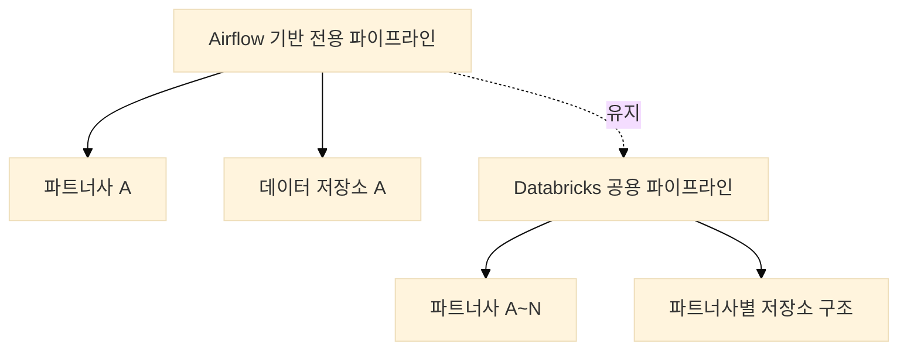
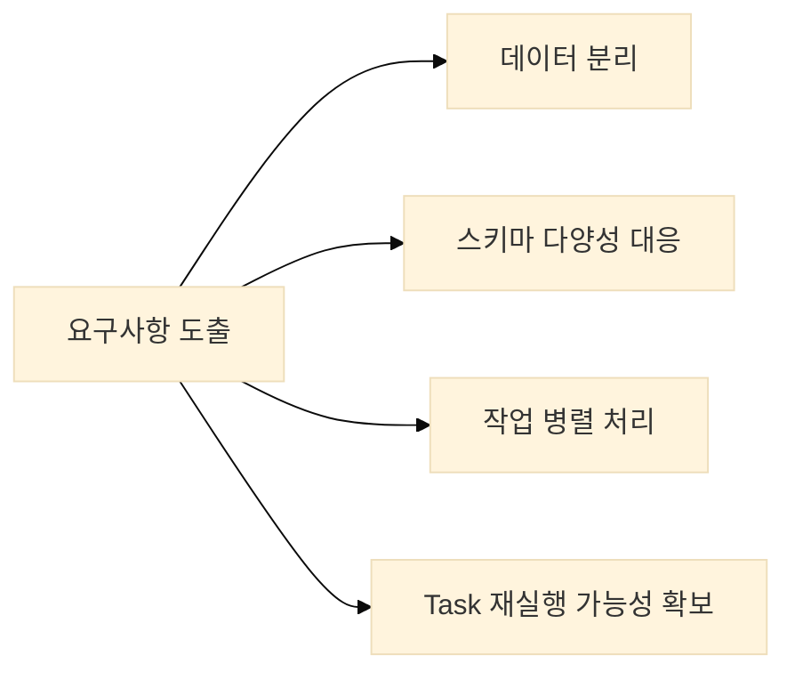
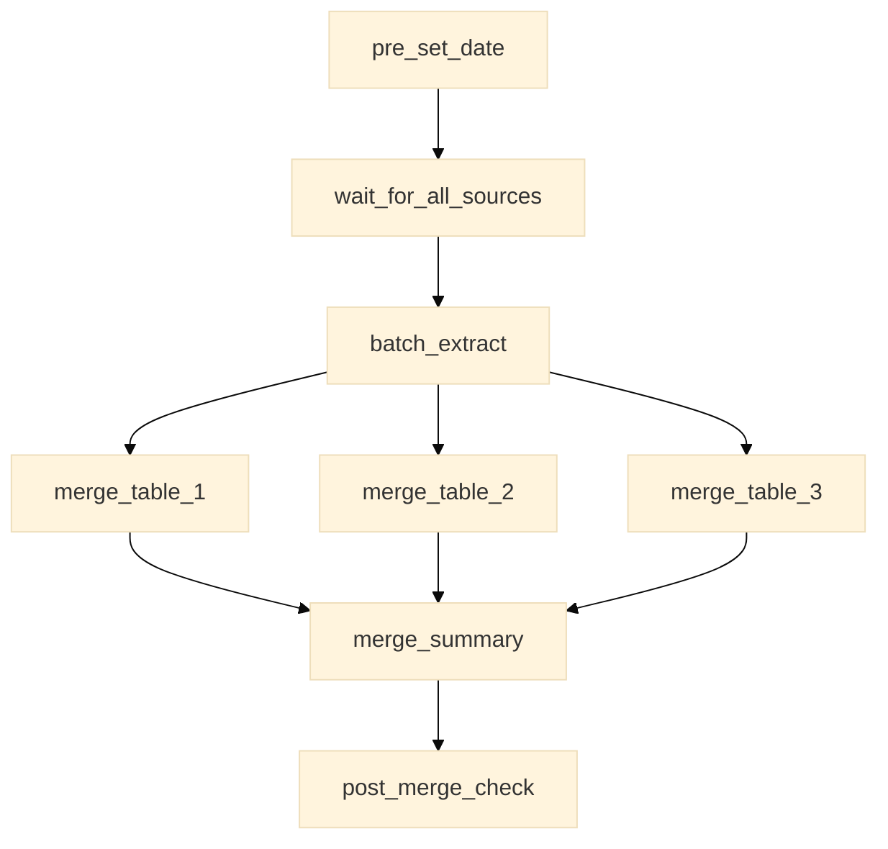
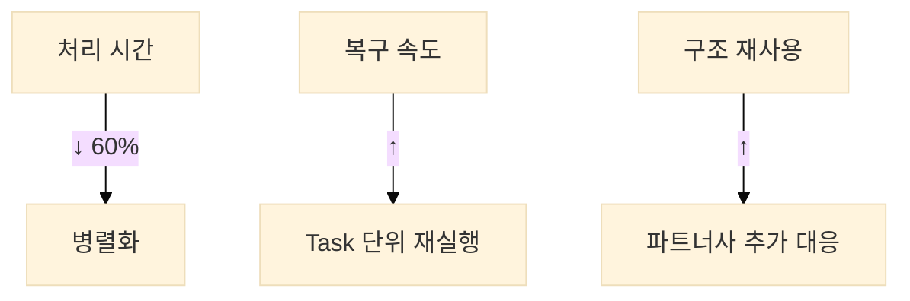

# 파트너사 확장에 따른 데이터 수집 파이프라인 설계 사례

## 1. 배경

기존에는 Airflow 기반의 전용 데이터 수집 파이프라인을 운영하고 있었습니다.  
해당 파이프라인은 특정 파트너사의 `.tar.gz` 압축 파일을 수신하여 내부의 `.csv` 테이블 데이터를 정제 및 병합한 후 저장하는 구조였습니다.  
파일 구조와 테이블 스키마가 고정되어 있었기 때문에 안정적으로 운영할 수 있었습니다.

그러나 파트너사 수가 증가하면서 다양한 포맷의 데이터가 유입되었고, 기존 구조로는 확장에 한계가 발생하였습니다.  
이에 따라 Databricks 기반의 공용 데이터 수집 파이프라인을 신규로 설계 및 구축하는 과제를 수행하게 되었습니다.



## 2. 기획 및 요구사항 정리

공용 파이프라인을 설계하기 위해 다음과 같은 요구사항을 정리하였습니다:

1. **데이터 분리**
   - 파트너사 간 데이터 분리가 반드시 보장되어야 함
   - 보안 및 운영상 논리적 분리 필요

2. **스키마 다양성**
   - 파트너사마다 상이한 테이블 스키마
   - 동적 컬럼 수 및 순서 변경 가능성

3. **처리 흐름**
   - 병렬성과 유연성 확보
   - 실패한 작업만 부분 재실행 가능



## 3. 구현

### 3.1 Workflow 구성

Databricks Workflow를 기반으로 전체 배치를 Task 단위로 분리하였습니다.
각 Task는 독립적으로 실행될 수 있도록 구성하였으며, 병렬 처리를 적용하여 전체 처리 속도를 개선하였습니다.

예시로, Workflow 정의는 다음과 같습니다:

```yaml
# databricks/workflow/ingestion_workflow.yml
name: partner_ingestion
tasks:
  - task_key: pre_set_date
    notebook_task:
      notebook_path: /Workflows/pre_set_date
    max_retries: 3
    timeout_seconds: 3600

  - task_key: batch_extract
    depends_on:
      - pre_set_date
    notebook_task:
      notebook_path: /Workflows/batch_extract
    max_retries: 3
    timeout_seconds: 7200

  - task_key: merge_table_1
    depends_on:
      - batch_extract
    notebook_task:
      notebook_path: /Workflows/merge_table_1
    max_retries: 3
    timeout_seconds: 3600

  - task_key: merge_table_2
    depends_on:
      - batch_extract
    notebook_task:
      notebook_path: /Workflows/merge_table_2
    max_retries: 3
    timeout_seconds: 3600

  - task_key: merge_table_3
    depends_on:
      - batch_extract
    notebook_task:
      notebook_path: /Workflows/merge_table_3
    max_retries: 3
    timeout_seconds: 3600

  - task_key: merge_summary
    depends_on:
      - merge_table_1
      - merge_table_2
      - merge_table_3
    notebook_task:
      notebook_path: /Workflows/merge_summary
    max_retries: 3
    timeout_seconds: 3600

  - task_key: post_merge_check
    depends_on:
      - merge_summary
    notebook_task:
      notebook_path: /Workflows/post_merge_check
    max_retries: 3
    timeout_seconds: 3600
```

각 Task는 다음과 같은 설정을 포함하고 있습니다:

- `max_retries`: Task 실패 시 최대 재시도 횟수 (3회)
- `timeout_seconds`: Task 실행 최대 허용 시간
  - 일반 Task: 1시간 (3600초)
  - 데이터 추출 Task: 2시간 (7200초)

이러한 설정을 통해:
1. 일시적인 네트워크 오류나 리소스 부족으로 인한 실패를 자동으로 복구
2. 무한정 실행되는 Task를 방지하여 리소스 낭비 예방
3. 각 Task의 특성에 맞는 적절한 타임아웃 설정으로 효율적인 리소스 관리



### 3.2 기술 구성 요소

1. **파일 처리**
   - `.tar.gz` 압축 해제: Python의 tarfile 활용
   - S3 경로: 파트너사명 및 날짜 기반 디렉토리 구조

예시로, 압축 해제 및 S3 업로드 코드는 다음과 같습니다:

```python
# databricks/notebooks/batch_extract.py
import tarfile
import boto3
from datetime import datetime

def extract_and_upload(partner_id: str, tar_path: str):
    s3 = boto3.client('s3')
    date_str = datetime.now().strftime('%Y%m%d')
    
    with tarfile.open(tar_path, 'r:gz') as tar:
        for member in tar.getmembers():
            if member.name.endswith('.csv'):
                # 파트너사별 S3 경로 구성
                s3_key = f"{partner_id}/{date_str}/{member.name}"
                s3.upload_fileobj(
                    tar.extractfile(member),
                    'data-bucket',
                    s3_key
                )
```

2. **병합 처리**
   - JSON 기반 스키마 정보 참조
   - Databricks Workflow를 통한 의존성 관리
   - Task 단위 재시도 지원


## 4. 결과 및 회고

### 4.1 주요 성과

1. **성능 개선**
   - 병렬 처리 도입으로 처리 시간 40~60% 감소
   - Task 단위 재시작으로 장애 복구 간소화

2. **운영 효율성**
   - 신규 파트너사 추가 시 구조 재사용 가능
   - 로그 및 알림 체계 개선으로 가시성 향상



### 4.2 회고

기존에 안정적으로 운영되던 파이프라인 구조는 특정 조건에 최적화된 형태였습니다.
처음에는 기존 코드를 복사하여 확장하면 되지 않을까 생각했지만, 파트너사 수 증가와 요구 조건 다양화에 따라 이 접근은 금세 한계에 도달하였습니다.

이번 개선을 통해 작동하는 구조와 확장 가능한 구조는 다르다는 사실을 체감하게 되었으며,
장기적인 운영을 고려한 설계의 중요성을 다시 한 번 인식할 수 있었습니다.

## 5. 마무리

이번 프로젝트는 기존 시스템을 유지하면서, 새로운 요구사항에 대응하기 위해 Databricks 기반으로 공용 ingestion 파이프라인을 처음부터 새롭게 설계한 사례였습니다.
설계와 구현 과정에서 다양한 시도를 했으며, 구조적 확장성과 운영 효율성을 동시에 확보할 수 있었습니다.

향후에는 해당 파이프라인을 기반으로 Transformation 및 DQA 체계로 확장하여, 전체 데이터 처리 흐름을 통합적으로 관리할 수 있는 구조로 발전시킬 예정입니다.
