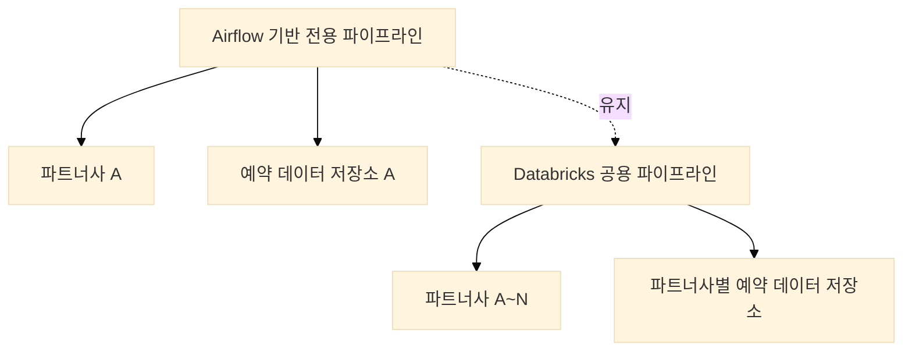
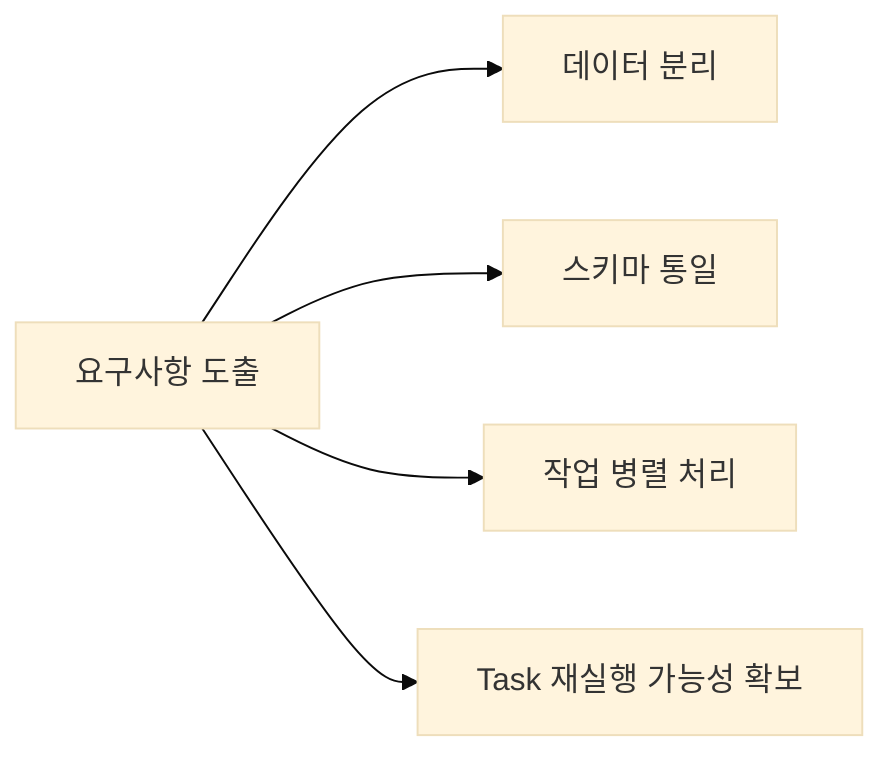

# 파트너사 확장에 따른 데이터 수집 파이프라인 설계 사례

## 1. 배경
기존에는 Airflow 기반의 전용 데이터 수집 파이프라인을 운영하고 있었습니다.  
해당 파이프라인은 특정 파트너사의 예약 데이터를 `.tar.gz` 형식으로 수신하여, 내부의 `.csv` 테이블 데이터를 정제 및 병합한 후 저장하는 구조였습니다.  
파일 구조와 테이블 스키마가 고정되어 있었기 때문에 안정적으로 운영할 수 있었습니다.

그러나 파트너사 수가 증가하면서 다양한 포맷의 예약 데이터가 유입되었고, 기존 구조로는 확장에 한계가 발생하였습니다. 데이터 형식이 서로 달랐고, 필수 컬럼이 누락된 경우도 있었으며, 컬럼 이름이 중복되는 경우도 있었습니다.
이러한 상황에서는 모델 학습이 어려웠고, 신규 파트너사 연동에도 많은 시간이 소요되었습니다.

그래서 **"모델 학습에 쓸 수 있을 만큼 품질 좋은 데이터를 자동으로 모을 수 있는 공용 ETL 파이프라인"**을 만들기로 했습니다.

이에 따라 파이프라인의 스키마 정리, 주요 처리 흐름 설계, 핵심 모듈 구현을 담당하여 Databricks 기반의 공용 데이터 수집 파이프라인을 신규로 설계 및 구축하게 되었습니다.



## 2. 기획 및 요구사항 정리

### 2.1 내가 맡은 역할
이번 프로젝트에서 다음과 같은 역할을 맡았습니다:
- 파트너사별 스키마와 오류 패턴 분석
- 공통 포맷 정의 및 변환 규칙 설계
- Databricks 기반 파이프라인 구조 설계
- 주요 처리 단계에 대한 프로토타입 개발 및 테스트 자동화

### 2.2 주요 요구사항
공용 파이프라인을 설계하기 위해 다음과 같은 요구사항을 정리하였습니다:

1. **데이터 분리**
   - 파트너사 간 예약 데이터 분리가 반드시 보장되어야 함
   - 보안 및 운영상 논리적 분리 필요

2. **스키마 통일**
   - 파트너사별 상이한 예약 데이터 스키마를 통합된 형태로 변환
   - 데이터 품질 및 일관성 확보

3. **처리 흐름**
   - 병렬성과 유연성 확보
   - 실패한 작업만 부분 재실행 가능



## 3. 구현

### 3.1 구조 설계
여러 파트너의 데이터를 하나의 파이프라인에서 처리하려면 유연하면서도 일관된 구조가 필요했습니다.
설계한 구조는 다음과 같습니다:

1. **Raw Layer**: 수집한 데이터를 그대로 저장 (정제 전)
2. **Standardized Layer**: 컬럼 이름 정리, 타입 변환 등 스키마 통일
3. **Validated Layer**: 결측치, 중복, 논리 오류 검증 후 최종 저장

각 단계는 Databricks Job으로 구성했고, JSON 기반 스키마 정의 파일을 읽어 처리 흐름을 자동으로 제어하게 했습니다.

### 3.2 Workflow 구성

Databricks Workflow를 기반으로 전체 배치를 Task 단위로 분리하였습니다.
각 Task는 독립적으로 실행될 수 있도록 구성하였으며, 병렬 처리를 적용하여 전체 처리 속도를 개선하였습니다.

예시로, Workflow 정의는 다음과 같습니다:

```yaml
# databricks/workflow/ingestion_workflow.yml
name: partner_ingestion
tasks:
  - task_key: pre_set_date
    notebook_task:
      notebook_path: /Workflows/pre_set_date
    max_retries: 3
    timeout_seconds: 3600

  - task_key: batch_extract
    depends_on:
      - pre_set_date
    notebook_task:
      notebook_path: /Workflows/batch_extract
    max_retries: 3
    timeout_seconds: 7200

  - task_key: merge_reservation
    depends_on:
      - batch_extract
    notebook_task:
      notebook_path: /Workflows/merge_reservation
    max_retries: 3
    timeout_seconds: 3600

  - task_key: merge_room
    depends_on:
      - batch_extract
    notebook_task:
      notebook_path: /Workflows/merge_room
    max_retries: 3
    timeout_seconds: 3600

  - task_key: merge_guest
    depends_on:
      - batch_extract
    notebook_task:
      notebook_path: /Workflows/merge_guest
    max_retries: 3
    timeout_seconds: 3600

  - task_key: merge_summary
    depends_on:
      - merge_reservation
      - merge_room
      - merge_guest
    notebook_task:
      notebook_path: /Workflows/merge_summary
    max_retries: 3
    timeout_seconds: 3600

  - task_key: post_merge_check
    depends_on:
      - merge_summary
    notebook_task:
      notebook_path: /Workflows/post_merge_check
    max_retries: 3
    timeout_seconds: 3600
```

### 3.3 주요 구현 포인트

#### 3.3.1 파트너별 매핑 로직
파트너마다 컬럼 이름이 다르기 때문에, 변환 매핑을 별도로 관리하게 했습니다.
예를 들어, price, base_price, original_price 등 이름만 다른 가격 정보 컬럼을 하나로 통합하는 방식입니다.

```python
# pseudo code for column mapping
for column in input_columns:
    if column in mapping_dict:
        df = df.withColumnRenamed(column, mapping_dict[column])
```

#### 3.3.2 스키마 정합성 자동 검증
데이터가 규칙에 맞는지 확인하기 위해, expectations를 정의하고 자동 검증을 추가했습니다.
예: 날짜 형식 확인, 필수 컬럼 누락 여부 등.

이 검증 로직은 Jupyter Notebook + pytest + Databricks CLI를 활용해 로컬에서도 테스트할 수 있도록 구성했습니다.

### 3.4 기술 구성 요소

#### 3.4.1 데이터 수집 계층

1. **파일 처리**
   - `.tar.gz` 압축 해제: Python의 tarfile 활용
   - S3 경로: 파트너사명 및 날짜 기반 디렉토리 구조
   - 파일 검증: 크기, 포맷, 무결성 검사

2. **데이터 추출**
   - 파트너사별 예약 데이터 로딩
   - 데이터 포맷 변환 (CSV, JSON 등)
   - 기본적인 데이터 정제

#### 3.4.2 데이터 변환 계층

1. **스키마 관리**

아래는 Delta Lake 기반 스키마 매핑 처리의 일부 예시입니다.

   ```python
   # databricks/notebooks/schema_mapping.py
   from pyspark.sql.types import *
   
   # 통합 예약 데이터 스키마 정의 (예시)
   unified_schema = StructType([
       StructField("reservation_id", StringType(), False),
       StructField("hotel_id", StringType(), False),
       StructField("check_in_date", DateType(), False),
       StructField("check_out_date", DateType(), False),
       StructField("total_amount", DecimalType(10,2), True),
       StructField("partner_id", StringType(), False)
   ])
   ```

   또는 Databricks SQL을 사용한 구현 (예시):
   ```sql
   -- 통합 예약 데이터 테이블 생성 (예시)
   CREATE TABLE IF NOT EXISTS unified_reservations (
     reservation_id STRING NOT NULL,
     hotel_id STRING NOT NULL,
     check_in_date DATE NOT NULL,
     check_out_date DATE NOT NULL,
     total_amount DECIMAL(10,2),
     partner_id STRING NOT NULL
   )
   USING DELTA
   PARTITIONED BY (check_in_date, partner_id);
   ```

2. **데이터 변환**
   - 파트너사별 원본 데이터를 통합 스키마로 변환
   - 데이터 타입 및 포맷 표준화
   - 누락된 필드에 대한 기본값 처리
   - 데이터 품질 검증

#### 3.4.3 데이터 저장 계층

1. **데이터 저장**
   - Delta Lake를 활용한 ACID 트랜잭션 지원
   - 파트너사별 테이블 분리
   - 파티셔닝 전략: 체크인 날짜, 파트너사 기준

2. **메타데이터 관리**
   - 처리 이력 추적
   - 데이터 품질 메트릭 저장
   - 파트너사별 처리 상태 관리


## 4. 결과 및 회고

### 4.1 주요 성과

1. **성능 개선**
   - 병렬 처리 도입으로 처리 시간 40~60% 감소
   - Task 단위 재시작으로 장애 복구 간소화

2. **운영 효율성**
   - 신규 파트너사 추가 시 구조 재사용 가능
   - 로그 및 알림 체계 개선으로 가시성 향상

3. **데이터 품질**
   - 통합된 스키마로 인한 데이터 일관성 확보
   - 파트너사 간 데이터 비교 분석 용이

### 4.2 기대 효과

- 신규 파트너사의 데이터 연동 속도가 눈에 띄게 빨라짐
- 수작업 정제 과정이 거의 없어지고, 에러도 모니터링 가능
- 정제된 데이터는 그대로 모델 학습에 투입 가능할 만큼 안정적인 품질을 유지

### 4.3 회고

기존에 안정적으로 운영되던 파이프라인 구조는 특정 조건에 최적화된 형태였습니다.
처음에는 기존 코드를 복사하여 확장하면 되지 않을까 생각했지만, 파트너사 수 증가와 요구 조건 다양화에 따라 이 접근은 금세 한계에 도달하였습니다.

이번 개선을 통해 작동하는 구조와 확장 가능한 구조는 다르다는 사실을 체감하게 되었으며,
장기적인 운영을 고려한 설계의 중요성을 다시 한 번 인식할 수 있었습니다.

## 5. 마무리

이번 글에서는 데이터 수집부터 스키마 정리까지 다뤘습니다.
다음 글에서는 데이터 품질 검증 로직, 테스트 자동화, 운영 구조에 대해 조금 더 자세히 소개해볼 생각입니다.

이번 프로젝트를 통해 공용 파이프라인 설계와 운영의 기반을 마련할 수 있었습니다.
이후에는 Transformation 및 DQA 체계를 포함한 전반적인 데이터 파이프라인의 자동화와 통합 운영을 목표로, 구조를 지속적으로 개선해 나갈 예정입니다.