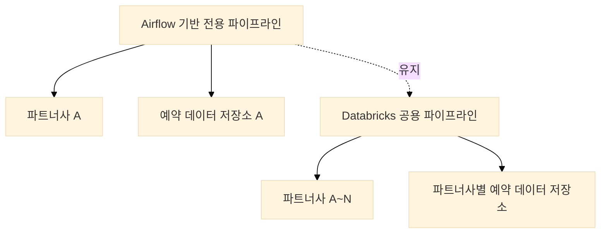
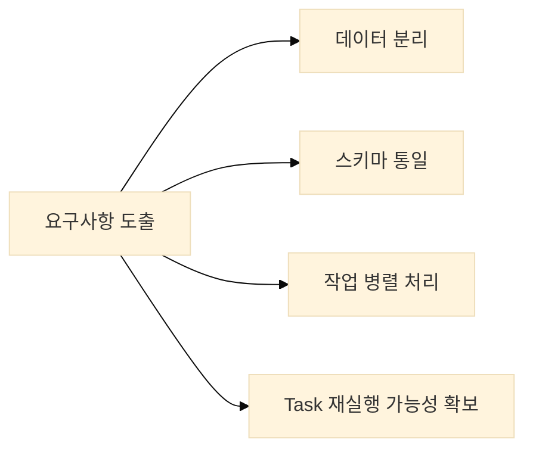
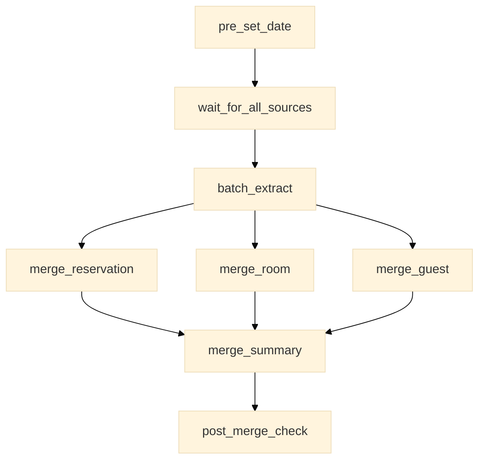
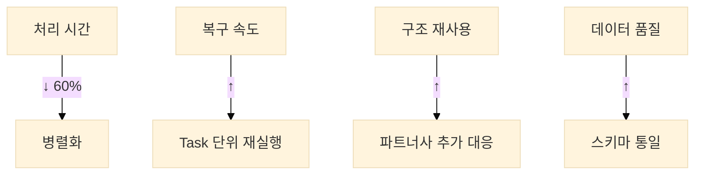

# 파트너사 확장에 따른 데이터 수집 파이프라인 설계 사례

## 1. 배경

기존에는 Airflow 기반의 전용 데이터 수집 파이프라인을 운영하고 있었습니다.  
해당 파이프라인은 특정 파트너사의 예약 데이터를 `.tar.gz` 형식으로 수신하여, 내부의 `.csv` 테이블 데이터를 정제 및 병합한 후 저장하는 구조였습니다.  
파일 구조와 테이블 스키마가 고정되어 있었기 때문에 안정적으로 운영할 수 있었습니다.

그러나 파트너사 수가 증가하면서 다양한 포맷의 예약 데이터가 유입되었고, 기존 구조로는 확장에 한계가 발생하였습니다.  
이에 따라 Databricks 기반의 공용 데이터 수집 파이프라인을 신규로 설계 및 구축하는 과제를 수행하게 되었습니다.



## 2. 기획 및 요구사항 정리

공용 파이프라인을 설계하기 위해 다음과 같은 요구사항을 정리하였습니다:

1. **데이터 분리**
   - 파트너사 간 예약 데이터 분리가 반드시 보장되어야 함
   - 보안 및 운영상 논리적 분리 필요

2. **스키마 통일**
   - 파트너사별 상이한 예약 데이터 스키마를 통합된 형태로 변환
   - 데이터 품질 및 일관성 확보

3. **처리 흐름**
   - 병렬성과 유연성 확보
   - 실패한 작업만 부분 재실행 가능



## 3. 구현

### 3.1 Workflow 구성

Databricks Workflow를 기반으로 전체 배치를 Task 단위로 분리하였습니다.
각 Task는 독립적으로 실행될 수 있도록 구성하였으며, 병렬 처리를 적용하여 전체 처리 속도를 개선하였습니다.

예시로, Workflow 정의는 다음과 같습니다:

```yaml
# databricks/workflow/ingestion_workflow.yml
name: partner_ingestion
tasks:
  - task_key: pre_set_date
    notebook_task:
      notebook_path: /Workflows/pre_set_date
    max_retries: 3
    timeout_seconds: 3600

  - task_key: batch_extract
    depends_on:
      - pre_set_date
    notebook_task:
      notebook_path: /Workflows/batch_extract
    max_retries: 3
    timeout_seconds: 7200

  - task_key: merge_reservation
    depends_on:
      - batch_extract
    notebook_task:
      notebook_path: /Workflows/merge_reservation
    max_retries: 3
    timeout_seconds: 3600

  - task_key: merge_room
    depends_on:
      - batch_extract
    notebook_task:
      notebook_path: /Workflows/merge_room
    max_retries: 3
    timeout_seconds: 3600

  - task_key: merge_guest
    depends_on:
      - batch_extract
    notebook_task:
      notebook_path: /Workflows/merge_guest
    max_retries: 3
    timeout_seconds: 3600

  - task_key: merge_summary
    depends_on:
      - merge_reservation
      - merge_room
      - merge_guest
    notebook_task:
      notebook_path: /Workflows/merge_summary
    max_retries: 3
    timeout_seconds: 3600

  - task_key: post_merge_check
    depends_on:
      - merge_summary
    notebook_task:
      notebook_path: /Workflows/post_merge_check
    max_retries: 3
    timeout_seconds: 3600
```

각 Task는 다음과 같은 설정을 포함하고 있습니다:

- `max_retries`: Task 실패 시 최대 재시도 횟수 (3회)
- `timeout_seconds`: Task 실행 최대 허용 시간
  - 일반 Task: 1시간 (3600초)
  - 데이터 추출 Task: 2시간 (7200초)

이러한 설정을 통해:
1. 일시적인 네트워크 오류나 리소스 부족으로 인한 실패를 자동으로 복구
2. 무한정 실행되는 Task를 방지하여 리소스 낭비 예방
3. 각 Task의 특성에 맞는 적절한 타임아웃 설정으로 효율적인 리소스 관리



### 3.2 기술 구성 요소

#### 3.2.1 데이터 수집 계층

1. **파일 처리**
   - `.tar.gz` 압축 해제: Python의 tarfile 활용
   - S3 경로: 파트너사명 및 날짜 기반 디렉토리 구조
   - 파일 검증: 크기, 포맷, 무결성 검사

2. **데이터 추출**
   - 파트너사별 예약 데이터 로딩
   - 데이터 포맷 변환 (CSV, JSON 등)
   - 기본적인 데이터 정제

#### 3.2.2 데이터 변환 계층

1. **스키마 관리**
   ```python
   # databricks/notebooks/schema_mapping.py
   from pyspark.sql.types import *
   
   # 통합 예약 데이터 스키마 정의 (예시)
   unified_schema = StructType([
       StructField("reservation_id", StringType(), False),
       StructField("hotel_id", StringType(), False),
       StructField("check_in_date", DateType(), False),
       StructField("check_out_date", DateType(), False),
       StructField("total_amount", DecimalType(10,2), True),
       StructField("partner_id", StringType(), False)
   ])
   ```

   또는 Databricks SQL을 사용한 구현 (예시):
   ```sql
   -- 통합 예약 데이터 테이블 생성 (예시)
   CREATE TABLE IF NOT EXISTS unified_reservations (
     reservation_id STRING NOT NULL,
     hotel_id STRING NOT NULL,
     check_in_date DATE NOT NULL,
     check_out_date DATE NOT NULL,
     total_amount DECIMAL(10,2),
     partner_id STRING NOT NULL
   )
   USING DELTA
   PARTITIONED BY (check_in_date, partner_id);

   -- 파트너사 A 데이터 변환 (예시)
   CREATE OR REPLACE VIEW partner_a_transformed AS
   SELECT
     booking_id AS reservation_id,
     property_id AS hotel_id,
     CAST(arrival_date AS DATE) AS check_in_date,
     CAST(departure_date AS DATE) AS check_out_date,
     CAST(booking_amount AS DECIMAL(10,2)) AS total_amount,
     source_id AS partner_id
   FROM partner_a_raw;

   -- 통합 테이블에 데이터 병합 (예시)
   MERGE INTO unified_reservations target
   USING partner_a_transformed source
   ON target.reservation_id = source.reservation_id
     AND target.partner_id = source.partner_id
   WHEN MATCHED THEN
     UPDATE SET *
   WHEN NOT MATCHED THEN
     INSERT *;
   ```

   > **참고**: 본 파이프라인은 PySpark 기반으로 구현하였으며, 일부 로직은 Databricks SQL로 전환하여 테스트하였습니다. SQL을 사용한 테스트는 주로 데이터 변환 로직의 정확성을 검증하고 성능을 비교하기 위한 목적으로 수행되었습니다. 본문에서는 양쪽 방식의 이해를 돕기 위해 예제를 병행하여 기술하였습니다.

   구현 특징:
   - PySpark의 StructType을 사용한 강력한 타입 시스템
   - 파트너사별 매핑 규칙을 통한 유연한 스키마 변환
   - 필수/선택 필드 구분으로 데이터 품질 보장
   - 데이터 타입의 정확한 정의

2. **데이터 변환**
   - 파트너사별 원본 데이터를 통합 스키마로 변환
   - 데이터 타입 및 포맷 표준화
   - 누락된 필드에 대한 기본값 처리
   - 데이터 품질 검증

#### 3.2.3 데이터 저장 계층

1. **데이터 저장**
   - Delta Lake를 활용한 ACID 트랜잭션 지원
   - 파트너사별 테이블 분리
   - 파티셔닝 전략: 체크인 날짜, 파트너사 기준

   Delta Lake를 선택한 주요 이유:
   - **스키마 관리**: 스키마 진화(schema evolution)와 스키마 검증을 통한 데이터 품질 보장
   - **Feature Store 준비**: ML 모델 학습을 위한 피처 저장소 구축 가능성
   - **데이터 계보 관리**: 데이터 변경 이력 추적 및 데이터 품질 모니터링
   - **통합 지원**: Databricks의 통합 환경에서 데이터 레이크하우스 아키텍처 구현 용이

2. **메타데이터 관리**
   - 처리 이력 추적
   - 데이터 품질 메트릭 저장
   - 파트너사별 처리 상태 관리


## 4. 결과 및 회고

### 4.1 주요 성과

1. **성능 개선**
   - 병렬 처리 도입으로 처리 시간 40~60% 감소
   - Task 단위 재시작으로 장애 복구 간소화

2. **운영 효율성**
   - 신규 파트너사 추가 시 구조 재사용 가능
   - 로그 및 알림 체계 개선으로 가시성 향상

3. **데이터 품질**
   - 통합된 스키마로 인한 데이터 일관성 확보
   - 파트너사 간 데이터 비교 분석 용이



### 4.2 회고

기존에 안정적으로 운영되던 파이프라인 구조는 특정 조건에 최적화된 형태였습니다.
처음에는 기존 코드를 복사하여 확장하면 되지 않을까 생각했지만, 파트너사 수 증가와 요구 조건 다양화에 따라 이 접근은 금세 한계에 도달하였습니다.

이번 개선을 통해 작동하는 구조와 확장 가능한 구조는 다르다는 사실을 체감하게 되었으며,
장기적인 운영을 고려한 설계의 중요성을 다시 한 번 인식할 수 있었습니다.

## 5. 마무리

이번 프로젝트는 기존 시스템을 유지하면서, 새로운 요구사항에 대응하기 위해 Databricks 기반으로 공용 ingestion 파이프라인을 처음부터 새롭게 설계한 사례였습니다.
설계와 구현 과정에서 다양한 시도를 했으며, 구조적 확장성과 운영 효율성을 동시에 확보할 수 있었습니다.

이번 프로젝트를 통해 공용 파이프라인 설계와 운영의 기반을 마련할 수 있었습니다.
이후에는 Transformation 및 DQA 체계를 포함한 전반적인 데이터 파이프라인의 자동화와 통합 운영을 목표로, 구조를 지속적으로 개선해 나갈 예정입니다.