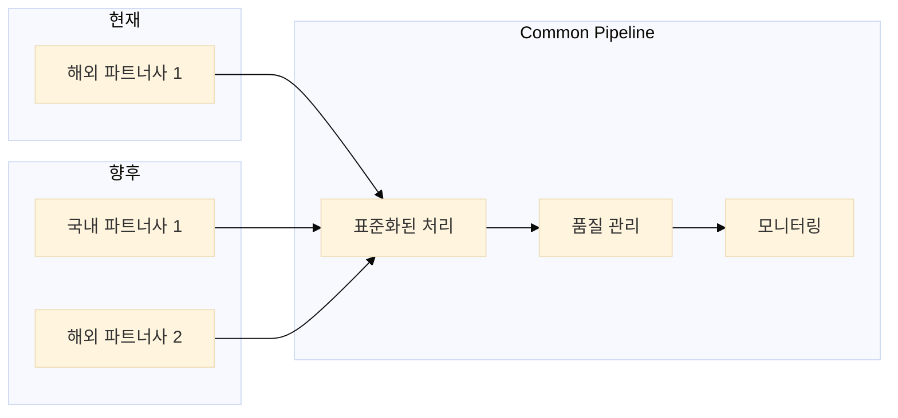
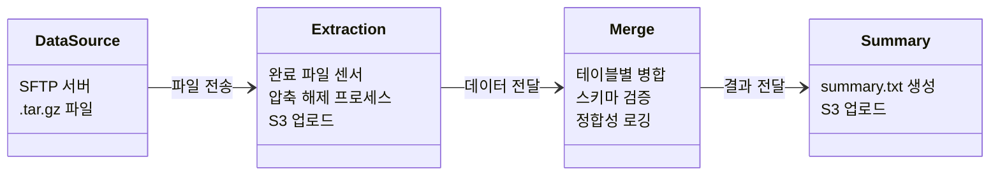
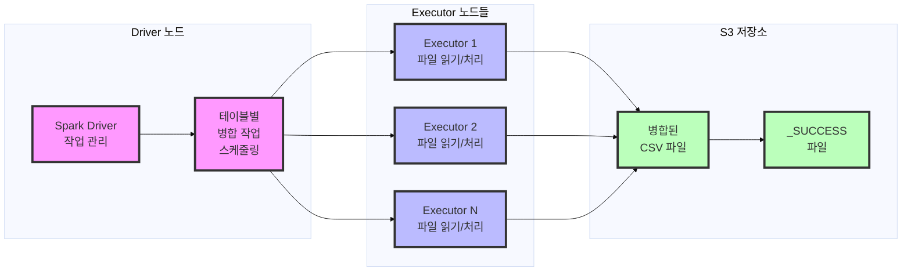
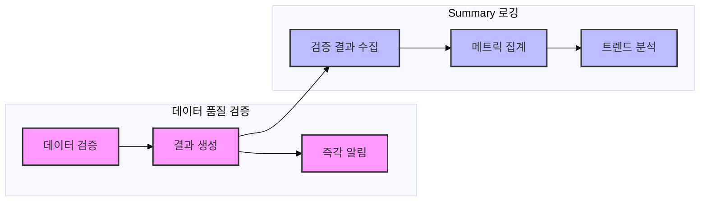

## 1. 개요 및 배경

작년에 저희 팀은 여행 예약 플랫폼에 다이나믹 프라이싱 서비스를 런칭했고, 올해 저는 파이프라인 구축 담당으로 투입되었습니다. 다이나믹 프라이싱이란 시장 상황, 수요 변화, 경쟁사 가격 등 다양한 요소를 실시간으로 분석하여 최적의 가격을 자동으로 책정하는 시스템입니다. 현재는 해외 파트너사 하나의 데이터만 처리하고 있지만, 곧 국내외 파트너사가 추가로 합류할 예정입니다. 문제는 각 파트너마다 데이터 구조와 형식이 제각각이라, 이를 효율적으로 통합 처리할 수 있는 표준화된 파이프라인이 필요했습니다.

그동안 저는 주로 사내 툴 개발만 해왔기 때문에, 하루에 수만 개의 파일을 처리하는 빅데이터 환경은 완전히 새로운 세계였습니다. 분산 처리 시스템을 구축하고, 작업을 병렬화하며, 대용량 파일을 병합하는 등 실제 문제를 해결하면서 이론으로만 알고 있던 빅데이터 개념들을 직접 구현해보는 재미를 느낄 수 있었습니다. 특히 책이나 강의에서 배웠던 분산 컴퓨팅 원리가 실제 환경에서 어떻게 적용되는지 경험하고, 그 과정에서 발생하는 다양한 도전 과제들을 해결하며 데이터 엔지니어링에 대한 실전 역량을 키울 수 있었습니다.

> 이 글은 완성된 솔루션을 제시하는 것이 아니라, 대규모 데이터 엔지니어링과 배치 프로세싱 도입 과정에서 겪은 시행착오와 교훈을 기록한 학습 여정입니다.

## 2. 프로젝트 배경 상세

여행 예약 플랫폼의 핵심 서비스인 다이나믹 프라이싱 시스템을 운영하고 있습니다. 이 서비스는 실시간으로 시장 상황과 경쟁사 가격을 분석하여 최적의 가격을 결정하는 시스템으로, 향후 다양한 파트너사로 서비스 제공을 확대할 계획입니다.

기존 데이터 파이프라인의 주요 문제점:
1. **스키마 종속성**: 레거시 시스템 전용 스키마로 타 파트너사 데이터 재활용 불가
2. **스토리지 비용 상승**: 지속적인 원본 데이터 적재로 관리 비용과 스토리지 비용 증가
3. **비효율적인 인제스트 방식**: 변경 감지 메커니즘 부재로 중복 적재 및 리소스 낭비
4. **DQA 체계 부재**: 실시간/배치 기반 데이터 품질 검증 체계 미흡

현재 파트너사의 데이터는 CSV 파일로 단편화되어 있고, 테이블명과 컬럼이 불명확하여 의미를 파악하기 어렵습니다. NULL 값과 중복 레코드가 다수 존재하며, 프라이머리 키 충돌이 빈번하여 데이터 무결성이 떨어져 증분 적재(incremental append)도 불가능하고 일일 스냅샷으로 전체 데이터를 오버라이트하고 있는 상황입니다.

### 1.5 Dynamic Pricing Solution 구조


Dynamic Pricing Solution은 실시간으로 시장 상황과 경쟁사 가격을 분석하여 최적의 가격을 결정하는 시스템입니다. 시스템의 핵심은 정확하고 신뢰할 수 있는 데이터입니다.

### 1.6 ETL 파이프라인의 필요성


다이나믹 프라이싱 모델이 정확한 가격을 예측하려면 여러 소스의 데이터를 깔끔하게 정리해서 합쳐야 합니다. 이 모델은 크게 세 종류의 데이터를 활용합니다:

| 데이터 종류   | 설명                                                         |
|--------------|--------------------------------------------------------------|
| 파트너사 데이터 | 고객의 실제 예약 내역, 검색 패턴, 예약 취소율 등 고객 행동 데이터 |
| 시장 데이터   | 지역별 수요 동향, 경쟁 호텔 가격 정보, 계절적 특성, 이벤트 정보 등 |
| 내부 데이터   | 호텔 정보(등급, 시설, 객실 타입), 과거 가격 책정 전략과 실적 데이터 등 |

이런 다양한 데이터는 각기 다른 형식과 구조를 가지고 있어서, 이를 ML 모델이 학습할 수 있는 형태로 변환하는 과정이 필요합니다. 바로 이 작업을 자동화하고 효율적으로 처리하기 위해 ETL(Extract, Transform, Load) 파이프라인을 구축하게 되었습니다. 이 파이프라인을 통해 데이터 품질을 일관되게 유지하고, 최종적으로 모델의 가격 예측 정확도를 높일 수 있었습니다.

### 1.7 Common Pipeline이 필요한 이유


현재 해외 파트너사 1곳의 데이터를 처리하고 있으며, 향후 국내 파트너사 1곳과 추가 해외 파트너사 1곳이 추가될 예정입니다. 각 파트너사마다 데이터 제공 방식과 품질 기준이 상이합니다. 이러한 다양한 데이터 소스를 효율적으로 통합 관리하기 위해서는 표준화된 Common Pipeline이 필수적입니다.

## 3. 단계적 접근 전략

이 프로젝트는 규모와 복잡성을 고려하여 다음과 같이 4단계 로드맵으로 계획했습니다:

| Phase | 설명 |
|------|------|
| **Phase 1** | SFTP → S3 → 병합 파이프라인 마이그레이션<br>- 기존 Airflow 기반 SFTP 수신 및 S3 저장 파이프라인을 Databricks로 마이그레이션<br>- 수만 개의 파일을 효율적으로 처리하는 병합 작업 구현 |
| **Phase 2** | 데이터 인제스트, 스키마 정규화, 스토리지 최적화<br>- 다양한 파트너사의 데이터 인제스트 방식을 수용할 수 있도록 파이프라인 리팩토링<br>- 스키마 처리 로직을 유연하게 설계하여 이기종 데이터 구조 대응 |
| **Phase 3** | DQA(Data Quality Assurance) 및 데이터 인제스트 표준화<br>- 데이터 품질 검증 프로세스 구현 및 자동화<br>- 다양한 파트너사의 데이터 인제스트 방식을 표준화된 방식으로 통합 |
| **Phase 4** | 스키마 통합 및 최적화<br>- 파트너사별 상이한 스키마를 통합된 형태로 정규화<br>- 데이터 사이언티스트들과 협력하여 최적의 스키마 설계 |

각 단계는 이전 단계의 성과를 기반으로 하며, 단계별로 명확한 목표와 결과물을 정의하여 점진적으로 시스템을 개선해 나갈 계획입니다. 현재는 Phase 1을 진행 중이며, 이 글에서는 Phase 1에서 겪은 경험과 배운 점을 중점적으로 공유합니다.

## 4. 현재 파트너사의 데이터 특성

현재 해외 파트너사로부터 수신하는 데이터는 다음과 같은 특성을 갖고 있습니다:

- **데이터 볼륨**
  - 일일 수만 개의 `.tar.gz` 압축 파일 수신
  - 각 압축 파일은 수백 MB 크기
  - 압축 파일 내부에는 테이블별 `.csv` 파일 다수 포함

- **데이터 스키마**
- 파일명 패턴: `{table_name}_{date}_{batch_id}.csv` 형식으로 제공
  - 테이블마다 스키마와 컬럼 수가 상이 → 병합시 스키마 불일치 이슈
  - 일부 테이블은 일자별 스키마 변동 가능성으로 다이나믹 스키마 핸들링 필요

- **데이터 품질 관리 요건**
  - 데이터 누락/오류 발생 시 ML 파이프라인에 치명적 영향
  - 데이터 정합성과 처리 효율성을 위한 표준화된 프로세싱 필요

## 5. 문제 정의와 구조 개선 과정

### 5.1 초기 접근의 실패

처음에는 문제를 단순하게 접근했습니다. "파일을 읽어서 병합하면 되겠지"라는 생각으로 시작했지만, 실제로는 여러 기술적 한계에 부딪혔습니다.

로컬 환경에서 간단한 Python 스크립트로 접근했으나, 데이터 볼륨이 과도하여 처리 시간이 지나치게 길어지고 리소스 부족으로 프로세스가 종료되는 이슈가 발생했습니다. 확장성을 고려한 복잡한 로직을 구현하다 보니 실행조차 되지 않는 코드만 늘어나는 문제에 직면했습니다.

마침 데이터팀 전체가 Airflow에서 Databricks로 워크플로우 플랫폼을 마이그레이션하는 중이었기 때문에, 이 기회에 바로 Databricks 환경으로 개발을 전환했습니다.

- **메모리 제한**: Python `pandas`로 수만 개 파일 처리 시도 → OOM(Out of Memory) 오류 발생
- **병렬화 시도**: `multiprocessing` 도입 → 프로세스 간 메모리 공유 제약으로 성능 향상 미미
- **Spark 도입**: `coalesce(1)`로 모든 테이블 일괄 병합 시도 → Driver 메모리 부족으로 Job 실패

### 5.2 구조 개선 과정

초기 실패를 통해 다음과 같은 인사이트를 얻었습니다:

1. **워크로드 특성 차이**
   - `.tar.gz` 압축 해제: CPU-bound 작업
   - 파일 병합: IO-bound + Spark shuffle 오퍼레이션
   - 상이한 특성을 가진 작업은 분리 필요

2. **디버깅 복잡성**
   - 단일 Notebook에서 모든 로직 실행
   - 오류 발생 시 근본 원인 분석 어려움
   - 높은 결합도로 인한 부분 수정 어려움

3. **장애 복구 비효율성**
   - 병합 작업 실패 시 압축 해제부터 재실행 필요
   - 이미 성공한 작업도 반복 실행

### 5.2.2 Task 분리 아키텍처 도입


### 5.3 Task 분리 아키텍처 도입

문제 해결을 위해 파이프라인을 독립적인 Task들로 분리했습니다:

#### 압축 해제 Task
파트너사가 제공한 `.tar.gz` 압축 파일을 풀어서 개별 CSV 파일들을 추출하는 작업입니다. Python의 기본 라이브러리인 `tarfile`을 사용했고, 파일을 임시 디렉토리에 저장하는 대신 바로 S3에 업로드하여 디스크 공간을 절약했습니다.

#### 병합 Task
압축 해제된 수많은 CSV 파일들을 테이블별로 모아서 하나의 큰 파일로 합치는 작업입니다. 이 과정에서 각 테이블의 구조 정보(컬럼명, 데이터 타입 등)를 JSON 파일로 저장해 활용했습니다.

#### 각 작업의 분리 실행
처음에는 모든 작업을 하나의 큰 프로그램으로 실행했다가 메모리 부족 문제가 발생했습니다. 그래서 압축 해제와 병합을 별도의 Databricks 작업으로 분리하여 각각 실행했더니 리소스 활용이 효율적으로 개선되었습니다.

#### 작업 간 연결 방식
각 작업은 직접 데이터를 주고받는 대신, S3 버킷 경로를 통해 간접적으로 연결했습니다. 예를 들어 압축 해제 작업은 결과물을 S3에 저장하고, 병합 작업은 그 S3 경로를 읽어와서 처리하는 방식입니다. 이렇게 하면 각 작업이 독립적으로 실행되고 실패해도 전체 파이프라인이 중단되지 않는 장점이 있습니다.

### 5.4 Workflow 기반 전환

Task 분리 후, 더 나은 관리와 자동화를 위해 Databricks Workflow로 전환했습니다:

- **Workflow 구성 세부사항**
  - `pre_set_date`: process_date 파라미터가 미설정 시 어제 날짜로 디폴트 설정
  - `wait_for_all_sources`: 모든 소스 파일 Readiness 체크
  - `batch_extract`: .tar.gz 파일 압축 해제 및 S3 업로드
  - 각 테이블별 `merge_*` task: 독립적인 병합 작업 수행
  - `merge_summary`: 모든 병합 완료 후 summary.txt 생성
  - `post_merge_check`: 최종 결과 검증

- **Workflow 전환의 이점**
  - 병렬 프로세싱 최적화: 각 테이블 병합을 독립적으로 실행하여 전체 처리 시간 단축
  - 장애 복구 효율화: 실패한 task만 선택적 재실행 가능
  - 모니터링 고도화: 태스크별 상태 실시간 트래킹
  - 유지보수성 향상: 태스크별 책임 명확화
  - 스케일 아웃: 새로운 테이블 통합 용이성

## 6. 성능 최적화 전략

### 6.1 Spark 분산 처리 아키텍처

- **문제**: `pandas` 기반 병합 시 수만 개 파일은 메모리 한계 초과, Spark도 다수의 테이블 일괄 처리 시 Driver 과부하로 종료

- **솔루션**:
  - 병합 작업을 **테이블 단위로 샤딩**
  - 테이블별 개별 `SparkSession` 생성
  - Spark에서 `coalesce(1)`로 단일 CSV로 저장하되, 읽기/셔플은 분산 처리 유지

- **Spark 튜닝 파라미터**:
  - `spark.default.parallelism`: Executor 코어 수의 2배로 설정하여 병렬성 극대화
  - `spark.sql.shuffle.partitions`: 데이터 볼륨에 최적화된 파티션 수로 동적 조정
  - `spark.memory.fraction`: 0.8로 상향 조정하여 셔플 메모리 할당 최적화
  - `spark.sql.adaptive.enabled=true`: AQE(Adaptive Query Execution) 활성화로 동적 최적화

### 6.1.2 Spark 분산 처리 아키텍처 상세 다이어그램


### 6.2 리소스 최적화

- **솔루션**:
  - 적절한 수의 워커로 구성된 Auto-scaling 클러스터 구성
  - 워크로드 증가 시 자동 스케일 아웃
  - 비용 효율성과 성능 사이의 균형점 확보

- **클러스터 컨피그레이션**:
  - 인스턴스 타입: 표준 VM으로 설정하여 비용 대비 성능 최적화
  - 오토스케일링 트리거: CPU 사용률 임계치 초과 시 스케일 아웃
  - 스케일 다운 지연: 적절한 시간으로 설정하여 일시적 부하 변동 시 불필요한 스케일 다운 방지
  - 스팟 인스턴스: 비용 절감을 위해 스팟 인스턴스 활용

### 6.2.2 데이터 처리 최적화 상세 다이어그램

```mermaid
%%{init: {
  'theme': 'base',
  'themeVariables': {
    'fontSize': '20px',
    'fontFamily': 'arial',
    'lineHeight': '1.5',
    'textAlignment': 'center'
  }
}}%%
graph LR
    subgraph "Phase 1: 초기 구현"
        direction LR
        P1[로컬 Python<br/>단일 프로세스] --> P2[메모리 부족<br/>OOM 발생]
    end

    subgraph "Phase 2: 분산 처리"
        direction LR
        S1[Spark 도입<br/>분산 처리] --> S2[Driver 노드<br/>과부하]
    end

    subgraph "Phase 3: 최적화"
        direction LR
        O1[테이블별<br/>독립 처리] --> O2[Spark 튜닝<br/>파라미터 최적화] --> O3[Auto-scaling<br/>클러스터]
    end

    P2 ==> S1
    S2 ==> O1

    style P1 fill:#ffcccc,stroke:#333,stroke-width:2px
    style P2 fill:#ffcccc,stroke:#333,stroke-width:2px
    style S1 fill:#ffffcc,stroke:#333,stroke-width:2px
    style S2 fill:#ffffcc,stroke:#333,stroke-width:2px
    style O1 fill:#ccffcc,stroke:#333,stroke-width:2px
    style O2 fill:#ccffcc,stroke:#333,stroke-width:2px
    style O3 fill:#ccffcc,stroke:#333,stroke-width:2px

    classDef phase1 fill:#ffcccc,stroke:#333,stroke-width:2px;
    classDef phase2 fill:#ffffcc,stroke:#333,stroke-width:2px;
    classDef phase3 fill:#ccffcc,stroke:#333,stroke-width:2px;
```


## 7. 데이터 품질 검증 및 summary 로깅

### 7.1 데이터 품질 검증

데이터 품질 검증의 중요성:
- ML 모델 학습 데이터 품질은 예측 정확도에 직결
- 파트너사 데이터 제공 방식 변경 시 자동 감지 필요
- 데이터 누락/오류는 의사결정에 치명적 영향 가능

데이터 품질 관리의 실제 도전 과제:
- **품질 차원의 다양성**: NULL 값, 컬럼 누락 외에도 데이터 타입 불일치, 비즈니스 룰 위반, 이상치(outlier) 등 다양한 품질 이슈 존재
- **품질 메트릭의 컨텍스트 종속성**: 비즈니스 컨텍스트에 따라 품질 기준이 상이함
- **시계열적 품질 변동**: 파트너사 데이터 제공 패턴 변화로 예측 불가능한 품질 이슈 발생
- **대규모 데이터 검증의 오버헤드**: 수만 개 파일의 자동화된 검증 체계 구축 난이도

### 7.1.3 데이터 품질 검증 프로세스

이 프로세스는 데이터의 품질을 검증하는 핵심 단계를 보여줍니다:


**데이터 품질 검증 프로세스의 특징**:
1. **검증 범위**: 데이터의 구조적, 의미적 품질을 모두 검사
   - 헤더 불일치: 스키마 정합성 검증
   - NULL 비율: 데이터 완전성 검증
   - 파일 개수: 데이터 누락 여부 확인
   - 데이터 타입: 값의 유효성 검증

2. **검증 방식**: 다각도의 동시 검증 수행
   - 병합된 CSV 파일에 대한 다중 검증
   - 원본 파일과의 비교 검증

3. **결과 처리**: 단계적 에스컬레이션
   - 검증 결과를 summary.txt에 기록
   - 이슈 발생 시 경고/오류 로깅
   - 심각한 문제 발생 시 알림 트리거

### 7.2 Summary 로깅

Summary 로깅은 전체 ETL 프로세스의 실행 메트릭과 성능을 모니터링하기 위한 메타데이터를 수집하고 기록하는 프로세스입니다. 이 로깅 시스템은 다음과 같은 주요 기능을 포함합니다:

#### 주요 기능

1. **파일 카운트 집계**
   - 원본 및 병합 후 파일 수 검증
   - 각 테이블별 .csv 파일 개수 확인
   - 테이블 병합 전후의 총 파일 수 및 용량 (MB) 기록
   - `_SUCCESS` 및 `merged_<table>.csv`의 존재 여부 확인

2. **레이턴시 측정**
   - 단계별 처리 소요 시간 트래킹
   - S3 상태 점검, 읽기, 쓰기, 리네이밍, 전체 병합 소요 시간 측정
   - 각 단계는 `log_time()`을 통해 초 단위로 기록
   - Summary는 JSON 또는 CSV 형식으로 S3에 저장 (예: `merge_metrics.json`)

3. **오류 및 경고 집계**
   - 파일 없음, 스키마 오류, 빈 파일 등 예외 상황 기록
   - `s3.head_object`, `df.rdd.isEmpty`, `try/except` 블록에서 감지
   - WARN 및 ERROR 메시지로 구분하여 stdout 및 로그에 출력

4. **Null 비율 및 데이터 품질 분석**
   - 각 테이블에서 null 값이 많은 컬럼 자동 탐지
   - `df.select(...).agg(...)`를 통해 컬럼별 null 비율 로그 출력
   - 품질 이슈가 예상되는 컬럼 표시

5. **컬럼 수 및 스키마 정보 수집**
   - `df.columns`의 길이와 `df.printSchema()` 결과 저장
   - 컬럼 수가 과도하거나 불균형할 경우 경고

6. **병목 원인 추정**
   - 다음 기준으로 병목 가능성을 로깅:
     - 파일 수가 많음 (> 1,000개)
     - 입력 데이터 용량이 큼 (> 1GB)
     - null 비율이 높음 (> 50%)
     - 컬럼 수가 많음 (> 200)
     - 병합 시간이 5분 이상 소요됨

7. **리소스 사용량 (추가 가능)**
   - `psutil`을 기반으로 RSS 메모리 사용량 로그 ([MEMORY] RSS = xxx MB)
   - 병합 중 프로세스 메모리 모니터링

8. **알림 트리거링 (옵션)**
   - 병합 실패 또는 시간 초과 시 Slack 또는 Email 알림 연계 가능
   - Databricks Webhook 또는 Job 실패 알림과 연동

9. **최종 리포트 업로드**
   - 전체 테이블 병합 시간 및 처리 정보 요약 파일:
     - `merge_summary_<date>.json` 또는 `.csv`
     - 업로드 위치: `s3://.../logs/summary/yyyy/mm/dd/`
     - 포함되는 형식 예시:
       ```json
       {
         "table": "fasfoliodetail",
         "start_time": "2025-04-08T13:00:01",
         "end_time": "2025-04-08T13:38:10",
         "duration_sec": 2289,
         "input_size_mb": 3597.3,
         "csv_files": 1,
         "null_ratio": {"col1": 0.12, "col2": 0.76},
         "status": "SUCCESS"
       }
       ```

#### 두 프로세스의 주요 차이점
- **목적의 차이**
  - 데이터 품질 검증: "데이터가 올바른가?"라는 질문에 답변
  - Summary 로깅: "파이프라인이 제대로 작동하는가?"라는 질문에 답변

이 두 프로세스를 통해 데이터와 시스템 모두의 신뢰성을 확보할 수 있습니다.

#### 실제 활용 사례
예를 들어, 특정 테이블의 NULL 비율이 높게 감지되는 경우:
1. **데이터 품질 검증**
   - NULL 비율 임계치 초과 감지
   - 담당자에게 즉시 알림 발송
   - 검증 결과를 로그에 기록

2. **Summary 로깅**
   - 품질 검증 결과 수집
   - NULL 비율 추이 기록
   - 장기적인 품질 지표 산출

#### 통합 모니터링 효과
- **단기적 관점**: 데이터 품질 검증을 통한 즉각적인 문제 감지와 대응
- **장기적 관점**: Summary 로깅을 통한 시스템 개선 포인트 도출
- **종합적 분석**: 두 프로세스의 결과를 종합하여 데이터 파이프라인의 전반적인 건강도 평가

이처럼 두 프로세스는 서로 다른 시간 범위와 목적을 가지고 있지만, 전체 시스템의 안정성과 신뢰성을 보장하는 데 상호 보완적으로 기여합니다. 이러한 이중 검증 구조를 통해 데이터 품질 문제를 조기에 발견하고, 장기적인 개선 방향을 수립할 수 있습니다.

### 7.2.3 데이터 품질 검증과 Summary 로깅의 관계

현재는 데이터 품질 검증과 Summary 로깅이 각각 독립적으로 구현되어 있지만, 향후 다음과 같은 통합 프로세스를 구축할 계획입니다:



## 8. 현재까지의 구현과 향후 계획

지금까지 Phase 1을 마무리하고 Phase 2의 일부를 구현했습니다. 솔직히 말하면 처음 예상했던 것보다 훨씬 더 복잡한 여정이었습니다. 단순히 "파일을 합치는 작업"으로 생각했지만, 실제로는 아키텍처 설계, 성능 최적화, 오류 처리, 모니터링 등 다양한 측면을 고려해야 하는 복잡한 프로젝트였습니다. 그 과정에서 문제를 더 작은 단위로 분해하고 점진적으로 해결해 나가는 접근법의 중요성을 배웠습니다.

특히 인상 깊었던 것은 이론과 실제의 차이를 실감한 순간이었습니다. 처음에는 클러스터 리소스를 최대로 할당하면 더 빠른 처리가 가능할 것이라 생각했는데, 실제로는 그다지 큰 차이를 느끼지 못했습니다. 그때 "아, 이래서 Spark 최적화 기법들이 필요한 거구나"라는 생각이 들었습니다. 단순히 리소스만 투입하는 것이 아니라 실제 데이터와 작업 특성에 맞게 최적화하는 것이 중요하다는 걸 체감했습니다.

앞으로는 다음과 같은 부분에 집중할 계획입니다:

- **스토리지 최적화**
  - 현재의 CSV 기반 저장 방식은 효율성이 떨어지므로, 더 나은 스토리지 솔루션을 검토할 예정입니다.
  - 파트너사가 늘어날수록 저장소 관리가 더 중요해질 것 같습니다.

- **ETL 로직 표준화**
  - 지금은 파트너사별 특성에 맞춘 개별 로직이 많아서, 이를 더 일반화된 형태로 리팩토링하고 싶습니다.
  - 새로운 파트너사 추가 시 최소한의 코드 변경으로 대응할 수 있도록 하는 구조를 고민 중입니다.

- **작업 모니터링 간소화**
  - 각 작업의 성공/실패 여부를 더 직관적으로 확인할 수 있는 방법이 필요합니다.
  - 지금은 여러 로그를 찾아보며 확인해야 해서 번거로운 면이 있습니다.

개인적으로는 SWE로서 이 프로젝트를 통해 데이터 엔지니어링에 대한 실무적 이해를 넓힐 수 있었습니다. 애플리케이션 개발과는 또 다른 문제 해결 접근법이 필요하다는 점이 흥미로웠고, 빅데이터 처리의 특성을 직접 경험하며 엔지니어로서의 시야를 넓힐 수 있었습니다.

## 9. 배운 점과 교훈

이 프로젝트는 기술적 측면뿐만 아니라 문제 해결 접근 방식에 대해서도 많은 교훈을 주었습니다. 가장 크게 배운 점들을 공유하자면:

- **완벽함을 처음부터 추구하지 말자**
  - 초기에는 너무 "확장성 있는 구조"에 집착하다 보니 복잡한 아키텍처를 설계하는 데 시간을 허비했습니다.
  - "작동하는 간단한 솔루션"으로 시작하고, 점차적으로 개선해 나가는 접근이 훨씬 효과적이었습니다.

- **실패를 두려워하지 말 것**
  - 여러 차례 시스템이 다운되거나 결과가 예상과 달랐지만, 각 실패가 중요한 학습 기회였습니다.
  - 특히 Spark OOM(Out of Memory) 에러는 처음엔 좌절스러웠지만, 이를 해결하며 분산 처리의 특성을 더 깊이 이해하게 되었습니다.

- **문서화의 중요성**
  - 여러 번의 시행착오를 겪으면서 문서화의 필요성을 절실히 느꼈습니다.
  - 어떤 시도를 했고, 무엇이 효과적이었으며, 어떤 부분에서 문제가 발생했는지를 기록하다 보니 개념을 더 쉽게 이해할 수 있었습니다.

- **분리와 모듈화의 중요성**
  - 초기에는 모든 기능을 하나의 큰 스크립트로 작성했다가 디버깅과 유지보수가 어려워졌습니다.
  - 작업을 분리하고 모듈화하면서 코드의 가독성과 유지보수성이 크게 향상되었습니다.

특히 SWE로서 평소에는 경험하기 어려운 분산 시스템의 특성을 몸소 체험한 것이 큰 공부였습니다. 제가 그동안 작성했던 애플리케이션 코드는 대부분 단일 서버에서 실행되는 것들이었는데, 여러 노드에 작업을 분산시키고 그 결과를 다시 모으는 과정에서 발생하는 다양한 문제들을 직접 맞닥뜨리며 해결하니 분산 컴퓨팅에 대한 실질적인 이해가 생겼습니다. 특히 "이론상으로는 됩니다"와 "실제로 돌아갑니다"의 차이가 얼마나 큰지 깨달았습니다.

## 10. 결론

이 ETL 파이프라인 구축 여정은 저에게 소프트웨어 엔지니어링의 또 다른 측면을 경험하게 해준 소중한 기회였습니다. 평소 애플리케이션 개발에서는 마주치지 않았던 대용량 데이터 처리, 분산 시스템 관리, 배치 작업 최적화와 같은 도전 과제를 해결하며 기술적 시야를 넓힐 수 있었습니다.

처음에는 단순히 "파일을 합치는 작업"으로 생각했지만, 실제로는 아키텍처 설계, 성능 최적화, 오류 처리, 모니터링 등 다양한 측면을 고려해야 하는 복잡한 프로젝트였습니다. 그 과정에서 문제를 더 작은 단위로 분해하고 점진적으로 해결해 나가는 접근법의 중요성을 배웠습니다.

가장 큰 성과는 SWE로서 데이터 엔지니어링 분야로 기술 스택을 확장한 것입니다. 이제 애플리케이션과 데이터 파이프라인을 연결하는 통합 시스템을 설계할 수 있는 능력을 갖추었고, 팀 내에서 두 영역을 이해하는 중재자 역할을 할 수 있게 되었습니다.

다이나믹 프라이싱 서비스는 앞으로 더 많은 파트너사와 함께 확장될 예정이며, 이 ETL 파이프라인은 그 성장의 중요한 기반이 될 것입니다. 앞으로도 계속해서 시스템을 개선하고 새로운 도전에 임하며 SWE로서의 역량을 넓혀나갈 계획입니다.