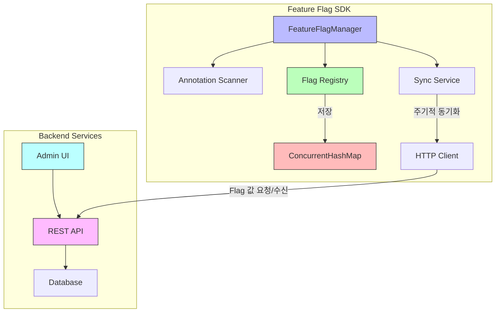
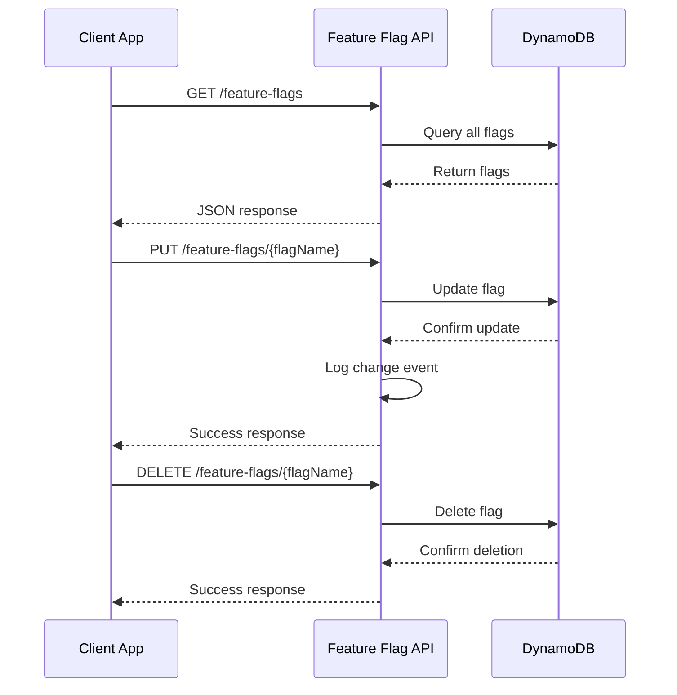
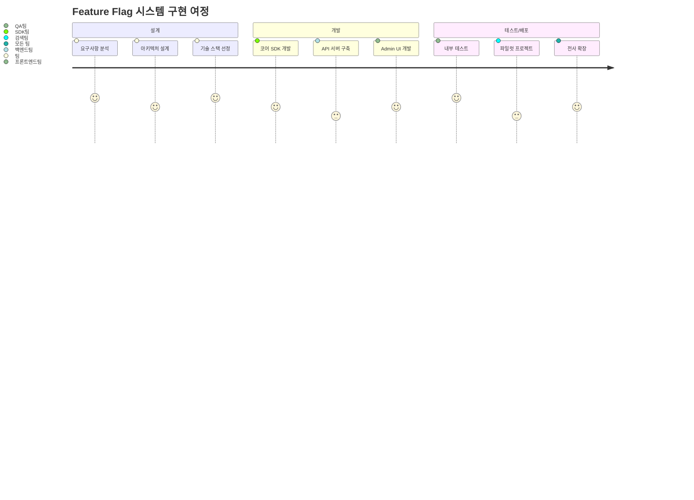

*이 글은 Feature Flag 시스템 구축에 관한 시리즈 중 2부입니다. [1부: 개념, 설계 고민, 그리고 Java SDK 개발 여정](../feature-flag-part1), [3부: 멀티모듈 환경에서의 ClassLoader 문제와 해결, 그리고 개선점](../feature-flag-part3)도 확인해보세요.*

<!-- Reference common style file -->
<link rel="stylesheet" href="/assets/css/common-style.css">

## 4. 기술 스택 상세

### 4.1 코어 SDK: Java 8 (Vanilla Java)
Java 8을 선택한 이유는 회사의 기존 코드베이스와의 호환성도 있었지만, 더 중요한 것은 SDK의 확장성과 유지보수성이었다. 프레임워크 의존성이 가져올 수 있는 문제점을 고민했다. Spring과 같은 프레임워크를 사용할 경우 버전 충돌이 발생할 수 있고, 사용자들이 SDK를 도입할 때 추가적인 설정이 필요해질 수 있다고 판단했다. 순수 Java만으로 구현함으로써 어떤 환경에서도 쉽게 통합될 수 있는 유연성을 확보했고, 이는 실제로 레거시 시스템에서도 문제없이 작동하는 결과로 이어졌다. 특히 Reflection API를 활용한 어노테이션 처리 부분에서는 외부 라이브러리 없이 직접 구현하는 과정이 도전적이었지만, 이를 통해 Java의 메타프로그래밍 기능에 대한 이해도를 크게 높일 수 있었다.
처음에는 Spring Framework를 고려했다. Spring의 의존성 주입이나 AOP 같은 강력한 기능들이 매력적이었지만, SDK가 Spring에 종속되면 사용자들이 Spring 버전을 맞춰야 하고 불필요한 의존성이 생길 것 같았다. 결국 순수 Java로 구현하기로 했다.

순수 Java를 선택한 건 정말 잘한 것 같다. 프레임워크에 종속되지 않다보니 어떤 환경에서든 쉽게 붙일 수 있었고, 사용자들도 별도 설정 없이 바로 쓸 수 있었다. 특히 레거시 시스템에 붙일 때도 아무 문제가 없었다.
자바 버전을 선택할 때는 신중한 고민이 필요했다. 처음에는 Java 7을 고려했는데, 안정성이 검증되었고 대부분의 시스템과 호환된다는 장점이 있었다. 하지만 이미 지원이 종료되었고, 무엇보다 람다식이나 스트림 API 같은 현대적인 기능들을 사용할 수 없다는 큰 제약이 있었다.

Java 11도 매력적인 선택지였다. 향상된 성능과 모듈 시스템 등 최신 기능들을 활용할 수 있었기 때문이다. 하지만 우리 회사의 여러 시스템이 아직 Java 8 환경에서 운영되고 있어서, Java 11을 도입하면 호환성 문제가 발생할 수 있었다.

고민 끝에 Java 8을 선택했다. 람다식, 스트림 API, Optional 등 코드를 현대적이고 깔끔하게 작성할 수 있는 기능들을 제공하면서도, 대부분의 시스템과 호환되는 균형 잡힌 선택이었다. 특히 우리가 목표로 했던 "어디서나 쉽게 붙일 수 있는 가벼운 라이브러리"를 만드는 데 가장 적합했다. 실제로 이 선택 덕분에 코드도 더 읽기 쉽고 관리하기 좋아졌다.

### 4.2 인프라: Kubernetes on AWS EKS
Feature Flag 시스템을 위한 별도의 인프라를 구축하지 않고, 회사에 이미 구축되어 있던 실험 분기 API에 새로운 엔드포인트를 추가하는 방식으로 개발했다. 이 접근 방식은 빠른 개발과 배포를 가능하게 했지만, 지금 돌이켜보면 독립적인 서비스로 분리했어야 했다는 아쉬움이 크다. 실제로 실험 분기 API의 장애가 Feature Flag 시스템에까지 영향을 미치는 사고가 발생했다. 한번은 실험 API의 데이터베이스 연결 오류로 인해 모든 Feature Flag 값 조회가 실패하면서, 여러 서비스에서 기본값으로 폴백하는 상황이 발생했다. 이런 경험을 통해 핵심 기능들은 독립적으로 운영되어야 한다는 교훈을 얻었다.

기존 API에 기능을 추가하면서 Flag 값 변경이 모든 클라이언트에 빠르게 전파되어야 한다는 요구사항을 충족시키기 위해 캐싱 전략과 업데이트 메커니즘을 최적화했다. 이 과정에서 API 설계와 확장성에 대한 중요한 교훈을 얻었으며, 향후에는 처음부터 독립적인 마이크로서비스로 설계하여 Feature Flag 시스템만의 특성에 맞게 최적화된 인프라를 구축하는 것이 더 나은 선택이었을 것이다.

인프라 구성에서는 기존 실험 분기 API에 통합하는 방식을 선택했다. 이는 주로 시간 제약과 실용적 고려 때문이었다. 하지만 이상적으로는 독립형 마이크로서비스로 구축하여 다음과 같은 이점을 얻을 수 있었을 것이다:

- 전용 리소스를 통한 성능 최적화
- 독립적인 확장 및 배포 주기
- 더 명확한 책임 분리와 관리
- 다른 시스템의 장애로부터 격리

이러한 경험은 향후 프로젝트에서 초기 아키텍처 결정의 중요성과 장기적 확장성을 더 신중하게 고려해야 함을 깨닫게 했다.

최종적으로 하이브리드 접근법을 채택했다. 클라이언트는 로컬에서 Flag 결정을 처리하지만 주기적으로 중앙 서버와 동기화하여 분산 시스템의 성능 이점과 중앙 관리의 일관성을 균형 있게 조합했다. 이 선택은 특히 네트워크 장애 시에도 기본값으로 작동하는 견고한 시스템을 구축하는 데 중요했다.

<!-- SDK 아키텍처 다이어그램 -->
<div style="text-align:center; margin:20px auto;">

<p style="text-align:center;"><small><i>Feature Flag SDK의 핵심 컴포넌트와 백엔드 서비스 간의 관계</i></small></p>
</div>

### 4.3 배포: Jib & Jenkins
배포 과정에서 가장 큰 고민은 빌드 시간 단축과 안정적인 배포 파이프라인 구축이었다. 기존 Docker 기반 배포에서는 매번 전체 이미지를 다시 빌드하는 비효율이 있었고, 이로 인해 작은 코드 변경에도 배포 시간이 길어지는 문제가 있었다. Jib을 도입함으로써 변경된 클래스 파일만 효율적으로 업데이트하는 방식으로 빌드 시간을 크게 단축할 수 있었다. 또한 Jenkins 파이프라인을 구성하면서 단순 자동화를 넘어 각 단계별 검증 과정을 추가했다. 특히 단위 테스트를 실행하고, 코드 커버리지가 일정 수준 이상일 때만 배포가 진행되도록 설정했다. 이 과정에서 CI/CD 파이프라인의 중요성과 테스트 자동화의 가치를 실감할 수 있었다.

Jib과 Jenkins를 선택한 것은 정말 좋은 결정이었다. Jib은 Docker 이미지 빌드 시간을 획기적으로 단축시켜주었다. 기존에는 전체 이미지를 다시 빌드하느라 3-5분씩 걸렸는데, Jib을 도입하고 나서는 변경된 레이어만 빌드하다 보니 30초 이내로 끝나게 되었다. Docker 데몬이 필요 없어서 클라우드 빌드 환경에서도 문제없이 잘 돌아갔고, 멀티스테이지 빌드도 자동으로 처리해줘서 이미지 크기도 최적화할 수 있었다. Maven이나 Gradle과도 잘 맞아서 기존 빌드 스크립트를 크게 손대지 않고도 적용할 수 있었다.

Jenkins도 우리 환경에 잘 맞았다. 무엇보다 회사의 기존 인프라와 잘 통합되어 있어서 별도의 설정이나 관리가 거의 필요 없었다. 플러그인도 정말 다양해서 필요한 기능은 거의 다 찾을 수 있었고, 권한 관리나 감사 기능도 세세하게 제어할 수 있어서 좋았다. 특히 우리 개발자들이 Jenkins를 이미 잘 알고 있어서 새로운 도구를 도입할 때 생기는 학습 비용도 들지 않았다.

이 조합은 빠른 빌드와 안정적인 파이프라인이라는 두 가지 목표를 모두 달성하는 최적의 솔루션이었다. 특히 배포 자동화와 품질 게이트(코드 커버리지, 정적 분석 등)를 통합함으로써 개발자들이 코드 품질에 더 집중할 수 있는 환경을 조성했다.

### 4.4 데이터 저장소: AWS DynamoDB
데이터 저장소 선택에서 가장 큰 고민은 SQL과 NoSQL 중 어떤 것을 사용할지였다. SQL은 스키마 변경이 어렵고 확장성이 제한적이지만 데이터 일관성과 트랜잭션 지원이 강점이었다. NoSQL은 유연한 스키마와 수평적 확장이 용이하지만 강력한 일관성 보장이 어려웠다. 결국 NoSQL 중에서도 DynamoDB를 선택했는데, 이는 회사 인프라팀에서 이미 DynamoDB를 지원하고 있었기 때문이다. 이를 통해 운영 부담을 크게 줄일 수 있었고, 특히 Flag 값 조회 API가 서비스의 핵심 로직 실행 전에 호출되는 만큼 안정적인 운영이 가능했다.

데이터 저장소 선택 시 고려했던 대안들은 다음과 같다:

30. **PostgreSQL/MySQL**
   - 장점: 강력한 트랜잭션, ACID 준수, SQL 표준 지원, 복잡한 쿼리 가능
   - 단점: 수평적 확장 어려움, 스키마 변경의 복잡성, 높은 초기 설정 비용
   - 기각 이유: Feature Flag 데이터 모델의 단순성과 높은 읽기 처리량 요구사항에 과도한 솔루션

31. **MongoDB**
   - 장점: 문서 지향 모델, 유연한 스키마, 개발자 친화적 API
   - 단점: 일관성 모델 약함, 복잡한 샤딩 설정, 운영 복잡성
   - 기각 이유: 회사 내 MongoDB 운영 경험 부족, 관리 오버헤드 우려

## 5. 시스템 활용

### 5.1 엔드포인트 목록
Feature Flag 시스템은 다음과 같은 RESTful API 엔드포인트를 제공한다:

- `GET /feature-flags`: 모든 Feature Flag 목록 조회
- `PUT /feature-flags/{flagName}`: 특정 Feature Flag 생성 또는 수정
- `DELETE /feature-flags/{flagName}`: 특정 Feature Flag 삭제

API 설계 시 다음과 같은 대안적 접근법을 검토했다:

32. **gRPC 기반 API**
   - 장점: Protocol Buffer의 효율적인 직렬화, 강력한 타입 시스템, 양방향 스트리밍을 통한 실시간 업데이트 지원
   - 단점: HTTP 도구와의 호환성 부족, 높은 학습 곡선, 브라우저 네이티브 지원 미흡
   - 기각 이유: REST API의 범용성과 단순함, 기존 인프라와의 통합 용이성을 더 중요하게 판단

여담으로, Node.js 클라이언트 개발 과정에서 Protocol Buffer 스키마를 정의하면서 gRPC로의 전환을 재검토했다. 하지만 기존 시스템의 복잡도와 마이그레이션에 필요한 리소스를 고려했을 때 현실적인 제약이 있었다. 이는 초기 설계 단계에서 확장성을 충분히 고려하지 못한 결과였다.

그래도 최종적으로 선택한 RESTful API는 다음과 같은 명확한 이점을 제공했다:

- 단순하고 직관적인 리소스 중심 설계
- 기존 HTTP 캐싱과 로드밸런싱 활용 가능
- 풍부한 개발 도구와 디버깅 환경
- 모든 주요 프로그래밍 언어의 클라이언트 지원

<!-- API 흐름도 -->
<div style="text-align:center; margin:20px auto;">

<p style="text-align:center;"><small><i>Feature Flag API 엔드포인트 호출 흐름</i></small></p>
</div>

### 5.2 SDK 통합 코드

### 호출 예시
```java
FeatureFlagManager manager = FeatureFlagManager.builder()
                .setPackageNames(new String[]{"your.package.names"})
                .setEnvironment(ExpEnv.QA)
                .setClassLoader(classLoader)
                .build();
```

### 선언 예시
```java
// Flag를 선언할 클래스 내에서
@FeatureFlag(flagName = "new-search-algorithm")
public static boolean useNewSearchAlgorithm = false;

@FeatureFlag(flagName = "premium-features-enabled")
public static boolean premiumFeaturesEnabled = false;

// 사용하는 곳에서는 일반 변수처럼 접근
if (SearchConfig.useNewSearchAlgorithm) {
    // 새 알고리즘 사용 로직
}
```

### 5.3 Admin UI

<!-- Admin UI 화면 예시 -->
<div class="alternative-diagram">
  
  <p style="text-align:center;"><small><i>Feature Flag Admin UI 화면 예시 - 직관적인 ON/OFF 토글과 상세 설정 제공</i></small></p>
</div>

## 6. 결론 및 다음 내용 소개

<!-- 구현 여정 개요 -->
<div style="text-align:center; margin:20px auto;">

<p style="text-align:center;"><small><i>Feature Flag 시스템 구현 여정과 각 단계별 성취도</i></small></p>
</div>

이번 2부에서는 Feature Flag 시스템의 기술 스택 선택 과정과 실제 구현 사례를 살펴보았다. 특히 Java 8 기반의 순수 Java SDK 개발, AWS 인프라 활용, Jib 및 Jenkins를 활용한 배포 환경 구성, 그리고 DynamoDB를 통한 데이터 관리 방식에 대해 다루었다. 이러한 기술 스택은 단순히 최신 트렌드를 따르는 것이 아닌, 우리 조직의 상황과 니즈에 맞게 신중하게 선택된 결과물이다.

Feature Flag 시스템 개발을 통해 "완벽한 시스템보다는 확장 가능한 시스템"이라는 원칙의 중요성을 깨달았다. 초기에는 단순한 기능만으로 시작했지만, 점진적으로 필요한 기능을 추가하면서 시스템을 발전시켜 나갔다. 이러한 접근 방식은 빠른 출시와 사용자 피드백 기반의 개선을 가능하게 했다.

다음 [3부: 멀티모듈 환경에서의 ClassLoader 문제와 해결, 그리고 개선점](../feature-flag-part3)에서는 시스템 운영 중 마주한 가장 흥미로운 기술적 도전 과제인 ClassLoader 관련 문제와 그 해결 과정을 살펴볼 예정이다. 특히 다양한 배포 환경과 모듈 구조에서 발생할 수 있는 리플렉션 관련 이슈와 대응 방법에 대해 자세히 다룰 것이다. 또한 현재 시스템의 한계점과 향후 개선 방향에 대해서도 논의할 예정이다.