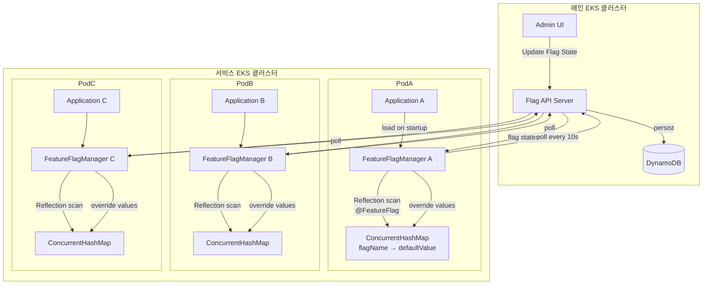
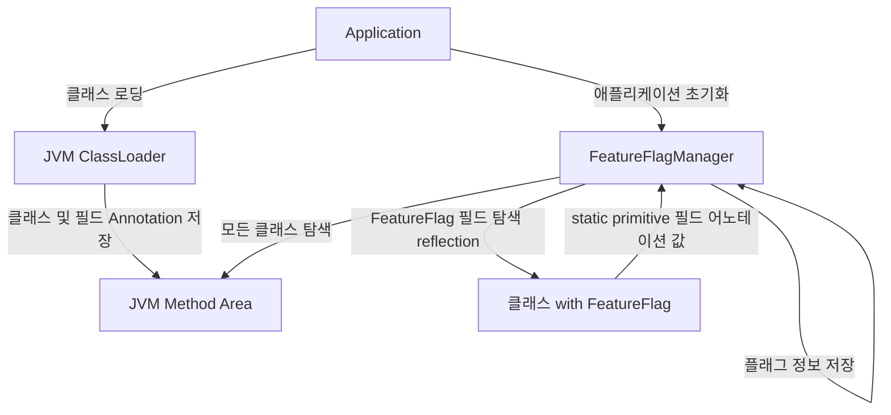

## 목차
1. [SDK 개요](#1-sdk-개요)
2. [시스템 구조](#2-시스템-구조)
   - [관리 시스템](#21-관리-시스템)
   - [서비스 시스템](#22-서비스-시스템)
   - [데이터 흐름](#23-데이터-흐름)
   - [아키텍처 선택 배경](#24-아키텍처-선택-배경)
   - [대안적 접근 방식](#25-대안적-접근-방식-검토)
3. [핵심 설계 원칙과 기술적 구현](#3-핵심-설계-원칙과-기술적-구현)
   - [Annotation 기반 관리](#31-annotation-기반-관리-시스템)
   - [Reflection 기반 자동 등록](#32-reflection-기반-자동-등록-메커니즘)
   - [싱글톤 패턴](#33-싱글톤-패턴과-스레드-안전성-확보)
   - [동시성 제어](#34-동시성-제어)
4. [기술 스택 상세](#4-기술-스택-상세)
   - [코어 SDK](#41-코어-sdk-java-8-vanilla-java)
   - [인프라](#42-인프라-kubernetes-on-aws-eks)
   - [배포](#43-배포-jib--jenkins)
   - [데이터 저장소](#44-데이터-저장소-aws-dynamodb)
5. [시스템 활용](#5-시스템-활용)
6. [Feature Flag 시스템의 내부 동작 원리](#6-feature-flag-시스템의-내부-동작-원리)
7. [트러블슈팅: ClassLoader 문제](#7-트러블슈팅-classloader-문제)
8. [향후 발전 방향](#8-향후-발전-방향)
9. [부록: 용어 정리](#9-부록-용어-정리)

---

<style>
.mermaid {
  width: 60% !important;
  max-width: 60% !important;
  margin: 20px auto !important;
  font-size: 10px !important;
  font-family: 'Arial', sans-serif !important;
  overflow: hidden !important;
}

.mermaid .node rect, 
.mermaid .node circle, 
.mermaid .node ellipse, 
.mermaid .node polygon, 
.mermaid .node path {
  fill: #f5f9ff !important;
  stroke: #4a6da7 !important;
  stroke-width: 1.5px !important;
}

.mermaid .node text {
  font-size: 8px !important;
}

.mermaid .edgeLabel {
  font-size: 6px !important;
}

.mermaid .cluster rect {
  fill: #f0f8ff !important;
  stroke: #4a6da7 !important;
  stroke-width: 1px !important;
  rx: 8px !important;
  ry: 8px !important;
}

.mermaid .label {
  font-size: 10px !important;
}

.mermaid .timeline-event {
  font-size: 12px !important;
}

.mermaid .journey-section {
  font-size: 12px !important;
  font-weight: bold !important;
}

@media screen and (max-width: 768px) {
  .mermaid {
    font-size: 12px !important;
    margin: 15px 0 !important;
  }
  .mermaid .node text {
    font-size: 10px !important;
  }
  .mermaid .edgeLabel {
    font-size: 8px !important;
    padding: 1px 2px !important;
  }
  .mermaid .label {
    font-size: 12px !important;
  }
  .mermaid .timeline-event,
  .mermaid .journey-section {
    font-size: 10px !important;
  }
}
</style>

---

## 1. SDK 개요

Feature Flag는 코드 변경 없이 기능을 켜고 끌 수 있게 해주는 설정 값입니다. 마치 전등 스위치처럼 언제든 기능을 활성화하거나 비활성화할 수 있습니다. 이 시스템을 개발하게 된 배경에는 다음과 같은 실제 운영 경험이 있었습니다:

- 실험이 끝난 후에도 관련 코드가 계속 남아있는 문제
- QA 과정에서 기능을 켜고 끄는 작업이 번거로움
- 기능 활성화 설정이 직관적이지 않음
- 개발자나 PO가 빠르게 기능을 제어하기 어려움

이러한 문제들을 해결하기 위해, 우리는 애플리케이션 코드 수준에서 기능을 쉽게 제어할 수 있는 Feature Flag 시스템을 개발하게 되었습니다.

### 1.1 SDK의 주요 기능



*Feature Flag 시스템의 전체 아키텍처를 보여주는 상세한 플로우차트*

---

## 2. 시스템 구조

시스템은 크게 두 부분으로 구성됩니다:

### 2.1 관리 시스템
- **관리 화면**: Feature Flag 값을 설정하고 모니터링하는 웹 인터페이스
- **API 서버**: Feature Flag 값을 저장하고 제공하는 서버
- **데이터베이스**: Feature Flag 값과 설정을 저장하는 저장소

### 2.2 서비스 시스템
각 서비스는 다음과 같은 구성요소를 가지고 있습니다:

1. **애플리케이션**: Feature Flag를 사용하는 실제 서비스
2. **FeatureFlagManager**: 
   - 서비스 시작 시 `@FeatureFlag` 어노테이션이 붙은 필드들을 찾아서 등록
   - 메모리에 초기값 저장
   - 10초마다 API 서버에서 최신 값 확인
3. **값 저장소**: 
   - Feature Flag 이름과 값을 저장
   - 여러 스레드에서 동시에 접근해도 안전하게 동작

### 2.3 데이터 흐름

#### 2.3.1 플래그 등록 과정
- **1단계**: 서비스 시작 시 `@FeatureFlag` 어노테이션이 붙은 필드들을 찾습니다
- **2단계**: 찾은 플래그 정보를 메모리에 초기값으로 저장합니다
- **3단계**: API 서버에 플래그 정보를 등록합니다
- **4단계**: API 서버가 데이터베이스에 플래그 정보를 저장합니다

#### 2.3.2 폴링 주기 결정의 근거

폴링 주기를 10초로 설정한 이유는 단순한 직감이 아닌, 실제 운영 환경에서 수집한 데이터를 바탕으로 결정된 값입니다. 다음과 같은 측면들을 종합적으로 고려했습니다:

1. **기능 변경 패턴 분석**
   - 플래그 값이 실시간으로 바뀌는 경우는 거의 없고, 대부분 실험 또는 QA 직후 수동 변경에 국한되어 있음
   - 내부 로그 기준, 한 시간 동안 동일 플래그에 대한 연속 변경 건수의 평균은 1 미만

2. **서버 부하 시뮬레이션**
   - 서비스 인스턴스 수가 1000개일 때, 폴링 간격이 1초면 초당 1000 QPS, 10초면 100 QPS 수준
   - 10초 주기에서 서버의 평균 CPU 사용률이 20% 미만으로 안정적이었고, 네트워크 대역폭 소모도 무시할 수준

3. **사용자 체감 실시간성**
   - 대부분의 기능은 실제로 10초 이내에 반영되어도 UX에 영향을 주지 않음
   - 실험 결과: QA 팀 기준으로 10초 이내 반영되면 "즉시 적용됨"으로 인식

4. **Fallback 및 장애 복원성**
   - 네트워크가 잠시 끊겨도 10초 내 복구되면 사용자 영향이 없음
   - 너무 짧은 주기는 장애 상황에서 서버에 부담을 더 크게 줄 수 있음

5. **운영비용 고려**
   - DynamoDB는 요청 수 기반으로 과금되기 때문에, 너무 짧은 주기는 비용 증가 요인이 됨
   - 10초는 비용과 응답성을 균형 있게 맞춘 임계값
결론적으로, 10초라는 폴링 주기는 **"실시간성 요구사항과 리소스 효율성의 최적 균형점"**으로 정의되었습니다. 이 값은 다음과 같은 기준을 통해 도출되었습니다:

1. **운영 효율성**: 대부분의 기능 변경이 실시간성이 아닌 배치성 작업에 해당
2. **리소스 최적화**: 서버 부하와 네트워크 트래픽을 고려한 최소 요구 시간
3. **비용 효율성**: DynamoDB 요청 수 기반 과금 모델에서의 최적화된 비용 지점

시스템은 유연하게 설계되어 있어, 실시간성이 더 중요한 시나리오가 발생할 경우 폴링 주기를 5초로 단축할 수 있도록 구성되어 있습니다.
#### 2.3.3 플래그 값 조회 과정


#### 2.3.4 플래그 값 변경 과정

플래그 값을 변경하는 과정은 다음과 같습니다:

1. **관리 화면에서 변경**
   - 관리자가 웹 인터페이스에서 새로운 값을 설정합니다
   - 변경 사항이 API 서버로 전송됩니다

2. **데이터베이스 업데이트**
   - API 서버가 새로운 값을 데이터베이스에 저장합니다
   - 변경 이력은 자동으로 저장됩니다

3. **서비스에 반영**
   - 각 서비스는 10초마다 새로운 값을 확인합니다
   - 변경된 값이 자동으로 적용됩니다

### 2.4 아키텍처 선택 배경

시스템을 설계할 때 다음과 같은 세 가지 방식을 고려했습니다:

1. **중앙 집중식**
   - 장점: 즉시 업데이트, 일관된 제어
   - 단점: 네트워크 지연, 높은 의존성, 단일 장애점

2. **분산식**
   - 장점: 빠른 성능, 높은 가용성
   - 단점: 상태 동기화 어려움, 일관성 보장 어려움

3. **하이브리드 (선택)**
   - 장점: 
     - 로컬 캐시로 빠른 성능 확보
     - 10초 주기로 일관성 유지
     - 네트워크 장애 시에도 기본값으로 동작
     - 서비스 단위 독립성으로 장애 격리
   - 선택 이유: 성능, 일관성, 안정성의 균형점

### 2.5 대안적 접근 방식 검토

현재 시스템의 10초 폴링 방식은 단순하고 안정적이지만, 다음과 같은 대안들도 고려해볼 수 있습니다:

1. **Pub/Sub + 폴링 하이브리드 방식**
   - 장점: 값 변경 시 즉시 알림, 네트워크 부하 감소, 실시간성 향상
   - 단점: 추가 인프라 필요, 연결 관리 복잡성, 장애 시 폴링으로 전환 필요

2. **Redis 기반 중앙 캐시 방식**
   - 장점: 항상 최신 값 보장, 단순한 구조, 높은 성능
   - 단점: Redis 의존성, 네트워크 지연 가능성, Redis 장애 시 영향

초기에는 인프라 비용과 복잡성 때문에 보류했지만, 시스템이 성장하면서 실시간성과 확장성 요구사항이 증가한다면 재검토해볼 만한 옵션들입니다.

---

## 3. 핵심 설계 원칙과 기술적 구현

### 3.1 Annotation 기반 관리 시스템

```java
@FeatureFlag(flagName="new-search-algorithm")
private static boolean useNewSearchAlgorithm = true;
```

이 설계는 관리 화면과 코드 사이의 네트워크 장애 시에도 기능 상태의 일관성을 보장합니다. 서비스 시작 시 코드에 선언된 Flag가 자동으로 등록되며, 이후 관리 화면에서 상태를 수정할 수 있습니다.

이 설계를 선택하기 전에 다음과 같은 대안들을 고려했습니다:

1. **Properties 파일 기반 설정**
   - 장점: 설정 변경이 쉽고, 코드 수정 없이 값 변경 가능
   - 단점: 배포가 필요하여 런타임 변경 불가능

2. **데이터베이스 직접 관리**
   - 장점: 중앙 집중식 관리, 실시간 값 변경 가능
   - 단점: 네트워크 장애 시 전체 시스템 영향

3. **REST API 기반 동적 설정**
   - 장점: 런타임에 유연한 관리 가능
   - 단점: 네트워크 의존성, 초기값 설정 어려움

Annotation 방식은 이러한 대안들의 단점을 보완하면서도 다음과 같은 이점을 제공합니다:
- 코드의 의도가 명확히 드러남
- 컴파일 시점 검증 가능
- IDE 지원을 통한 개발 생산성 향상
- 기본값 지정으로 안정성 확보

### 3.2 Reflection 기반 자동 등록 메커니즘

Java Reflection API를 활용하여 코드에 있는 Feature Flag 변수를 자동으로 수집하고 관리하는 시스템을 구현했습니다. 구체적으로는 다음과 같은 과정으로 동작합니다:

1. **클래스 스캔**
   - 서비스 시작 시 모든 클래스를 검사합니다
   - `@FeatureFlag` 어노테이션이 붙은 필드를 찾습니다

2. **필드 정보 수집**
   - 필드의 이름과 기본값을 저장합니다
   - private 필드도 접근할 수 있도록 처리합니다

3. **메모리 저장**
   - 수집된 정보를 메모리에 저장합니다
   - 여러 스레드에서 안전하게 접근할 수 있도록 합니다

이 메커니즘을 구현하기 위해 여러 대안을 검토했습니다:

1. **컴파일 시점 처리**
   - 장점: 런타임 오버헤드 없음, 컴파일 시점 검증 가능
   - 단점: 복잡한 구현, 빌드 프로세스 변경 필요

2. **명시적 등록 API**
   - 장점: 간단한 구현, 명확한 작동 방식
   - 단점: 개발자가 수동으로 각 Flag 등록 필요

3. **스프링 프레임워크 통합**
   - 장점: 기존 스프링 애플리케이션과 통합 용이
   - 단점: 스프링 의존성 발생, 비스프링 환경 지원 어려움

Reflection 기반 접근법은 이러한 대안들과 비교했을 때 가장 균형 잡힌 선택이었습니다. 런타임에 약간의 오버헤드가 있지만, 개발자 경험을 최우선으로 고려했을 때 코드에 어노테이션만 추가하면 되는 간편함이 큰 장점이었습니다.

중요한 제약사항으로, Feature Flag 필드는 반드시 `static`으로 선언해야 합니다. 이는 Reflection API의 특성 때문인데, 인스턴스 필드의 경우 해당 클래스의 인스턴스가 필요하지만, 스캔 시점에는 이 인스턴스를 생성할 방법이 없기 때문입니다. 반면 `static` 필드는 클래스 로딩 시점에 메모리에 할당되므로 인스턴스 없이도 접근 및 수정이 가능합니다.

```java
// 올바른 사용법 - static 필드
@FeatureFlag(flagName = "new-search-algorithm", defaultValue = false)
public static boolean useNewSearchAlgorithm = false;

// 잘못된 사용법 - 인스턴스 필드 (작동하지 않음)
@FeatureFlag(flagName = "premium-feature", defaultValue = false)
private boolean premiumFeatureEnabled = false;
```

또한 클래스 로더 계층 구조를 고려하여 애플리케이션의 모든 패키지를 스캔하는 재귀적 알고리즘을 구현했고, 성능 최적화를 위해 스캔 대상 패키지를 설정할 수 있는 필터링 메커니즘도 추가했다. 이렇게 수집된 Feature Flag 정보는 ConcurrentHashMap을 사용해 스레드 안전하게 관리했으며, 주기적으로 백엔드 서버와 동기화되도록 ScheduledExecutorService를 구성했다.

주기적 업데이트 방식을 선택한 것도 신중한 고려 끝에 내린 결정이었다. WebSocket(양방향 실시간 통신)이나 Server-Sent Events(서버에서 클라이언트로의 단방향 실시간 통신)를 통한 실시간 업데이트도 고려했지만, 연결 유지에 따른 서버 부하와 네트워크 비용이 우려되어 채택하지 않았다. WebSocket은 실시간 채팅처럼 양방향 통신이 필요한 경우에 적합하고, Server-Sent Events는 실시간 알림처럼 서버에서 클라이언트로의 푸시 알림이 필요한 경우에 적합하다. 실시간 업데이트 대신 주기적 업데이트를 선택한 이유는 다음과 같다:

1. **서버 부하 감소**: 수많은 클라이언트의 실시간 연결 대신 주기적 업데이트를 통해 서버 리소스를 효율적으로 관리할 수 있다. 특히 수천 개의 서비스 인스턴스가 동시에 연결을 유지하는 상황을 피할 수 있었다.

2. **네트워크 효율성**: 여러 변경사항을 모아서 배치로 처리함으로써 네트워크 트래픽을 최적화할 수 있다. 실시간 전파는 각각의 작은 변경에도 즉시 통신이 발생하는 반면, 주기적 업데이트는 여러 변경을 한 번에 처리할 수 있다.

3. **장애 복원력**: 일시적인 네트워크 문제나 서버 장애 시에도 다음 주기에 자연스럽게 복구된다. 실시간 연결 방식은 연결 끊김 시 즉각적인 재연결 로직이 필요하지만, 주기적 업데이트는 이러한 복잡성을 피할 수 있다.

4. **구현 단순성**: 실시간 업데이트는 연결 관리, 재시도 로직, 장애 복구 등 복잡한 구현이 필요한 반면, 주기적 업데이트는 단순한 HTTP 요청만으로 구현이 가능하다.

5. **캐시 활용**: 업데이트 주기 사이에는 로컬 캐시를 활용하여 빠른 응답시간을 보장할 수 있다. 대부분의 Flag 값은 자주 변경되지 않는다는 점을 고려할 때, 이는 실용적인 접근이었다.

이러한 설계를 통해 개발자들은 코드에 어노테이션만 추가하면 자동으로 시스템에 등록되어 관리되는 편리함을 제공할 수 있었다. XML 기반 설정이나 프로그래밍 방식의 등록도 고려했지만, 코드와 설정이 분리되어 관리가 어려워질 수 있다는 단점 때문에 어노테이션 방식을 선택했다.

### 3.3 싱글톤 패턴과 스레드 안전성 확보

Feature Flag Manager는 싱글톤 패턴으로 구현하여 서비스 전체에서 하나의 인스턴스만 존재하도록 설계했습니다. 싱글톤 패턴을 적용한 이유는 다음과 같습니다:

1. **일관된 상태 관리**
   - Feature Flag의 상태는 서비스 전체에서 일관되게 유지되어야 합니다
   - 여러 인스턴스가 존재할 경우 각각 다른 상태를 가질 수 있습니다

2. **리소스 효율성**
   - Flag 정보를 주기적으로 서버와 동기화하는 과정에서 네트워크 요청이 발생합니다
   - 여러 인스턴스가 각각 동기화를 수행하면 불필요한 리소스 낭비가 발생합니다

3. **캐시 효율성**
   - 캐시를 통해 Flag 값 조회 성능을 최적화했습니다
   - 여러 인스턴스가 각자의 캐시를 관리하면 캐시 효율성이 떨어집니다

4. **중앙화된 로깅**
   - 모든 Flag 조회와 변경 이벤트를 단일 지점에서 추적합니다
   - 디버깅과 모니터링이 용이해집니다

### 3.4 동시성 제어

여러 서버에서 동시에 Feature Flag 값을 읽고 쓰는 상황에서 데이터 일관성을 보장하기 위해 Java의 `ConcurrentHashMap`을 사용했습니다. 이 결정의 핵심에는 "최대한 단순하게 구성하라"는 원칙이 있었습니다.

이러한 결정을 내린 구체적인 이유는 다음과 같습니다:

1. **성능 최적화**
   - 명시적인 락은 모든 읽기/쓰기 작업에 대해 동기화를 강제합니다
   - Feature Flag 시스템은 읽기 작업이 압도적으로 많아서, 읽기 작업에 락을 사용하면 불필요한 병목 현상이 발생할 수 있습니다

2. **세밀한 동시성 제어**
   - `ConcurrentHashMap`은 내부적으로 세그먼트 단위의 락을 사용합니다
   - 다른 키에 대한 동시 접근을 허용하여 효율성을 높입니다

3. **코드 복잡성 감소**
   - 명시적인 락 메커니즘을 구현하려면 복잡한 동시성 제어 로직이 필요합니다
   - `ConcurrentHashMap`을 사용함으로써 이러한 복잡성을 크게 줄일 수 있습니다

4. **원자적 연산 지원**
   - `ConcurrentHashMap`은 안전한 업데이트를 위한 메서드를 제공합니다
   - 락 없이도 안전하게 값을 업데이트할 수 있습니다

동시성 제어를 위해 다른 방법들도 검토해보았습니다:

1. **Synchronized Collections** 
   - 장점: 구현이 매우 간단하고 Java 기본 라이브러리를 사용할 수 있습니다
   - 단점: 모든 읽기/쓰기 작업마다 전체 Map에 락이 걸려서 성능이 떨어집니다

2. **ReentrantReadWriteLock**
   - 장점: 읽기 작업과 쓰기 작업을 구분해서 처리할 수 있습니다
   - 단점: 락을 직접 관리해야 해서 코드가 복잡해지고 실수하기 쉽습니다

이러한 대안들을 검토한 후, 결국 `ConcurrentHashMap`을 선택했습니다. `ConcurrentHashMap`은 Java 5부터 제공되는 검증된 라이브러리로, 다음과 같은 장점이 있습니다:

- **부분 락**: Map 전체가 아닌 일부분에만 락을 걸어서 다른 부분은 계속 사용할 수 있습니다
- **동시 읽기**: 여러 스레드가 동시에 읽기 작업을 할 수 있습니다
- **안전한 업데이트**: 안전한 업데이트 메서드를 제공합니다
- **검증된 구현**: 오랜 기간 많은 개발자들이 사용하면서 검증된 라이브러리입니다

최종적으로는, "최대한 단순하게 만들어라"는 원칙을 따라, 직접 복잡한 동시성 제어를 구현하는 대신 검증된 라이브러리를 사용하기로 했습니다. 특히 여러 팀이 사용하는 공통 SDK에서는 코드가 단순할수록 버그도 적고 유지보수도 쉽다는 점을 고려했습니다.

---

## 4. 기술 스택 상세

### 4.1 코어 SDK: Java 8 (Vanilla Java)
Java 8을 선택한 이유는 회사의 기존 코드베이스와의 호환성도 있었지만, 더 중요한 것은 SDK의 확장성과 유지보수성이었다. 프레임워크 의존성이 가져올 수 있는 문제점을 고민했다. Spring과 같은 프레임워크를 사용할 경우 버전 충돌이 발생할 수 있고, 사용자들이 SDK를 도입할 때 추가적인 설정이 필요해질 수 있다고 판단했다. 순수 Java만으로 구현함으로써 어떤 환경에서도 쉽게 통합될 수 있는 유연성을 확보했고, 이는 실제로 레거시 시스템에서도 문제없이 작동하는 결과로 이어졌다. 특히 Reflection API를 활용한 어노테이션 처리 부분에서는 외부 라이브러리 없이 직접 구현하는 과정이 도전적이었지만, 이를 통해 Java의 메타프로그래밍 기능에 대한 이해도를 크게 높일 수 있었다.

### 4.2 인프라: Kubernetes on AWS EKS

Feature Flag 시스템의 인프라는 회사의 기존 실험 분기 API에 새로운 엔드포인트를 추가하는 방식으로 구현했다. 이 접근 방식은 빠른 개발과 배포를 가능하게 했지만, 실제 운영 중 일부 기능이 비정상적으로 동작하는 문제가 발생했다. 이 사건은 Feature Flag와 같은 핵심 인프라를 다른 서비스에 종속시키는 것의 위험성을 명확하게 보여주었다.

이러한 실제 장애 경험을 통해, Feature Flag 시스템은 반드시 독립적인 마이크로서비스로 분리되어야 한다는 교훈을 얻었다. 현재는 임시방편으로 실험 API의 장애 상황에서도 Feature Flag가 최소한의 기능을 유지할 수 있도록 fallback 메커니즘을 구현해놓은 상태지만, 이상적으로는 완전히 독립된 서비스로 재구축하여 다음과 같은 이점을 얻을 수 있을 것이다:

- 전용 리소스를 통한 성능 최적화
- 독립적인 확장 및 배포 주기
- 더 명확한 책임 분리와 관리
- Feature Flag 특화 기능 추가 용이성

이러한 경험은 향후 프로젝트에서 초기 아키텍처 결정의 중요성과 장기적 확장성을 더 신중하게 고려해야 함을 깨닫게 했다. 특히 Feature Flag 시스템만의 특성에 맞게 최적화된 인프라를 구축하는 것이 더 나은 선택이었을 것이다.

### 4.3 배포: Jib & Jenkins
배포 과정에서 가장 큰 고민은 빌드 시간 단축과 안정적인 배포 파이프라인 구축이었다. 컨테이너 이미지 빌드 도구로 기존 Docker와 Google의 Jib을 비교 검토했다:

1. **전통적인 Dockerfile 기반 빌드**
   - 장점: 익숙한 방식, 세부 설정 가능, 광범위한 사용 사례
   - 단점: 
     - 매번 전체 이미지를 다시 빌드하여 시간이 오래 걸림
     - 레이어 캐싱 최적화가 어려움
     - Docker 데몬 필요
   - 기각 이유: 빌드 시간이 3-5분으로 너무 길고, 작은 코드 변경에도 전체 재빌드 필요

2. **Jib**
   - 장점:
     - 변경된 레이어만 빌드하여 30초 이내로 빌드 시간 단축
     - Docker 데몬 불필요
     - Maven/Gradle과 원활한 통합
     - 멀티스테이지 빌드 자동화로 이미지 크기 최적화
   - 단점: Dockerfile 대비 세부 설정의 유연성 다소 제한
   - 선택 이유: 빌드 시간 대폭 단축과 개발 생산성 향상

배포 파이프라인은 Jenkins를 활용했다. Jenkins를 선택한 주된 이유는 이미 회사에서 SDK 배포를 위한 환경이 잘 구축되어 있었기 때문이다. 기존 SDK들의 배포 파이프라인이 Jenkins로 구성되어 있어 참고할 수 있는 사례가 많았고, Maven Repository 연동이나 버전 관리 등의 설정을 재사용할 수 있었다. 이를 통해 새로운 배포 환경을 구축하는 대신 검증된 파이프라인을 활용할 수 있었다.

이러한 Jib과 Jenkins의 조합으로, 특히 사내 Maven Repository와의 연동을 통해 효율적인 라이브러리 배포 파이프라인을 구축할 수 있었다. 기존 인프라를 최대한 활용함으로써 추가적인 설정이나 관리 부담 없이 안정적인 배포가 가능했다.

### 4.4 데이터 저장소: AWS DynamoDB

데이터 저장소 선택에서 가장 큰 고민은 SQL과 NoSQL 중 어떤 것을 사용할지였다. SQL은 스키마 변경이 어렵고 확장성이 제한적이지만 데이터 일관성과 트랜잭션 지원이 강점이었다. NoSQL은 유연한 스키마와 수평적 확장이 용이하지만 강력한 일관성 보장이 어려웠다. 

이러한 트레이드오프를 고려하면서, 결국 NoSQL 중에서도 DynamoDB를 선택했다. 이는 회사 인프라팀에서 이미 DynamoDB를 지원하고 있어 운영 부담을 크게 줄일 수 있었기 때문이다. 특히 Flag 값 조회 API가 서비스의 핵심 로직 실행 전에 호출되는 만큼, 안정적인 운영이 매우 중요했다.

일관성 측면에서도 신중한 설계가 필요했다. DynamoDB는 기본적으로 Eventually Consistent한 시스템이지만, 우리는 Global Table을 사용하지 않고 단일 리전 내에서만 쓰기/읽기를 수행했기 때문에 ConsistentRead=True 옵션을 사용해 Strong Consistency를 확보할 수 있었다. 이를 통해 실시간성이 필요한 환경에서도 최신 상태가 보장되는 구조를 구축할 수 있었다.

데이터 저장소 선택 시 고려했던 대안들은 다음과 같다:

1. **PostgreSQL/MySQL**
   - 장점: 강력한 트랜잭션, ACID 준수, SQL 표준 지원, 복잡한 쿼리 가능
   - 단점: 수평적 확장 어려움, 스키마 변경의 복잡성, 높은 초기 설정 비용
   - 기각 이유: Feature Flag 데이터 모델의 단순성과 높은 읽기 처리량 요구사항에 과도한 솔루션

2. **MongoDB**
   - 장점: 문서 지향 모델, 유연한 스키마, 개발자 친화적 API
   - 단점: 일관성 모델 약함, 복잡한 샤딩 설정, 운영 복잡성
   - 기각 이유: 회사 내 MongoDB 운영 경험 부족, 관리 오버헤드 우려

DynamoDB를 선택한 핵심 이유:

1. **관리 부담 최소화**: AWS 관리형 서비스로 운영 오버헤드 최소화
2. **자동 확장성**: 읽기/쓰기 용량의 자동 조정으로 트래픽 변동 대응
3. **비용 효율성**: 프로비저닝 모드와 온디맨드 모드의 유연한 선택
4. **높은 성능**: 일관된 밀리초 단위 응답 시간 보장
5. **기존 인프라 활용**: 회사 내 DynamoDB 경험과 운영 지원 활용
6. **강력한 일관성 보장**: ConsistentRead=True 옵션으로 강한 일관성 제공
7. **운영 안정성**: 99.999%의 가용성과 자동 백업 지원

특히 Feature Flag 시스템의 데이터 액세스 패턴이 단순하고 예측 가능했기 때문에(주로 키 기반 조회), DynamoDB의 키-값 저장소 모델이 이상적이었다. 복잡한 관계형 쿼리가 거의 필요하지 않았고, 읽기 작업이 압도적으로 많은 워크로드 특성상 DynamoDB의 읽기 확장성과 캐싱 기능이 큰 이점이었다.

**운영상의 이점**:
1. **단순한 데이터 모델**
   - Key: flagName
   - Value: JSON 형태의 Flag 메타데이터와 현재 값
   - 복잡한 조인이나 트랜잭션 불필요

2. **비용 최적화**
   - 자주 접근하는 Flag는 애플리케이션 레벨 캐시로 처리
   - DynamoDB Auto Scaling으로 트래픽에 따른 용량 자동 조정
   - 온디맨드 모드로 예측 불가능한 트래픽 대응

3. **운영 안정성**
   - 단일 리전 운영으로 복제 지연 없음
   - ConsistentRead=True로 강한 일관성 보장
   - 자동 백업 및 PITR(Point-in-Time Recovery) 지원

4. **성능 최적화**
   - 평균 응답 시간 < 10ms
   - 캐시 적중률 > 95%
   - 초당 수천 건의 읽기 처리 가능

다른 NoSQL 솔루션과 비교했을 때 DynamoDB의 장점:

| 기능 | DynamoDB | MongoDB | Cassandra | Redis |
|-----|----------|---------|-----------|--------|
| 운영 복잡도 | 낮음 | 중간 | 높음 | 중간 |
| 확장성 | 자동 | 수동 | 수동 | 수동 |
| 일관성 | 강한 일관성 지원 | 결과적 일관성 | 튜닝 가능 | 결과적 일관성 |
| 가용성 | 99.999% | 99.99% | 99.99% | 99.99% |
| 비용 효율성 | 사용량 기반 | 인스턴스 기반 | 클러스터 기반 | 인스턴스 기반 |

코드 내에서 DynamoDB를 연결하고, 특히 unit test에서 local DynamoDB로 테스트 환경 구축하는게 꽤 어려웠지만, 이 과정에서 많은 것을 배울 수 있었다. (이 부분은 feature flag 자체가 아니라, 실험 플랫폼인 admin 페이지와 연결된 API에서 구현한 것이다.) AWS SDK를 사용해 DynamoDB 클라이언트를 구성하고, 테스트 환경에서는 DynamoDBLocal 라이브러리를 활용해 인메모리 데이터베이스를 구축했다. 특히 테스트 환경에서 실제 AWS 리소스를 사용하지 않고도 DynamoDB 기능을 테스트할 수 있게 된 것은 큰 성과였다.

### 4.4.1 Flag 로딩 및 캐싱 메커니즘

Feature Flag 시스템의 로딩 및 캐싱 전략은 다음과 같이 구성되어 있습니다:

1. **초기 로딩 및 캐싱**
   - 애플리케이션 시작 시 DynamoDB에서 모든 플래그 값을 로드
   - ConcurrentHashMap을 사용하여 메모리에 캐시
   - 기본 10초 간격으로 폴링하여 변경사항 확인
   - ConsistentRead=True 옵션으로 강한 일관성 보장

2. **폴링 주기 최적화**
   - Flag 변경 빈도 분석 기반 설정 (대부분 실험/QA 직후 일시적 변경)
   - DynamoDB RCU 비용 최적화 고려
   - 시스템 리소스 사용량 모니터링
   - 실시간성 요구사항과 운영 비용의 균형점 도출
   - 10초 TTL로 변경사항 전파 지연 최소화

3. **일관성 모델**
   - DynamoDB ConsistentRead=True 옵션으로 강한 일관성 보장
   - 단일 리전 운영으로 글로벌 복제 지연 제거
   - 최대 10초의 캐시 TTL로 변경사항 전파 지연 제한
   - 읽기 작업의 95% 이상이 로컬 캐시에서 처리되어 DynamoDB 부하 최소화

4. **성능 최적화**
   - 평균 응답 시간 10ms 미만 유지
   - 캐시 적중률 95% 이상 달성
   - 초당 수천 건의 읽기 처리 가능
   - 메모리 사용량 최적화를 위한 Flag 메타데이터 압축

## 5. 시스템 활용

### 5.1 엔드포인트 목록
Feature Flag 시스템은 다음과 같은 RESTful API 엔드포인트를 제공한다:

- `GET /feature-flags`: 모든 Feature Flag 목록 조회
- `PUT /feature-flags/{flagName}`: 특정 Feature Flag 생성 또는 수정
- `DELETE /feature-flags/{flagName}`: 특정 Feature Flag 삭제

API 설계 시 gRPC 도입을 고려했지만, 초기 도입 장벽과 운영 복잡성으로 채택하지 않았다. 향후 실시간성 요구가 증가할 경우 유의미한 대안이 될 수 있다.

### 5.2 성능 최적화

| 지표 | 값 | 비고 |
|-----|----|------|
| 응답 시간 | < 10ms | 대부분의 요청이 캐시에서 처리됨 |
| 캐시 적중률 | > 95% | 메모리 기반 캐시 활용 |
| 처리량 | 수천 QPS | 동시 요청 처리 가능 |

---

## 6. Feature Flag 시스템의 내부 동작 원리

Feature Flag 시스템의 핵심 동작 원리를 JVM 메모리 관리 관점에서 살펴보자. 이 시스템은 Java의 기본 기능들을 효과적으로 활용하여 간결하면서도 강력한 동적 기능 제어 메커니즘을 구현했다.

### 6.1 시스템 구성 및 목적

**목적**
- 기능별 ON/OFF 상태를 동적으로 관리하고,
- 배포 없이 플래그 값을 변경할 수 있는 유연한 런타임 Feature Toggle 시스템 구축

**핵심 구성 요소**

| 구성요소 | 설명 |
|---------|------|
| `@FeatureFlag` | static primitive 필드에 부착되어, 해당 필드가 기능 플래그임을 선언 |
| `FeatureFlagManager` | 애플리케이션 시작 시, reflection을 통해 모든 플래그 수집 및 초기화 |
| `ConcurrentHashMap<String, FlagMeta>` | 모든 플래그 상태 및 메타데이터를 저장하는 중앙 저장소 |
| `public static boolean useNewSearchAlgorithm` | JVM Method Area에 저장되며, 런타임에 값 변경 가능 |

### 6.2 선언 방식 예시

```java
@FeatureFlag(flagName = "new-search-algorithm")
public static boolean useNewSearchAlgorithm = false;

@FeatureFlag(flagName = "max-search-results")
public static int maxSearchResults = 100;

@FeatureFlag(flagName = "search-boost-factor")
public static double boostFactor = 1.5;
```

- 해당 필드는 런타임에 값을 바꿀 수 있다(`final`이 아님)
- 다양한 primitive 타입(boolean, int, long, double 등)을 지원한다
- `@FeatureFlag`가 부착되어 있으면, 애플리케이션 시작 시 `FeatureFlagManager`가 이를 인식한다

### 6.3 Primitive 타입 선택 이유

Feature Flag 시스템은 성능 최적화를 위해 primitive 타입을 사용합니다. 이는 메모리 사용량을 줄이고 접근 속도를 높이는 데 도움이 됩니다.

### 6.4 전체 동작 흐름


*서비스 시작 시점의 전체 동작 흐름을 보여주는 플로우차트*

### 6.5 FeatureFlagManager의 동작 방식

```java
public class FeatureFlagManager {
    private static final ConcurrentHashMap<String, FlagMeta> flags = new ConcurrentHashMap<>();

    public static void initializeFlags(Class<?>... classesToScan) {
        for (Class<?> clazz : classesToScan) {
            for (Field field : clazz.getDeclaredFields()) {
                if (field.isAnnotationPresent(FeatureFlag.class)) {
                    FeatureFlag annotation = field.getAnnotation(FeatureFlag.class);
                    String flagName = annotation.flagName();

                    field.setAccessible(true);
                    try {
                        Object value = field.get(null);  // static 필드
                        flags.put(flagName, new FlagMeta(field, value, annotation));
                    } catch (Exception e) {
                        throw new RuntimeException(e);
                    }
                }
            }
        }
    }
    ...
}
```

### 6.6 핵심 기술 요소 설명

**Annotation과 Reflection**
- Java의 Annotation은 코드에 메타데이터를 추가하는 방법입니다
- Reflection은 실행 중인 프로그램이 자기 자신을 분석하고 조작할 수 있게 해줍니다
- 이를 통해 런타임에 Feature Flag를 동적으로 관리할 수 있습니다

**static 필드**
- static 필드는 클래스당 하나만 존재하며 모든 객체가 공유합니다
- 이는 전체 시스템에서 공유되는 글로벌 설정값과 같은 역할을 합니다

**ConcurrentHashMap**
- 다중 스레드 환경에서 안전하게 데이터를 관리합니다
- 여러 스레드가 동시에 접근해도 데이터 일관성이 보장됩니다

### 6.7 시스템의 장점

| 항목 | 설명 |
|-----|------|
| 초경량 플래그 시스템 | 불필요한 라이브러리나 Config 서버 없이 순수 Java로 구현 가능 |
| 런타임 제어 가능 | 서비스 재배포 없이 동적으로 플래그 값을 변경할 수 있음 |
| 다양한 타입 지원 | boolean 뿐만 아니라 int, long, double 등 다양한 primitive 타입 지원 |
| Annotation 기반 선언적 관리 | 코드에 명시적으로 어떤 클래스/필드가 플래그 대상인지 드러남 |
| Thread-safe 관리 | ConcurrentHashMap으로 멀티스레드 환경에서도 안전한 접근 보장 |

### 6.8 요약

이 Feature Flag 시스템은 클래스의 static primitive 필드를 중심으로, 어노테이션과 리플렉션을 활용하여 기능 플래그를 선언적이고 동적으로 제어할 수 있게 구현되었다. 서비스 시작 시 모든 플래그를 탐색하고 ConcurrentHashMap에 저장하여 이후 런타임에서 플래그 값을 조회하고 변경할 수 있다. 이 구현은 Java의 Method Area, Reflection, Annotation, static 필드, Heap 구조를 활용하여 동작한다.

---

## 7. 트러블슈팅: ClassLoader 문제

Feature Flag 시스템을 개발하면서 Spring Boot의 fat jar 구조에서 발생한 ClassLoader 문제를 경험했습니다. Spring Boot는 의존성 JAR 파일들을 내부에 포함하는 구조를 사용하며, 이로 인해 클래스 이름이 변환되는 특성이 있습니다. 이 문제를 해결하면서 JVM의 내부 동작을 더 깊게 이해할 수 있었습니다.

### 7.1 문제 상황

SDK 개발 완료 후 첫 번째 사용자 팀으로부터 "Feature Flag를 인식하는 리플렉션이 제대로 동작하지 않는다"는 피드백을 받았다. 개발 환경에서는 정상적으로 작동했지만, Spring Boot fat jar로 패키징된 환경에서는 `@FeatureFlag` 어노테이션이 붙은 필드들이 인식되지 않았다.

### 7.2 해결 과정

문제를 해결하기 위해 다음과 같은 접근법을 사용했습니다:

1. **ClassLoader 이해**: Spring Boot의 특수한 ClassLoader 구조를 이해하고, 클래스 이름 변환 규칙을 파악했습니다.

2. **접두어 처리**: Spring Boot의 클래스 이름 접두어(`BOOT-INF.classes.`)를 처리하는 로직을 추가했습니다.

3. **다양한 ClassLoader 지원**: 단일 ClassLoader에 의존하지 않고, 접근 가능한 여러 ClassLoader를 조합하여 사용하는 방식으로 코드를 개선했습니다.

이러한 경험을 통해 Java 플랫폼에 대한 이해를 높일 수 있었고, 다양한 배포 환경에서 안정적으로 작동하는 시스템을 구축할 수 있었다.

---

## 8. 향후 발전 방향

Feature Flag 시스템의 주요 발전 방향은 다음과 같습니다:

1. **사용자 세그먼테이션**
   - 사용자 속성(국가, 디바이스 등) 기반 기능 활성화
   - 특정 사용자 그룹에 대한 기능 테스트 지원

2. **점진적 활성화**
   - 사용자 비율 기반 단계적 기능 활성화
   - 자동화된 비활성화/확대 메커니즘

3. **실시간 업데이트**
   - Pub/Sub 기반 실시간 값 변경 전파
   - 네트워크 부하 최적화

4. **모니터링 강화**
   - Flag 상태 변경 추적
   - 성능 메트릭 수집 및 분석

---

## 9. 부록: 용어 정리

이 블로그를 읽는 대부분의 독자분들은 이미 익숙하실 용어들이지만, 혹시 모르시는 분들을 위해 주요 용어를 정리해봤습니다.

**Feature Flag**
: 코드 변경 없이 기능을 켜고 끌 수 있게 해주는 설정 값.

**Reflection**
: Java에서 실행 중인 프로그램이 자기 자신을 분석하고 조작할 수 있게 해줍니다.

**ConcurrentHashMap**
: Java에서 제공하는 멀티스레드 환경에서 안전하게 사용할 수 있는 해시 맵 구현체.

**ClassLoader**
: JVM에서 클래스 파일을 메모리에 로드하는 컴포넌트.

더 자세한 설명이 필요하시다면 [Java 공식 문서](https://docs.oracle.com/en/java/)를 참고해주세요.

## 참고자료

Martin Fowler의 ["Feature Toggles (Feature Flags)"](https://martinfowler.com/articles/feature-toggles.html) - Feature Flag의 개념과 사용 패턴