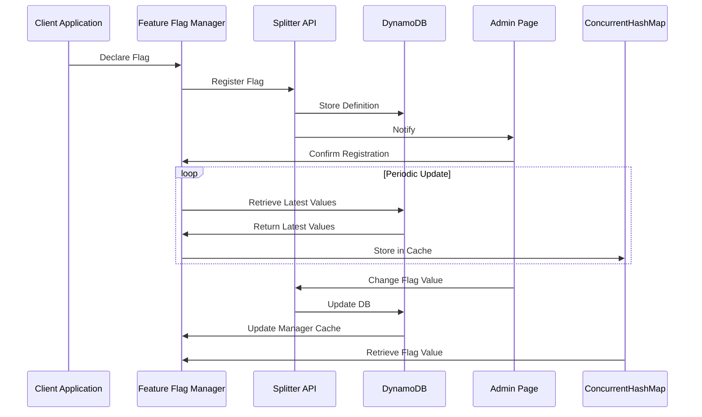
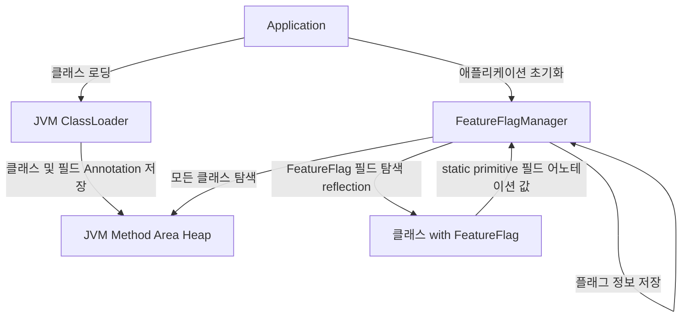
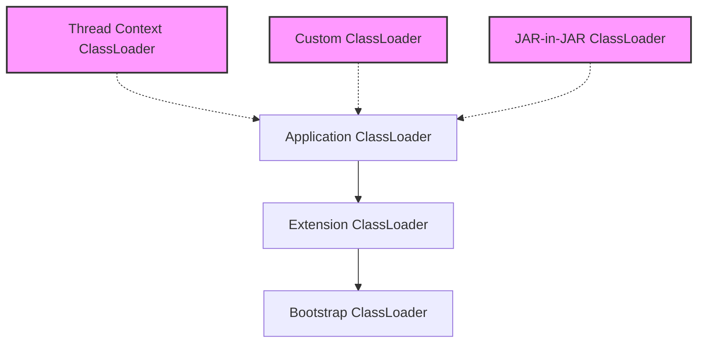

<style>
.mermaid {
  width: 60% !important; /* Force the width to be smaller */
  max-width: 60% !important; /* Ensure it doesn't exceed a certain width */
  margin: 20px auto !important;
  font-size: 10px !important; /* Reduce the font size */
  font-family: 'Arial', sans-serif !important;
  overflow: hidden !important;
}

.mermaid .node rect, 
.mermaid .node circle, 
.mermaid .node ellipse, 
.mermaid .node polygon, 
.mermaid .node path {
  fill: #f5f9ff !important;
  stroke: #4a6da7 !important;
  stroke-width: 1.5px !important;
}

.mermaid .node text {
  font-size: 8px !important; /* Adjust node text size */
}

.mermaid .edgeLabel {
  font-size: 6px !important; /* Adjust edge label size */
}

.mermaid .cluster rect {
  fill: #f0f8ff !important;
  stroke: #4a6da7 !important;
  stroke-width: 1px !important;
  rx: 8px !important;
  ry: 8px !important;
}

.mermaid .label {
  font-size: 10px !important; /* Adjust label size */
}

.mermaid .timeline-event {
  font-size: 12px !important;
}

.mermaid .journey-section {
  font-size: 12px !important;
  font-weight: bold !important;
}

/* 모바일 최적화를 위한 미디어 쿼리 */
@media screen and (max-width: 768px) {
  .mermaid {
    font-size: 12px !important;
    margin: 15px 0 !important;
  }
  .mermaid .node text {
    font-size: 10px !important;
  }
  .mermaid .edgeLabel {
    font-size: 8px !important;
    padding: 1px 2px !important;
  }
  .mermaid .label {
    font-size: 12px !important;
  }
  .mermaid .timeline-event,
  .mermaid .journey-section {
    font-size: 10px !important;
  }
}
</style>

## 1. Feature Flag 시스템 개요

Feature Flag(기능 플래그)는 코드를 변경하지 않고도 기능을 켜고 끌 수 있게 해주는 소프트웨어 개발 기법이다. 마치 집안의 전등 스위치처럼, 개발자는 기능의 활성화 여부를 간단히 '스위치'로 제어할 수 있다. 이 기법은 코드 배포와 기능 출시를 분리함으로써, 새로운 기능을 안전하게 테스트하고 점진적으로 사용자에게 제공할 수 있게 해준다.

시스템 개발 초기에는 Feature Flag 도입 여부를 두고 많은 고민이 있었다. 기존 배포 프로세스를 개선하자는 의견도 있었지만, 이는 여러 팀과의 협업이 필요한 큰 변화였고 당장의 문제 해결이 어려웠다. 또한 Hackle과 같은 국내 Feature Flag 솔루션 도입도 검토했으나, 회사의 특수한 요구사항과 보안 정책 등을 고려했을 때 자체 개발이 더 적합하다고 판단했다. 결국 Feature Flag 방식을 선택한 이유는 코드 배포와 기능 출시를 완전히 분리하여 비즈니스 부서가 개발팀에 의존하지 않고도 기능을 제어할 수 있게 하기 위함이었다.

## 1.1 시스템 아키텍처 개요



*Feature Flag 시스템의 전체 아키텍처를 보여주는 다이어그램*

## 2. 시스템 아키텍처

시스템의 데이터 흐름과 주요 컴포넌트는 크게 4가지 프로세스로 구성됩니다:

### 2.1 플래그 등록 프로세스
- **Step 1**: Client Application에서 `@FeatureFlag` 어노테이션으로 플래그 선언
- **Step 2**: Feature Flag Manager가 선언된 플래그를 Splitter API에 등록
- **Step 3**: Splitter API가 플래그 정의를 DynamoDB에 저장
- **Step 4**: Admin Page에 등록 알림 전송 및 확인

### 2.2 주기적 업데이트 프로세스
- **Step 1**: Manager가 주기적으로 API에 최신 플래그 값 요청
- **Step 2**: API가 DB와 Admin Page에서 최신 값 조회
- **Step 3**: 조회된 값을 Manager의 LRU Cache에 업데이트

### 2.3 플래그 값 조회 프로세스
- **Step 1**: Client가 Manager에 플래그 값 요청
- **Step 2**: Manager가 Cache에서 값을 조회하여 반환
- **Step 3**: Cache Miss 시 API를 통해 최신 값 조회

### 2.4 플래그 값 변경 프로세스
- **Step 1**: Admin Page에서 플래그 값 변경
- **Step 2**: API를 통해 DB에 업데이트
- **Step 3**: 다음 주기적 업데이트 시 변경사항 전파

### 2.5 아키텍처 선택 배경

시스템 설계 시 세 가지 접근법을 비교했습니다:

1. **중앙집중식**
   - 장점: 즉각적 업데이트, 일관된 제어
   - 단점: 네트워크 지연, 높은 의존성

2. **분산식**
   - 장점: 빠른 성능
   - 단점: 상태 동기화 어려움

3. **하이브리드 (선택)**
   - 장점: 
     - 로컬 결정으로 빠른 성능 확보
     - 주기적 동기화로 일관성 유지
     - 네트워크 장애 시에도 기본값으로 동작
   - 이유: 성능과 일관성의 최적 균형점

이러한 하이브리드 구조는 시스템의 안정성과 성능을 모두 고려한 설계입니다.

## 3. 핵심 설계 원칙과 기술적 구현

### 3.1 Annotation 기반 관리 시스템

```java
@FeatureFlag(flagName="new-search-algorithm")
private static boolean useNewSearchAlgorithm = true;
```

이 설계는 Admin 페이지와 코드 사이의 Splitter API 네트워크 장애 시에도 기능 상태의 일관성을 보장했다. 애플리케이션 시작 시 코드 내 선언된 Flag가 실험 플랫폼에 자동 등록되었으며, 이후 실험 플랫폼에서 상태를 수정할 수 있도록 했다.

이 설계를 선택하기 전에 다음과 같은 대안들을 고려했다. 가장 중요한 요구사항은 "런타임에 코드 수정이나 재배포 없이 변수 값을 동적으로 변경할 수 있어야 한다"는 것이었다. 이 핵심 요구사항을 기준으로 다음 대안들을 평가했다:

1. **Properties 파일 기반 설정**
   - 장점: 설정 변경이 쉽고, 코드 수정 없이 값 변경 가능
   - 단점: 여전히 배포가 필요하여 런타임 변경 불가능, 코드와 설정의 불일치 가능성 존재
   - 기각 이유: 런타임 동적 변경이라는 핵심 요구사항 충족 실패

2. **데이터베이스 직접 관리**
   - 장점: 중앙 집중식 관리, 런타임에 실시간 값 변경 가능
   - 단점: 네트워크 장애 시 전체 시스템 영향, 초기 구동 시 지연
   - 기각 이유: 안정성 위험이 너무 큼

3. **REST API 기반 동적 설정**
   - 장점: 런타임에 유연한 관리와 실시간 업데이트 가능
   - 단점: 네트워크 의존성, 초기값 설정의 어려움
   - 기각 이유: 코드의 의도가 불명확하고 타입 안정성 부족

4. **인터페이스와 구현체를 통한 방식**
   - 장점: 런타임에 유연한 기능 제어 가능
   - 단점: 구조가 복잡하고 개발 시간이 오래 걸림
   - 기각 이유: MVP 단계에서는 빠르고 단순한 구현이 우선이었음

5. **환경 변수 활용**
   - 장점: 배포 환경별 구성 쉬움, 인프라 수준에서 제어 가능
   - 단점: 런타임 변경이 거의 불가능, 모니터링 및 감사 복잡
   - 기각 이유: 런타임 동적 변경이라는 핵심 요구사항 충족 실패

Annotation 방식은 이러한 대안들의 단점을 보완하면서도 다음과 같은 이점을 제공했다:
- 코드의 의도가 명확히 드러남
- 컴파일 타임 검증 가능
- IDE 지원을 통한 개발 생산성 향상
- 기본값 지정으로 안정성 확보

### 3.2 Reflection 기반 자동 등록 메커니즘

Java Reflection API를 활용하여 코드 전반에 흩어진 Feature Flag 변수를 자동으로 수집하고 관리하는 시스템을 구현했다. 구체적으로는 `Class.forName()`, `getDeclaredFields()`, `getAnnotation()` 메서드를 활용해 런타임에 `@FeatureFlag` 어노테이션이 붙은 필드들을 탐색했다. 이 과정에서 접근 제한자(private, protected)가 있는 필드도 `setAccessible(true)`를 통해 접근할 수 있도록 처리했다. 

자동 등록 메커니즘을 구현하기 위해 여러 기술적 대안을 검토했다:

1. **컴파일 타임 어노테이션 프로세싱**
   - 장점: 런타임 오버헤드 없음, 컴파일 시점 검증 가능
   - 단점: 복잡한 구현, 빌드 프로세스 변경 필요
   - 기각 이유: 구현 복잡성 및 기존 빌드 시스템과의 통합 어려움

2. **명시적 등록 API**
   - 장점: 간단한 구현, 명확한 작동 방식, 네트워크 장애 시 기본값 명시적 지정 가능
   - 단점: 개발자가 수동으로 각 Flag 등록 필요, 유지관리 부담, 기본값 설정 누락 시 장애 위험
   - 기각 이유: 사용 편의성 감소, Flag 등록 및 기본값 설정 누락 가능성 높음

3. **스프링 프레임워크 통합**
   - 장점: 기존 스프링 애플리케이션과 통합 용이, 풍부한 생태계
   - 단점: 스프링 의존성 발생, 비스프링 환경 지원 어려움
   - 기각 이유: 프레임워크 중립성 손상, 레거시 시스템 지원 제한

Reflection 기반 접근법은 이러한 대안들과 비교했을 때 가장 균형 잡힌 선택이었다. 런타임에 약간의 오버헤드가 있지만, 개발자 경험을 최우선으로 고려했을 때 코드에 어노테이션만 추가하면 되는 간편함이 큰 장점이었다. 또한 프레임워크 의존성 없이 순수 Java로 구현함으로써 어떤 환경에서도 사용 가능한 SDK를 만들 수 있었다.

중요한 제약사항으로, Feature Flag 필드는 반드시 `static`으로 선언해야 했다. 이는 Reflection API의 특성 때문인데, 인스턴스 필드의 경우 해당 클래스의 인스턴스가 필요하지만, 스캔 시점에는 이 인스턴스를 생성할 방법이 없기 때문이다. 반면 `static` 필드는 클래스 로딩 시점에 메모리에 할당되므로 인스턴스 없이도 접근 및 수정이 가능하다. 이 제약은 개발자들에게 명확히 안내되었으며, 가이드라인 문서에도 강조되었다.

```java
// 올바른 사용법 - static 필드
@FeatureFlag(flagName = "new-search-algorithm", defaultValue = false)
public static boolean useNewSearchAlgorithm = false;

// 잘못된 사용법 - 인스턴스 필드 (작동하지 않음)
@FeatureFlag(flagName = "premium-feature", defaultValue = false)
private boolean premiumFeatureEnabled = false;
```

또한 클래스 로더 계층 구조를 고려하여 애플리케이션의 모든 패키지를 스캔하는 재귀적 알고리즘을 구현했고, 성능 최적화를 위해 스캔 대상 패키지를 설정할 수 있는 필터링 메커니즘도 추가했다. 이렇게 수집된 Feature Flag 정보는 ConcurrentHashMap을 사용해 스레드 안전하게 관리했으며, 주기적으로 백엔드 서버와 동기화되도록 ScheduledExecutorService를 구성했다.

주기적 업데이트 방식을 선택한 것도 신중한 고려 끝에 내린 결정이었다. WebSocket(양방향 실시간 통신)이나 Server-Sent Events(서버에서 클라이언트로의 단방향 실시간 통신)를 통한 실시간 업데이트도 고려했지만, 연결 유지에 따른 서버 부하와 네트워크 비용이 우려되어 채택하지 않았다. WebSocket은 실시간 채팅처럼 양방향 통신이 필요한 경우에 적합하고, Server-Sent Events는 실시간 알림처럼 서버에서 클라이언트로의 푸시 알림이 필요한 경우에 적합하다. 실시간 업데이트 대신 주기적 업데이트를 선택한 이유는 다음과 같다:

1. **서버 부하 감소**: 수많은 클라이언트의 실시간 연결 대신 주기적 업데이트를 통해 서버 리소스를 효율적으로 관리할 수 있다. 특히 수천 개의 서비스 인스턴스가 동시에 연결을 유지하는 상황을 피할 수 있었다.

2. **네트워크 효율성**: 여러 변경사항을 모아서 배치로 처리함으로써 네트워크 트래픽을 최적화할 수 있다. 실시간 전파는 각각의 작은 변경에도 즉시 통신이 발생하는 반면, 주기적 업데이트는 여러 변경을 한 번에 처리할 수 있다.

3. **장애 복원력**: 일시적인 네트워크 문제나 서버 장애 시에도 다음 주기에 자연스럽게 복구된다. 실시간 연결 방식은 연결 끊김 시 즉각적인 재연결 로직이 필요하지만, 주기적 업데이트는 이러한 복잡성을 피할 수 있다.

4. **구현 단순성**: 실시간 업데이트는 연결 관리, 재시도 로직, 장애 복구 등 복잡한 구현이 필요한 반면, 주기적 업데이트는 단순한 HTTP 요청만으로 구현이 가능하다.

5. **캐시 활용**: 업데이트 주기 사이에는 로컬 캐시를 활용하여 빠른 응답시간을 보장할 수 있다. 대부분의 Flag 값은 자주 변경되지 않는다는 점을 고려할 때, 이는 실용적인 접근이었다.

이러한 설계를 통해 개발자들은 코드에 어노테이션만 추가하면 자동으로 시스템에 등록되어 관리되는 편리함을 제공할 수 있었다. XML 기반 설정이나 프로그래밍 방식의 등록도 고려했지만, 코드와 설정이 분리되어 관리가 어려워질 수 있다는 단점 때문에 어노테이션 방식을 선택했다. 특히 LRU 캐시를 도입한 것은 시스템의 성능을 크게 향상시켰는데, Redis나 Memcached 같은 외부 캐시 시스템도 검토했지만 추가적인 인프라 관리 부담을 줄이기 위해 인메모리 캐시로 결정했다. 이는 다음과 같은 이점을 가져왔다:

### 3.3 싱글톤 패턴과 스레드 안전성 확보

Feature Flag Manager는 싱글톤 패턴으로 구현하여 애플리케이션 전체에서 하나의 인스턴스만 존재하도록 설계했다. 싱글톤 패턴을 적용한 명확한 이유는 다음과 같다:

1. **일관된 상태 관리**: Feature Flag의 상태는 애플리케이션 전체에서 일관되게 유지되어야 한다. 여러 인스턴스가 존재할 경우 각각 다른 상태를 가질 수 있어 예측 불가능한 동작이 발생할 위험이 있다.

2. **리소스 효율성**: Flag 정보를 주기적으로 백엔드 서버와 동기화하는 과정에서 네트워크 요청과 메모리 사용이 발생한다. 여러 인스턴스가 각각 동기화를 수행한다면 불필요한 리소스 낭비가 발생할 수 있다.

3. **캐시 효율성 극대화**: LRU 캐시를 통해 Flag 값 조회 성능을 최적화했는데, 여러 인스턴스가 각자의 캐시를 관리한다면 캐시 히트율이 떨어져 성능 이점이 감소한다.

4. **중앙화된 로깅과 모니터링**: 모든 Flag 조회와 변경 이벤트를 단일 지점에서 추적하고 로깅함으로써 디버깅과 모니터링이 용이해진다.

### 3.4 동시성 제어를 위한 고민

학부 운영체제 수업에서 Lock을 배웠지만, 실제 프로덕션 환경에서 동시성 제어를 구현하는 것은 처음이었다. 특히 여러 서버에서 동시에 Feature Flag 값을 읽고 쓰는 상황에서 데이터 일관성을 어떻게 보장할지 고민이 컸다. 시니어 엔지니어들과 논의를 통해 여러 방안을 검토했는데, 결국 복잡한 커스텀 락 메커니즘보다는 Java에서 제공하는 `ConcurrentHashMap`을 활용하기로 결정했다.

이 결정의 핵심에는 "최대한 심플하게 구성하라"는 시니어 엔지니어의 조언이 있었다. 특히 여러 팀이 사용하는 공통 SDK에서는 단순성이 매우 중요한 원칙이었다. 복잡한 동시성 제어 로직은 버그 발생 가능성을 높이고 디버깅을 어렵게 만들 수 있기 때문에, 검증된 라이브러리의 기능을 최대한 활용하는 것이 더 안정적이고 유지보수하기 쉽다는 결론에 도달했다.

이러한 결정을 내린 구체적인 이유는 다음과 같다:

1. **성능 최적화**: 명시적인 락은 모든 읽기/쓰기 작업에 대해 동기화를 강제하여 성능 저하를 일으킬 수 있다. Feature Flag 시스템은 읽기 작업이 압도적으로 많은 특성을 가지고 있어, 읽기 작업에 락을 사용하면 불필요한 병목 현상이 발생할 수 있다.

2. **세밀한 동시성 제어**: `ConcurrentHashMap`은 내부적으로 세그먼트 단위의 락을 사용하여 다른 키에 대한 동시 접근을 허용한다. 이는 여러 Flag에 대한 동시 접근 시 전체 맵에 락을 거는 것보다 훨씬 효율적이다.

3. **코드 복잡성 감소**: 명시적인 락 메커니즘을 구현하려면 읽기/쓰기 락, 데드락 방지 등 복잡한 동시성 제어 로직이 필요하다. `ConcurrentHashMap`을 사용함으로써 이러한 복잡성을 크게 줄일 수 있었다.

4. **원자적 연산 지원**: `ConcurrentHashMap`은 `putIfAbsent`, `computeIfAbsent` 등의 원자적 연산을 제공하여 락 없이도 안전한 업데이트가 가능하다.

동시성 제어를 위해 다른 방법들도 검토해보았다:

1. **Synchronized Collections** 
   ```java
   Map<String, FeatureFlag> flagRegistry = Collections.synchronizedMap(new HashMap<>());
   ```
   - 장점: 구현이 매우 간단하고 Java 기본 라이브러리를 사용할 수 있다
   - 단점: 모든 읽기/쓰기 작업마다 전체 Map에 락이 걸려서 성능이 떨어진다
   - 기각 이유: 읽기 작업이 많은 우리 시스템에서는 성능 저하가 심각할 것으로 예상됨

2. **ReentrantReadWriteLock**
   ```java
   private final Map<String, FeatureFlag> flagRegistry = new HashMap<>();
   private final ReadWriteLock rwLock = new ReentrantReadWriteLock();
   
   public FeatureFlag getFlag(String name) {
       rwLock.readLock().lock();  // 읽기 락 획득
       try {
           return flagRegistry.get(name);
       } finally {
           rwLock.readLock().unlock();  // 읽기 락 해제
       }
   }
   
   public void updateFlag(String name, FeatureFlag flag) {
       rwLock.writeLock().lock();  // 쓰기 락 획득
       try {
           flagRegistry.put(name, flag);
       } finally {
           rwLock.writeLock().unlock();  // 쓰기 락 해제
       }
   }
   ```
   - 장점: 읽기 작업과 쓰기 작업을 구분해서 처리할 수 있다
   - 단점: 락을 직접 관리해야 해서 코드가 복잡해지고 실수하기 쉽다
   - 기각 이유: 락 관리의 복잡성으로 인해 버그 발생 가능성이 높음

이러한 대안들을 검토한 후, 결국 ConcurrentHashMap을 선택했다. ConcurrentHashMap은 Java 5부터 제공되는 검증된 라이브러리로, 다음과 같은 장점이 있다:

- **부분 락**: Map 전체가 아닌 일부분에만 락을 걸어서 다른 부분은 계속 사용할 수 있다
- **동시 읽기**: 여러 스레드가 동시에 읽기 작업을 할 수 있다
- **안전한 업데이트**: putIfAbsent(), replace() 같은 안전한 업데이트 메서드를 제공한다
- **검증된 구현**: 오랜 기간 많은 개발자들이 사용하면서 검증된 라이브러리다

최종적으로는, 시니어 개발자의 "최대한 단순하게 만들어라"는 조언을 따라, 직접 복잡한 동시성 제어를 구현하는 대신 검증된 라이브러리를 사용하기로 했다. 특히 여러 팀이 사용하는 공통 SDK에서는 코드가 단순할수록 버그도 적고 유지보수도 쉽다는 점을 고려했다.

## 4. 기술 스택 상세

### 4.1 코어 SDK: Java 8 (Vanilla Java)
Java 8을 선택한 이유는 회사의 기존 코드베이스와의 호환성도 있었지만, 더 중요한 것은 SDK의 확장성과 유지보수성이었다. 프레임워크 의존성이 가져올 수 있는 문제점을 고민했다. Spring과 같은 프레임워크를 사용할 경우 버전 충돌이 발생할 수 있고, 사용자들이 SDK를 도입할 때 추가적인 설정이 필요해질 수 있다고 판단했다. 순수 Java만으로 구현함으로써 어떤 환경에서도 쉽게 통합될 수 있는 유연성을 확보했고, 이는 실제로 레거시 시스템에서도 문제없이 작동하는 결과로 이어졌다. 특히 Reflection API를 활용한 어노테이션 처리 부분에서는 외부 라이브러리 없이 직접 구현하는 과정이 도전적이었지만, 이를 통해 Java의 메타프로그래밍 기능에 대한 이해도를 크게 높일 수 있었다.

### 4.2 인프라: Kubernetes on AWS EKS
Feature Flag 시스템의 인프라는 회사의 기존 실험 분기 API에 새로운 엔드포인트를 추가하는 방식으로 구현했다. 이 접근 방식은 빠른 개발과 배포를 가능하게 했지만, 실제 운영 중 심각한 문제가 발생했다. 지난 분기에 실험 API 서버에서 메모리 누수로 인한 장애가 발생했고, 이로 인해 Feature Flag 시스템까지 영향을 받아 일부 기능이 정상적으로 동작하지 않는 사고가 있었다. 이 사건은 Feature Flag와 같은 핵심 인프라를 다른 서비스에 종속시키는 것의 위험성을 명확하게 보여주었다.

이러한 실제 장애 경험을 통해, Feature Flag 시스템은 반드시 독립적인 마이크로서비스로 분리되어야 한다는 교훈을 얻었다. 현재는 임시방편으로 실험 API의 장애 상황에서도 Feature Flag가 최소한의 기능을 유지할 수 있도록 fallback 메커니즘을 구현해놓은 상태지만, 이상적으로는 완전히 독립된 서비스로 재구축하여 다음과 같은 이점을 얻을 수 있을 것이다:

- 전용 리소스를 통한 성능 최적화
- 독립적인 확장 및 배포 주기
- 더 명확한 책임 분리와 관리
- Feature Flag 특화 기능 추가 용이성

이러한 경험은 향후 프로젝트에서 초기 아키텍처 결정의 중요성과 장기적 확장성을 더 신중하게 고려해야 함을 깨닫게 했다. 특히 Feature Flag 시스템만의 특성에 맞게 최적화된 인프라를 구축하는 것이 더 나은 선택이었을 것이다.

### 4.3 배포: Jib & Jenkins
배포 과정에서 가장 큰 고민은 빌드 시간 단축과 안정적인 배포 파이프라인 구축이었다. 컨테이너 이미지 빌드 도구로 기존 Docker와 Google의 Jib을 비교 검토했다:

1. **전통적인 Dockerfile 기반 빌드**
   - 장점: 익숙한 방식, 세부 설정 가능, 광범위한 사용 사례
   - 단점: 
     - 매번 전체 이미지를 다시 빌드하여 시간이 오래 걸림
     - 레이어 캐싱 최적화가 어려움
     - Docker 데몬 필요
   - 기각 이유: 빌드 시간이 3-5분으로 너무 길고, 작은 코드 변경에도 전체 재빌드 필요

2. **Jib**
   - 장점:
     - 변경된 레이어만 빌드하여 30초 이내로 빌드 시간 단축
     - Docker 데몬 불필요
     - Maven/Gradle과 원활한 통합
     - 멀티스테이지 빌드 자동화로 이미지 크기 최적화
   - 단점: Dockerfile 대비 세부 설정의 유연성 다소 제한
   - 선택 이유: 빌드 시간 대폭 단축과 개발 생산성 향상

배포 파이프라인은 Jenkins를 활용했다. Jenkins를 선택한 주된 이유는 이미 회사에서 SDK 배포를 위한 환경이 잘 구축되어 있었기 때문이다. 기존 SDK들의 배포 파이프라인이 Jenkins로 구성되어 있어 참고할 수 있는 사례가 많았고, Maven Repository 연동이나 버전 관리 등의 설정을 재사용할 수 있었다. 이를 통해 새로운 배포 환경을 구축하는 대신 검증된 파이프라인을 활용할 수 있었다.

이러한 Jib과 Jenkins의 조합으로, 특히 사내 Maven Repository와의 연동을 통해 효율적인 라이브러리 배포 파이프라인을 구축할 수 있었다. 기존 인프라를 최대한 활용함으로써 추가적인 설정이나 관리 부담 없이 안정적인 배포가 가능했다.

### 4.4 데이터 저장소: AWS DynamoDB
데이터 저장소 선택에서 가장 큰 고민은 SQL과 NoSQL 중 어떤 것을 사용할지였다. SQL은 스키마 변경이 어렵고 확장성이 제한적이지만 데이터 일관성과 트랜잭션 지원이 강점이었다. NoSQL은 유연한 스키마와 수평적 확장이 용이하지만 강력한 일관성 보장이 어려웠다. 결국 NoSQL 중에서도 DynamoDB를 선택했는데, 이는 회사 인프라팀에서 이미 DynamoDB를 지원하고 있었기 때문이다. 이를 통해 운영 부담을 크게 줄일 수 있었고, 특히 Flag 값 조회 API가 서비스의 핵심 로직 실행 전에 호출되는 만큼 안정적인 운영이 가능했다.

데이터 저장소 선택 시 고려했던 대안들은 다음과 같다:

1. **PostgreSQL/MySQL**
   - 장점: 강력한 트랜잭션, ACID 준수, SQL 표준 지원, 복잡한 쿼리 가능
   - 단점: 수평적 확장 어려움, 스키마 변경의 복잡성, 높은 초기 설정 비용
   - 기각 이유: Feature Flag 데이터 모델의 단순성과 높은 읽기 처리량 요구사항에 과도한 솔루션

2. **MongoDB**
   - 장점: 문서 지향 모델, 유연한 스키마, 개발자 친화적 API
   - 단점: 일관성 모델 약함, 복잡한 샤딩 설정, 운영 복잡성
   - 기각 이유: 회사 내 MongoDB 운영 경험 부족, 관리 오버헤드 우려

DynamoDB를 선택한 핵심 이유:

1. **관리 부담 최소화**: AWS 관리형 서비스로 운영 오버헤드 최소화
2. **자동 확장성**: 읽기/쓰기 용량의 자동 조정으로 트래픽 변동 대응
3. **비용 효율성**: 프로비저닝 모드와 온디맨드 모드의 유연한 선택
4. **높은 성능**: 일관된 밀리초 단위 응답 시간 보장
5. **기존 인프라 활용**: 회사 내 DynamoDB 경험과 운영 지원 활용

특히 Feature Flag 시스템의 데이터 액세스 패턴이 단순하고 예측 가능했기 때문에(주로 키 기반 조회), DynamoDB의 키-값 저장소 모델이 이상적이었다. 복잡한 관계형 쿼리가 거의 필요하지 않았고, 읽기 작업이 압도적으로 많은 워크로드 특성상 DynamoDB의 읽기 확장성과 캐싱 기능이 큰 이점이었다.

코드 내에서 DynamoDB를 연결하고, 특히 unit test에서 local DynamoDB로 테스트 환경 구축하는게 꽤 어려웠지만, 이 과정에서 많은 것을 배울 수 있었다. (이 부분은 feature flag 자체가 아니라, 실험 플랫폼인 admin 페이지와 연결된 API에서 구현한 것이다.) AWS SDK를 사용해 DynamoDB 클라이언트를 구성하고, 테스트 환경에서는 DynamoDBLocal 라이브러리를 활용해 인메모리 데이터베이스를 구축했다. 특히 테스트 환경에서 실제 AWS 리소스를 사용하지 않고도 DynamoDB 기능을 테스트할 수 있게 된 것은 큰 성과였다.

## 5. 시스템 활용

### 5.1 엔드포인트 목록
Feature Flag 시스템은 다음과 같은 RESTful API 엔드포인트를 제공한다:

- `GET /feature-flags`: 모든 Feature Flag 목록 조회
- `PUT /feature-flags/{flagName}`: 특정 Feature Flag 생성 또는 수정
- `DELETE /feature-flags/{flagName}`: 특정 Feature Flag 삭제

API 설계 시 gRPC 도입을 고민했지만, 당시에는 학습 곡선이 높아 보여 채택하지 않았다. 지금 돌아보면 이 결정이 아쉽다. 우리 Feature Flag SDK의 특성을 고려했을 때 gRPC가 제공했을 이점들은 다음과 같다:

1. **Flag 값 동기화의 효율성**
   - 현재는 10초의 TTL을 가진 캐시를 사용하여 실시간 동기화가 아닌 주기적 갱신 방식을 채택
   - 그럼에도 REST API로는 폴링 방식의 갱신이 필요하며, 이는 불필요한 네트워크 트래픽 발생
   - gRPC를 사용했다면 서버 푸시 기반의 효율적인 갱신이 가능했을 것이며, 특히 Flag 값 변경 시에만 클라이언트에 알림
   - 수천 개의 SDK 인스턴스가 동시 접속한 상황에서도 폴링 대신 스트리밍으로 서버 부하 감소 가능했을 것

2. **다국어 SDK 개발 효율**
   - 현재 Java, Node.js, Python 등 여러 언어의 SDK를 각각 개발/유지보수 중
   - Protocol Buffer로 정의했다면 각 언어별 클라이언트 코드 자동 생성
   - SDK 버전 간 일관성 유지가 더 쉬웠을 것

3. **Flag 정의 타입 시스템**
   - 현재는 타입 불일치로 인한 런타임 에러는 없으나, 개발자의 실수로 인한 휴먼 에러 가능성 존재
   - Protocol Buffer의 명시적 타입 정의로 개발 단계에서 실수 방지 가능
   - 특히 여러 팀이 Flag를 공유하는 상황에서 문서화와 타입 체크 자동화 가능

하지만 최종적으로 선택한 RESTful API도 다음과 같은 명확한 이점을 제공했다:

- 단순하고 직관적인 리소스 중심 설계
- 기존 HTTP 캐싱과 로드밸런싱 활용 가능
- 풍부한 개발 도구와 디버깅 환경
- 모든 주요 프로그래밍 언어의 클라이언트 지원

### 5.2 SDK 통합 코드

#### 호출 예시
```java
FeatureFlagManager manager = FeatureFlagManager.builder()
                .setPackageNames(new String[]{"your.package.names"})
                .setEnvironment(ExpEnv.QA)
                .setClassLoader(classLoader)
                .build();
```

#### 선언 예시
```java
@FeatureFlag(flagName = "Test2")
public static int privateField = 3;
```

## 6. Feature Flag 시스템의 내부 동작 원리

Feature Flag 시스템의 핵심 동작 원리를 JVM 메모리 관리 관점에서 살펴보자. 이 시스템은 Java의 기본 기능들을 효과적으로 활용하여 간결하면서도 강력한 동적 기능 제어 메커니즘을 구현했다.

### 6.1 시스템 구성 및 목적

**목적**
- 기능별 ON/OFF 상태를 동적으로 관리하고,
- 배포 없이 플래그 값을 변경할 수 있는 유연한 런타임 Feature Toggle 시스템 구축

**핵심 구성 요소**

| 구성요소 | 설명 |
|---------|------|
| `@FeatureFlag` | static primitive 필드에 부착되어, 해당 필드가 기능 플래그임을 선언 |
| `FeatureFlagManager` | 애플리케이션 시작 시, reflection을 통해 모든 플래그 수집 및 초기화 |
| `ConcurrentHashMap<String, FlagMeta>` | 모든 플래그 상태 및 메타데이터를 저장하는 중앙 저장소 |
| `public static boolean useNewSearchAlgorithm` | JVM Method Area에 저장되며, 런타임에 값 변경 가능 |

### 6.2 선언 방식 예시

```java
@FeatureFlag(flagName = "new-search-algorithm")
public static boolean useNewSearchAlgorithm = false;

@FeatureFlag(flagName = "max-search-results")
public static int maxSearchResults = 100;

@FeatureFlag(flagName = "search-boost-factor")
public static double boostFactor = 1.5;
```

- 해당 필드는 런타임에 값을 바꿀 수 있다(`final`이 아님)
- 다양한 primitive 타입(boolean, int, long, double 등)을 지원한다
- `@FeatureFlag`가 부착되어 있으면, 애플리케이션 시작 시 `FeatureFlagManager`가 이를 인식한다

### 6.3 Primitive 타입을 사용하는 이유

시스템 설계 시 primitive 타입과 객체 타입의 비교:

| 항목 | Primitive 타입 | 객체 타입 |
|-----|---------------|-----------|
| **메모리 효율성** | ✅ 참조 오버헤드 없음<br>✅ boolean은 1바이트만 사용 | ❌ 객체 참조 오버헤드 발생<br>❌ 추가 메모리 사용 |
| **성능** | ✅ 박싱/언박싱 없음<br>✅ 직접 접근 가능 | ❌ 박싱/언박싱 필요<br>❌ 참조 접근 필요 |
| **타입 안전성** | ✅ 컴파일 타임 타입 체크<br>✅ 타입 변환 오류 방지 | ✅ 컴파일 타임 타입 체크<br>❌ null 가능성 존재 |
| **사용성** | ✅ 직관적인 사용<br>✅ 변환 과정 불필요 | ❌ null 체크 필요<br>❌ 형변환 필요할 수 있음 |
| **리플렉션** | ✅ 단순하고 직접적인 처리<br>✅ 값 설정이 용이 | ❌ 복잡한 객체 처리 필요<br>❌ 깊은 복사 고려 필요 |
| **직렬화** | ✅ 간단한 직렬화/역직렬화<br>✅ 네트워크 전송 효율적 | ❌ 복잡한 직렬화 로직<br>❌ 더 큰 전송 크기 |

사용 예시:

### 6.4 전체 동작 흐름: 서비스 시작 시점


*서비스 시작 시점의 전체 동작 흐름을 보여주는 플로우차트*

| 구성 요소 | 예시 | JVM 저장 위치 | 설명 |
|---------|------|--------------|------|
| static primitive 필드 | useNewSearchAlgorithm, maxSearchResults | Method Area (필드 참조)<br>Heap (값 저장) | 기능 플래그의 실제 값을 저장하는 필드 |
| Annotation 메타데이터 | `@FeatureFlag(...)` | Method Area | 클래스 메타정보의 일부로 저장되는 어노테이션 정보 |
| ConcurrentHashMap | `Map<String, FlagMeta>` | Heap | 런타임에 플래그 상태를 관리하는 중앙 저장소 |
| 리플렉션 참조 객체 | `Field`, `Annotation` | Heap | 리플렉션 API 사용 시 생성되는 임시 객체들 |

### 6.5 FeatureFlagManager의 동작 방식 (예시 코드 기반)

```java
public class FeatureFlagManager {
    private static final ConcurrentHashMap<String, FlagMeta> flags = new ConcurrentHashMap<>();

    public static void initializeFlags(Class<?>... classesToScan) {
        for (Class<?> clazz : classesToScan) {
            for (Field field : clazz.getDeclaredFields()) {
                if (field.isAnnotationPresent(FeatureFlag.class)) {
                    FeatureFlag annotation = field.getAnnotation(FeatureFlag.class);
                    String flagName = annotation.flagName();

                    field.setAccessible(true);
                    try {
                        // 필드 타입에 따라 다르게 처리
                        Object value = field.get(null);  // static 필드
                        flags.put(flagName, new FlagMeta(field, value, annotation));
                    } catch (Exception e) {
                        throw new RuntimeException(e);
                    }
                }
            }
        }
    }
    ...
}
```

### 6.6 핵심 기술 요소 설명

**Annotation과 Reflection의 기본 개념**
- Java에서 Annotation은 코드에 메타데이터를 추가하는 방법이다
- 예를 들어 `@FeatureFlag`라는 어노테이션을 만들면, 이 정보는 컴파일 시 `.class` 파일에 저장된다
- JVM이 클래스를 로딩할 때, 이 메타데이터는 Method Area라는 메모리 영역에 저장된다
- Reflection은 실행 중인 프로그램이 자기 자신을 분석하고 수정할 수 있게 해주는 기능이다
  - `clazz.getDeclaredFields()`로 클래스의 모든 필드 정보를 가져올 수 있다
  - `field.getAnnotation()`으로 필드에 붙은 어노테이션 정보도 읽을 수 있다

**static과 primitive 타입의 이해**
- Java에서 `static` 키워드가 붙은 필드는 클래스당 하나만 존재한다
  - 일반 필드는 객체마다 별도로 존재하지만, static 필드는 모든 객체가 공유한다
  - 이는 전체 시스템에서 공유되는 글로벌 설정값과 같은 역할을 한다
- primitive 타입(int, boolean 등)은 객체가 아닌 기본 데이터 타입이다
  - 메모리 사용량이 적고 접근 속도가 빠르다
  - 객체 타입 대비 단순하지만 효율적인 특성을 가진다

**ConcurrentHashMap과 멀티스레딩**
- 일반 HashMap은 다중 스레드 환경에서 데이터 정합성 문제가 발생할 수 있다
  - 동시성 제어가 되지 않아 데이터 손실이나 불일치가 발생할 수 있다
- ConcurrentHashMap은 스레드 안전성이 보장된 특수한 Map 구현체이다
  - 다중 스레드 환경에서 동기화를 자동으로 처리한다
  - 데이터 접근 시 세밀한 락킹을 통해 성능과 안전성을 모두 확보한다
- 이 Map은 JVM의 Heap 영역에 저장되며 가비지 컬렉션의 대상이 된다

### 6.7 시스템의 장점

| 항목 | 설명 |
|-----|------|
| 초경량 플래그 시스템 | 불필요한 라이브러리나 Config 서버 없이 순수 Java로 구현 가능 |
| 런타임 제어 가능 | 서비스 재배포 없이 동적으로 플래그 값을 변경할 수 있음 |
| 다양한 타입 지원 | boolean 뿐만 아니라 int, long, double 등 다양한 primitive 타입 지원 |
| Annotation 기반 선언적 관리 | 코드에 명시적으로 어떤 클래스/필드가 플래그 대상인지 드러남 |
| Thread-safe 관리 | ConcurrentHashMap으로 멀티스레드 환경에서도 안전한 접근 보장 |

### 6.8 요약

이 Feature Flag 시스템은 클래스의 static primitive 필드를 중심으로, 어노테이션과 리플렉션을 활용하여 기능 플래그를 선언적이고 동적으로 제어할 수 있게 구현되었다. 서비스 시작 시 모든 플래그를 탐색하고 ConcurrentHashMap에 저장하여 이후 런타임에서 플래그 값을 조회하고 변경할 수 있다. 이 구현은 Java의 Method Area, Reflection, Annotation, static 필드, Heap 구조를 활용하여 동작한다.

## 7. 트러블슈팅: 배포 환경별 ClassLoader 문제

Feature Flag Java SDK를 설계하고 개발하는 과정에서 다양한 기술적 도전 과제들이 있었지만, 그중에서도 현업 배포 환경에서 발생한 ClassLoader 관련 문제는 특히 기억에 남는다. 이 문제는 실제 프로덕션 환경에서의 예상치 못한 변수를 고려하는 것의 중요성을 일깨워주는 소중한 경험이었다.

### 7.1 문제 상황

SDK 개발 완료 후 첫 번째 사용자였던 검색팀으로부터 "Feature Flag를 인식하는 리플렉션이 제대로 동작하지 않는다"는 피드백을 받았다. 개발 환경과 우리 팀의 프로덕션 환경에서는 정상적으로 작동했기 때문에 처음에는 문제의 원인을 파악하기 어려웠다. 로그 분석을 통해 문제 현상을 확인한 결과, 검색팀의 서비스에서는 `@FeatureFlag` 어노테이션이 붙은 필드들이 전혀 인식되지 않았다.

```java
// SDK 내 리플렉션 코드 (문제 발생 전)
private void scanPackages() {
    for (String packageName : packageNames) {
        try {
            Class<?>[] classes = getClasses(packageName);
            for (Class<?> clazz : classes) {
                scanFieldsInClass(clazz);
            }
        } catch (Exception e) {
            logger.error("Error scanning package: " + packageName, e);
        }
    }
}

private Class<?>[] getClasses(String packageName) throws Exception {
    ClassLoader classLoader = Thread.currentThread().getContextClassLoader();
    String path = packageName.replace('.', '/');
    Enumeration<URL> resources = classLoader.getResources(path);
    
    // 패키지 내 클래스 찾기 로직
    // ...
}
```

### 7.2 원인 분석

수일간의 디버깅과 검색팀과의 협업을 통해 문제의 핵심 원인을 파악할 수 있었다:

1. **배포 방식의 차이**: 우리 팀은 Jib을 사용하여 컨테이너 이미지를 만들어 배포했지만, 검색팀은 Executable JAR(fat JAR)로 패키징하여 배포하고 있었다.

2. **ClassLoader 구조와 클래스 이름 변환의 차이**: 
   - 일반적인 JAR 또는 컨테이너 배포에서는 모든 클래스가 같은 ClassLoader에 로드되며 원래의 패키지 이름과 클래스 이름이 그대로 유지된다.
   - 반면 Executable JAR(Spring Boot의 Fat JAR 포함)는 내장된 의존성 JAR 파일들마다 별도의 ClassLoader를 사용하는 구조를 가진다. 검색해본 바로는 Spring Boot의 내장 로더가 의존성 JAR 내부의 클래스를 로드할 때 클래스 이름 앞에 특별한 prefix를 붙인다는 점이 가장 큰 차이였다. 예를 들어, 원래 `com.company.service.MyClass`였던 클래스가 `BOOT-INF.classes.com.company.service.MyClass`와 같은 형태로 변환되었다. 이로 인해 패키지 기반 스캔 시 클래스를 찾지 못하는 문제가 발생했다.

3. **멀티 모듈 프로젝트 문제**: 추가 조사를 통해 다른 팀의 멀티 모듈 프로젝트에서도 모듈 간 ClassLoader 차이로 어노테이션 스캔이 실패하는 유사한 문제가 있음을 확인했다.

이 문제의 본질은 단순히 "클래스를 찾지 못하는 버그"가 아니라, Java 애플리케이션의 실행 환경과 ClassLoader 계층 구조에 대한 이해가 필요한 아키텍처적 문제였다.


*Java ClassLoader 계층 구조 - 다양한 배포 환경에서 추가 ClassLoader가 생성될 수 있음*

다음은 Spring Boot Executable JAR에서의 클래스 이름 변환 과정을 보여주는 예시이다:

**원래 클래스 이름**: `com.company.service.SearchService`  
**Executable JAR에서의 클래스 이름**: `BOOT-INF.classes.com.company.service.SearchService`

이러한 클래스 이름 변환은 Spring Boot의 LaunchedURLClassLoader가 수행하며, `Class.forName()`이나 패키지 스캔 시 이러한 변환된 이름을 고려하지 않으면 클래스를 찾지 못하게 된다.

### 7.3 해결 과정

문제를 더 자세히 이해하기 위해 Spring Boot의 Executable JAR 구조를 확인해보았다. 검색 결과, Spring Boot는 JAR 파일 내부에 모든 의존성을 포함하는 "nested JAR" 구조를 사용하며, 이를 실행하기 위해 특별한 ClassLoader와 로딩 메커니즘을 사용한다는 것을 알게 되었다.

```
my-application.jar
├── META-INF
│   └── MANIFEST.MF (Main-Class: org.springframework.boot.loader.JarLauncher)
├── BOOT-INF
│   ├── classes
│   │   └── com
│   │       └── company
│   │           └── service
│   │               └── SearchService.class
│   └── lib
│       ├── dependency1.jar
│       └── dependency2.jar
└── org
    └── springframework
        └── boot
            └── loader
                ├── JarLauncher.class
                └── ...
```

이 구조에서 `BOOT-INF/classes`에는 애플리케이션 클래스가, `BOOT-INF/lib`에는 의존성 JAR 파일들이, 그리고 `org/springframework/boot/loader`에는 이 모든 것을 로드하기 위한 부트스트랩 코드가 포함된다. 이로 인해 클래스 이름이 원래의 패키지 이름에 `BOOT-INF.classes.` 접두어가 붙는 형태로 변환되는 것이었다.

문제 해결을 위해 여러 접근법을 시도했다:

1. **ClassLoader 이해**: Java의 ClassLoader는 JVM에서 클래스를 동적으로 로드하는 핵심 컴포넌트이다. Bootstrap ClassLoader, Extension ClassLoader, Application ClassLoader의 3단계 계층 구조로 되어있으며, 각각 JDK의 핵심 라이브러리, 확장 라이브러리, 애플리케이션 클래스를 로드하는 역할을 한다. 이러한 ClassLoader의 동작 방식을 이해하는 것이 Spring Boot의 JAR 실행 구조를 파악하는데 도움이 되었다.

2. **다양한 배포 환경 테스트**: 다른 팀과의 페어 프로그래밍 세션을 통해 각 팀의 배포 환경에서 발생하는 문제를 직접 확인하고 해결책을 검증했다. 디버깅 로그를 보면서 Spring Boot로 패키징된 JAR 파일의 클래스 이름 변환 과정을 이해할 수 있었다.

3. **접두어 처리 메커니즘 개발**: `BOOT-INF.classes.` 접두어를 가진 클래스를 올바르게 처리할 수 있는 로직을 개발했다. 패키지 스캔 시 접두어가 있는 경우와 없는 경우를 모두 고려하여 클래스를 찾는 방식으로 코드를 개선했다.

4. **여러 ClassLoader 활용**: 단일 ClassLoader에 의존하지 않고, 접근 가능한 여러 ClassLoader를 조합하여 사용하는 방식으로 코드를 개선했다.

5. **사용자 지정 ClassLoader 지원과 접두어 처리 옵션**: SDK 사용자가 직접 특수한 ClassLoader를 제공하고, 패키지 접두어 처리 방식을 설정할 수 있는 옵션을 추가했다.

### 7.4 추가 문제: 멀티 모듈 프로젝트에서의 클래스 로딩

Executable JAR 이슈를 해결한 후에도, 멀티 모듈 프로젝트에서 새로운 문제가 발견되었다. 특히 모듈 간 의존성이 복잡한 대규모 프로젝트에서 추가적인 클래스 로딩 이슈가 발생했다.

```
project-root/
├── module-core/
│   └── src/main/java/com/company/core/
│       └── CoreFeatureFlags.java
├── module-service/
│   └── src/main/java/com/company/service/
│       └── ServiceFeatureFlags.java
└── module-web/
    └── src/main/java/com/company/web/
        └── WebFeatureFlags.java
```

위와 같은 구조에서, `module-web`은 `module-service`에 의존하고, `module-service`는 `module-core`에 의존하는 구조일 때, `module-web`에서 SDK를 초기화하면 다른 모듈의 Feature Flag가 인식되지 않는 문제가 발생했다.

이 문제는 모듈별로 다른 ClassLoader가 사용되거나, 클래스 패스 구성 방식의 차이로 인해 발생했다. 특히 IDE 개발 환경과 빌드 도구(Maven/Gradle)의 실행 환경에서 클래스 로딩 방식이 달라 더욱 복잡한 상황이었다.

이를 해결하기 위해 모듈 간 경계를 넘어 클래스를 검색할 수 있는 추가적인 메커니즘을 구현했다:

1. **모듈 간 클래스 패스 스캔**: 모듈 간 의존성 구조를 분석하여 연결된 모든 모듈의 클래스 패스를 스캔하는 로직을 추가했다.

2. **서비스 로더 메커니즘 도입**: Java의 `ServiceLoader` API를 활용하여 각 모듈이 자신의 Feature Flag를 중앙 레지스트리에 등록할 수 있는 선언적 메커니즘을 제공했다.

3. **명시적 모듈 등록 API**: 모듈 개발자가 자신의 모듈에 있는 Feature Flag 클래스를 명시적으로 등록할 수 있는 API를 추가했다.

```java
// 모듈별 Feature Flag 등록을 위한 API 예시
FeatureFlagManager manager = FeatureFlagManager.getInstance();
manager.registerModule("core", CoreFeatureFlags.class);
manager.registerModule("service", ServiceFeatureFlags.class);
manager.registerModule("web", WebFeatureFlags.class);
```

이러한 접근 방식을 통해 복잡한 멀티 모듈 프로젝트에서도 Feature Flag가 안정적으로 작동할 수 있게 되었다.

### 7.5 배운 점

이 트러블슈팅 경험을 통해 많은 것을 배웠다. 솔직히 Java와 Spring, JVM 생태계는 이번 프로젝트가 처음이라 초반에는 상당히 어려웠다. ClassLoader나 리플렉션 같은 개념들이 생소했고, 클라이언트 환경인 Spring Boot의 실행 구조를 이해하는 데도 시간이 걸렸다. 하지만 문제를 하나씩 해결해나가면서 점차 이해도가 높아졌고, 결국 안정적인 시스템을 만들어낼 수 있었다는 점이 매우 뿌듯했다.

특히 개발 환경과 프로덕션 환경의 차이를 직접 경험하면서, 이론적인 지식을 넘어 실제 운영 환경에서 발생할 수 있는 다양한 문제들을 배울 수 있었다. 처음에는 단순히 API만 사용하던 수준에서, 이제는 JVM의 내부 동작 원리까지 이해하게 된 것이 가장 큰 성장이었다고 생각한다.

여러 팀이 사용하는 SDK를 만든다는 책임감도 컸다. 처음에는 단순히 '돌아가게만' 만들면 된다고 생각했지만, 실제로는 다양한 환경과 사용 사례를 고려한 견고한 설계가 필요했다. 디버그 로깅을 꼼꼼히 추가하고, 엣지 케이스를 철저히 테스트하는 습관도 이 과정에서 자연스럽게 생겼다.

결과적으로 Feature Flag 시스템은 성공적으로 도입되었고, 이 과정에서 얻은 Java 플랫폼에 대한 이해와 경험은 앞으로의 개발 여정에 큰 자산이 될 것 같다. 물론 아직도 배워야 할 것이 많지만, 이번 경험을 통해 새로운 기술을 습득하는 자신감을 얻을 수 있었다.

## 8. 향후 발전 방향

Feature Flag 시스템은 현재 안정적으로 운영되고 있으며, 많은 팀들이 유용하게 활용하고 있다. 다만 회사의 전략적 방향에 따라 다른 프로젝트들이 우선순위를 가지게 되면서, 시스템의 추가 개발은 잠시 보류된 상태다. 현재는 기존 기능의 안정적인 운영과 유지보수에 집중하고 있다.

앞으로 시스템을 더욱 발전시킬 기회가 온다면, 사용자들의 피드백을 바탕으로 다음과 같은 개선사항들을 검토해볼 수 있을 것 같다:

1. **분석 및 로깅 시스템 구축**: 현재 Feature Flag 변경에 대한 로깅 기능이 없어 Flag 변경의 영향을 분석할 수 없는 상황이다. 이벤트 기반 알림 시스템(EventListener)과 AWS의 모니터링 서비스(CloudWatch)를 통합하여 변경 이력을 추적하고, 이를 실험 플랫폼과 연동하여 비즈니스 지표에 미치는 영향을 정량적으로 분석할 수 있는 시스템이 필요하다.

2. **트래픽 세그먼테이션**: 사용자 속성(국가, 디바이스 등)에 따라 다른 Flag 값을 제공할 수 있는 기능이 필요하다. 이를 통해 특정 사용자 그룹에만 새로운 기능을 테스트할 수 있다. 예를 들어, "한국 지역의 안드로이드 사용자에게만 새 검색 UI 보여주기"와 같은 세밀한 제어가 가능해진다.

3. **점진적 롤아웃 기능**: 트래픽의 일정 비율(5%, 10%, 50%)에 대해 단계적으로 기능을 적용할 수 있는 기능이 필요하다. 이를 통해 새 기능의 안정성을 검증하며 리스크를 최소화할 수 있다. 문제가 발견되면 빠르게 롤백하거나, 안정적이면 더 많은 사용자에게 확대할 수 있는 자동화 메커니즘이 이상적이다.

4. **조건부 Flag 활성화**: 특정 조건(시간, 서버 부하 등)에 따라 자동으로 Flag 값이 변경되는 규칙 기반 시스템이 있으면 더욱 유연한 기능 관리가 가능하다. 예를 들어, "서버 CPU 사용률이 80% 이상인 경우 무거운 기능을 자동으로 비활성화"하는 자동 방어 메커니즘 구현이 가능해진다.

5. **실험 플랫폼과의 통합**: Feature Flag 시스템과 A/B 테스트 플랫폼을 통합하여 데이터 기반 의사결정으로 확장할 수 있다. 이를 통해 개발자가 아닌 PM이나 비즈니스 분석가도 쉽게 실험을 제어하고 그 결과를 분석할 수 있는 환경이 구축된다. 단순히 기능을 켜고 끄는 것을 넘어, 어떤 버전이 더 효과적인지 측정하고 자동으로 최적의 버전을 선택하는 시스템으로 발전할 수 있다.

6. **Flag 종속성 관리**: 여러 Flag 간의 종속성을 관리할 수 있는 기능이 필요하다. 특정 Flag가 활성화되면 다른 Flag도 자동으로 변경되는 규칙을 설정할 수 있다면 복잡한 기능 출시를 더 안전하게 관리할 수 있다. 이는 "새 결제 시스템 Flag가 활성화되면 자동으로 새 주문 처리 Flag도 활성화"와 같은 시나리오에서 유용하다.

7. **아키텍처 개선**: 독립적인 마이크로서비스로 설계했다면 확장성과 유지보수성이 더 좋았을 것이다. 또한 서비스 장애 확산을 방지하는 Circuit Breaker 패턴을 적용하여 서버 장애 시 대응력을 높이고, 감사(Audit) 기능을 추가하여 Flag 값 변경 이력을 추적할 수 있었다면 더 안정적인 시스템이 되었을 것이다.

8. **성능 최적화**: Java의 Reflection API(프로그램이 실행 중에 자기 자신의 구조를 분석하는 기능) 사용으로 인한 성능 영향을 최소화하고, 더 정교한 캐시 무효화 메커니즘을 구현했다면 더 효율적이었을 것이다. 특히 Flag 값이 변경되었을 때 즉시 모든 클라이언트에 전파되는 실시간 업데이트 메커니즘(WebSocket 등을 활용)이 있었다면 좋았을 것이다.

이러한 개선 사항들은 프로젝트 진행 중 식별되었으나 조직 변경으로 인해 구현하지 못했다. 그럼에도 이 경험을 통해 얻은 교훈은 다음 프로젝트에 큰 도움이 되었다.

## 9. 용어 정리

**Feature Flag**
: 코드 변경 없이 기능을 켜고 끌 수 있게 해주는 설정 값. 마치 전등 스위치처럼 언제든 기능을 활성화하거나 비활성화할 수 있다.

**Feature Toggle**
: Feature Flag와 동의어로, 기능을 켜고 끄는 스위치 역할을 한다.

**Reflection**
: Java에서 실행 중인 프로그램이 자신의 구조(클래스, 메서드, 필드 등)를 검사하고 조작할 수 있는 능력. 런타임에 클래스의 내부 구조를 살펴보고 동적으로 사용할 수 있게 해준다.

**Java Annotation**
: 코드에 메타데이터를 추가하는 Java의 기능. `@FeatureFlag`와 같이 '@' 기호로 시작하며, 컴파일러나 실행 환경에 추가 정보를 제공한다.

**Static Field**
: 클래스의 모든 인스턴스가 공유하는 필드. 객체를 생성하지 않고도 접근할 수 있으며, 해당 클래스의 모든 객체에 동일한 값이 적용된다.

**JVM(Java Virtual Machine)**
: Java 코드를 실행하는 가상 머신. Java는 플랫폼 독립적인 바이트코드로 컴파일되고, JVM이 이를 실행 환경에 맞게 해석하여 실행한다.

**Method Area**
: JVM 메모리 영역 중 하나로, 클래스 정보와 static 변수, 상수 등을 저장하는 공간. 모든 스레드가 공유한다.

**Heap**
: JVM 메모리 영역 중 하나로, 객체가 할당되는 영역. 애플리케이션에서 생성하는 모든 객체 인스턴스가 이곳에 저장된다.

**ConcurrentHashMap**
: Java에서 제공하는 멀티스레드 환경에서 안전하게 사용할 수 있는 해시 맵(키-값 저장소) 구현체. 여러 스레드가 동시에 읽고 쓸 때 발생할 수 있는 문제를 방지한다.

**Primitive Type**
: Java의 기본 데이터 타입(int, boolean, double 등). 객체가 아닌 값 자체를 저장하며, 메모리 효율성과 성능 면에서 유리하다.

**ClassLoader**
: JVM에서 클래스 파일을 메모리에 로드하는 컴포넌트. 필요할 때 클래스를 동적으로 로드하고 링크하는 역할을 한다.

## 참고자료

Martin Fowler의 ["Feature Toggles (Feature Flags)"](https://martinfowler.com/articles/feature-toggles.html) - Feature Flag의 개념과 사용 패턴