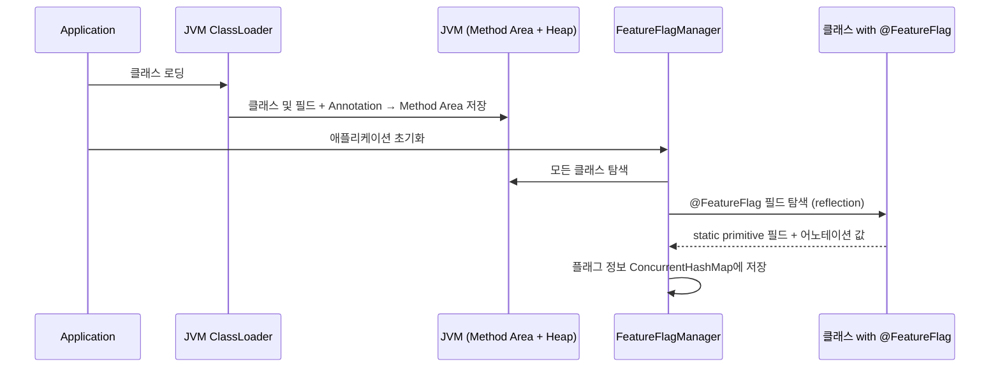
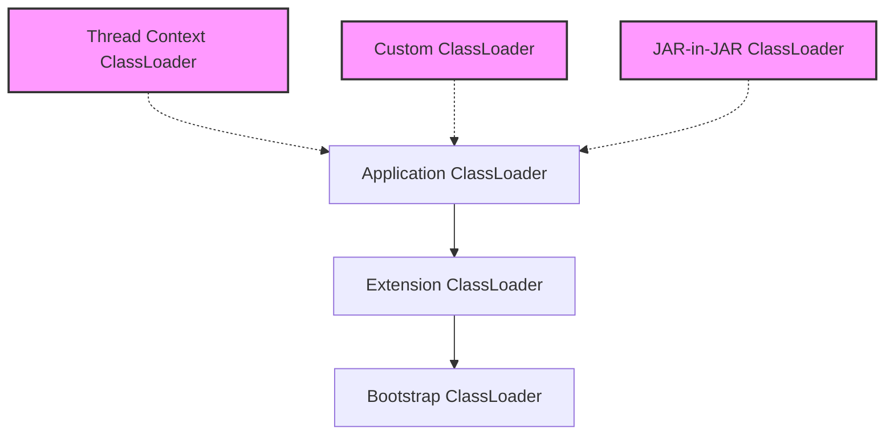

<style>
  /* Custom styles to override theme */
  .post {
    width: 100%;
    max-width: 900px;  /* 데스크톱에서의 최대 너비 */
    margin: 0 auto;
    padding: 20px;     /* 기본 패딩 */
    font-family: -apple-system, BlinkMacSystemFont, "Segoe UI", Roboto, Helvetica, Arial, sans-serif;
  }

  .mermaid {
    width: 100%;
    max-width: 300px !important;  /* 최대 너비 더 축소 */
    margin: 10px auto;
    text-align: center;
    background-color: white;
    padding: 5px;
    border-radius: 4px;
    box-shadow: 0 1px 3px rgba(0,0,0,0.1);
    overflow-x: auto;
  }
  
  .mermaid svg {
    width: auto !important;
    max-width: 250px !important;  /* SVG 최대 너비 더 축소 */
    height: auto !important;
    display: inline-block !important;
    transform: scale(0.7);  /* SVG 크기를 70%로 축소 */
    transform-origin: center center;
  }

  /* 모바일 최적화 */
  @media screen and (max-width: 767px) {
    .post {
      padding: 10px 5px;
    }
    
    .mermaid {
      max-width: 250px !important;  /* 모바일에서는 더 작게 */
      padding: 2px;
    }
    
    .mermaid svg {
      max-width: 200px !important;
      transform: scale(0.6);  /* 모바일에서는 60%로 축소 */
    }
  }
</style>

*이 글은 Feature Flag 시스템 구축에 관한 시리즈 중 3부입니다. [1부: 개념, 설계 고민, 그리고 Java SDK 개발 여정](../feature-flag-part1), [2부: 복잡한 엔터프라이즈 환경에서의 기술적 도전기](../feature-flag-part2)도 확인해보세요.*


## 6. Feature Flag 시스템의 내부 동작 원리

Feature Flag 시스템의 핵심 동작 원리를 JVM 메모리 관리 관점에서 살펴보자. 이 시스템은 Java의 기본 기능들을 효과적으로 활용하여 간결하면서도 강력한 동적 기능 제어 메커니즘을 구현했다.

### 6.1 시스템 구성 및 목적

**목적**
- 기능별 ON/OFF 상태를 동적으로 관리하고,
- 배포 없이 플래그 값을 변경할 수 있는 유연한 런타임 Feature Toggle 시스템 구축
**핵심 구성 요소**

- `@FeatureFlag`: static primitive 필드에 부착되어, 해당 필드가 기능 플래그임을 선언
- `FeatureFlagManager`: 애플리케이션 시작 시, reflection을 통해 모든 플래그 수집 및 초기화
- `ConcurrentHashMap<String, FlagMeta>`: 모든 플래그 상태 및 메타데이터를 저장하는 중앙 저장소
- `public static boolean useNewSearchAlgorithm`: JVM Method Area에 저장되며, 런타임에 값 변경 가능

### 6.2 선언 방식 예시

```java
@FeatureFlag(flagName = "new-search-algorithm")
public static boolean useNewSearchAlgorithm = false;

@FeatureFlag(flagName = "max-search-results")
public static int maxSearchResults = 100;

@FeatureFlag(flagName = "search-boost-factor")
public static double boostFactor = 1.5;
```

- 해당 필드는 런타임에 값을 바꿀 수 있다(`final`이 아님)
- 다양한 primitive 타입(boolean, int, long, double 등)을 지원한다
- `@FeatureFlag`가 부착되어 있으면, 애플리케이션 시작 시 `FeatureFlagManager`가 이를 인식한다

### 6.3 Primitive 타입을 사용하는 이유

시스템 설계 시 primitive 타입을 사용한 이유는 다음과 같다:

1. **메모리 효율성**: primitive 타입은 객체가 아니므로 참조 오버헤드가 없다. 특히 boolean은 단 1바이트만 차지하여 메모리 사용이 매우 효율적이다.

2. **성능 최적화**: 객체 래퍼(Boolean, Integer 등)와 달리 primitive 타입은 박싱/언박싱 과정이 없어 성능이 더 뛰어나다. 자주 접근되는 Flag 값은 이러한 성능 차이가 중요하다.

3. **타입 안전성**: 각 플래그마다 명확한 타입을 지정함으로써 컴파일 타임에 타입 검사가 가능하다. 이는 런타임 오류 가능성을 줄인다.

4. **간결한 사용성**: 개발자가 별도의 변환 과정 없이 자연스럽게 사용할 수 있다.
   ```java
   if (useNewSearchAlgorithm) {
       // 새 알고리즘 사용
   }
   ```

5. **다양한 설정 지원**: boolean 외에도 int, double 등을 지원함으로써 단순한 on/off 토글을 넘어 다양한 설정값을 제어할 수 있다.
   ```java
   // 검색 결과 수 제한 적용
   List<Result> results = search(query).limit(maxSearchResults);
   ```

객체 타입(String, 사용자 정의 클래스 등) 대신 primitive 타입만 지원한 것은 아래와 같은 고려 때문이었다:

1. **리플렉션 최적화**: primitive 타입은 리플렉션을 통한 값 설정이 단순하고 직접적이다.

2. **직렬화 용이성**: 백엔드 시스템과 통신 시 primitive 타입은 직렬화/역직렬화가 간단하다.

3. **설계 단순화**: 복잡한 객체 타입을 지원하면 값의 불변성, 깊은 복사 등 추가적인 고려사항이 생기므로, MVP 단계에서는 primitive 타입만 지원하는 것이 합리적이었다.

### 6.4 전체 동작 흐름: 서비스 시작 시점


각 항목별 JVM 저장 위치는 다음과 같다:

**static primitive 필드**
- 예시: useNewSearchAlgorithm, maxSearchResults 
- 저장 위치: Method Area (필드 참조) + 값은 Heap 내부 primitive

**Annotation 메타데이터**
- 예시: @FeatureFlag(...)
- 저장 위치: Method Area (클래스 메타정보로 저장됨)

**ConcurrentHashMap**
- 예시: Map<String, FlagMeta>
- 저장 위치: Heap (런타임 상태 저장)

**리플렉션 조회 시 참조 객체**
- 예시: Field, Annotation
- 저장 위치: Heap (reflection 시 생성되는 객체들)

### 6.5 FeatureFlagManager의 동작 방식 (예시 코드 기반)

```java
public class FeatureFlagManager {
    private static final ConcurrentHashMap<String, FlagMeta> flags = new ConcurrentHashMap<>();

    public static void initializeFlags(Class<?>... classesToScan) {
        for (Class<?> clazz : classesToScan) {
            for (Field field : clazz.getDeclaredFields()) {
                if (field.isAnnotationPresent(FeatureFlag.class)) {
                    FeatureFlag annotation = field.getAnnotation(FeatureFlag.class);
                    String flagName = annotation.flagName();

                    field.setAccessible(true);
                    try {
                        // 필드 타입에 따라 다르게 처리
                        Object value = field.get(null);  // static 필드
                        flags.put(flagName, new FlagMeta(field, value, annotation));
                    } catch (Exception e) {
                        throw new RuntimeException(e);
                    }
                }
            }
        }
    }

    public static <T> T getFlag(String flagName, T defaultValue) {
        FlagMeta meta = flags.get(flagName);
        if (meta != null) {
            try {
                @SuppressWarnings("unchecked")
                T value = (T) meta.value;
                return value;
            } catch (ClassCastException e) {
                logger.error("Type mismatch for flag: " + flagName, e);
                return defaultValue;
            }
        }
        return defaultValue;
    }

    public static <T> void setFlag(String flagName, T value) {
        FlagMeta meta = flags.get(flagName);
        if (meta != null && meta.field.getType().isAssignableFrom(value.getClass())) {
            try {
                meta.field.set(null, value);  // static 필드 갱신
                meta.value = value;
            } catch (Exception e) {
                throw new RuntimeException(e);
            }
        }
    }

    static class FlagMeta {
        final Field field;
        final FeatureFlag annotation;
        volatile Object value;

        FlagMeta(Field field, Object value, FeatureFlag annotation) {
            this.field = field;
            this.value = value;
            this.annotation = annotation;
        }
    }
}
```

### 6.6 핵심 기술 요소 설명

**Annotation + Reflection**
- `@FeatureFlag` 메타정보는 `.class` 파일에 저장되고 JVM 로딩 시 Method Area에 올라간다
- `clazz.getDeclaredFields()` → 클래스의 모든 필드를 가져온다
- `field.getAnnotation(...)` → 해당 필드에 붙은 어노테이션을 Heap에서 객체로 생성하여 반환한다

**static primitive 필드**
- `static` → 클래스 단위로 공유된다
- `primitive` → 가볍고 효율적인 메모리 사용
- `field.set(null, value)` → 런타임에 해당 static 필드 값을 변경 가능하다
  (인스턴스가 없으므로 첫 인자에 null)

**ConcurrentHashMap**
- Heap에 저장되어 GC 대상이 된다
- 다수의 스레드에서 플래그를 읽고 쓸 수 있다 (Thread-safe)
- Map의 키는 어노테이션의 flagName, 값은 메타정보를 담은 래퍼 객체 FlagMeta이다

### 6.7 시스템의 장점

| 항목 | 설명 |
|-----|------|
| 초경량 플래그 시스템 | 불필요한 라이브러리나 Config 서버 없이 순수 Java로 구현 가능 |
| 런타임 제어 가능 | 서비스 재배포 없이 동적으로 플래그 값을 변경할 수 있음 |
| 다양한 타입 지원 | boolean 뿐만 아니라 int, long, double 등 다양한 primitive 타입 지원 |
| Annotation 기반 선언적 관리 | 코드에 명시적으로 어떤 클래스/필드가 플래그 대상인지 드러남 |
| Thread-safe 관리 | ConcurrentHashMap으로 멀티스레드 환경에서도 안전한 접근 보장 |

### 6.8 요약

이 Feature Flag 시스템은 클래스의 static primitive 필드를 중심으로, 어노테이션과 리플렉션을 활용하여 기능 플래그를 선언적이고 동적으로 제어할 수 있게 설계되었다. 서비스 시작 시 모든 플래그를 탐색하고 ConcurrentHashMap에 저장하여 이후 런타임에서 플래그 값을 조회하고 변경할 수 있다. 이 설계는 Java의 Method Area, Reflection, Annotation, static 필드, Heap 구조를 효과적으로 활용한 좋은 사례이다.

## 7. 트러블슈팅: 배포 환경별 ClassLoader 문제

Feature Flag Java SDK를 설계하고 개발하는 과정에서 다양한 기술적 도전 과제들이 있었지만, 그중에서도 현업 배포 환경에서 발생한 ClassLoader 관련 문제는 특히 기억에 남는다. 이 문제는 실제 프로덕션 환경에서의 예상치 못한 변수를 고려하는 것의 중요성을 일깨워주는 소중한 경험이었다.

### 7.1 문제 상황

SDK 개발 완료 후 첫 번째 사용자였던 검색팀으로부터 "Feature Flag를 인식하는 리플렉션이 제대로 동작하지 않는다"는 피드백을 받았다. 개발 환경과 우리 팀의 프로덕션 환경에서는 정상적으로 작동했기 때문에 처음에는 문제의 원인을 파악하기 어려웠다. 로그 분석을 통해 문제 현상을 확인한 결과, 검색팀의 서비스에서는 `@FeatureFlag` 어노테이션이 붙은 필드들이 전혀 인식되지 않았다.

```java
// SDK 내 리플렉션 코드 (문제 발생 전)
private void scanPackages() {
    for (String packageName : packageNames) {
        try {
            Class<?>[] classes = getClasses(packageName);
            for (Class<?> clazz : classes) {
                scanFieldsInClass(clazz);
            }
        } catch (Exception e) {
            logger.error("Error scanning package: " + packageName, e);
        }
    }
}

private Class<?>[] getClasses(String packageName) throws Exception {
    ClassLoader classLoader = Thread.currentThread().getContextClassLoader();
    String path = packageName.replace('.', '/');
    Enumeration<URL> resources = classLoader.getResources(path);
    
    // 패키지 내 클래스 찾기 로직
    // ...
}
```

### 7.2 원인 분석

수일간의 디버깅과 검색팀과의 협업을 통해 문제의 핵심 원인을 파악할 수 있었다:

1. **배포 방식의 차이**: 우리 팀은 Jib을 사용하여 컨테이너 이미지를 만들어 배포했지만, 검색팀은 Executable JAR(fat JAR)로 패키징하여 배포하고 있었다.

2. **ClassLoader 구조와 클래스 이름 변환의 차이**: 
   - 일반적인 JAR 또는 컨테이너 배포에서는 모든 클래스가 같은 ClassLoader에 로드되며 원래의 패키지 이름과 클래스 이름이 그대로 유지된다.
   - 반면 Executable JAR(Spring Boot의 Fat JAR 포함)는 내장된 의존성 JAR 파일들마다 별도의 ClassLoader를 사용하는 구조를 가진다. 검색해본 바로는 Spring Boot의 내장 로더가 의존성 JAR 내부의 클래스를 로드할 때 클래스 이름 앞에 특별한 prefix를 붙인다는 점이 가장 큰 차이였다. 예를 들어, 원래 `com.company.service.MyClass`였던 클래스가 `BOOT-INF.classes.com.company.service.MyClass`와 같은 형태로 변환되었다. 이로 인해 패키지 기반 스캔 시 클래스를 찾지 못하는 문제가 발생했다.

3. **멀티 모듈 프로젝트 문제**: 추가 조사를 통해 다른 팀의 멀티 모듈 프로젝트에서도 모듈 간 ClassLoader 차이로 어노테이션 스캔이 실패하는 유사한 문제가 있음을 확인했다.

이 문제의 본질은 단순히 "클래스를 찾지 못하는 버그"가 아니라, Java 애플리케이션의 실행 환경과 ClassLoader 계층 구조에 대한 이해가 필요한 아키텍처적 문제였다.


*Java ClassLoader 계층 구조 - 다양한 배포 환경에서 추가 ClassLoader가 생성될 수 있음*

다음은 Spring Boot Executable JAR에서의 클래스 이름 변환 과정을 보여주는 예시이다:

**원래 클래스 이름**: `com.company.service.SearchService`  
**Executable JAR에서의 클래스 이름**: `BOOT-INF.classes.com.company.service.SearchService`

**원래 클래스 이름**: `com.company.flag.FeatureManager`  
**Executable JAR에서의 클래스 이름**: `BOOT-INF.classes.com.company.flag.FeatureManager`

**원래 클래스 이름**: `org.springframework.core.io.Resource`  
**Executable JAR에서의 클래스 이름**: `org.springframework.boot.loader.jar.JarFileEntries`

이러한 클래스 이름 변환은 Spring Boot의 LaunchedURLClassLoader가 수행하며, `Class.forName()`이나 패키지 스캔 시 이러한 변환된 이름을 고려하지 않으면 클래스를 찾지 못하게 된다.

### 7.3 해결 과정

문제를 더 자세히 이해하기 위해 Spring Boot의 Executable JAR 구조를 확인해보았다. 검색 결과, Spring Boot는 JAR 파일 내부에 모든 의존성을 포함하는 "nested JAR" 구조를 사용하며, 이를 실행하기 위해 특별한 ClassLoader와 로딩 메커니즘을 사용한다는 것을 알게 되었다.

```
my-application.jar
├── META-INF
│   └── MANIFEST.MF (Main-Class: org.springframework.boot.loader.JarLauncher)
├── BOOT-INF
│   ├── classes
│   │   └── com
│   │       └── company
│   │           └── service
│   │               └── SearchService.class
│   └── lib
│       ├── dependency1.jar
│       └── dependency2.jar
└── org
    └── springframework
        └── boot
            └── loader
                ├── JarLauncher.class
                └── ...
```

이 구조에서 `BOOT-INF/classes`에는 애플리케이션 클래스가, `BOOT-INF/lib`에는 의존성 JAR 파일들이, 그리고 `org/springframework/boot/loader`에는 이 모든 것을 로드하기 위한 부트스트랩 코드가 포함된다. 이로 인해 클래스 이름이 원래의 패키지 이름에 `BOOT-INF.classes.` 접두어가 붙는 형태로 변환되는 것이었다.

문제 해결을 위해 여러 접근법을 시도했다:

1. **ClassLoader 이해**: 온라인 문서와 예제를 통해 JVM의 ClassLoader 동작 방식을 찾아보았다. 특히 Executable JAR, WAR, Spring Boot의 ClassLoader 구조에 대한 기본적인 이해를 쌓는 데 집중했다.

2. **다양한 배포 환경 테스트**: 다른 팀들의 배포 방식을 시뮬레이션하는 테스트 환경을 구축하여 문제를 재현하고 해결책을 검증했다. 특히 Spring Boot로 패키징된 JAR 파일을 생성하고, 클래스 이름 변환이 어떻게 일어나는지 확인했다.

3. **접두어 처리 메커니즘 개발**: `BOOT-INF.classes.` 접두어를 가진 클래스를 올바르게 처리할 수 있는 로직을 개발했다. 패키지 스캔 시 접두어가 있는 경우와 없는 경우를 모두 고려하여 클래스를 찾는 방식으로 코드를 개선했다.

4. **여러 ClassLoader 활용**: 단일 ClassLoader에 의존하지 않고, 접근 가능한 여러 ClassLoader를 조합하여 사용하는 방식으로 코드를 개선했다.

```java
// 개선된 ClassLoader 처리 코드
private List<Class<?>> getAllClasses(String packageName) throws Exception {
    List<Class<?>> classes = new ArrayList<>();
    
    // 1. 현재 스레드의 ContextClassLoader 사용
    ClassLoader contextClassLoader = Thread.currentThread().getContextClassLoader();
    classes.addAll(getClassesFromLoader(packageName, contextClassLoader));
    
    // 2. 현재 클래스의 ClassLoader 사용
    ClassLoader thisClassLoader = this.getClass().getClassLoader();
    if (thisClassLoader != contextClassLoader) {
        classes.addAll(getClassesFromLoader(packageName, thisClassLoader));
    }
    
    // 3. 시스템 ClassLoader 사용
    ClassLoader systemClassLoader = ClassLoader.getSystemClassLoader();
    if (systemClassLoader != null && 
        systemClassLoader != contextClassLoader && 
        systemClassLoader != thisClassLoader) {
        classes.addAll(getClassesFromLoader(packageName, systemClassLoader));
    }
    
    // 4. 사용자 지정 ClassLoader 사용 (파라미터로 전달받은 경우)
    if (userClassLoader != null && 
        userClassLoader != contextClassLoader && 
        userClassLoader != thisClassLoader && 
        userClassLoader != systemClassLoader) {
        classes.addAll(getClassesFromLoader(packageName, userClassLoader));
    }
    
    // 5. Spring Boot의 Executable JAR를 위한 추가 처리
    // BOOT-INF.classes 접두어가 붙은 클래스 처리
    try {
        String bootInfPackage = "BOOT-INF.classes." + packageName;
        classes.addAll(getClassesFromLoader(bootInfPackage, contextClassLoader));
        
        if (thisClassLoader != contextClassLoader) {
            classes.addAll(getClassesFromLoader(bootInfPackage, thisClassLoader));
        }
        
        // 다른 ClassLoader에도 동일하게 적용
    } catch (Exception e) {
        logger.debug("Failed to scan BOOT-INF classes, this may not be a Spring Boot executable JAR", e);
    }
    
    // 중복 제거 및 결과 반환
    return classes.stream().distinct().collect(Collectors.toList());
}

private List<Class<?>> getClassesFromLoader(String packageName, ClassLoader classLoader) {
    List<Class<?>> classes = new ArrayList<>();
    try {
        // 패키지 경로를 파일 시스템 경로로 변환
        String path = packageName.replace('.', '/');
        Enumeration<URL> resources = classLoader.getResources(path);
        
        while (resources.hasMoreElements()) {
            URL resource = resources.nextElement();
            String protocol = resource.getProtocol();
            
            if ("file".equals(protocol)) {
                // 파일 시스템에서 클래스 스캔
                classes.addAll(findClassesInDirectory(new File(resource.getFile()), packageName));
            } else if ("jar".equals(protocol)) {
                // JAR 파일 내부에서 클래스 스캔
                classes.addAll(findClassesInJar(resource, packageName));
            }
        }
        
        // Spring Boot Executable JAR 특별 처리
        if (packageName.startsWith("BOOT-INF.classes.")) {
            // 원래 패키지 이름 추출 (접두어 제거)
            String originalPackage = packageName.substring("BOOT-INF.classes.".length());
            
            // 클래스 로딩 시 접두어 처리 로직
            // ...
        }
    } catch (Exception e) {
        logger.warn("Error scanning package: " + packageName + " with classloader: " + classLoader, e);
    }
    
    return classes;
}
```

5. **사용자 지정 ClassLoader 지원과 접두어 처리 옵션**: SDK 사용자가 직접 특수한 ClassLoader를 제공하고, 패키지 접두어 처리 방식을 설정할 수 있는 옵션을 추가했다.

```java
// SDK 초기화 시 ClassLoader 지정과 접두어 처리 옵션 추가
FeatureFlagManager manager = FeatureFlagManager.builder()
        .setPackageNames(new String[]{"your.package.names"})
        .setEnvironment(ExpEnv.QA)
        .setClassLoader(customClassLoader) // 사용자 지정 ClassLoader 설정
        .enableSpringBootSupport(true) // Spring Boot JAR 지원 활성화
        .addPackagePrefix("BOOT-INF.classes") // 추가 패키지 접두어 지정
        .build();
```

Spring Boot 애플리케이션을 위한 특별 초기화 헬퍼 메서드도 추가했다:

```java
// Spring Boot 환경에 최적화된 초기화 메서드
public static FeatureFlagManager forSpringBoot(String[] packageNames, ExpEnv env) {
    // Spring Boot의 LaunchedURLClassLoader 자동 감지
    ClassLoader bootClassLoader = Thread.currentThread().getContextClassLoader();
    return FeatureFlagManager.builder()
            .setPackageNames(packageNames)
            .setEnvironment(env)
            .setClassLoader(bootClassLoader)
            .enableSpringBootSupport(true)
            .build();
}
```

### 7.4 추가 문제: 멀티 모듈 프로젝트에서의 클래스 로딩

Executable JAR 이슈를 해결한 후에도, 멀티 모듈 프로젝트에서 새로운 문제가 발견되었다. 특히 모듈 간 의존성이 복잡한 대규모 프로젝트에서 추가적인 클래스 로딩 이슈가 발생했다.

```
project-root/
├── module-core/
│   └── src/main/java/com/company/core/
│       └── CoreFeatureFlags.java
├── module-service/
│   └── src/main/java/com/company/service/
│       └── ServiceFeatureFlags.java
└── module-web/
    └── src/main/java/com/company/web/
        └── WebFeatureFlags.java
```

위와 같은 구조에서, `module-web`은 `module-service`에 의존하고, `module-service`는 `module-core`에 의존하는 구조일 때, `module-web`에서 SDK를 초기화하면 다른 모듈의 Feature Flag가 인식되지 않는 문제가 발생했다.

이 문제는 모듈별로 다른 ClassLoader가 사용되거나, 클래스 패스 구성 방식의 차이로 인해 발생했다. 특히 IDE 개발 환경과 빌드 도구(Maven/Gradle)의 실행 환경에서 클래스 로딩 방식이 달라 더욱 복잡한 상황이었다.

이를 해결하기 위해 모듈 간 경계를 넘어 클래스를 검색할 수 있는 추가적인 메커니즘을 구현했다:

1. **모듈 간 클래스 패스 스캔**: 모듈 간 의존성 구조를 분석하여 연결된 모든 모듈의 클래스 패스를 스캔하는 로직을 추가했다.

2. **서비스 로더 메커니즘 도입**: Java의 `ServiceLoader` API를 활용하여 각 모듈이 자신의 Feature Flag를 중앙 레지스트리에 등록할 수 있는 선언적 메커니즘을 제공했다.

3. **명시적 모듈 등록 API**: 모듈 개발자가 자신의 모듈에 있는 Feature Flag 클래스를 명시적으로 등록할 수 있는 API를 추가했다.

```java
// 모듈별 Feature Flag 등록을 위한 API
FeatureFlagManager.getInstance().registerModuleFlags(CoreFeatureFlags.class);
FeatureFlagManager.getInstance().registerModuleFlags(ServiceFeatureFlags.class);
```

이러한 접근 방식을 통해 복잡한 멀티 모듈 프로젝트에서도 Feature Flag가 안정적으로 작동할 수 있게 되었다.

### 7.5 배운 점

이 트러블슈팅 경험을 통해 얻은 중요한 교훈들:

1. **실제 사용 환경의 중요성**: 기능 설계 시 구현뿐만 아니라 실제 사용 환경과 다양한 배포 방식까지 세심하게 고려해야 한다. 개발 환경과 프로덕션 환경의 차이를 항상 염두에 두어야 한다.

2. **기술적 이해의 가치**: JVM의 ClassLoader와 리플렉션에 대한 기본적인 이해가 문제 해결의 핵심이었다. 표면적인 API 사용법을 넘어 기본적인 동작 원리를 이해하는 것이 복잡한 문제 해결에 큰 도움이 된다.

3. **확장성 있는 설계의 중요성**: 다양한 환경과 사용 사례를 수용할 수 있는 유연한 설계가 중요하다. 특히 공통 SDK와 같이 여러 팀이 사용하는 코드는 더욱 강건하고 적응력 있게 설계해야 한다.

4. **엣지 케이스 테스트의 필요성**: 일반적인 사용 사례뿐만 아니라 예상치 못한 엣지 케이스도 철저히 테스트해야 한다. 다양한 배포 환경을 시뮬레이션하는 테스트 사례를 추가하여 유사한 문제를 사전에 방지할 수 있다.

5. **상세한 로깅의 가치**: 상세한 디버그 로깅이 문제 진단에 결정적인 역할을 했다. 특히 리플렉션과 같은 메타프로그래밍 기법을 사용할 때는 내부 동작을 추적할 수 있는 로깅이 필수적이다.

트러블슈팅 과정은 정말 힘들었지만, 그만큼 많이 배울 수 있었던 소중한 경험이었다. 처음에는 Java의 ClassLoader나 리플렉션 같은 개념들이 너무 어려워서 좌절도 많이 했다. 하지만 동료 개발자들과 페어 프로그래밍을 하면서 문제를 하나씩 해결해나갔다. 특히 ClassLoader 관련 문제를 해결할 때는 함께 Java 스펙도 찾아보고, 오픈소스 프로젝트의 구현 사례도 분석하면서 깊이 있게 공부했다. 이렇게 실제 문제를 해결하면서 공부하니 이론으로만 알던 개념들을 확실하게 이해할 수 있었다. 이러한 학습 과정을 통해 기술적 성장을 이룰 수 있었지만, 실제 프로덕션 환경에서는 또 다른 도전이 기다리고 있었다.

개발 환경에서는 잘 동작하던 코드가 실제 프로덕션 환경에서 문제가 발생했을 때는 정말 당황스러웠다. 하지만 이 경험을 통해 테스트의 중요성을 뼈저리게 느꼈고, 다양한 환경에서의 테스트 케이스를 꼼꼼히 작성하는 습관을 기를 수 있었다. 결국 이런 시행착오 끝에 안정적으로 동작하는 SDK를 만들 수 있었고, 이 과정에서 성장할 수 있었다는 점이 가장 큰 수확이었다.

## 8. 개선 필요사항 및 기술적 아쉬움

회사 합병/분사 과정에서 팀이 바뀌고 프로젝트가 인수인계 되면서 여러 핵심 기능을 구현하지 못했다. 현재는 기본적인 관리 운영만 담당하고 있으며, 다음과 같은 개선이 필요하다:

1. **분석 및 로깅 시스템 구축**: 현재 Feature Flag 변경에 대한 로깅 기능이 없어 Flag 변경의 영향을 분석할 수 없는 상황이다. 이벤트 기반 알림 시스템(EventListener)과 AWS의 모니터링 서비스(CloudWatch)를 통합하여 변경 이력을 추적하고, 이를 실험 플랫폼과 연동하여 비즈니스 지표에 미치는 영향을 정량적으로 분석할 수 있는 시스템이 필요하다.

2. **트래픽 세그먼테이션**: 사용자 속성(국가, 디바이스 등)에 따라 다른 Flag 값을 제공할 수 있는 기능이 필요하다. 이를 통해 특정 사용자 그룹에만 새로운 기능을 테스트할 수 있다. 예를 들어, "한국 지역의 안드로이드 사용자에게만 새 검색 UI 보여주기"와 같은 세밀한 제어가 가능해진다.

3. **점진적 롤아웃 기능**: 트래픽의 일정 비율(5%, 10%, 50%)에 대해 단계적으로 기능을 적용할 수 있는 기능이 필요하다. 이를 통해 새 기능의 안정성을 검증하며 리스크를 최소화할 수 있다. 문제가 발견되면 빠르게 롤백하거나, 안정적이면 더 많은 사용자에게 확대할 수 있는 자동화 메커니즘이 이상적이다.

4. **조건부 Flag 활성화**: 특정 조건(시간, 서버 부하 등)에 따라 자동으로 Flag 값이 변경되는 규칙 기반 시스템이 있으면 더욱 유연한 기능 관리가 가능하다. 예를 들어, "서버 CPU 사용률이 80% 이상인 경우 무거운 기능을 자동으로 비활성화"하는 자동 방어 메커니즘 구현이 가능해진다.

5. **실험 플랫폼과의 통합**: Feature Flag 시스템과 A/B 테스트 플랫폼을 통합하여 데이터 기반 의사결정으로 확장할 수 있다. 이를 통해 개발자가 아닌 PM이나 비즈니스 분석가도 쉽게 실험을 제어하고 그 결과를 분석할 수 있는 환경이 구축된다. 단순히 기능을 켜고 끄는 것을 넘어, 어떤 버전이 더 효과적인지 측정하고 자동으로 최적의 버전을 선택하는 시스템으로 발전할 수 있다.

6. **Flag 종속성 관리**: 여러 Flag 간의 종속성을 관리할 수 있는 기능이 필요하다. 특정 Flag가 활성화되면 다른 Flag도 자동으로 변경되는 규칙을 설정할 수 있다면 복잡한 기능 출시를 더 안전하게 관리할 수 있다. 이는 "새 결제 시스템 Flag가 활성화되면 자동으로 새 주문 처리 Flag도 활성화"와 같은 시나리오에서 유용하다.

7. **아키텍처 개선**: 독립적인 마이크로서비스로 설계했다면 확장성과 유지보수성이 더 좋았을 것이다. 또한 서비스 장애 확산을 방지하는 Circuit Breaker 패턴을 적용하여 서버 장애 시 대응력을 높이고, 감사(Audit) 기능을 추가하여 Flag 값 변경 이력을 추적할 수 있었다면 더 안정적인 시스템이 되었을 것이다.

8. **성능 최적화**: Java의 Reflection API(프로그램이 실행 중에 자기 자신의 구조를 분석하는 기능) 사용으로 인한 성능 영향을 최소화하고, 더 정교한 캐시 무효화 메커니즘을 구현했다면 더 효율적이었을 것이다. 특히 Flag 값이 변경되었을 때 즉시 모든 클라이언트에 전파되는 실시간 업데이트 메커니즘(WebSocket 등을 활용)이 있었다면 좋았을 것이다.

이러한 개선 사항들은 프로젝트 진행 중 식별되었으나 조직 변경으로 인해 구현하지 못했다. 그럼에도 이 경험을 통해 얻은 교훈은 다음 프로젝트에 큰 도움이 되었다.

## 9. 다음 시스템 개발 시 적용할 교훈

이 프로젝트에서 얻은 경험은 후속 프로젝트에 많은 영향을 미쳤다. 특히 다음과 같은 교훈을 얻었다:

1. **사용성 중심 설계**: 기술적으로 완벽한 시스템보다 사용자(개발자)가 쉽게 이해하고 활용할 수 있는 시스템이 더 가치 있다. API 설계 시 개발자 경험(DX)을 최우선으로 고려해야 한다.

2. **점진적 확장 계획**: 처음부터 완벽한 시스템을 구축하기보다는 MVP(Minimum Viable Product)로 시작하고 사용자 피드백을 받아 개선하는 개발 전략이다. 이 과정에서 올바른 추상화 계층을 구축하면 확장이 용이해진다.

3. **문서화와 교육의 중요성**: 시스템 사용법에 대한 명확한 문서와 코드 예제가 도입 속도를 높인다. 기술 세미나, 코드랩, 가이드 문서 등 다양한 방식으로 사용자 교육을 진행해야 한다.

4. **모니터링과 분석 초기 구축**: 시스템 효과를 측정할 수 있는 모니터링과 분석 도구를 초기부터 구축하는 것이 중요하다. 데이터 기반 의사결정을 통해 시스템의 가치를 증명하고 개선 방향을 명확히 할 수 있다.

5. **유연성과 확장성의 균형**: 지나친 유연성 추구는 시스템 복잡도를 높인다. 현재 요구사항과 향후 확장 가능성 사이의 균형을 찾는 것이 중요하다.

6. **크로스 플랫폼 전략 초기 수립**: 다양한 플랫폼에서 일관된 경험을 제공하기 위한 전략을 초기부터 수립해야 한다. 각 플랫폼의 특성을 고려한 SDK 설계로 개발자 경험을 최적화할 수 있다.

7. **기술적 부채 관리**: 빠른 구현을 위한 타협이 기술적 부채로 누적되지 않도록 주기적인 리팩토링과 개선 작업을 계획해야 한다. 특히 핵심 기능의 안정성과 성능에 대한 지속적인 모니터링과 개선이 중요하다.

8. **팀 간 협업 모델 구축**: 플랫폼 팀과 사용자 팀 간의 효과적인 협업 모델을 구축하는 것이 중요하다. 정기적인 피드백 수집, 사용자 그룹 운영, 공동 개발 세션 등을 통해 시스템 발전 방향을 함께 모색해야 한다.

다음 프로젝트에서는 이러한 교훈을 바탕으로 더 완성도 높은 기술 플랫폼을 구축할 수 있을 것이다.

## 10. 용어 정리

**Feature Flag**
: 코드 변경 없이 기능을 켜고 끌 수 있게 해주는 설정 값. 마치 전등 스위치처럼 언제든 기능을 활성화하거나 비활성화할 수 있다.

**Feature Toggle**
: Feature Flag와 동의어로, 기능을 켜고 끄는 스위치 역할을 한다.

**A/B Testing**
: 두 가지 이상의 변형을 비교하여 더 효과적인 것을 결정하는 실험. 사용자를 A그룹과 B그룹으로 나누어 다른 경험을 제공하고 어떤 것이 더 좋은 결과를 내는지 측정한다.

**Canary Release**
: 새 기능을 일부 사용자에게만 점진적으로 배포하는 방식. 마치 광부들이 유독가스를 감지하기 위해 카나리아 새를 사용했던 것처럼, 일부 사용자를 통해 위험을 먼저 감지한다.

**SDK(Software Development Kit)**
: 특정 소프트웨어를 개발하기 위한 도구 모음. 라이브러리, 문서, 예제 코드 등을 포함한다.

**Reflection**
: Java에서 실행 중인 프로그램이 자신의 구조(클래스, 메서드, 필드 등)를 검사하고 조작할 수 있는 능력. 런타임에 클래스의 내부 구조를 살펴보고 동적으로 사용할 수 있다.

**Java Annotation**
: 코드에 메타데이터를 추가하는 Java의 기능. `@FeatureFlag`와 같이 '@' 기호로 시작하며, 컴파일러나 실행 환경에 추가 정보를 제공한다.

**Static Field**
: 클래스의 모든 인스턴스가 공유하는 필드. 객체를 생성하지 않고도 접근할 수 있으며, 해당 클래스의 모든 객체에 동일한 값이 적용된다.

**Thread-safe**
: 여러 스레드(동시에 실행되는 작업)가 동시에 접근해도 안전하게 동작하는 코드나 데이터 구조. 경쟁 상태나 데이터 오염 없이 정확한 결과를 보장한다.

**JVM(Java Virtual Machine)**
: Java 코드를 실행하는 가상 머신. Java는 플랫폼 독립적인 바이트코드로 컴파일되고, JVM이 이를 실행 환경에 맞게 해석하여 실행한다.

**Method Area**
: JVM 메모리 영역 중 하나로, 클래스 정보와 static 변수, 상수 등을 저장하는 공간. 모든 스레드가 공유한다.

**Heap**
: JVM 메모리 영역 중 하나로, 객체가 할당되는 영역. 애플리케이션에서 생성하는 모든 객체 인스턴스가 이곳에 저장된다.

**ConcurrentHashMap**
: Java에서 제공하는 멀티스레드 환경에서 안전하게 사용할 수 있는 해시 맵(키-값 저장소) 구현체. 여러 스레드가 동시에 읽고 쓸 때 발생할 수 있는 문제를 방지한다.

**Primitive Type**
: Java의 기본 데이터 타입(int, boolean, double 등). 객체가 아닌 값 자체를 저장하며, 메모리 효율성과 성능 면에서 유리하다.

**MVP(Minimum Viable Product)**
: 최소한의 기능을 갖춘 제품. 핵심 기능만 구현하여 빠르게 출시하고 사용자 피드백을 받아 개선하는 개발 전략이다.

**ClassLoader**
: JVM에서 클래스 파일을 메모리에 로드하는 컴포넌트. 필요할 때 클래스를 동적으로 로드하고 링크하는 역할을 한다.

**Executable JAR**
: 직접 실행 가능한 Java 아카이브 파일. 모든 의존성과 실행에 필요한 메타데이터를 포함하고 있어 별도의 설치 없이 `java -jar` 명령으로 실행할 수 있다.

**Spring Boot**
: Java 기반 애플리케이션 개발을 단순화하는 프레임워크. 복잡한 설정 없이 빠르게 독립 실행형 애플리케이션을 만들 수 있게 해준다.

**Node.js**
: JavaScript를 서버 측에서 실행할 수 있게 해주는 런타임 환경. 웹 서버, CLI 도구, 백엔드 API 등을 JavaScript로 개발할 수 있다.

**Isomorphic JavaScript**
: 서버와 클라이언트에서 동일한 코드로 실행되는 JavaScript. 코드 재사용성을 높이고 일관된 동작을 보장한다.

**TypeScript**
: Microsoft가 개발한 JavaScript의 정적 타입 확장 언어. 컴파일 시점에 타입 검사를 통해 오류를 미리 발견할 수 있다.

**REST API**
: 웹 서비스를 위한 아키텍처 스타일. HTTP 프로토콜의 기본 메서드(GET, POST, PUT, DELETE 등)를 활용하여 리소스를 표현하고 상태를 전송한다.

**Circuit Breaker**
: 장애 확산을 방지하는 소프트웨어 디자인 패턴. 전기 회로의 차단기처럼, 서비스 호출이 계속 실패하면 일정 시간 동안 호출을 차단하여 시스템 과부하를 방지한다.

**Progressive Rollout**
: 새 기능을 점진적으로 더 많은 사용자에게 배포하는 전략. 초기에는 소수의 사용자에게만 제공하고, 안정성이 확인되면 점차 확대한다.

**Runtime Control**
: 프로그램이 실행 중에 동적으로 동작을 변경할 수 있는 기능. 재시작 없이 설정이나 기능을 변경할 수 있다.

**Cache Invalidation**
: 캐시된 데이터를 갱신하는 과정. 서버에서 Flag 값이 변경되었을 때 클라이언트의 캐시를 업데이트하여 일관성을 유지한다.

**Dynamic Reflection**
: 애플리케이션 실행 중에 클래스와 메서드 구조를 검사하고 조작하는 기능. 실행 시점에 유연하게 코드 동작을 변경할 수 있다.

**Type Safety**
: Flag 값의 데이터 타입이 올바르게 사용되는지 확인하는 메커니즘. 잘못된 타입 사용으로 인한 오류를 사전에 방지한다.

## 참고자료

Martin Fowler의 ["Feature Toggles (Feature Flags)"](https://martinfowler.com/articles/feature-toggles.html) - Feature Flag의 개념과 사용 패턴
