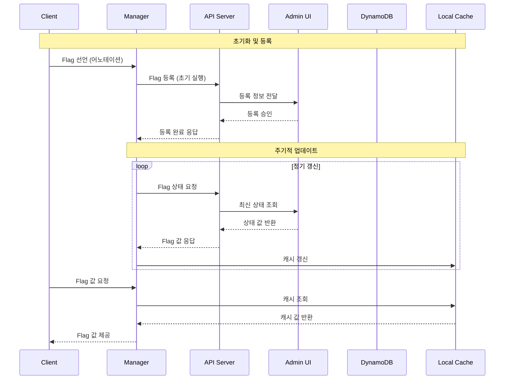

## 1. Feature Flag 시스템 개요

Feature Flag는 코드 수정이나 재배포 없이 특정 기능을 켜거나 끌 수 있는 기법으로, A/B 테스트, 점진적 기능 출시, 긴급 롤백 상황에서 활용되었다. 인턴으로 입사했을 당시, 회사는 단순한 롤아웃/롤백 작업에도 이전 버전 재배포나 새로운 실험 생성이 필요했다. 이 문제를 해결하기 위해 Java 기반의 Feature Flag SDK를 개발했다.

시스템 개발 초기에는 Feature Flag 도입 여부를 두고 많은 고민이 있었다. 기존 배포 프로세스를 개선하자는 의견도 있었지만, 이는 여러 팀과의 협업이 필요한 큰 변화였고 당장의 문제 해결이 어려웠다. 또한 Hackle과 같은 국내 Feature Flag 솔루션 도입도 검토했으나, 회사의 특수한 요구사항과 보안 정책 등을 고려했을 때 자체 개발이 더 적합하다고 판단했다. 결국 Feature Flag 방식을 선택한 이유는 코드 배포와 기능 출시를 완전히 분리하여 비즈니스 부서가 개발팀에 의존하지 않고도 기능을 제어할 수 있게 하기 위함이었다.

## 2. 시스템 아키텍처

시스템의 데이터 흐름과 주요 컴포넌트 간의 상호작용은 다음 시퀀스 다이어그램과 같다:

<style>
.mermaid svg {
  max-width: 20% !important;
  width: auto !important;
  height: auto !important;
}
</style>



*시스템의 주요 컴포넌트 간 상호작용을 보여주는 시퀀스 다이어그램*

아키텍처 설계 시 중앙집중식과 분산식 접근법을 비교했다. 중앙집중식은 모든 Flag 결정을 중앙 서버에서 처리하는 방식으로, 즉각적인 업데이트와 일관된 제어가 가능하지만 네트워크 지연과 의존성이 증가한다. 분산식은 각 클라이언트가 로컬에서 결정을 내리는 방식으로, 성능은 좋지만 상태 동기화가 어렵다.

최종적으로 하이브리드 접근법을 채택했다. 클라이언트는 로컬에서 Flag 결정을 처리하지만 주기적으로 중앙 서버와 동기화하여 분산 시스템의 성능 이점과 중앙 관리의 일관성을 균형 있게 조합했다. 이 선택은 특히 네트워크 장애 시에도 기본값으로 작동하는 견고한 시스템을 구축하는 데 중요했다.

## 3. 핵심 설계 원칙과 기술적 구현

### 3.1 Annotation 기반 관리 시스템

```java
@FeatureFlag(flagName="new-search-algorithm")
private static boolean useNewSearchAlgorithm = true;
```

이 설계는 Admin 페이지와 코드 사이의 Splitter API 네트워크 장애 시에도 기능 상태의 일관성을 보장했다. 애플리케이션 시작 시 코드 내 선언된 Flag가 실험 플랫폼에 자동 등록되었으며, 이후 실험 플랫폼에서 상태를 수정할 수 있도록 했다.

이 설계를 선택하기 전에 다음과 같은 대안들을 고려했다. 가장 중요한 요구사항은 "런타임에 코드 수정이나 재배포 없이 변수 값을 동적으로 변경할 수 있어야 한다"는 것이었다. 이 핵심 요구사항을 기준으로 다음 대안들을 평가했다:

1. **Properties 파일 기반 설정**
   - 장점: 설정 변경이 쉽고, 코드 수정 없이 값 변경 가능
   - 단점: 여전히 배포가 필요하여 런타임 변경 불가능, 코드와 설정의 불일치 가능성 존재
   - 기각 이유: 런타임 동적 변경이라는 핵심 요구사항 충족 실패

2. **데이터베이스 직접 관리**
   - 장점: 중앙 집중식 관리, 런타임에 실시간 값 변경 가능
   - 단점: 네트워크 장애 시 전체 시스템 영향, 초기 구동 시 지연
   - 기각 이유: 안정성 위험이 너무 큼

3. **REST API 기반 동적 설정**
   - 장점: 런타임에 유연한 관리와 실시간 업데이트 가능
   - 단점: 네트워크 의존성, 초기값 설정의 어려움
   - 기각 이유: 코드의 의도가 불명확하고 타입 안정성 부족

4. **인터페이스와 구현체를 통한 방식**
   - 장점: 런타임에 유연한 기능 제어 가능
   - 단점: 구조가 복잡하고 개발 시간이 오래 걸림
   - 기각 이유: MVP 단계에서는 빠르고 단순한 구현이 우선이었음

5. **환경 변수 활용**
   - 장점: 배포 환경별 구성 쉬움, 인프라 수준에서 제어 가능
   - 단점: 런타임 변경이 거의 불가능, 모니터링 및 감사 복잡
   - 기각 이유: 런타임 동적 변경이라는 핵심 요구사항 충족 실패

Annotation 방식은 이러한 대안들의 단점을 보완하면서도 다음과 같은 이점을 제공했다:
- 코드의 의도가 명확히 드러남
- 컴파일 타임 검증 가능
- IDE 지원을 통한 개발 생산성 향상
- 기본값 지정으로 안정성 확보

### 3.2 Reflection 기반 자동 등록 메커니즘

Java Reflection API를 활용하여 코드 전반에 흩어진 Feature Flag 변수를 자동으로 수집하고 관리하는 시스템을 구현했다. 구체적으로는 `Class.forName()`, `getDeclaredFields()`, `getAnnotation()` 메서드를 활용해 런타임에 `@FeatureFlag` 어노테이션이 붙은 필드들을 탐색했다. 이 과정에서 접근 제한자(private, protected)가 있는 필드도 `setAccessible(true)`를 통해 접근할 수 있도록 처리했다. 

자동 등록 메커니즘을 구현하기 위해 여러 기술적 대안을 검토했다:

1. **컴파일 타임 어노테이션 프로세싱**
   - 장점: 런타임 오버헤드 없음, 컴파일 시점 검증 가능
   - 단점: 복잡한 구현, 빌드 프로세스 변경 필요
   - 기각 이유: 구현 복잡성 및 기존 빌드 시스템과의 통합 어려움

2. **명시적 등록 API**
   - 장점: 간단한 구현, 명확한 작동 방식, 네트워크 장애 시 기본값 명시적 지정 가능
   - 단점: 개발자가 수동으로 각 Flag 등록 필요, 유지관리 부담, 기본값 설정 누락 시 장애 위험
   - 기각 이유: 사용 편의성 감소, Flag 등록 및 기본값 설정 누락 가능성 높음

3. **스프링 프레임워크 통합**
   - 장점: 기존 스프링 애플리케이션과 통합 용이, 풍부한 생태계
   - 단점: 스프링 의존성 발생, 비스프링 환경 지원 어려움
   - 기각 이유: 프레임워크 중립성 손상, 레거시 시스템 지원 제한

Reflection 기반 접근법은 이러한 대안들과 비교했을 때 가장 균형 잡힌 선택이었다. 런타임에 약간의 오버헤드가 있지만, 개발자 경험을 최우선으로 고려했을 때 코드에 어노테이션만 추가하면 되는 간편함이 큰 장점이었다. 또한 프레임워크 의존성 없이 순수 Java로 구현함으로써 어떤 환경에서도 사용 가능한 SDK를 만들 수 있었다.

중요한 제약사항으로, Feature Flag 필드는 반드시 `static`으로 선언해야 했다. 이는 Reflection API의 특성 때문인데, 인스턴스 필드의 경우 해당 클래스의 인스턴스가 필요하지만, 스캔 시점에는 이 인스턴스를 생성할 방법이 없기 때문이다. 반면 `static` 필드는 클래스 로딩 시점에 메모리에 할당되므로 인스턴스 없이도 접근 및 수정이 가능하다. 이 제약은 개발자들에게 명확히 안내되었으며, 가이드라인 문서에도 강조되었다.

```java
// 올바른 사용법 - static 필드
@FeatureFlag(flagName = "new-search-algorithm", defaultValue = false)
public static boolean useNewSearchAlgorithm = false;

// 잘못된 사용법 - 인스턴스 필드 (작동하지 않음)
@FeatureFlag(flagName = "premium-feature", defaultValue = false)
private boolean premiumFeatureEnabled = false;
```

또한 클래스 로더 계층 구조를 고려하여 애플리케이션의 모든 패키지를 스캔하는 재귀적 알고리즘을 구현했고, 성능 최적화를 위해 스캔 대상 패키지를 설정할 수 있는 필터링 메커니즘도 추가했다. 이렇게 수집된 Feature Flag 정보는 ConcurrentHashMap을 사용해 스레드 안전하게 관리했으며, 주기적으로 백엔드 서버와 동기화되도록 ScheduledExecutorService를 구성했다.

주기적 업데이트 방식을 선택한 것도 신중한 고려 끝에 내린 결정이었다. WebSocket(양방향 실시간 통신)이나 Server-Sent Events(서버에서 클라이언트로의 단방향 실시간 통신)를 통한 실시간 업데이트도 고려했지만, 연결 유지에 따른 서버 부하와 네트워크 비용이 우려되어 채택하지 않았다. WebSocket은 실시간 채팅처럼 양방향 통신이 필요한 경우에 적합하고, Server-Sent Events는 실시간 알림처럼 서버에서 클라이언트로의 푸시 알림이 필요한 경우에 적합하다. 실시간 업데이트 대신 주기적 업데이트를 선택한 이유는 다음과 같다:

1. **서버 부하 감소**: 수많은 클라이언트의 실시간 연결 대신 주기적 업데이트를 통해 서버 리소스를 효율적으로 관리할 수 있다. 특히 수천 개의 서비스 인스턴스가 동시에 연결을 유지하는 상황을 피할 수 있었다.

2. **네트워크 효율성**: 여러 변경사항을 모아서 배치로 처리함으로써 네트워크 트래픽을 최적화할 수 있다. 실시간 전파는 각각의 작은 변경에도 즉시 통신이 발생하는 반면, 주기적 업데이트는 여러 변경을 한 번에 처리할 수 있다.

3. **장애 복원력**: 일시적인 네트워크 문제나 서버 장애 시에도 다음 주기에 자연스럽게 복구된다. 실시간 연결 방식은 연결 끊김 시 즉각적인 재연결 로직이 필요하지만, 주기적 업데이트는 이러한 복잡성을 피할 수 있다.

4. **구현 단순성**: 실시간 업데이트는 연결 관리, 재시도 로직, 장애 복구 등 복잡한 구현이 필요한 반면, 주기적 업데이트는 단순한 HTTP 요청만으로 구현이 가능하다.

5. **캐시 활용**: 업데이트 주기 사이에는 로컬 캐시를 활용하여 빠른 응답시간을 보장할 수 있다. 대부분의 Flag 값은 자주 변경되지 않는다는 점을 고려할 때, 이는 실용적인 접근이었다.

이러한 설계를 통해 개발자들은 코드에 어노테이션만 추가하면 자동으로 시스템에 등록되어 관리되는 편리함을 제공할 수 있었다. XML 기반 설정이나 프로그래밍 방식의 등록도 고려했지만, 코드와 설정이 분리되어 관리가 어려워질 수 있다는 단점 때문에 어노테이션 방식을 선택했다. 특히 LRU 캐시를 도입한 것은 시스템의 성능을 크게 향상시켰는데, Redis나 Memcached 같은 외부 캐시 시스템도 검토했지만 추가적인 인프라 관리 부담을 줄이기 위해 인메모리 캐시로 결정했다. 이는 다음과 같은 이점을 가져왔다:

### 3.3 싱글톤 패턴과 스레드 안전성 확보

Feature Flag Manager는 싱글톤 패턴으로 구현하여 애플리케이션 전체에서 하나의 인스턴스만 존재하도록 설계했다. 싱글톤 패턴을 적용한 명확한 이유는 다음과 같다:

1. **일관된 상태 관리**: Feature Flag의 상태는 애플리케이션 전체에서 일관되게 유지되어야 한다. 여러 인스턴스가 존재할 경우 각각 다른 상태를 가질 수 있어 예측 불가능한 동작이 발생할 위험이 있다.

2. **리소스 효율성**: Flag 정보를 주기적으로 백엔드 서버와 동기화하는 과정에서 네트워크 요청과 메모리 사용이 발생한다. 여러 인스턴스가 각각 동기화를 수행한다면 불필요한 리소스 낭비가 발생할 수 있다.

3. **캐시 효율성 극대화**: LRU 캐시를 통해 Flag 값 조회 성능을 최적화했는데, 여러 인스턴스가 각자의 캐시를 관리한다면 캐시 히트율이 떨어져 성능 이점이 감소한다.

4. **중앙화된 로깅과 모니터링**: 모든 Flag 조회와 변경 이벤트를 단일 지점에서 추적하고 로깅함으로써 디버깅과 모니터링이 용이해진다.

### 3.4 동시성 제어를 위한 고민

학부 운영체제 수업에서 Lock을 배웠지만, 실제 프로덕션 환경에서 동시성 제어를 구현하는 것은 처음이었다. 특히 여러 서버에서 동시에 Feature Flag 값을 읽고 쓰는 상황에서 데이터 일관성을 어떻게 보장할지 고민이 컸다. 시니어 엔지니어들과 논의를 통해 여러 방안을 검토했는데, 결국 복잡한 커스텀 락 메커니즘보다는 Java에서 제공하는 `ConcurrentHashMap`을 활용하기로 결정했다.

이 결정의 핵심에는 "최대한 심플하게 구성하라"는 시니어 엔지니어의 조언이 있었다. 특히 여러 팀이 사용하는 공통 SDK에서는 단순성이 매우 중요한 원칙이었다. 복잡한 동시성 제어 로직은 버그 발생 가능성을 높이고 디버깅을 어렵게 만들 수 있기 때문에, 검증된 라이브러리의 기능을 최대한 활용하는 것이 더 안정적이고 유지보수하기 쉽다는 결론에 도달했다.

이러한 결정을 내린 구체적인 이유는 다음과 같다:

1. **성능 최적화**: 명시적인 락은 모든 읽기/쓰기 작업에 대해 동기화를 강제하여 성능 저하를 일으킬 수 있다. Feature Flag 시스템은 읽기 작업이 압도적으로 많은 특성을 가지고 있어, 읽기 작업에 락을 사용하면 불필요한 병목 현상이 발생할 수 있다.

2. **세밀한 동시성 제어**: `ConcurrentHashMap`은 내부적으로 세그먼트 단위의 락을 사용하여 다른 키에 대한 동시 접근을 허용한다. 이는 여러 Flag에 대한 동시 접근 시 전체 맵에 락을 거는 것보다 훨씬 효율적이다.

3. **코드 복잡성 감소**: 명시적인 락 메커니즘을 구현하려면 읽기/쓰기 락, 데드락 방지 등 복잡한 동시성 제어 로직이 필요하다. `ConcurrentHashMap`을 사용함으로써 이러한 복잡성을 크게 줄일 수 있었다.

4. **원자적 연산 지원**: `ConcurrentHashMap`은 `putIfAbsent`, `computeIfAbsent` 등의 원자적 연산을 제공하여 락 없이도 안전한 업데이트가 가능하다.

동시성 관리를 위한 다른 대안들도 검토했다:

1. **Synchronized Collections**
   ```java
   Map<String, FeatureFlag> flagRegistry = Collections.synchronizedMap(new HashMap<>());
   ```
   - 장점: 구현 간단, Java 표준 라이브러리 활용
   - 단점: 메서드 호출마다 전체 컬렉션에 락 적용, 확장성 제한
   - 기각 이유: 읽기 작업이 많은 시스템에서 성능 병목 현상 발생

2. **ReentrantReadWriteLock**
   ```java
   private final Map<String, FeatureFlag> flagRegistry = new HashMap<>();
   private final ReadWriteLock rwLock = new ReentrantReadWriteLock();
   
   public FeatureFlag getFlag(String name) {
       rwLock.readLock().lock();
       try {
           return flagRegistry.get(name);
       } finally {
           rwLock.readLock().unlock();
       }
   }
   
   public void updateFlag(String name, FeatureFlag flag) {
       rwLock.writeLock().lock();
       try {
           flagRegistry.put(name, flag);
       } finally {
           rwLock.writeLock().unlock();
       }
   }
   ```
   - 장점: 읽기/쓰기 작업 구분, 읽기 작업 동시성 향상
   - 단점: 코드 복잡성 증가, 락 획득/해제 관리 필요
   - 기각 이유: 명시적 락 관리의 복잡성과 오류 가능성

이러한 대안들을 검토한 결과, `ConcurrentHashMap`은 성능과 코드 단순성을 최적으로 균형 잡는 선택이었다. 특히 Java 5부터 제공되는 안정적인 API로, 다양한 환경에서 호환성이 보장되고 잘 검증된 구현체라는 장점이 있었다. 실제 성능 테스트에서도 읽기 작업이 많은 우리 시스템에서 가장 좋은 결과를 보여주었다.

`ConcurrentHashMap`의 주요 특징을 요약하자면:

- **분할 락(Segmented Locking)**: 맵 전체가 아닌 일부 세그먼트에만 락을 적용하여 동시성 성능 향상
- **락 스트라이핑(Lock Striping)**: 여러 개의 락을 사용하여 다른 버킷에 대한 동시 접근 허용
- **비차단 읽기(Non-blocking Reads)**: 읽기 작업은 락을 획득하지 않고 수행되어 높은 처리량 제공
- **약한 일관성(Weak Consistency)**: 완전한 동기화 대신 실용적인 일관성 모델 채택
- **원자적 연산**: `putIfAbsent()`, `replace()` 등 복합 연산의 원자성 보장

검증된 동시성 컬렉션을 활용하는 것이 더 안정적이고 유지보수하기 쉽다는 결론에 도달했다. "최대한 심플하게 구성하라"는 조언이 가장 큰 영향을 미쳤는데, 이는 특히 여러 팀이 사용하는 공통 SDK에서 중요한 원칙이었다. 복잡한 동시성 제어 로직은 버그 발생 가능성을 높이고 디버깅을 어렵게 만들 수 있기 때문에, 검증된 라이브러리의 기능을 최대한 활용하는 방향으로 설계했다.

## 4. 기술 스택 상세

### 4.1 코어 SDK: Java 8 (Vanilla Java)
Java 8을 선택한 이유는 회사의 기존 코드베이스와의 호환성도 있었지만, 더 중요한 것은 SDK의 확장성과 유지보수성이었다. 프레임워크 의존성이 가져올 수 있는 문제점을 고민했다. Spring과 같은 프레임워크를 사용할 경우 버전 충돌이 발생할 수 있고, 사용자들이 SDK를 도입할 때 추가적인 설정이 필요해질 수 있다고 판단했다. 순수 Java만으로 구현함으로써 어떤 환경에서도 쉽게 통합될 수 있는 유연성을 확보했고, 이는 실제로 레거시 시스템에서도 문제없이 작동하는 결과로 이어졌다. 특히 Reflection API를 활용한 어노테이션 처리 부분에서는 외부 라이브러리 없이 직접 구현하는 과정이 도전적이었지만, 이를 통해 Java의 메타프로그래밍 기능에 대한 이해도를 크게 높일 수 있었다.

SDK 구현 시 고려했던 다른 기술 스택 대안들은 다음과 같다:

1. **Kotlin**
   - 장점: 간결한 문법, Null 안전성, 함수형 프로그래밍 지원
   - 단점: 추가 의존성, 일부 개발자에게 생소함, 학습 곡선
   - 기각 이유: 모든 팀원이 Java에 익숙했고, 추가 언어 도입으로 인한 복잡성 증가 우려

2. **Scala**
   - 장점: 함수형 프로그래밍, 타입 안전성, 강력한 표현력
   - 단점: 높은 학습 곡선, 복잡한 문법, 빌드 시간 증가
   - 기각 이유: 팀 내 전문성 부족, 통합 및 유지보수 어려움

3. **Spring Framework 기반**
   - 장점: 풍부한 기능, 의존성 주입, 관점 지향 프로그래밍
   - 단점: 무거운 의존성, 버전 충돌 가능성, 오버헤드
   - 기각 이유: 경량화 목표와 상충, 프레임워크 중립성 손상

4. **Java EE/Jakarta EE**
   - 장점: 표준화된 API, 엔터프라이즈 기능 포함
   - 단점: 복잡한 구성, 무거운 서버 요구, 유연성 제한
   - 기각 이유: 마이크로서비스 환경에 과도한 기능, 가벼운 SDK 목표와 불일치

자바 버전 선택에 있어서도 여러 옵션을 비교했다:

1. **Java 7**
   - 장점: 광범위한 호환성, 성숙한 생태계
   - 단점: 제한된 기능, 이미 지원 종료
   - 기각 이유: 람다식, 스트림 API 등 Java 8의 유용한 기능 부재

2. **Java 11 이상**
   - 장점: 최신 기능, 모듈 시스템, 향상된 성능
   - 단점: 일부 레거시 시스템과 호환성 이슈
   - 기각 이유: 회사 내 일부 시스템이 아직 Java 8 기반으로 운영 중

결과적으로 Java 8은 새로운 기능(람다, 스트림, Optional 등)과 광범위한 호환성 사이의 최적의 균형점이었다. 이 선택은 SDK의 주요 목표인 "어디서나 쉽게 통합 가능한 경량 라이브러리" 제공에 부합했으며, 코드 가독성과 유지보수성을 높이는 데도 기여했다.

### 4.2 인프라: Kubernetes on AWS EKS
Feature Flag 시스템을 위한 별도의 인프라를 구축하지 않고, 회사에 이미 구축되어 있던 실험 분기 API에 새로운 엔드포인트를 추가하는 방식으로 개발했다. 이 접근 방식은 빠른 개발과 배포를 가능하게 했지만, 지금 돌이켜보면 독립적인 서비스로 분리했어야 했다는 아쉬움이 남는다. 기존 API에 기능을 추가하면서 Flag 값 변경이 모든 클라이언트에 빠르게 전파되어야 한다는 요구사항을 충족시키기 위해 캐싱 전략과 업데이트 메커니즘을 최적화했다. 이 과정에서 API 설계와 확장성에 대한 중요한 교훈을 얻었으며, 향후에는 처음부터 독립적인 마이크로서비스로 설계하여 Feature Flag 시스템만의 특성에 맞게 최적화된 인프라를 구축하는 것이 더 나은 선택이었을 것이다.

인프라 구성에서 고려했던 대안들은 다음과 같다:

1. **독립형 Feature Flag 서비스**
   - 장점: 전용 리소스, 독립적 확장성, 최적화된 설계
   - 단점: 추가 인프라 관리 부담, 개발 시간 증가
   - 기각 이유: 빠른 출시 요구사항과 초기 리소스 제약

2. **AWS Lambda 기반 서버리스 아키텍처**
   - 장점: 관리 오버헤드 감소, 자동 확장, 사용량 기반 비용
   - 단점: 콜드 스타트 지연, 장기 실행 연결 제한, 디버깅 어려움
   - 기각 이유: 지속적 연결 및 상태 관리 요구사항과의 불일치

3. **다중 리전 배포**
   - 장점: 지역적 지연 감소, 고가용성, 재해 복구
   - 단점: 복잡한 데이터 동기화, 비용 증가, 관리 복잡성
   - 기각 이유: 초기 단계에서의 과도한 복잡성, 명확한 지역적 요구사항 부재

4. **하이브리드 클라우드 접근법**
   - 장점: 온프레미스와 클라우드 환경 모두 지원, 유연한 배포
   - 단점: 환경 간 일관성 유지 어려움, 관리 복잡성
   - 기각 이유: 추가 복잡성 대비 명확한 이점 부족

실험 분기 API에 통합하는 방식을 선택한 것은 주로 시간 제약과 실용적 고려 때문이었다. 하지만 이상적으로는 독립형 마이크로서비스로 구축하여 다음과 같은 이점을 얻을 수 있었을 것이다:

- 전용 리소스를 통한 성능 최적화
- 독립적인 확장 및 배포 주기
- 더 명확한 책임 분리와 관리
- Feature Flag 특화 기능 추가 용이성

이러한 경험은 향후 프로젝트에서 초기 아키텍처 결정의 중요성과 장기적 확장성을 더 신중하게 고려해야 함을 깨닫게 했다.

### 4.3 배포: Jib & Jenkins
배포 과정에서 가장 큰 고민은 빌드 시간 단축과 안정적인 배포 파이프라인 구축이었다. 기존 Docker 기반 배포에서는 매번 전체 이미지를 다시 빌드하는 비효율이 있었고, 이로 인해 작은 코드 변경에도 배포 시간이 길어지는 문제가 있었다. Jib을 도입함으로써 변경된 클래스 파일만 효율적으로 업데이트하는 방식으로 빌드 시간을 크게 단축할 수 있었다. 또한 Jenkins 파이프라인을 구성하면서 단순 자동화를 넘어 각 단계별 검증 과정을 추가했다. 특히 단위 테스트를 실행하고, 코드 커버리지가 일정 수준 이상일 때만 배포가 진행되도록 설정했다. 이 과정에서 CI/CD 파이프라인의 중요성과 테스트 자동화의 가치를 실감할 수 있었다.

배포 전략에 있어 여러 대안을 검토했다:

1. **전통적인 Dockerfile 기반 빌드**
   - 장점: 익숙한 방식, 세부 설정 가능, 광범위한 사용 사례
   - 단점: 느린 빌드 시간, 레이어 캐싱 최적화 어려움
   - 기각 이유: 빌드 시간 개선 요구 충족 실패, 반복적인 전체 재빌드 필요

2. **GitLab CI/CD**
   - 장점: 코드 저장소와 통합, 선언적 파이프라인, 현대적 UI
   - 단점: 기존 Jenkins 투자와 익숙함 포기 필요
   - 기각 이유: 팀의 Jenkins 경험과 기존 파이프라인 자산 활용 선호

3. **GitHub Actions**
   - 장점: 간편한 설정, 코드 저장소 통합, 풍부한 마켓플레이스
   - 단점: 온프레미스 제어 제한, 회사 Github Enterprise와의 호환성 이슈
   - 기각 이유: 회사 내 GitHub 도입 수준 및 기존 시스템과의 통합 문제

4. **Spinnaker를 통한 고급 배포**
   - 장점: 정교한 배포 전략, 멀티 클라우드 지원, 카나리 배포
   - 단점: 복잡한 설정, 학습 곡선, 관리 오버헤드
   - 기각 이유: 시스템 복잡성 대비 현재 요구사항 불일치

Jib과 Jenkins의 조합을 선택한 주요 이유:

1. **Jib의 장점**:
   - 변경된 레이어만 빌드하여 빌드 시간 대폭 단축 (기존 3-5분에서 30초 이내로 개선)
   - Docker 데몬 불필요, 클라우드 빌드 환경에서도 원활한 동작
   - 멀티스테이지 빌드 자동화로 이미지 사이즈 최적화
   - Maven/Gradle과의 원활한 통합

2. **Jenkins의 장점**:
   - 기존 회사 인프라와의 통합성
   - 풍부한 플러그인 생태계와 확장성
   - 세밀한 권한 관리와 감사 기능
   - 회사 개발자들의 높은 친숙도

이 조합은 빠른 빌드와 안정적인 파이프라인이라는 두 가지 목표를 모두 달성하는 최적의 솔루션이었다. 특히 배포 자동화와 품질 게이트(코드 커버리지, 정적 분석 등)를 통합함으로써 개발자들이 코드 품질에 더 집중할 수 있는 환경을 조성했다.

### 4.4 데이터 저장소: AWS DynamoDB
데이터 저장소 선택에서 가장 큰 고민은 SQL과 NoSQL 중 어떤 것을 사용할지였다. SQL은 스키마 변경이 어렵고 확장성이 제한적이지만 데이터 일관성과 트랜잭션 지원이 강점이었다. NoSQL은 유연한 스키마와 수평적 확장이 용이하지만 강력한 일관성 보장이 어려웠다. 결국 NoSQL 중에서도 DynamoDB를 선택했는데, 이는 회사 인프라팀에서 이미 DynamoDB를 지원하고 있었기 때문이다. 이를 통해 운영 부담을 크게 줄일 수 있었고, 특히 Flag 값 조회 API가 서비스의 핵심 로직 실행 전에 호출되는 만큼 안정적인 운영이 가능했다.

데이터 저장소 선택 시 고려했던 대안들은 다음과 같다:

1. **PostgreSQL/MySQL**
   - 장점: 강력한 트랜잭션, ACID 준수, SQL 표준 지원, 복잡한 쿼리 가능
   - 단점: 수평적 확장 어려움, 스키마 변경의 복잡성, 높은 초기 설정 비용
   - 기각 이유: Feature Flag 데이터 모델의 단순성과 높은 읽기 처리량 요구사항에 과도한 솔루션

2. **MongoDB**
   - 장점: 문서 지향 모델, 유연한 스키마, 개발자 친화적 API
   - 단점: 일관성 모델 약함, 복잡한 샤딩 설정, 운영 복잡성
   - 기각 이유: 회사 내 MongoDB 운영 경험 부족, 관리 오버헤드 우려

3. **Redis**
   - 장점: 극도로 빠른 읽기/쓰기, 인메모리 저장소, 단순한 API
   - 단점: 영구 저장 제한, 메모리 제약, 복잡한 쿼리 지원 부족
   - 기각 이유: 영구 데이터 저장 요구사항과의 불일치, 데이터 모델 표현의 제한

4. **Cassandra**
   - 장점: 선형적 확장성, 고가용성, 튜닝 가능한 일관성 모델
   - 단점: 복잡한 설정 및 관리, 학습 곡선, 쿼리 패턴 제한
   - 기각 이유: 시스템 복잡성 대비 현재 규모 요구사항 불균형, 운영 전문성 부족

DynamoDB를 선택한 핵심 이유:

1. **관리 부담 최소화**: AWS 관리형 서비스로 운영 오버헤드 최소화
2. **자동 확장성**: 읽기/쓰기 용량의 자동 조정으로 트래픽 변동 대응
3. **비용 효율성**: 프로비저닝 모드와 온디맨드 모드의 유연한 선택
4. **높은 성능**: 일관된 밀리초 단위 응답 시간 보장
5. **기존 인프라 활용**: 회사 내 DynamoDB 경험과 운영 지원 활용

특히 Feature Flag 시스템의 데이터 액세스 패턴이 단순하고 예측 가능했기 때문에(주로 키 기반 조회), DynamoDB의 키-값 저장소 모델이 이상적이었다. 복잡한 관계형 쿼리가 거의 필요하지 않았고, 읽기 작업이 압도적으로 많은 워크로드 특성상 DynamoDB의 읽기 확장성과 캐싱 기능이 큰 이점이었다.

코드 내에서 DynamoDB를 연결하고, 특히 unit test에서 local DynamoDB로 테스트 환경 구축하는게 꽤 어려웠지만, 이 과정에서 많은 것을 배울 수 있었다. (이 부분은 feature flag 자체가 아니라, 실험 플랫폼인 admin 페이지와 연결된 API에서 구현한 것이다.) AWS SDK를 사용해 DynamoDB 클라이언트를 구성하고, 테스트 환경에서는 DynamoDBLocal 라이브러리를 활용해 인메모리 데이터베이스를 구축했다. 특히 테스트 코드에서 DynamoDB 테이블을 자동으로 생성하고 삭제하는 과정을 JUnit의 @Before, @After 어노테이션을 활용해 구현했는데, 이 부분이 가장 까다로웠다. 테스트 환경에서 실제 AWS 리소스를 사용하지 않고도 DynamoDB 기능을 테스트할 수 있게 된 것은 큰 성과였다.

## 5. 시스템 활용

### 5.1 엔드포인트 목록
Feature Flag 시스템은 다음과 같은 RESTful API 엔드포인트를 제공한다:

- `GET /feature-flags`: 모든 Feature Flag 목록 조회
- `PUT /feature-flags/{flagName}`: 특정 Feature Flag 생성 또는 수정
- `DELETE /feature-flags/{flagName}`: 특정 Feature Flag 삭제

API 설계 시 다음과 같은 대안적 접근법을 검토했다:

1. **gRPC 기반 API**
   - 장점: Protocol Buffer의 효율적인 직렬화, 강력한 타입 시스템, 양방향 스트리밍을 통한 실시간 업데이트 지원
   - 단점: HTTP 도구와의 호환성 부족, 높은 학습 곡선, 브라우저 네이티브 지원 미흡
   - 기각 이유: REST API의 범용성과 단순함, 기존 인프라와의 통합 용이성을 더 중요하게 판단

여담으로, Node.js 클라이언트 개발 과정에서 Protocol Buffer 스키마를 정의하면서 gRPC로의 전환을 재검토했다. 하지만 기존 시스템의 복잡도와 마이그레이션에 필요한 리소스를 고려했을 때 현실적인 제약이 있었다. 이는 초기 설계 단계에서 확장성을 충분히 고려하지 못한 결과였다.

그래도 최종적으로 선택한 RESTful API는 다음과 같은 명확한 이점을 제공했다:

- 단순하고 직관적인 리소스 중심 설계
- 기존 HTTP 캐싱과 로드밸런싱 활용 가능
- 풍부한 개발 도구와 디버깅 환경
- 모든 주요 프로그래밍 언어의 클라이언트 지원

### 5.2 SDK 통합 코드

#### 호출 예시
```java
FeatureFlagManager manager = FeatureFlagManager.builder()
                .setPackageNames(new String[]{"your.package.names"})
                .setEnvironment(ExpEnv.QA)
                .setClassLoader(classLoader)
                .build();
```

#### 선언 예시
```java
@FeatureFlag(flagName = "Test2")
public static int privateField = 3;
```

SDK 설계 시 고려했던 대안적 접근법:

1. **메서드 체이닝 패턴**
   ```java
   FeatureFlagManager manager = FeatureFlagManager.getInstance()
       .withPackages("your.package.names")
       .withEnvironment(ExpEnv.QA)
       .withClassLoader(classLoader)
       .build();
   ```
   - 장점: 유연한 구성, 가독성 좋음, 점진적 구성 가능
   - 단점: 중간 객체가 변경 가능한 상태를 가짐, 스레드 안전성 보장 어려움
   - 빌더 패턴과의 차이점: 빌더는 별도의 Builder 클래스를 통해 객체를 생성하여 원본 객체의 불변성을 보장하고, 필수값 검증이 용이함. 반면 메서드 체이닝은 자기 자신을 반환하여 상태를 직접 변경하므로 객체의 일관성을 유지하기 어려움

2. **팩토리 메서드 패턴**
   ```java
   FeatureFlagManager manager = FeatureFlagManagerFactory.create(
       "your.package.names", ExpEnv.QA, classLoader);
   ```
   - 장점: 단순한 인터페이스, 구현 세부사항 숨김
   - 단점: 구성 옵션 확장성 제한, 가독성 저하 가능성
   - 복잡한 설정 옵션을 지원하기에 제한적인 접근법

3. **정적 구성 클래스**
   ```java
   FeatureFlagConfig.setPackageNames("your.package.names");
   FeatureFlagConfig.setEnvironment(ExpEnv.QA);
   FeatureFlagConfig.setClassLoader(classLoader);
   FeatureFlagManager manager = FeatureFlagManager.getInstance();
   ```
   - 장점: 익숙한 접근법, 분리된 구성
   - 단점: 글로벌 상태 의존, 멀티테넌시 어려움, 테스트 복잡성
   - 여러 구성을 동시에 지원해야 하는 요구사항과 충돌

빌더 패턴을 선택한 이유:

- 명확하고 가독성 높은 API 디자인
- 필수 및 선택적 매개변수 구분 용이
- 객체 생성 과정의 유연성과 제어성
- 불변 객체 생성 지원으로 스레드 안전성 향상
- 자바 개발자에게 익숙한 디자인 패턴

## 6. 성과와 확장

Feature Flag 시스템을 구축함으로써 배포 속도를 개선하고 기능을 유연하게 관리할 수 있는 환경을 성공적으로 만들었다. 이를 통해 개발팀은 코드 배포와 기능 출시를 분리할 수 있게 되었고, 여러 팀에서 이 시스템을 적극적으로 활용하고 있다. 

특히 주목할 만한 성과로는 JavaScript SDK 프로젝트를 성공적으로 이끈 것이 있다. 사내 Feature Flag 시스템 오너로서, Node.js SDK를 사용하는 FE(앱 개발 등 B2C side) 팀과 협업하여 실험 환경을 확장했다. 이를 통해 리브랜딩, 홈 리뉴얼, 멤버십 통합 등 대규모 프로젝트에서도 점진적 배포 및 실험이 안정적으로 운영될 수 있도록 기여했다.

JavaScript SDK 개발 시 고려했던 대안들:

1. **기존 Java SDK 포팅 접근법**
   - 장점: 일관된 동작, 검증된 설계 재사용
   - 단점: 언어 특성 차이 무시, JavaScript 생태계 활용 제한
   - 대신 선택한 접근법: JavaScript 특성과 생태계를 고려한 재설계

2. **타사 JavaScript Feature Flag 라이브러리 도입**
   - 장점: 개발 시간 절약, 검증된 구현체 활용
   - 단점: 백엔드 시스템과의 통합 복잡성, 맞춤 요구사항 지원 제한
   - 기각 이유: 기존 백엔드 시스템과의 일관된 통합 필요성

3. **서버사이드 렌더링(SSR) 중심 접근법**
   - 장점: 클라이언트 로직 단순화, 서버에서 일관된 결정
   - 단점: 클라이언트 유연성 제한, 서버 의존성 증가
   - 기각 이유: 클라이언트에서 동적 Feature Flag 결정 필요성

최종적으로 Node.js와 브라우저 환경 모두를 지원하는 isomorphic JavaScript SDK를 개발했다. 이 SDK는 TypeScript로 작성되어 타입 안전성을 확보했고, 다양한 프레임워크(React, Vue, Angular 등)와 통합할 수 있는 어댑터를 제공했다. 특히 모바일 앱에서의 네이티브 브릿지를 통한 통합도 지원하여 크로스 플랫폼 일관성을 확보했다.

이러한 확장 작업은 초기 Java SDK 개발 때 견고한 API 설계와 추상화 계층을 구축했기에 가능했다. 백엔드 API를 일관되게 유지하면서도 클라이언트 특성에 맞는 SDK를 제공함으로써 개발자 경험을 최적화할 수 있었다.

## 7. 개선 필요사항 및 기술적 아쉬움

회사 합병/분사 과정에서 팀이 바뀌고 프로젝트가 인수인계 되기로 결정되면서 여러 핵심 기능을 구현하지 못했다. 현재는 기본적인 관리 운영만 담당하고 있으며, 다음과 같은 개선이 필요하다:

1. **분석 및 로깅 시스템 구축**: 현재 Feature Flag 변경에 대한 로깅 기능이 없어 Flag 변경의 영향을 분석할 수 없는 상황이다. EventListener와 AWS CloudWatch 통합을 통해 변경 이력을 추적하고, 이를 실험 플랫폼과 연동하여 비즈니스 지표에 미치는 영향을 정량적으로 분석할 수 있는 시스템이 필요하다.

2. **트래픽 세그먼테이션**: 사용자 속성(국가, 디바이스 등)에 따라 다른 Flag 값을 제공할 수 있는 기능이 필요하다. 이를 통해 특정 사용자 그룹에만 새로운 기능을 테스트할 수 있다.

3. **점진적 롤아웃 기능**: 트래픽의 일정 비율(5%, 10%, 50%)에 대해 단계적으로 기능을 적용할 수 있는 기능이 필요하다. 이를 통해 새 기능의 안정성을 검증하며 리스크를 최소화할 수 있다.

4. **조건부 Flag 활성화**: 특정 조건(시간, 서버 부하 등)에 따라 자동으로 Flag 값이 변경되는 규칙 기반 시스템이 있으면 더욱 유연한 기능 관리가 가능하다.

5. **실험 플랫폼과의 통합**: Feature Flag 시스템과 A/B 테스트 플랫폼을 통합하여 데이터 기반 의사결정으로 확장할 수 있다. 이를 통해 PM이나 비개발자도 쉽게 실험을 제어하고 그 결과를 분석할 수 있었을 것이다.

6. **Flag 종속성 관리**: 여러 Flag 간의 종속성을 관리할 수 있는 기능이 필요하다. 특정 Flag가 활성화되면 다른 Flag도 자동으로 변경되는 규칙을 설정할 수 있다면 복잡한 기능 출시를 더 안전하게 관리할 수 있다.

7. **아키텍처 개선**: 독립적인 마이크로서비스로 설계했다면 확장성과 유지보수성이 더 좋았을 것이다. 또한 Circuit Breaker 패턴을 적용하여 서버 장애 시 대응력을 높이고, 감사(Audit) 기능을 추가하여 Flag 값 변경 이력을 추적할 수 있었다면 더 안정적인 시스템이 되었을 것이다.

8. **성능 최적화**: Reflection API 사용으로 인한 성능 영향을 최소화하고, 더 정교한 캐시 무효화 메커니즘을 구현했다면 더 효율적이었을 것이다. 특히 Flag 값이 변경되었을 때 즉시 모든 클라이언트에 전파되는 실시간 업데이트 메커니즘이 있었다면 좋았을 것이다.

## 8. 결론

Feature Flag 시스템 개발 과정에서 가장 큰 아쉬움은 회사 구조 변경으로 인해 계획했던 개선 및 확장 프로젝트가 완료되지 못한 점이다. 특히 로깅 기능과 같은 핵심 요소를 구현하지 못했다는 점이다. 실험 플랫폼과의 통합을 통한 데이터 수집 및 분석 기능이 구현되었다면, 기술팀뿐만 아니라 PM이나 비개발자도 실험을 직접 제어하고 결과를 분석할 수 있는 환경이 조성되었을 것이다.

결과적으로, 여러 기술적 선택과 설계 결정 과정에서 많은 교훈을 얻을 수 있었다. 특히 다양한 대안 중에서 기술 선택 시 현재 요구사항과 미래 확장성 사이의 균형을 맞추는 것의 중요성을 배웠다. 초기에는 빠른 구현과 출시를 위해 일부 타협적 결정을 내렸지만, 이상적으로는 처음부터 독립적인 마이크로서비스로 설계하여 장기적 관점에서 더 확장 가능한 아키텍처를 구축했어야 했다.

이 시스템이 단순히 기능을 켜고 끄는 도구를 넘어, 전사적 데이터 기반 의사결정의 핵심 인프라로 자리매김하는 모습을 기대해본다. 로깅 시스템과 트래픽 세그먼테이션 같은 기능이 추가된다면, 이 Feature Flag 시스템은 훨씬 더 강력하고 가치 있는 도구로 발전할 수 있을 것이다.

## 9. 용어 설명

- **Annotation(어노테이션)**: 자바 코드에 메타데이터를 추가하는 방법으로, 컴파일러나 런타임에 특별한 처리를 위한 지시사항 제공
- **Circuit Breaker Pattern(서킷 브레이커 패턴)**: 장애 발생 후 서비스 호출을 일시적으로 중단하고 대체 로직을 실행함으로써 연쇄적인 장애 방지하는 설계 패턴
- **ConcurrentHashMap**: 세그먼트 수준의 잠금을 사용하여 동시성 성능을 최적화하는 스레드 안전한 HashMap 구현체
- **In-memory Database(인메모리 데이터베이스)**: 모든 데이터를 디스크가 아닌 주 메모리(RAM)에 저장하여 더 빠른 응답 시간을 제공하는 데이터베이스 시스템
- **Instance Field(인스턴스 필드)**: 클래스의 각 인스턴스(객체)마다 별도로 존재하는 변수로, 객체가 생성될 때 메모리에 할당
- **Java Reflection(자바 리플렉션)**: 런타임에 클래스, 메서드, 필드를 검사하고 조작할 수 있게 해주는 자바 API
- **Jenkins(젠킨스)**: 지속적 통합 및 배포(CI/CD)를 지원하는 오픈소스 자동화 서버
- **Lock(락)**: 다중 스레드 환경에서 공유 자원에 대한 접근을 제어하는 동기화 메커니즘
- **Metaprogramming(메타프로그래밍)**: 코드가 다른 코드를 생성하거나 조작할 수 있게 하는 프로그래밍 기법으로, 프로그램이 자체 구조와 동작을 분석하고 수정 가능
- **Microservice(마이크로서비스)**: 대규모 애플리케이션을 작고 독립적인 서비스 모음으로 개발하는 아키텍처 스타일
- **ScheduledExecutorService**: 지정된 시간 간격으로 백그라운드 스레드에서 주기적인 작업 실행을 관리하는 자바 서비스
- **Server-Sent Events(SSE)**: 서버에서 클라이언트로 단방향 실시간 데이터를 전송할 수 있는 HTTP 기반 기술로, 실시간 알림이나 업데이트에 적합
- **Singleton Pattern(싱글톤 패턴)**: 애플리케이션 전체에서 클래스의 인스턴스가 하나만 존재하도록 보장하는 설계 패턴
- **Static Field(정적 필드)**: 클래스의 모든 인스턴스 간에 공유되는 변수로, 클래스가 로드될 때 메모리에 한 번만 할당
- **SynchronizedMap**: Collections 클래스에서 제공하는 메서드로, 일반 Map을 동기화된 Map으로 변환하지만 모든 작업에 단일 잠금을 사용하여 성능 제한
- **Volatile**: 다중 스레드 환경에서 변수의 가시성을 보장하기 위해 주 메모리에 직접 읽고 쓰도록 하는 자바 키워드
- **WebSocket**: HTTP 기반의 양방향 실시간 통신 프로토콜로, 서버와 클라이언트 간 지속적인 연결을 유지하며 실시간 데이터 교환을 가능하게 하는 기술