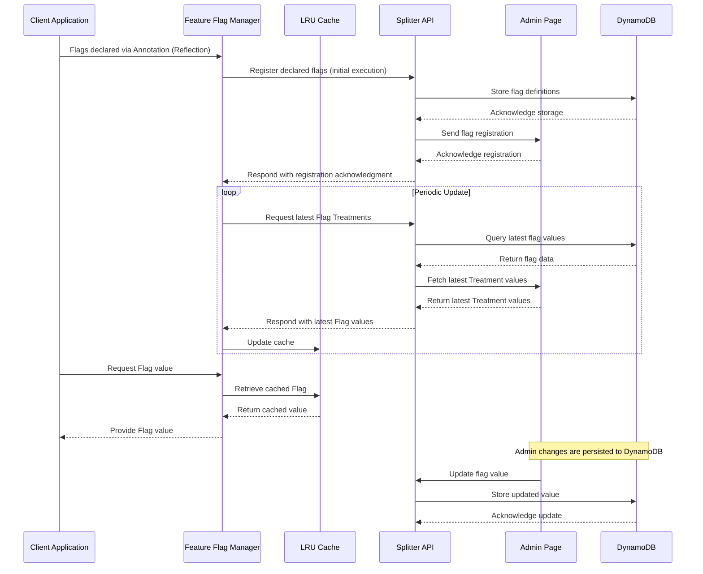
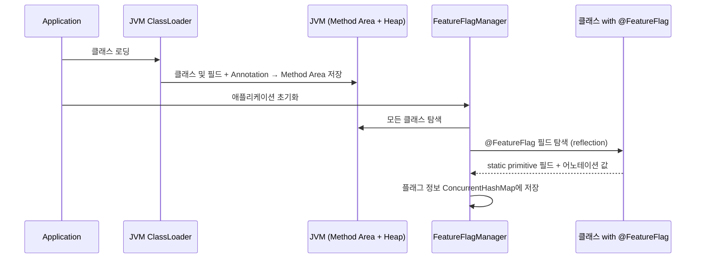
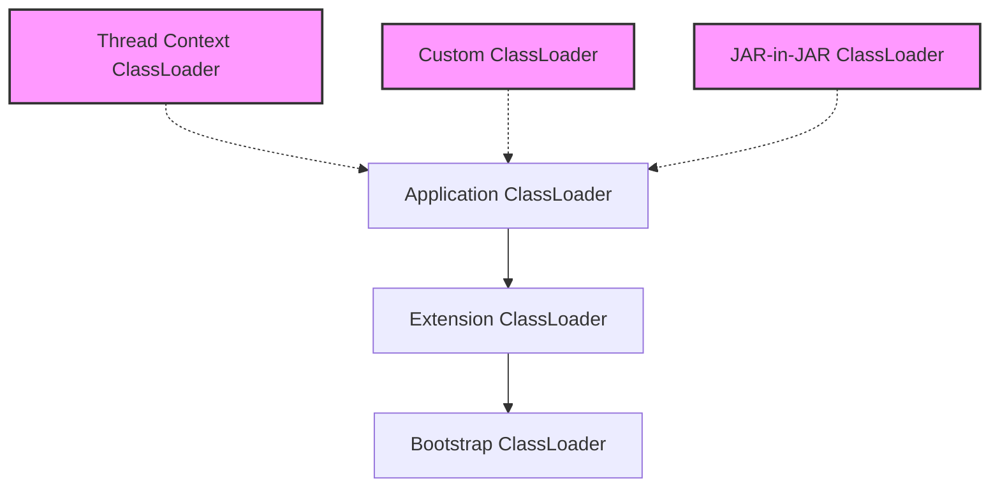

<style>
  /* Custom styles to override theme */
  .post {
    width: 100%;
    max-width: 900px;  /* 데스크톱에서의 최대 너비 */
    margin: 0 auto;
    padding: 20px;     /* 기본 패딩 */
    font-family: -apple-system, BlinkMacSystemFont, "Segoe UI", Roboto, Helvetica, Arial, sans-serif;
  }
  
  // ... existing code ...

  .mermaid {
    width: 100%;
    max-width: 400px !important;  /* 더 작은 최대 너비로 조정 */
    margin: 10px auto;
    text-align: center;
    background-color: white;
    padding: 5px;
    border-radius: 4px;
    box-shadow: 0 1px 3px rgba(0,0,0,0.1);
    overflow-x: auto;
  }
  
  .mermaid svg {
    width: auto !important;
    max-width: 350px !important;  /* SVG 최대 너비 더 축소 */
    height: auto !important;
    display: inline-block !important;
    transform: scale(0.9);  /* SVG 크기를 90%로 축소 */
    transform-origin: center center;
  }

  /* 모바일 최적화 */
  @media screen and (max-width: 767px) {
    .post {
      padding: 10px 5px;
    }
    
    .mermaid {
      padding: 2px;
      margin: 5px auto;
      max-width: 100%;
    }
    
    .mermaid svg {
      max-width: 100% !important;
      transform: scale(0.8);  /* 모바일에서는 더 작게 */
    }
  }
</style>

<!-- Mermaid configuration and initialization -->
<script src="https://cdn.jsdelivr.net/npm/mermaid@10.6.1/dist/mermaid.min.js"></script>
<script>
  document.addEventListener('DOMContentLoaded', function() {
    mermaid.initialize({
      startOnLoad: true,
      theme: 'default',
      sequence: {
        diagramMarginX: 1,
        diagramMarginY: 1,
        actorMargin: 5,           // 액터 간 마진 감소
        messageMargin: 10,
        boxMargin: 1,
        noteMargin: 1,
        boxTextMargin: 1,
        width: 200,
        height: 180,              // 전체 높이 감소
        useMaxWidth: true,
        wrap: true,
        mirrorActors: true,
        bottomMarginAdj: 1,       // 하단 여백 감소
        messageAlign: 'center',
        boxPadding: 1,
        fontSize: 11,                // 기본 폰트 크기 증가
        actorFontSize: 11,          // 액터 폰트 크기 증가
        noteFontSize: 11,           // 노트 폰트 크기 증가
        messageFontSize: 11,        // 메시지 폰트 크기 증가
        actorFontWeight: 'bold',    // 액터 텍스트 볼드 처리
        noteFontWeight: 'bold',     // 노트 텍스트 볼드 처리
        messageFontWeight: 'bold',  // 메시지 텍스트 볼드 처리
        noteTextAlignment: 'center',
        actorFontFamily: '-apple-system, BlinkMacSystemFont, "Segoe UI", Roboto, sans-serif',
        noteFontFamily: '-apple-system, BlinkMacSystemFont, "Segoe UI", Roboto, sans-serif',
        messageFontFamily: '-apple-system, BlinkMacSystemFont, "Segoe UI", Roboto, sans-serif',
        messageLineWidth: 2,        // 메시지 선 두께 증가
        actorLineWidth: 2,          // 액터 박스 선 두께 증가
        noteLineWidth: 2            // 노트 박스 선 두께 증가
      }
    });

    // 모든 Mermaid 다이어그램 강제 초기화
    document.addEventListener('DOMContentLoaded', function() {
      // 기존 다이어그램 제거
      document.querySelectorAll('.mermaid').forEach(function(el) {
        el.innerHTML = '';
      });

      // 다이어그램 다시 초기화
      mermaid.init(undefined, '.mermaid');
    });

    // Initialize all mermaid diagrams
    document.querySelectorAll('.language-mermaid').forEach(function(element) {
      const diagram = document.createElement('div');
      diagram.classList.add('mermaid');
      diagram.textContent = element.textContent;
      element.parentElement.replaceWith(diagram);
    });

    mermaid.init();
  });
</script>

## 1. Feature Flag 시스템 개요

Feature Flag(기능 플래그)는 코드를 변경하지 않고도 기능을 켜고 끌 수 있게 해주는 소프트웨어 개발 기법이다. 마치 집안의 전등 스위치처럼, 개발자는 기능의 활성화 여부를 간단히 '스위치'로 제어할 수 있다. 이 기법은 코드 배포와 기능 출시를 분리함으로써, 새로운 기능을 안전하게 테스트하고 점진적으로 사용자에게 제공할 수 있게 해준다.

시스템 개발 초기에는 Feature Flag 도입 여부를 두고 많은 고민이 있었다. 기존 배포 프로세스를 개선하자는 의견도 있었지만, 이는 여러 팀과의 협업이 필요한 큰 변화였고 당장의 문제 해결이 어려웠다. 또한 Hackle과 같은 국내 Feature Flag 솔루션 도입도 검토했으나, 회사의 특수한 요구사항과 보안 정책 등을 고려했을 때 자체 개발이 더 적합하다고 판단했다. 결국 Feature Flag 방식을 선택한 이유는 코드 배포와 기능 출시를 완전히 분리하여 비즈니스 부서가 개발팀에 의존하지 않고도 기능을 제어할 수 있게 하기 위함이었다.

## 2. 시스템 아키텍처

시스템의 데이터 흐름과 주요 컴포넌트 간의 상호작용은 다음 시퀀스 다이어그램과 같다:


*시스템의 주요 컴포넌트 간 상호작용을 보여주는 시퀀스 다이어그램*

아키텍처 설계 시 중앙집중식과 분산식 접근법을 비교했다. 중앙집중식은 모든 Flag 결정을 중앙 서버에서 처리하는 방식으로, 즉각적인 업데이트와 일관된 제어가 가능하지만 네트워크 지연과 의존성이 증가한다. 분산식은 각 클라이언트가 로컬에서 결정을 내리는 방식으로, 성능은 좋지만 상태 동기화가 어렵다.

최종적으로 하이브리드 접근법을 채택했다. 클라이언트는 로컬에서 Flag 결정을 처리하지만 주기적으로 중앙 서버와 동기화하여 분산 시스템의 성능 이점과 중앙 관리의 일관성을 균형 있게 조합했다. 이 선택은 특히 네트워크 장애 시에도 기본값으로 작동하는 견고한 시스템을 구축하는 데 중요했다.

## 3. 핵심 설계 원칙과 기술적 구현

### 3.1 Annotation 기반 관리 시스템

```java
@FeatureFlag(flagName="new-search-algorithm")
private static boolean useNewSearchAlgorithm = true;
```

이 설계는 Admin 페이지와 코드 사이의 Splitter API 네트워크 장애 시에도 기능 상태의 일관성을 보장했다. 애플리케이션 시작 시 코드 내 선언된 Flag가 실험 플랫폼에 자동 등록되었으며, 이후 실험 플랫폼에서 상태를 수정할 수 있도록 했다.

이 설계를 선택하기 전에 다음과 같은 대안들을 고려했다. 가장 중요한 요구사항은 "런타임에 코드 수정이나 재배포 없이 변수 값을 동적으로 변경할 수 있어야 한다"는 것이었다. 이 핵심 요구사항을 기준으로 다음 대안들을 평가했다:

1. **Properties 파일 기반 설정**
   - 장점: 설정 변경이 쉽고, 코드 수정 없이 값 변경 가능
   - 단점: 여전히 배포가 필요하여 런타임 변경 불가능, 코드와 설정의 불일치 가능성 존재
   - 기각 이유: 런타임 동적 변경이라는 핵심 요구사항 충족 실패

2. **데이터베이스 직접 관리**
   - 장점: 중앙 집중식 관리, 런타임에 실시간 값 변경 가능
   - 단점: 네트워크 장애 시 전체 시스템 영향, 초기 구동 시 지연
   - 기각 이유: 안정성 위험이 너무 큼

3. **REST API 기반 동적 설정**
   - 장점: 런타임에 유연한 관리와 실시간 업데이트 가능
   - 단점: 네트워크 의존성, 초기값 설정의 어려움
   - 기각 이유: 코드의 의도가 불명확하고 타입 안정성 부족

4. **인터페이스와 구현체를 통한 방식**
   - 장점: 런타임에 유연한 기능 제어 가능
   - 단점: 구조가 복잡하고 개발 시간이 오래 걸림
   - 기각 이유: MVP 단계에서는 빠르고 단순한 구현이 우선이었음

5. **환경 변수 활용**
   - 장점: 배포 환경별 구성 쉬움, 인프라 수준에서 제어 가능
   - 단점: 런타임 변경이 거의 불가능, 모니터링 및 감사 복잡
   - 기각 이유: 런타임 동적 변경이라는 핵심 요구사항 충족 실패

Annotation 방식은 이러한 대안들의 단점을 보완하면서도 다음과 같은 이점을 제공했다:
- 코드의 의도가 명확히 드러남
- 컴파일 타임 검증 가능
- IDE 지원을 통한 개발 생산성 향상
- 기본값 지정으로 안정성 확보

### 3.2 Reflection 기반 자동 등록 메커니즘

Java Reflection API를 활용하여 코드 전반에 흩어진 Feature Flag 변수를 자동으로 수집하고 관리하는 시스템을 구현했다. 구체적으로는 `Class.forName()`, `getDeclaredFields()`, `getAnnotation()` 메서드를 활용해 런타임에 `@FeatureFlag` 어노테이션이 붙은 필드들을 탐색했다. 이 과정에서 접근 제한자(private, protected)가 있는 필드도 `setAccessible(true)`를 통해 접근할 수 있도록 처리했다. 

자동 등록 메커니즘을 구현하기 위해 여러 기술적 대안을 검토했다:

1. **컴파일 타임 어노테이션 프로세싱**
   - 장점: 런타임 오버헤드 없음, 컴파일 시점 검증 가능
   - 단점: 복잡한 구현, 빌드 프로세스 변경 필요
   - 기각 이유: 구현 복잡성 및 기존 빌드 시스템과의 통합 어려움

2. **명시적 등록 API**
   - 장점: 간단한 구현, 명확한 작동 방식, 네트워크 장애 시 기본값 명시적 지정 가능
   - 단점: 개발자가 수동으로 각 Flag 등록 필요, 유지관리 부담, 기본값 설정 누락 시 장애 위험
   - 기각 이유: 사용 편의성 감소, Flag 등록 및 기본값 설정 누락 가능성 높음

3. **스프링 프레임워크 통합**
   - 장점: 기존 스프링 애플리케이션과 통합 용이, 풍부한 생태계
   - 단점: 스프링 의존성 발생, 비스프링 환경 지원 어려움
   - 기각 이유: 프레임워크 중립성 손상, 레거시 시스템 지원 제한

Reflection 기반 접근법은 이러한 대안들과 비교했을 때 가장 균형 잡힌 선택이었다. 런타임에 약간의 오버헤드가 있지만, 개발자 경험을 최우선으로 고려했을 때 코드에 어노테이션만 추가하면 되는 간편함이 큰 장점이었다. 또한 프레임워크 의존성 없이 순수 Java로 구현함으로써 어떤 환경에서도 사용 가능한 SDK를 만들 수 있었다.

중요한 제약사항으로, Feature Flag 필드는 반드시 `static`으로 선언해야 했다. 이는 Reflection API의 특성 때문인데, 인스턴스 필드의 경우 해당 클래스의 인스턴스가 필요하지만, 스캔 시점에는 이 인스턴스를 생성할 방법이 없기 때문이다. 반면 `static` 필드는 클래스 로딩 시점에 메모리에 할당되므로 인스턴스 없이도 접근 및 수정이 가능하다. 이 제약은 개발자들에게 명확히 안내되었으며, 가이드라인 문서에도 강조되었다.

```java
// 올바른 사용법 - static 필드
@FeatureFlag(flagName = "new-search-algorithm", defaultValue = false)
public static boolean useNewSearchAlgorithm = false;

// 잘못된 사용법 - 인스턴스 필드 (작동하지 않음)
@FeatureFlag(flagName = "premium-feature", defaultValue = false)
private boolean premiumFeatureEnabled = false;
```

또한 클래스 로더 계층 구조를 고려하여 애플리케이션의 모든 패키지를 스캔하는 재귀적 알고리즘을 구현했고, 성능 최적화를 위해 스캔 대상 패키지를 설정할 수 있는 필터링 메커니즘도 추가했다. 이렇게 수집된 Feature Flag 정보는 ConcurrentHashMap을 사용해 스레드 안전하게 관리했으며, 주기적으로 백엔드 서버와 동기화되도록 ScheduledExecutorService를 구성했다.

주기적 업데이트 방식을 선택한 것도 신중한 고려 끝에 내린 결정이었다. WebSocket(양방향 실시간 통신)이나 Server-Sent Events(서버에서 클라이언트로의 단방향 실시간 통신)를 통한 실시간 업데이트도 고려했지만, 연결 유지에 따른 서버 부하와 네트워크 비용이 우려되어 채택하지 않았다. WebSocket은 실시간 채팅처럼 양방향 통신이 필요한 경우에 적합하고, Server-Sent Events는 실시간 알림처럼 서버에서 클라이언트로의 푸시 알림이 필요한 경우에 적합하다. 실시간 업데이트 대신 주기적 업데이트를 선택한 이유는 다음과 같다:

1. **서버 부하 감소**: 수많은 클라이언트의 실시간 연결 대신 주기적 업데이트를 통해 서버 리소스를 효율적으로 관리할 수 있다. 특히 수천 개의 서비스 인스턴스가 동시에 연결을 유지하는 상황을 피할 수 있었다.

2. **네트워크 효율성**: 여러 변경사항을 모아서 배치로 처리함으로써 네트워크 트래픽을 최적화할 수 있다. 실시간 전파는 각각의 작은 변경에도 즉시 통신이 발생하는 반면, 주기적 업데이트는 여러 변경을 한 번에 처리할 수 있다.

3. **장애 복원력**: 일시적인 네트워크 문제나 서버 장애 시에도 다음 주기에 자연스럽게 복구된다. 실시간 연결 방식은 연결 끊김 시 즉각적인 재연결 로직이 필요하지만, 주기적 업데이트는 이러한 복잡성을 피할 수 있다.

4. **구현 단순성**: 실시간 업데이트는 연결 관리, 재시도 로직, 장애 복구 등 복잡한 구현이 필요한 반면, 주기적 업데이트는 단순한 HTTP 요청만으로 구현이 가능하다.

5. **캐시 활용**: 업데이트 주기 사이에는 로컬 캐시를 활용하여 빠른 응답시간을 보장할 수 있다. 대부분의 Flag 값은 자주 변경되지 않는다는 점을 고려할 때, 이는 실용적인 접근이었다.

이러한 설계를 통해 개발자들은 코드에 어노테이션만 추가하면 자동으로 시스템에 등록되어 관리되는 편리함을 제공할 수 있었다. XML 기반 설정이나 프로그래밍 방식의 등록도 고려했지만, 코드와 설정이 분리되어 관리가 어려워질 수 있다는 단점 때문에 어노테이션 방식을 선택했다. 특히 LRU 캐시를 도입한 것은 시스템의 성능을 크게 향상시켰는데, Redis나 Memcached 같은 외부 캐시 시스템도 검토했지만 추가적인 인프라 관리 부담을 줄이기 위해 인메모리 캐시로 결정했다. 이는 다음과 같은 이점을 가져왔다:

### 3.3 싱글톤 패턴과 스레드 안전성 확보

Feature Flag Manager는 싱글톤 패턴으로 구현하여 애플리케이션 전체에서 하나의 인스턴스만 존재하도록 설계했다. 싱글톤 패턴을 적용한 명확한 이유는 다음과 같다:

1. **일관된 상태 관리**: Feature Flag의 상태는 애플리케이션 전체에서 일관되게 유지되어야 한다. 여러 인스턴스가 존재할 경우 각각 다른 상태를 가질 수 있어 예측 불가능한 동작이 발생할 위험이 있다.

2. **리소스 효율성**: Flag 정보를 주기적으로 백엔드 서버와 동기화하는 과정에서 네트워크 요청과 메모리 사용이 발생한다. 여러 인스턴스가 각각 동기화를 수행한다면 불필요한 리소스 낭비가 발생할 수 있다.

3. **캐시 효율성 극대화**: LRU 캐시를 통해 Flag 값 조회 성능을 최적화했는데, 여러 인스턴스가 각자의 캐시를 관리한다면 캐시 히트율이 떨어져 성능 이점이 감소한다.

4. **중앙화된 로깅과 모니터링**: 모든 Flag 조회와 변경 이벤트를 단일 지점에서 추적하고 로깅함으로써 디버깅과 모니터링이 용이해진다.

### 3.4 동시성 제어를 위한 고민

학부 운영체제 수업에서 Lock을 배웠지만, 실제 프로덕션 환경에서 동시성 제어를 구현하는 것은 처음이었다. 특히 여러 서버에서 동시에 Feature Flag 값을 읽고 쓰는 상황에서 데이터 일관성을 어떻게 보장할지 고민이 컸다. 시니어 엔지니어들과 논의를 통해 여러 방안을 검토했는데, 결국 복잡한 커스텀 락 메커니즘보다는 Java에서 제공하는 `ConcurrentHashMap`을 활용하기로 결정했다.

이 결정의 핵심에는 "최대한 심플하게 구성하라"는 시니어 엔지니어의 조언이 있었다. 특히 여러 팀이 사용하는 공통 SDK에서는 단순성이 매우 중요한 원칙이었다. 복잡한 동시성 제어 로직은 버그 발생 가능성을 높이고 디버깅을 어렵게 만들 수 있기 때문에, 검증된 라이브러리의 기능을 최대한 활용하는 것이 더 안정적이고 유지보수하기 쉽다는 결론에 도달했다.

이러한 결정을 내린 구체적인 이유는 다음과 같다:

1. **성능 최적화**: 명시적인 락은 모든 읽기/쓰기 작업에 대해 동기화를 강제하여 성능 저하를 일으킬 수 있다. Feature Flag 시스템은 읽기 작업이 압도적으로 많은 특성을 가지고 있어, 읽기 작업에 락을 사용하면 불필요한 병목 현상이 발생할 수 있다.

2. **세밀한 동시성 제어**: `ConcurrentHashMap`은 내부적으로 세그먼트 단위의 락을 사용하여 다른 키에 대한 동시 접근을 허용한다. 이는 여러 Flag에 대한 동시 접근 시 전체 맵에 락을 거는 것보다 훨씬 효율적이다.

3. **코드 복잡성 감소**: 명시적인 락 메커니즘을 구현하려면 읽기/쓰기 락, 데드락 방지 등 복잡한 동시성 제어 로직이 필요하다. `ConcurrentHashMap`을 사용함으로써 이러한 복잡성을 크게 줄일 수 있었다.

4. **원자적 연산 지원**: `ConcurrentHashMap`은 `putIfAbsent`, `computeIfAbsent` 등의 원자적 연산을 제공하여 락 없이도 안전한 업데이트가 가능하다.

동시성 관리를 위한 다른 대안들도 검토했다:

1. **Synchronized Collections**
   ```java
   Map<String, FeatureFlag> flagRegistry = Collections.synchronizedMap(new HashMap<>());
   ```
   - 장점: 구현 간단, Java 표준 라이브러리 활용
   - 단점: 메서드 호출마다 전체 컬렉션에 락 적용, 확장성 제한
   - 기각 이유: 읽기 작업이 많은 시스템에서 성능 병목 현상 발생

2. **ReentrantReadWriteLock**
   ```java
   private final Map<String, FeatureFlag> flagRegistry = new HashMap<>();
   private final ReadWriteLock rwLock = new ReentrantReadWriteLock();
   
   public FeatureFlag getFlag(String name) {
       rwLock.readLock().lock();
       try {
           return flagRegistry.get(name);
       } finally {
           rwLock.readLock().unlock();
       }
   }
   
   public void updateFlag(String name, FeatureFlag flag) {
       rwLock.writeLock().lock();
       try {
           flagRegistry.put(name, flag);
       } finally {
           rwLock.writeLock().unlock();
       }
   }
   ```
   - 장점: 읽기/쓰기 작업 구분, 읽기 작업 동시성 향상
   - 단점: 코드 복잡성 증가, 락 획득/해제 관리 필요
   - 기각 이유: 명시적 락 관리의 복잡성과 오류 가능성

이러한 대안들을 검토한 결과, `ConcurrentHashMap`은 성능과 코드 단순성을 최적으로 균형 잡는 선택이었다. 특히 Java 5부터 제공되는 안정적인 API로, 다양한 환경에서 호환성이 보장되고 잘 검증된 구현체라는 장점이 있었다. 실제 성능 테스트에서도 읽기 작업이 많은 우리 시스템에서 가장 좋은 결과를 보여주었다.

`ConcurrentHashMap`의 주요 특징을 요약하자면:

- **분할 락(Segmented Locking)**: 맵 전체가 아닌 일부 세그먼트에만 락을 적용하여 동시성 성능 향상
- **락 스트라이핑(Lock Striping)**: 여러 개의 락을 사용하여 다른 버킷에 대한 동시 접근 허용
- **비차단 읽기(Non-blocking Reads)**: 읽기 작업은 락을 획득하지 않고 수행되어 높은 처리량 제공
- **약한 일관성(Weak Consistency)**: 완전한 동기화 대신 실용적인 일관성 모델 채택
- **원자적 연산**: `putIfAbsent()`, `replace()` 등 복합 연산의 원자성 보장

검증된 동시성 컬렉션을 활용하는 것이 더 안정적이고 유지보수하기 쉽다는 결론에 도달했다. "최대한 심플하게 구성하라"는 조언이 가장 큰 영향을 미쳤는데, 이는 특히 여러 팀이 사용하는 공통 SDK에서 중요한 원칙이었다. 복잡한 동시성 제어 로직은 버그 발생 가능성을 높이고 디버깅을 어렵게 만들 수 있기 때문에, 검증된 라이브러리의 기능을 최대한 활용하는 방향으로 설계했다.

## 4. 기술 스택 상세

### 4.1 코어 SDK: Java 8 (Vanilla Java)
Java 8을 선택한 이유는 회사의 기존 코드베이스와의 호환성도 있었지만, 더 중요한 것은 SDK의 확장성과 유지보수성이었다. 프레임워크 의존성이 가져올 수 있는 문제점을 고민했다. Spring과 같은 프레임워크를 사용할 경우 버전 충돌이 발생할 수 있고, 사용자들이 SDK를 도입할 때 추가적인 설정이 필요해질 수 있다고 판단했다. 순수 Java만으로 구현함으로써 어떤 환경에서도 쉽게 통합될 수 있는 유연성을 확보했고, 이는 실제로 레거시 시스템에서도 문제없이 작동하는 결과로 이어졌다. 특히 Reflection API를 활용한 어노테이션 처리 부분에서는 외부 라이브러리 없이 직접 구현하는 과정이 도전적이었지만, 이를 통해 Java의 메타프로그래밍 기능에 대한 이해도를 크게 높일 수 있었다.

SDK 구현 시 고려했던 다른 기술 스택 대안들은 다음과 같다:

1. **Kotlin**
   - 장점: 간결한 문법, Null 안전성, 함수형 프로그래밍 지원
   - 단점: 추가 의존성, 일부 개발자에게 생소함, 학습 곡선
   - 기각 이유: 모든 팀원이 Java에 익숙했고, 추가 언어 도입으로 인한 복잡성 증가 우려

2. **Scala**
   - 장점: 함수형 프로그래밍, 타입 안전성, 강력한 표현력
   - 단점: 높은 학습 곡선, 복잡한 문법, 빌드 시간 증가
   - 기각 이유: 팀 내 전문성 부족, 통합 및 유지보수 어려움

3. **Spring Framework 기반**
   - 장점: 풍부한 기능, 의존성 주입, 관점 지향 프로그래밍
   - 단점: 무거운 의존성, 버전 충돌 가능성, 오버헤드
   - 기각 이유: 경량화 목표와 상충, 프레임워크 중립성 손상

4. **Java EE/Jakarta EE**
   - 장점: 표준화된 API, 엔터프라이즈 기능 포함
   - 단점: 복잡한 구성, 무거운 서버 요구, 유연성 제한
   - 기각 이유: 마이크로서비스 환경에 과도한 기능, 가벼운 SDK 목표와 불일치

자바 버전 선택에 있어서도 여러 옵션을 비교했다:

1. **Java 7**
   - 장점: 광범위한 호환성, 성숙한 생태계
   - 단점: 제한된 기능, 이미 지원 종료
   - 기각 이유: 람다식, 스트림 API 등 Java 8의 유용한 기능 부재

2. **Java 11 이상**
   - 장점: 최신 기능, 모듈 시스템, 향상된 성능
   - 단점: 일부 레거시 시스템과 호환성 이슈
   - 기각 이유: 회사 내 일부 시스템이 아직 Java 8 기반으로 운영 중

결과적으로 Java 8은 새로운 기능(람다, 스트림, Optional 등)과 광범위한 호환성 사이의 최적의 균형점이었다. 이 선택은 SDK의 주요 목표인 "어디서나 쉽게 통합 가능한 경량 라이브러리" 제공에 부합했으며, 코드 가독성과 유지보수성을 높이는 데도 기여했다.

### 4.2 인프라: Kubernetes on AWS EKS
Feature Flag 시스템을 위한 별도의 인프라를 구축하지 않고, 회사에 이미 구축되어 있던 실험 분기 API에 새로운 엔드포인트를 추가하는 방식으로 개발했다. 이 접근 방식은 빠른 개발과 배포를 가능하게 했지만, 지금 돌이켜보면 독립적인 서비스로 분리했어야 했다는 아쉬움이 남는다. 기존 API에 기능을 추가하면서 Flag 값 변경이 모든 클라이언트에 빠르게 전파되어야 한다는 요구사항을 충족시키기 위해 캐싱 전략과 업데이트 메커니즘을 최적화했다. 이 과정에서 API 설계와 확장성에 대한 중요한 교훈을 얻었으며, 향후에는 처음부터 독립적인 마이크로서비스로 설계하여 Feature Flag 시스템만의 특성에 맞게 최적화된 인프라를 구축하는 것이 더 나은 선택이었을 것이다.

인프라 구성에서 고려했던 대안들은 다음과 같다:

1. **독립형 Feature Flag 서비스**
   - 장점: 전용 리소스, 독립적 확장성, 최적화된 설계
   - 단점: 추가 인프라 관리 부담, 개발 시간 증가
   - 기각 이유: 빠른 출시 요구사항과 초기 리소스 제약

2. **AWS Lambda 기반 서버리스 아키텍처**
   - 장점: 관리 오버헤드 감소, 자동 확장, 사용량 기반 비용
   - 단점: 콜드 스타트 지연, 장기 실행 연결 제한, 디버깅 어려움
   - 기각 이유: 지속적 연결 및 상태 관리 요구사항과의 불일치

3. **다중 리전 배포**
   - 장점: 지역적 지연 감소, 고가용성, 재해 복구
   - 단점: 복잡한 데이터 동기화, 비용 증가, 관리 복잡성
   - 기각 이유: 초기 단계에서의 과도한 복잡성, 명확한 지역적 요구사항 부재

4. **하이브리드 클라우드 접근법**
   - 장점: 온프레미스와 클라우드 환경 모두 지원, 유연한 배포
   - 단점: 환경 간 일관성 유지 어려움, 관리 복잡성
   - 기각 이유: 추가 복잡성 대비 명확한 이점 부족

실험 분기 API에 통합하는 방식을 선택한 것은 주로 시간 제약과 실용적 고려 때문이었다. 하지만 이상적으로는 독립형 마이크로서비스로 구축하여 다음과 같은 이점을 얻을 수 있었을 것이다:

- 전용 리소스를 통한 성능 최적화
- 독립적인 확장 및 배포 주기
- 더 명확한 책임 분리와 관리
- Feature Flag 특화 기능 추가 용이성

이러한 경험은 향후 프로젝트에서 초기 아키텍처 결정의 중요성과 장기적 확장성을 더 신중하게 고려해야 함을 깨닫게 했다.

### 4.3 배포: Jib & Jenkins
배포 과정에서 가장 큰 고민은 빌드 시간 단축과 안정적인 배포 파이프라인 구축이었다. 기존 Docker 기반 배포에서는 매번 전체 이미지를 다시 빌드하는 비효율이 있었고, 이로 인해 작은 코드 변경에도 배포 시간이 길어지는 문제가 있었다. Jib을 도입함으로써 변경된 클래스 파일만 효율적으로 업데이트하는 방식으로 빌드 시간을 크게 단축할 수 있었다. 또한 Jenkins 파이프라인을 구성하면서 단순 자동화를 넘어 각 단계별 검증 과정을 추가했다. 특히 단위 테스트를 실행하고, 코드 커버리지가 일정 수준 이상일 때만 배포가 진행되도록 설정했다. 이 과정에서 CI/CD 파이프라인의 중요성과 테스트 자동화의 가치를 실감할 수 있었다.

배포 전략에 있어 여러 대안을 검토했다:

1. **전통적인 Dockerfile 기반 빌드**
   - 장점: 익숙한 방식, 세부 설정 가능, 광범위한 사용 사례
   - 단점: 느린 빌드 시간, 레이어 캐싱 최적화 어려움
   - 기각 이유: 빌드 시간 개선 요구 충족 실패, 반복적인 전체 재빌드 필요

2. **GitLab CI/CD**
   - 장점: 코드 저장소와 통합, 선언적 파이프라인, 현대적 UI
   - 단점: 기존 Jenkins 투자와 익숙함 포기 필요
   - 기각 이유: 팀의 Jenkins 경험과 기존 파이프라인 자산 활용 선호

3. **GitHub Actions**
   - 장점: 간편한 설정, 코드 저장소 통합, 풍부한 마켓플레이스
   - 단점: 온프레미스 제어 제한, 회사 Github Enterprise와의 호환성 이슈
   - 기각 이유: 회사 내 GitHub 도입 수준 및 기존 시스템과의 통합 문제

4. **Spinnaker를 통한 고급 배포**
   - 장점: 정교한 배포 전략, 멀티 클라우드 지원, 카나리 배포
   - 단점: 복잡한 설정, 학습 곡선, 관리 오버헤드
   - 기각 이유: 시스템 복잡성 대비 현재 요구사항 불일치

Jib과 Jenkins의 조합을 선택한 주요 이유:

1. **Jib의 장점**:
   - 변경된 레이어만 빌드하여 빌드 시간 대폭 단축 (기존 3-5분에서 30초 이내로 개선)
   - Docker 데몬 불필요, 클라우드 빌드 환경에서도 원활한 동작
   - 멀티스테이지 빌드 자동화로 이미지 사이즈 최적화
   - Maven/Gradle과의 원활한 통합

2. **Jenkins의 장점**:
   - 기존 회사 인프라와의 통합성
   - 풍부한 플러그인 생태계와 확장성
   - 세밀한 권한 관리와 감사 기능
   - 회사 개발자들의 높은 친숙도

이 조합은 빠른 빌드와 안정적인 파이프라인이라는 두 가지 목표를 모두 달성하는 최적의 솔루션이었다. 특히 배포 자동화와 품질 게이트(코드 커버리지, 정적 분석 등)를 통합함으로써 개발자들이 코드 품질에 더 집중할 수 있는 환경을 조성했다.

### 4.4 데이터 저장소: AWS DynamoDB
데이터 저장소 선택에서 가장 큰 고민은 SQL과 NoSQL 중 어떤 것을 사용할지였다. SQL은 스키마 변경이 어렵고 확장성이 제한적이지만 데이터 일관성과 트랜잭션 지원이 강점이었다. NoSQL은 유연한 스키마와 수평적 확장이 용이하지만 강력한 일관성 보장이 어려웠다. 결국 NoSQL 중에서도 DynamoDB를 선택했는데, 이는 회사 인프라팀에서 이미 DynamoDB를 지원하고 있었기 때문이다. 이를 통해 운영 부담을 크게 줄일 수 있었고, 특히 Flag 값 조회 API가 서비스의 핵심 로직 실행 전에 호출되는 만큼 안정적인 운영이 가능했다.

데이터 저장소 선택 시 고려했던 대안들은 다음과 같다:

1. **PostgreSQL/MySQL**
   - 장점: 강력한 트랜잭션, ACID 준수, SQL 표준 지원, 복잡한 쿼리 가능
   - 단점: 수평적 확장 어려움, 스키마 변경의 복잡성, 높은 초기 설정 비용
   - 기각 이유: Feature Flag 데이터 모델의 단순성과 높은 읽기 처리량 요구사항에 과도한 솔루션

2. **MongoDB**
   - 장점: 문서 지향 모델, 유연한 스키마, 개발자 친화적 API
   - 단점: 일관성 모델 약함, 복잡한 샤딩 설정, 운영 복잡성
   - 기각 이유: 회사 내 MongoDB 운영 경험 부족, 관리 오버헤드 우려

3. **Redis**
   - 장점: 극도로 빠른 읽기/쓰기, 인메모리 저장소, 단순한 API
   - 단점: 영구 저장 제한, 메모리 제약, 복잡한 쿼리 지원 부족
   - 기각 이유: 영구 데이터 저장 요구사항과의 불일치, 데이터 모델 표현의 제한

4. **Cassandra**
   - 장점: 선형적 확장성, 고가용성, 튜닝 가능한 일관성 모델
   - 단점: 복잡한 설정 및 관리, 학습 곡선, 쿼리 패턴 제한
   - 기각 이유: 시스템 복잡성 대비 현재 규모 요구사항 불균형, 운영 전문성 부족

DynamoDB를 선택한 핵심 이유:

1. **관리 부담 최소화**: AWS 관리형 서비스로 운영 오버헤드 최소화
2. **자동 확장성**: 읽기/쓰기 용량의 자동 조정으로 트래픽 변동 대응
3. **비용 효율성**: 프로비저닝 모드와 온디맨드 모드의 유연한 선택
4. **높은 성능**: 일관된 밀리초 단위 응답 시간 보장
5. **기존 인프라 활용**: 회사 내 DynamoDB 경험과 운영 지원 활용

특히 Feature Flag 시스템의 데이터 액세스 패턴이 단순하고 예측 가능했기 때문에(주로 키 기반 조회), DynamoDB의 키-값 저장소 모델이 이상적이었다. 복잡한 관계형 쿼리가 거의 필요하지 않았고, 읽기 작업이 압도적으로 많은 워크로드 특성상 DynamoDB의 읽기 확장성과 캐싱 기능이 큰 이점이었다.

코드 내에서 DynamoDB를 연결하고, 특히 unit test에서 local DynamoDB로 테스트 환경 구축하는게 꽤 어려웠지만, 이 과정에서 많은 것을 배울 수 있었다. (이 부분은 feature flag 자체가 아니라, 실험 플랫폼인 admin 페이지와 연결된 API에서 구현한 것이다.) AWS SDK를 사용해 DynamoDB 클라이언트를 구성하고, 테스트 환경에서는 DynamoDBLocal 라이브러리를 활용해 인메모리 데이터베이스를 구축했다. 특히 테스트 코드에서 DynamoDB 테이블을 자동으로 생성하고 삭제하는 과정을 JUnit의 @Before, @After 어노테이션을 활용해 구현했는데, 이 부분이 가장 까다로웠다. 테스트 환경에서 실제 AWS 리소스를 사용하지 않고도 DynamoDB 기능을 테스트할 수 있게 된 것은 큰 성과였다.

## 5. 시스템 활용

### 5.1 엔드포인트 목록
Feature Flag 시스템은 다음과 같은 RESTful API 엔드포인트를 제공한다:

- `GET /feature-flags`: 모든 Feature Flag 목록 조회
- `PUT /feature-flags/{flagName}`: 특정 Feature Flag 생성 또는 수정
- `DELETE /feature-flags/{flagName}`: 특정 Feature Flag 삭제

API 설계 시 다음과 같은 대안적 접근법을 검토했다:

1. **gRPC 기반 API**
   - 장점: Protocol Buffer의 효율적인 직렬화, 강력한 타입 시스템, 양방향 스트리밍을 통한 실시간 업데이트 지원
   - 단점: HTTP 도구와의 호환성 부족, 높은 학습 곡선, 브라우저 네이티브 지원 미흡
   - 기각 이유: REST API의 범용성과 단순함, 기존 인프라와의 통합 용이성을 더 중요하게 판단

여담으로, Node.js 클라이언트 개발 과정에서 Protocol Buffer 스키마를 정의하면서 gRPC로의 전환을 재검토했다. 하지만 기존 시스템의 복잡도와 마이그레이션에 필요한 리소스를 고려했을 때 현실적인 제약이 있었다. 이는 초기 설계 단계에서 확장성을 충분히 고려하지 못한 결과였다.

그래도 최종적으로 선택한 RESTful API는 다음과 같은 명확한 이점을 제공했다:

- 단순하고 직관적인 리소스 중심 설계
- 기존 HTTP 캐싱과 로드밸런싱 활용 가능
- 풍부한 개발 도구와 디버깅 환경
- 모든 주요 프로그래밍 언어의 클라이언트 지원

### 5.2 SDK 통합 코드

#### 호출 예시
```java
FeatureFlagManager manager = FeatureFlagManager.builder()
                .setPackageNames(new String[]{"your.package.names"})
                .setEnvironment(ExpEnv.QA)
                .setClassLoader(classLoader)
                .build();
```

#### 선언 예시
```java
@FeatureFlag(flagName = "Test2")
public static int privateField = 3;
```

SDK 설계 시 고려했던 대안적 접근법:

1. **메서드 체이닝 패턴**
   ```java
   FeatureFlagManager manager = FeatureFlagManager.getInstance()
       .withPackages("your.package.names")
       .withEnvironment(ExpEnv.QA)
       .withClassLoader(classLoader)
       .build();
   ```
   - 장점: 유연한 구성, 가독성 좋음, 점진적 구성 가능
   - 단점: 중간 객체가 변경 가능한 상태를 가짐, 스레드 안전성 보장 어려움
   - 빌더 패턴과의 차이점: 빌더는 별도의 Builder 클래스를 통해 객체를 생성하여 원본 객체의 불변성을 보장하고, 필수값 검증이 용이함. 반면 메서드 체이닝은 자기 자신을 반환하여 상태를 직접 변경하므로 객체의 일관성을 유지하기 어려움

2. **팩토리 메서드 패턴**
   ```java
   FeatureFlagManager manager = FeatureFlagManagerFactory.create(
       "your.package.names", ExpEnv.QA, classLoader);
   ```
   - 장점: 단순한 인터페이스, 구현 세부사항 숨김
   - 단점: 구성 옵션 확장성 제한, 가독성 저하 가능성
   - 복잡한 설정 옵션을 지원하기에 제한적인 접근법

3. **정적 구성 클래스**
   ```java
   FeatureFlagConfig.setPackageNames("your.package.names");
   FeatureFlagConfig.setEnvironment(ExpEnv.QA);
   FeatureFlagConfig.setClassLoader(classLoader);
   FeatureFlagManager manager = FeatureFlagManager.getInstance();
   ```
   - 장점: 익숙한 접근법, 분리된 구성
   - 단점: 글로벌 상태 의존, 멀티테넌시 어려움, 테스트 복잡성
   - 여러 구성을 동시에 지원해야 하는 요구사항과 충돌

빌더 패턴을 선택한 이유:

- 명확하고 가독성 높은 API 디자인
- 필수 및 선택적 매개변수 구분 용이
- 객체 생성 과정의 유연성과 제어성
- 불변 객체 생성 지원으로 스레드 안전성 향상
- 자바 개발자에게 익숙한 디자인 패턴

## 6. Feature Flag 시스템의 내부 동작 원리

Feature Flag 시스템의 핵심 동작 원리를 JVM 메모리 관리 관점에서 살펴보자. 이 시스템은 Java의 기본 기능들을 효과적으로 활용하여 간결하면서도 강력한 동적 기능 제어 메커니즘을 구현했다.

### 6.1 시스템 구성 및 목적

**목적**
- 기능별 ON/OFF 상태를 동적으로 관리하고,
- 배포 없이 플래그 값을 변경할 수 있는 유연한 런타임 Feature Toggle 시스템 구축

**핵심 구성 요소**

| 구성요소 | 설명 |
|---------|------|
| `@FeatureFlag` | static primitive 필드에 부착되어, 해당 필드가 기능 플래그임을 선언 |
| `FeatureFlagManager` | 애플리케이션 시작 시, reflection을 통해 모든 플래그 수집 및 초기화 |
| `ConcurrentHashMap<String, FlagMeta>` | 모든 플래그 상태 및 메타데이터를 저장하는 중앙 저장소 |
| `public static boolean useNewSearchAlgorithm` | JVM Method Area에 저장되며, 런타임에 값 변경 가능 |

### 6.2 선언 방식 예시

```java
@FeatureFlag(flagName = "new-search-algorithm")
public static boolean useNewSearchAlgorithm = false;

@FeatureFlag(flagName = "max-search-results")
public static int maxSearchResults = 100;

@FeatureFlag(flagName = "search-boost-factor")
public static double boostFactor = 1.5;
```

- 해당 필드는 런타임에 값을 바꿀 수 있다(`final`이 아님)
- 다양한 primitive 타입(boolean, int, long, double 등)을 지원한다
- `@FeatureFlag`가 부착되어 있으면, 애플리케이션 시작 시 `FeatureFlagManager`가 이를 인식한다

### 6.3 Primitive 타입을 사용하는 이유

시스템 설계 시 primitive 타입을 사용한 이유는 다음과 같다:

1. **메모리 효율성**: primitive 타입은 객체가 아니므로 참조 오버헤드가 없다. 특히 boolean은 단 1바이트만 차지하여 메모리 사용이 매우 효율적이다.

2. **성능 최적화**: 객체 래퍼(Boolean, Integer 등)와 달리 primitive 타입은 박싱/언박싱 과정이 없어 성능이 더 뛰어나다. 자주 접근되는 Flag 값은 이러한 성능 차이가 중요하다.

3. **타입 안전성**: 각 플래그마다 명확한 타입을 지정함으로써 컴파일 타임에 타입 검사가 가능하다. 이는 런타임 오류 가능성을 줄인다.

4. **간결한 사용성**: 개발자가 별도의 변환 과정 없이 자연스럽게 사용할 수 있다.
   ```java
   if (useNewSearchAlgorithm) {
       // 새 알고리즘 사용
   }
   ```

5. **다양한 설정 지원**: boolean 외에도 int, double 등을 지원함으로써 단순한 on/off 토글을 넘어 다양한 설정값을 제어할 수 있다.
   ```java
   // 검색 결과 수 제한 적용
   List<Result> results = search(query).limit(maxSearchResults);
   ```

객체 타입(String, 사용자 정의 클래스 등) 대신 primitive 타입만 지원한 것은 아래와 같은 고려 때문이었다:

1. **리플렉션 최적화**: primitive 타입은 리플렉션을 통한 값 설정이 단순하고 직접적이다.

2. **직렬화 용이성**: 백엔드 시스템과 통신 시 primitive 타입은 직렬화/역직렬화가 간단하다.

3. **설계 단순화**: 복잡한 객체 타입을 지원하면 값의 불변성, 깊은 복사 등 추가적인 고려사항이 생기므로, MVP 단계에서는 primitive 타입만 지원하는 것이 합리적이었다.

### 6.4 전체 동작 흐름: 서비스 시작 시점



| 항목 | 예시 | JVM 저장 위치 |
|-----|------|--------------|
| static primitive 필드 | useNewSearchAlgorithm, maxSearchResults | Method Area (필드 참조) + 값은 Heap 내부 primitive |
| Annotation 메타데이터 | @FeatureFlag(...) | Method Area (클래스 메타정보로 저장됨) |
| ConcurrentHashMap | Map<String, FlagMeta> | Heap (런타임 상태 저장) |
| 리플렉션 조회 시 참조 객체 | Field, Annotation | Heap (reflection 시 생성되는 객체들) |

### 6.5 FeatureFlagManager의 동작 방식 (예시 코드 기반)

```java
public class FeatureFlagManager {
    private static final ConcurrentHashMap<String, FlagMeta> flags = new ConcurrentHashMap<>();

    public static void initializeFlags(Class<?>... classesToScan) {
        for (Class<?> clazz : classesToScan) {
            for (Field field : clazz.getDeclaredFields()) {
                if (field.isAnnotationPresent(FeatureFlag.class)) {
                    FeatureFlag annotation = field.getAnnotation(FeatureFlag.class);
                    String flagName = annotation.flagName();

                    field.setAccessible(true);
                    try {
                        // 필드 타입에 따라 다르게 처리
                        Object value = field.get(null);  // static 필드
                        flags.put(flagName, new FlagMeta(field, value, annotation));
                    } catch (Exception e) {
                        throw new RuntimeException(e);
                    }
                }
            }
        }
    }

    public static <T> T getFlag(String flagName, T defaultValue) {
        FlagMeta meta = flags.get(flagName);
        if (meta != null) {
            try {
                @SuppressWarnings("unchecked")
                T value = (T) meta.value;
                return value;
            } catch (ClassCastException e) {
                logger.error("Type mismatch for flag: " + flagName, e);
                return defaultValue;
            }
        }
        return defaultValue;
    }

    public static <T> void setFlag(String flagName, T value) {
        FlagMeta meta = flags.get(flagName);
        if (meta != null && meta.field.getType().isAssignableFrom(value.getClass())) {
            try {
                meta.field.set(null, value);  // static 필드 갱신
                meta.value = value;
            } catch (Exception e) {
                throw new RuntimeException(e);
            }
        }
    }

    static class FlagMeta {
        final Field field;
        final FeatureFlag annotation;
        volatile Object value;

        FlagMeta(Field field, Object value, FeatureFlag annotation) {
            this.field = field;
            this.value = value;
            this.annotation = annotation;
        }
    }
}
```

### 6.6 핵심 기술 요소 설명

**Annotation + Reflection**
- `@FeatureFlag` 메타정보는 `.class` 파일에 저장되고 JVM 로딩 시 Method Area에 올라간다
- `clazz.getDeclaredFields()` → 클래스의 모든 필드를 가져온다
- `field.getAnnotation(...)` → 해당 필드에 붙은 어노테이션을 Heap에서 객체로 생성하여 반환한다

**static primitive 필드**
- `static` → 클래스 단위로 공유된다
- `primitive` → 가볍고 효율적인 메모리 사용
- `field.set(null, value)` → 런타임에 해당 static 필드 값을 변경 가능하다
  (인스턴스가 없으므로 첫 인자에 null)

**ConcurrentHashMap**
- Heap에 저장되어 GC 대상이 된다
- 다수의 스레드에서 플래그를 읽고 쓸 수 있다 (Thread-safe)
- Map의 키는 어노테이션의 flagName, 값은 메타정보를 담은 래퍼 객체 FlagMeta이다

### 6.7 시스템의 장점

| 항목 | 설명 |
|-----|------|
| 초경량 플래그 시스템 | 불필요한 라이브러리나 Config 서버 없이 순수 Java로 구현 가능 |
| 런타임 제어 가능 | 서비스 재배포 없이 동적으로 플래그 값을 변경할 수 있음 |
| 다양한 타입 지원 | boolean 뿐만 아니라 int, long, double 등 다양한 primitive 타입 지원 |
| Annotation 기반 선언적 관리 | 코드에 명시적으로 어떤 클래스/필드가 플래그 대상인지 드러남 |
| Thread-safe 관리 | ConcurrentHashMap으로 멀티스레드 환경에서도 안전한 접근 보장 |

### 6.8 요약

이 Feature Flag 시스템은 클래스의 static primitive 필드를 중심으로, 어노테이션과 리플렉션을 활용하여 기능 플래그를 선언적이고 동적으로 제어할 수 있게 설계되었다. 서비스 시작 시 모든 플래그를 탐색하고 ConcurrentHashMap에 저장하여 이후 런타임에서 플래그 값을 조회하고 변경할 수 있다. 이 설계는 Java의 Method Area, Reflection, Annotation, static 필드, Heap 구조를 효과적으로 활용한 좋은 사례이다.

## 7. 트러블슈팅: 배포 환경별 ClassLoader 문제

Feature Flag Java SDK를 설계하고 개발하는 과정에서 다양한 기술적 도전 과제들이 있었지만, 그중에서도 현업 배포 환경에서 발생한 ClassLoader 관련 문제는 특히 기억에 남는다. 이 문제는 실제 프로덕션 환경에서의 예상치 못한 변수를 고려하는 것의 중요성을 일깨워주는 소중한 경험이었다.

### 7.1 문제 상황

SDK 개발 완료 후 첫 번째 사용자였던 검색팀으로부터 "Feature Flag를 인식하는 리플렉션이 제대로 동작하지 않는다"는 피드백을 받았다. 개발 환경과 우리 팀의 프로덕션 환경에서는 정상적으로 작동했기 때문에 처음에는 문제의 원인을 파악하기 어려웠다. 로그 분석을 통해 문제 현상을 확인한 결과, 검색팀의 서비스에서는 `@FeatureFlag` 어노테이션이 붙은 필드들이 전혀 인식되지 않았다.

```java
// SDK 내 리플렉션 코드 (문제 발생 전)
private void scanPackages() {
    for (String packageName : packageNames) {
        try {
            Class<?>[] classes = getClasses(packageName);
            for (Class<?> clazz : classes) {
                scanFieldsInClass(clazz);
            }
        } catch (Exception e) {
            logger.error("Error scanning package: " + packageName, e);
        }
    }
}

private Class<?>[] getClasses(String packageName) throws Exception {
    ClassLoader classLoader = Thread.currentThread().getContextClassLoader();
    String path = packageName.replace('.', '/');
    Enumeration<URL> resources = classLoader.getResources(path);
    
    // 패키지 내 클래스 찾기 로직
    // ...
}
```

### 7.2 원인 분석

수일간의 디버깅과 검색팀과의 협업을 통해 문제의 핵심 원인을 파악할 수 있었다:

1. **배포 방식의 차이**: 우리 팀은 Jib을 사용하여 컨테이너 이미지를 만들어 배포했지만, 검색팀은 Executable JAR(fat JAR)로 패키징하여 배포하고 있었다.

2. **ClassLoader 구조와 클래스 이름 변환의 차이**: 
   - 일반적인 JAR 또는 컨테이너 배포에서는 모든 클래스가 같은 ClassLoader에 로드되며 원래의 패키지 이름과 클래스 이름이 그대로 유지된다.
   - 반면 Executable JAR(Spring Boot의 Fat JAR 포함)는 내장된 의존성 JAR 파일들마다 별도의 ClassLoader를 사용하는 구조를 가진다. 검색해본 바로는 Spring Boot의 내장 로더가 의존성 JAR 내부의 클래스를 로드할 때 클래스 이름 앞에 특별한 prefix를 붙인다는 점이 가장 큰 차이였다. 예를 들어, 원래 `com.company.service.MyClass`였던 클래스가 `BOOT-INF.classes.com.company.service.MyClass`와 같은 형태로 변환되었다. 이로 인해 패키지 기반 스캔 시 클래스를 찾지 못하는 문제가 발생했다.

3. **멀티 모듈 프로젝트 문제**: 추가 조사를 통해 다른 팀의 멀티 모듈 프로젝트에서도 모듈 간 ClassLoader 차이로 어노테이션 스캔이 실패하는 유사한 문제가 있음을 확인했다.

이 문제의 본질은 단순히 "클래스를 찾지 못하는 버그"가 아니라, Java 애플리케이션의 실행 환경과 ClassLoader 계층 구조에 대한 이해가 필요한 아키텍처적 문제였다.


*Java ClassLoader 계층 구조 - 다양한 배포 환경에서 추가 ClassLoader가 생성될 수 있음*

다음은 Spring Boot Executable JAR에서의 클래스 이름 변환 과정을 보여주는 예시이다:

| 원래 클래스 이름 | Executable JAR에서의 클래스 이름 |
|-----------------|--------------------------------|
| com.company.service.SearchService | BOOT-INF.classes.com.company.service.SearchService |
| com.company.flag.FeatureManager | BOOT-INF.classes.com.company.flag.FeatureManager |
| org.springframework.core.io.Resource | org.springframework.boot.loader.jar.JarFileEntries |

이러한 클래스 이름 변환은 Spring Boot의 LaunchedURLClassLoader가 수행하며, `Class.forName()`이나 패키지 스캔 시 이러한 변환된 이름을 고려하지 않으면 클래스를 찾지 못하게 된다.

### 7.3 해결 과정

문제를 더 자세히 이해하기 위해 Spring Boot의 Executable JAR 구조를 확인해보았다. 검색 결과, Spring Boot는 JAR 파일 내부에 모든 의존성을 포함하는 "nested JAR" 구조를 사용하며, 이를 실행하기 위해 특별한 ClassLoader와 로딩 메커니즘을 사용한다는 것을 알게 되었다.

```
my-application.jar
├── META-INF
│   └── MANIFEST.MF (Main-Class: org.springframework.boot.loader.JarLauncher)
├── BOOT-INF
│   ├── classes
│   │   └── com
│   │       └── company
│   │           └── service
│   │               └── SearchService.class
│   └── lib
│       ├── dependency1.jar
│       └── dependency2.jar
└── org
    └── springframework
        └── boot
            └── loader
                ├── JarLauncher.class
                └── ...
```

이 구조에서 `BOOT-INF/classes`에는 애플리케이션 클래스가, `BOOT-INF/lib`에는 의존성 JAR 파일들이, 그리고 `org/springframework/boot/loader`에는 이 모든 것을 로드하기 위한 부트스트랩 코드가 포함된다. 이로 인해 클래스 이름이 원래의 패키지 이름에 `BOOT-INF.classes.` 접두어가 붙는 형태로 변환되는 것이었다.

문제 해결을 위해 여러 접근법을 시도했다:

1. **ClassLoader 이해**: 온라인 문서와 예제를 통해 JVM의 ClassLoader 동작 방식을 찾아보았다. 특히 Executable JAR, WAR, Spring Boot의 ClassLoader 구조에 대한 기본적인 이해를 쌓는 데 집중했다.

2. **다양한 배포 환경 테스트**: 다른 팀들의 배포 방식을 시뮬레이션하는 테스트 환경을 구축하여 문제를 재현하고 해결책을 검증했다. 특히 Spring Boot로 패키징된 JAR 파일을 생성하고, 클래스 이름 변환이 어떻게 일어나는지 확인했다.

3. **접두어 처리 메커니즘 개발**: `BOOT-INF.classes.` 접두어를 가진 클래스를 올바르게 처리할 수 있는 로직을 개발했다. 패키지 스캔 시 접두어가 있는 경우와 없는 경우를 모두 고려하여 클래스를 찾는 방식으로 코드를 개선했다.

4. **여러 ClassLoader 활용**: 단일 ClassLoader에 의존하지 않고, 접근 가능한 여러 ClassLoader를 조합하여 사용하는 방식으로 코드를 개선했다.

```java
// 개선된 ClassLoader 처리 코드
private List<Class<?>> getAllClasses(String packageName) throws Exception {
    List<Class<?>> classes = new ArrayList<>();
    
    // 1. 현재 스레드의 ContextClassLoader 사용
    ClassLoader contextClassLoader = Thread.currentThread().getContextClassLoader();
    classes.addAll(getClassesFromLoader(packageName, contextClassLoader));
    
    // 2. 현재 클래스의 ClassLoader 사용
    ClassLoader thisClassLoader = this.getClass().getClassLoader();
    if (thisClassLoader != contextClassLoader) {
        classes.addAll(getClassesFromLoader(packageName, thisClassLoader));
    }
    
    // 3. 시스템 ClassLoader 사용
    ClassLoader systemClassLoader = ClassLoader.getSystemClassLoader();
    if (systemClassLoader != null && 
        systemClassLoader != contextClassLoader && 
        systemClassLoader != thisClassLoader) {
        classes.addAll(getClassesFromLoader(packageName, systemClassLoader));
    }
    
    // 4. 사용자 지정 ClassLoader 사용 (파라미터로 전달받은 경우)
    if (userClassLoader != null && 
        userClassLoader != contextClassLoader && 
        userClassLoader != thisClassLoader && 
        userClassLoader != systemClassLoader) {
        classes.addAll(getClassesFromLoader(packageName, userClassLoader));
    }
    
    // 5. Spring Boot의 Executable JAR를 위한 추가 처리
    // BOOT-INF.classes 접두어가 붙은 클래스 처리
    try {
        String bootInfPackage = "BOOT-INF.classes." + packageName;
        classes.addAll(getClassesFromLoader(bootInfPackage, contextClassLoader));
        
        if (thisClassLoader != contextClassLoader) {
            classes.addAll(getClassesFromLoader(bootInfPackage, thisClassLoader));
        }
        
        // 다른 ClassLoader에도 동일하게 적용
    } catch (Exception e) {
        logger.debug("Failed to scan BOOT-INF classes, this may not be a Spring Boot executable JAR", e);
    }
    
    // 중복 제거 및 결과 반환
    return classes.stream().distinct().collect(Collectors.toList());
}

private List<Class<?>> getClassesFromLoader(String packageName, ClassLoader classLoader) {
    List<Class<?>> classes = new ArrayList<>();
    try {
        // 패키지 경로를 파일 시스템 경로로 변환
        String path = packageName.replace('.', '/');
        Enumeration<URL> resources = classLoader.getResources(path);
        
        while (resources.hasMoreElements()) {
            URL resource = resources.nextElement();
            String protocol = resource.getProtocol();
            
            if ("file".equals(protocol)) {
                // 파일 시스템에서 클래스 스캔
                classes.addAll(findClassesInDirectory(new File(resource.getFile()), packageName));
            } else if ("jar".equals(protocol)) {
                // JAR 파일 내부에서 클래스 스캔
                classes.addAll(findClassesInJar(resource, packageName));
            }
        }
        
        // Spring Boot Executable JAR 특별 처리
        if (packageName.startsWith("BOOT-INF.classes.")) {
            // 원래 패키지 이름 추출 (접두어 제거)
            String originalPackage = packageName.substring("BOOT-INF.classes.".length());
            
            // 클래스 로딩 시 접두어 처리 로직
            // ...
        }
    } catch (Exception e) {
        logger.warn("Error scanning package: " + packageName + " with classloader: " + classLoader, e);
    }
    
    return classes;
}
```

5. **사용자 지정 ClassLoader 지원과 접두어 처리 옵션**: SDK 사용자가 직접 특수한 ClassLoader를 제공하고, 패키지 접두어 처리 방식을 설정할 수 있는 옵션을 추가했다.

```java
// SDK 초기화 시 ClassLoader 지정과 접두어 처리 옵션 추가
FeatureFlagManager manager = FeatureFlagManager.builder()
        .setPackageNames(new String[]{"your.package.names"})
        .setEnvironment(ExpEnv.QA)
        .setClassLoader(customClassLoader) // 사용자 지정 ClassLoader 설정
        .enableSpringBootSupport(true) // Spring Boot JAR 지원 활성화
        .addPackagePrefix("BOOT-INF.classes") // 추가 패키지 접두어 지정
        .build();
```

Spring Boot 애플리케이션을 위한 특별 초기화 헬퍼 메서드도 추가했다:

```java
// Spring Boot 환경에 최적화된 초기화 메서드
public static FeatureFlagManager forSpringBoot(String[] packageNames, ExpEnv env) {
    // Spring Boot의 LaunchedURLClassLoader 자동 감지
    ClassLoader bootClassLoader = Thread.currentThread().getContextClassLoader();
    return FeatureFlagManager.builder()
            .setPackageNames(packageNames)
            .setEnvironment(env)
            .setClassLoader(bootClassLoader)
            .enableSpringBootSupport(true)
            .build();
}
```

### 7.4 추가 문제: 멀티 모듈 프로젝트에서의 클래스 로딩

Executable JAR 이슈를 해결한 후에도, 멀티 모듈 프로젝트에서 새로운 문제가 발견되었다. 특히 모듈 간 의존성이 복잡한 대규모 프로젝트에서 추가적인 클래스 로딩 이슈가 발생했다.

```
project-root/
├── module-core/
│   └── src/main/java/com/company/core/
│       └── CoreFeatureFlags.java
├── module-service/
│   └── src/main/java/com/company/service/
│       └── ServiceFeatureFlags.java
└── module-web/
    └── src/main/java/com/company/web/
        └── WebFeatureFlags.java
```

위와 같은 구조에서, `module-web`은 `module-service`에 의존하고, `module-service`는 `module-core`에 의존하는 구조일 때, `module-web`에서 SDK를 초기화하면 다른 모듈의 Feature Flag가 인식되지 않는 문제가 발생했다.

이 문제는 모듈별로 다른 ClassLoader가 사용되거나, 클래스 패스 구성 방식의 차이로 인해 발생했다. 특히 IDE 개발 환경과 빌드 도구(Maven/Gradle)의 실행 환경에서 클래스 로딩 방식이 달라 더욱 복잡한 상황이었다.

이를 해결하기 위해 모듈 간 경계를 넘어 클래스를 검색할 수 있는 추가적인 메커니즘을 구현했다:

1. **모듈 간 클래스 패스 스캔**: 모듈 간 의존성 구조를 분석하여 연결된 모든 모듈의 클래스 패스를 스캔하는 로직을 추가했다.

2. **서비스 로더 메커니즘 도입**: Java의 `ServiceLoader` API를 활용하여 각 모듈이 자신의 Feature Flag를 중앙 레지스트리에 등록할 수 있는 선언적 메커니즘을 제공했다.

3. **명시적 모듈 등록 API**: 모듈 개발자가 자신의 모듈에 있는 Feature Flag 클래스를 명시적으로 등록할 수 있는 API를 추가했다.

```java
// 모듈별 Feature Flag 등록을 위한 API
FeatureFlagManager.getInstance().registerModuleFlags(CoreFeatureFlags.class);
FeatureFlagManager.getInstance().registerModuleFlags(ServiceFeatureFlags.class);
```

이러한 접근 방식을 통해 복잡한 멀티 모듈 프로젝트에서도 Feature Flag가 안정적으로 작동할 수 있게 되었다.

### 7.5 배운 점

이 트러블슈팅 경험을 통해 얻은 중요한 교훈들:

1. **실제 사용 환경의 중요성**: 기능 설계 시 구현뿐만 아니라 실제 사용 환경과 다양한 배포 방식까지 세심하게 고려해야 한다. 개발 환경과 프로덕션 환경의 차이를 항상 염두에 두어야 한다.

2. **기술적 이해의 가치**: JVM의 ClassLoader와 리플렉션에 대한 기본적인 이해가 문제 해결의 핵심이었다. 표면적인 API 사용법을 넘어 기본적인 동작 원리를 이해하는 것이 복잡한 문제 해결에 큰 도움이 된다.

3. **확장성 있는 설계의 중요성**: 다양한 환경과 사용 사례를 수용할 수 있는 유연한 설계가 중요하다. 특히 공통 SDK와 같이 여러 팀이 사용하는 코드는 더욱 강건하고 적응력 있게 설계해야 한다.

4. **엣지 케이스 테스트의 필요성**: 일반적인 사용 사례뿐만 아니라 예상치 못한 엣지 케이스도 철저히 테스트해야 한다. 다양한 배포 환경을 시뮬레이션하는 테스트 사례를 추가하여 유사한 문제를 사전에 방지할 수 있다.

5. **상세한 로깅의 가치**: 상세한 디버그 로깅이 문제 진단에 결정적인 역할을 했다. 특히 리플렉션과 같은 메타프로그래밍 기법을 사용할 때는 내부 동작을 추적할 수 있는 로깅이 필수적이다.

트러블슈팅 과정은 어려웠지만, 덕분에 다양한 Java 실행 환경의 차이점을 깊이 이해할 수 있었고 SDK의 호환성을 크게 개선할 수 있었다. 이렇게 개발된 Feature Flag 시스템은 성공적으로 업무에 도입되었지만, 추가적인 개선 필요사항과 아쉬운 점도 남아있다.

## 8. 개선 필요사항 및 기술적 아쉬움

회사 합병/분사 과정에서 팀이 바뀌고 프로젝트가 인수인계 되기로 결정되면서 여러 핵심 기능을 구현하지 못했다. 현재는 기본적인 관리 운영만 담당하고 있으며, 다음과 같은 개선이 필요하다:

1. **분석 및 로깅 시스템 구축**: 현재 Feature Flag 변경에 대한 로깅 기능이 없어 Flag 변경의 영향을 분석할 수 없는 상황이다. 이벤트 기반 알림 시스템(EventListener)과 AWS의 모니터링 서비스(CloudWatch)를 통합하여 변경 이력을 추적하고, 이를 실험 플랫폼과 연동하여 비즈니스 지표에 미치는 영향을 정량적으로 분석할 수 있는 시스템이 필요하다.

2. **트래픽 세그먼테이션**: 사용자 속성(국가, 디바이스 등)에 따라 다른 Flag 값을 제공할 수 있는 기능이 필요하다. 이를 통해 특정 사용자 그룹에만 새로운 기능을 테스트할 수 있다. 예를 들어, "한국 지역의 안드로이드 사용자에게만 새 검색 UI 보여주기"와 같은 세밀한 제어가 가능해진다.

3. **점진적 롤아웃 기능**: 트래픽의 일정 비율(5%, 10%, 50%)에 대해 단계적으로 기능을 적용할 수 있는 기능이 필요하다. 이를 통해 새 기능의 안정성을 검증하며 리스크를 최소화할 수 있다. 문제가 발견되면 빠르게 롤백하거나, 안정적이면 더 많은 사용자에게 확대할 수 있는 자동화 메커니즘이 이상적이다.

4. **조건부 Flag 활성화**: 특정 조건(시간, 서버 부하 등)에 따라 자동으로 Flag 값이 변경되는 규칙 기반 시스템이 있으면 더욱 유연한 기능 관리가 가능하다. 예를 들어, "서버 CPU 사용률이 80% 이상인 경우 무거운 기능을 자동으로 비활성화"하는 자동 방어 메커니즘 구현이 가능해진다.

5. **실험 플랫폼과의 통합**: Feature Flag 시스템과 A/B 테스트 플랫폼을 통합하여 데이터 기반 의사결정으로 확장할 수 있다. 이를 통해 개발자가 아닌 PM이나 비즈니스 분석가도 쉽게 실험을 제어하고 그 결과를 분석할 수 있는 환경이 구축된다. 단순히 기능을 켜고 끄는 것을 넘어, 어떤 버전이 더 효과적인지 측정하고 자동으로 최적의 버전을 선택하는 시스템으로 발전할 수 있다.

6. **Flag 종속성 관리**: 여러 Flag 간의 종속성을 관리할 수 있는 기능이 필요하다. 특정 Flag가 활성화되면 다른 Flag도 자동으로 변경되는 규칙을 설정할 수 있다면 복잡한 기능 출시를 더 안전하게 관리할 수 있다. 이는 "새 결제 시스템 Flag가 활성화되면 자동으로 새 주문 처리 Flag도 활성화"와 같은 시나리오에서 유용하다.

7. **아키텍처 개선**: 독립적인 마이크로서비스로 설계했다면 확장성과 유지보수성이 더 좋았을 것이다. 또한 서비스 장애 확산을 방지하는 Circuit Breaker 패턴을 적용하여 서버 장애 시 대응력을 높이고, 감사(Audit) 기능을 추가하여 Flag 값 변경 이력을 추적할 수 있었다면 더 안정적인 시스템이 되었을 것이다.

8. **성능 최적화**: Java의 Reflection API(프로그램이 실행 중에 자기 자신의 구조를 분석하는 기능) 사용으로 인한 성능 영향을 최소화하고, 더 정교한 캐시 무효화 메커니즘을 구현했다면 더 효율적이었을 것이다. 특히 Flag 값이 변경되었을 때 즉시 모든 클라이언트에 전파되는 실시간 업데이트 메커니즘(WebSocket 등을 활용)이 있었다면 좋았을 것이다.

이러한 개선 사항들은 프로젝트 진행 중 식별되었으나 조직 변경으로 인해 구현하지 못했다. 그럼에도 이 경험을 통해 얻은 교훈은 다음 프로젝트에 큰 도움이 되었다.

## 9. 다음 시스템 개발 시 적용할 교훈

이 프로젝트에서 얻은 경험은 후속 프로젝트에 많은 영향을 미쳤다. 특히 다음과 같은 교훈을 얻었다:

1. **사용성 중심 설계**: 기술적으로 완벽한 시스템보다 사용자(개발자)가 쉽게 이해하고 활용할 수 있는 시스템이 더 가치 있다. API 설계 시 개발자 경험(DX)을 최우선으로 고려해야 한다.

2. **점진적 확장 계획**: 처음부터 완벽한 시스템을 구축하기보다는 MVP(Minimum Viable Product)로 시작하고 사용자 피드백을 바탕으로 점진적으로 확장하는 것이 중요하다. 이 과정에서 올바른 추상화 계층을 구축하면 확장이 용이해진다.

3. **문서화와 교육의 중요성**: 시스템 사용법에 대한 명확한 문서와 코드 예제가 도입 속도를 높인다. 기술 세미나, 코드랩, 가이드 문서 등 다양한 방식으로 사용자 교육을 진행해야 한다.

4. **모니터링과 분석 초기 구축**: 시스템 효과를 측정할 수 있는 모니터링과 분석 도구를 초기부터 구축하는 것이 중요하다. 데이터 기반 의사결정을 통해 시스템의 가치를 증명하고 개선 방향을 명확히 할 수 있다.

5. **유연성과 확장성의 균형**: 지나친 유연성 추구는 시스템 복잡도를 높인다. 현재 요구사항과 향후 확장 가능성 사이의 균형을 찾는 것이 중요하다.

6. **크로스 플랫폼 전략 초기 수립**: 다양한 플랫폼에서 일관된 경험을 제공하기 위한 전략을 초기부터 수립해야 한다. 각 플랫폼의 특성을 고려한 SDK 설계로 개발자 경험을 최적화할 수 있다.

7. **기술적 부채 관리**: 빠른 구현을 위한 타협이 기술적 부채로 누적되지 않도록 주기적인 리팩토링과 개선 작업을 계획해야 한다. 특히 핵심 기능의 안정성과 성능에 대한 지속적인 모니터링과 개선이 중요하다.

8. **팀 간 협업 모델 구축**: 플랫폼 팀과 사용자 팀 간의 효과적인 협업 모델을 구축하는 것이 중요하다. 정기적인 피드백 수집, 사용자 그룹 운영, 공동 개발 세션 등을 통해 시스템 발전 방향을 함께 모색해야 한다.

다음 프로젝트에서는 이러한 교훈을 바탕으로 더 완성도 높은 기술 플랫폼을 구축할 수 있을 것이다.

## 10. 용어 정리

| 용어 | 설명 |
|-----|-----|
| Feature Flag | 코드 변경 없이 기능을 켜고 끌 수 있게 해주는 설정 값. 마치 전등 스위치처럼 언제든 기능을 활성화하거나 비활성화할 수 있다. |
| Feature Toggle | Feature Flag와 동의어로, 기능을 켜고 끄는 스위치 역할을 한다. |
| A/B Testing | 두 가지 이상의 변형을 비교하여 더 효과적인 것을 결정하는 실험. 사용자를 A그룹과 B그룹으로 나누어 다른 경험을 제공하고 어떤 것이 더 좋은 결과를 내는지 측정한다. |
| Canary Release | 새 기능을 일부 사용자에게만 점진적으로 배포하는 방식. 마치 광부들이 유독가스를 감지하기 위해 카나리아 새를 사용했던 것처럼, 일부 사용자를 통해 위험을 먼저 감지한다. |
| SDK(Software Development Kit) | 특정 소프트웨어를 개발하기 위한 도구 모음. 라이브러리, 문서, 예제 코드 등을 포함한다. |
| Reflection | Java에서 실행 중인 프로그램이 자신의 구조(클래스, 메서드, 필드 등)를 검사하고 조작할 수 있는 능력. 런타임에 클래스의 내부 구조를 살펴보고 동적으로 사용할 수 있게 해준다. |
| Java Annotation | 코드에 메타데이터를 추가하는 Java의 기능. `@FeatureFlag`와 같이 '@' 기호로 시작하며, 컴파일러나 실행 환경에 추가 정보를 제공한다. |
| Static Field | 클래스의 모든 인스턴스가 공유하는 필드. 객체를 생성하지 않고도 접근할 수 있으며, 해당 클래스의 모든 객체에 동일한 값이 적용된다. |
| Thread-safe | 여러 스레드(동시에 실행되는 작업)가 동시에 접근해도 안전하게 동작하는 코드나 데이터 구조. 경쟁 상태나 데이터 오염 없이 정확한 결과를 보장한다. |
| JVM(Java Virtual Machine) | Java 코드를 실행하는 가상 머신. Java는 플랫폼 독립적인 바이트코드로 컴파일되고, JVM이 이를 실행 환경에 맞게 해석하여 실행한다. |
| Method Area | JVM 메모리 영역 중 하나로, 클래스 정보와 static 변수, 상수 등을 저장하는 공간. 모든 스레드가 공유한다. |
| Heap | JVM 메모리 영역 중 하나로, 객체가 할당되는 영역. 애플리케이션에서 생성하는 모든 객체 인스턴스가 이곳에 저장된다. |
| ConcurrentHashMap | Java에서 제공하는 멀티스레드 환경에서 안전하게 사용할 수 있는 해시 맵(키-값 저장소) 구현체. 여러 스레드가 동시에 읽고 쓸 때 발생할 수 있는 문제를 방지한다. |
| Primitive Type | Java의 기본 데이터 타입(int, boolean, double 등). 객체가 아닌 값 자체를 저장하며, 메모리 효율성과 성능 면에서 유리하다. |
| MVP(Minimum Viable Product) | 최소한의 기능을 갖춘 제품. 핵심 기능만 구현하여 빠르게 출시하고 사용자 피드백을 받아 개선하는 개발 전략이다. |
| ClassLoader | JVM에서 클래스 파일을 메모리에 로드하는 컴포넌트. 필요할 때 클래스를 동적으로 로드하고 링크하는 역할을 한다. |
| Executable JAR | 직접 실행 가능한 Java 아카이브 파일. 모든 의존성과 실행에 필요한 메타데이터를 포함하고 있어 별도의 설치 없이 `java -jar` 명령으로 실행할 수 있다. |
| Spring Boot | Java 기반 애플리케이션 개발을 단순화하는 프레임워크. 복잡한 설정 없이 빠르게 독립 실행형 애플리케이션을 만들 수 있게 해준다. |
| Node.js | JavaScript를 서버 측에서 실행할 수 있게 해주는 런타임 환경. 웹 서버, CLI 도구, 백엔드 API 등을 JavaScript로 개발할 수 있다. |
| Isomorphic JavaScript | 서버와 클라이언트에서 동일한 코드로 실행되는 JavaScript. 코드 재사용성을 높이고 일관된 동작을 보장한다. |
| TypeScript | Microsoft가 개발한 JavaScript의 정적 타입 확장 언어. 컴파일 시점에 타입 검사를 통해 오류를 미리 발견할 수 있다. |
| REST API | 웹 서비스를 위한 아키텍처 스타일. HTTP 프로토콜의 기본 메서드(GET, POST, PUT, DELETE 등)를 활용하여 리소스를 표현하고 상태를 전송한다. |
| Circuit Breaker | 장애 확산을 방지하는 소프트웨어 디자인 패턴. 전기 회로의 차단기처럼, 서비스 호출이 계속 실패하면 일정 시간 동안 호출을 차단하여 시스템 과부하를 방지한다. |
| Progressive Rollout | 새 기능을 점진적으로 더 많은 사용자에게 배포하는 전략. 초기에는 소수의 사용자에게만 제공하고, 안정성이 확인되면 점차 확대한다. |
| Runtime Control | 프로그램이 실행 중에 동적으로 동작을 변경할 수 있는 기능. 재시작 없이 설정이나 기능을 변경할 수 있다. |
| Cache Invalidation | 캐시된 데이터를 무효화하는 과정. 원본 데이터가 변경되었을 때 캐시된 데이터도 갱신하거나 제거하여 일관성을 유지한다. |
| Dynamic Reflection | 애플리케이션 실행 중에 클래스와 메서드 구조를 검사하고 조작하는 기능. 실행 시점에 유연하게 코드 동작을 변경할 수 있다. |
| Type Safety | 데이터 타입이 올바르게 사용되는지 확인하는 컴파일러 검사. 잘못된 타입 사용으로 인한 오류를 사전에 방지한다. |

## 참고자료

Martin Fowler의 ["Feature Toggles (Feature Flags)"](https://martinfowler.com/articles/feature-toggles.html) - Feature Flag의 개념과 사용 패턴