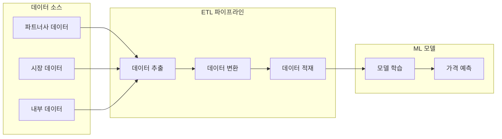
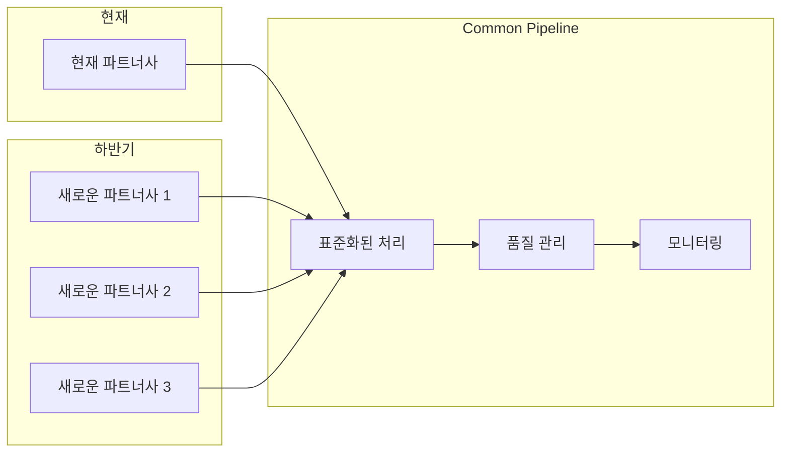
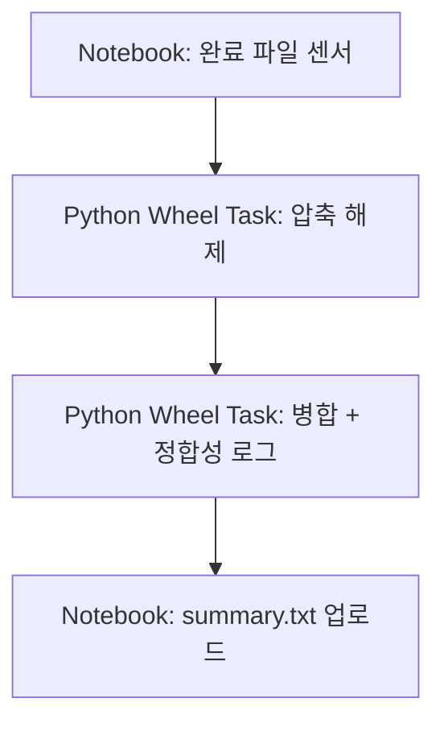

# 0. 개요

이 글은 `.tar.gz` 형식으로 제공되는 대량의 파트너사 데이터를 안정적으로 병합하고 처리하기 위해 구축한 확장형 ETL 파이프라인의 아키텍처와 설계 과정을 정리한 기술 기록입니다.

> 핵심 키워드: **대용량**, **병렬성**, **유연성**, **정합성 검증**, **Databricks + Spark 기반 분산 처리**

# ETL 파이프라인: 데이터 처리 시스템 구축기 - 초기 단계

# 1. 프로젝트 배경

### 1.1 Dynamic Pricing Solution이란?


Dynamic Pricing Solution은 실시간으로 시장 상황과 경쟁사 가격을 분석하여 최적의 가격을 결정하는 시스템입니다. 시스템의 핵심은 정확하고 신뢰할 수 있는 데이터입니다.

### 1.2 ETL 파이프라인의 필요성


ML 모델의 효과적인 학습을 위해서는 다양한 소스에서 수집한 데이터를 정제하고 통합하는 과정이 필수적입니다. 이 과정을 자동화하고 효율적으로 관리하기 위해 ETL 파이프라인을 구축하게 되었습니다.

### 1.3 Common Pipeline이 필요한 이유


하반기에 여러 파트너사가 추가될 예정이며, 각 파트너사마다 데이터 제공 방식과 품질 기준이 상이합니다. 이러한 다양한 데이터 소스를 효율적으로 통합 관리하기 위해서는 표준화된 Common Pipeline이 필수적입니다.

# 2. 문제 정의 및 초기 시도

## 2.1 일일 수신 데이터 특성
- 약 **40,000개 이상의 `.tar.gz` 압축 파일** 수신
- 내부에는 테이블별 `.csv` 파일 수십만 개 포함
- 테이블마다 구조/컬럼 수 다름 → 병합시 스키마 불일치 우려
- 실수로라도 누락되거나 오류 포함 시 ML 파이프라인에 치명적 영향

### 2.1.1 데이터 구조 상세
- 각 `.tar.gz` 파일은 약 100MB~500MB 크기로, 총 일일 데이터량은 10TB 이상
- CSV 파일은 테이블별로 분리되어 있으며, 일부 테이블은 10만 개 이상의 파일로 구성
- 파일명 패턴: `{table_name}_{date}_{batch_id}.csv` 형식으로 제공
- 일부 테이블은 매일 스키마가 변경될 수 있어 동적 스키마 처리 필요

## 2.2 초기 구조 (실패)
- 모든 압축 파일을 로컬로 다운로드 후 Python 병합 → 성능 한계
- Spark에서 전 테이블 한꺼번에 로드 후 병합 → GC overhead, Driver 재시작 발생

### 2.2.1 초기 접근 방식의 한계
- Python `pandas`를 사용한 단일 프로세스 병합: 4만 개 파일 처리 시 메모리 부족으로 OOM 발생
- `multiprocessing`으로 병렬화 시도: 프로세스 간 메모리 공유 문제로 성능 개선 미미
- Spark `coalesce(1)`로 모든 테이블 한 번에 병합: Driver 메모리 부족으로 Job 실패

```text
문제점 요약:
- 단일 Spark Job에서 수십만 개 CSV 병합 시, Driver OOM
- 테이블별 스키마 불일치로 병합 실패
- 실패 시 전체 Job 중단 → Retry 불가능
```

# 3. 구조 개선을 위한 의사결정 과정

## 3.1 Task 분리 아키텍처 도입

### 왜 분리했는가?
- `.tar.gz` 해제는 CPU-bound 작업, 병합은 IO-bound + Spark shuffle → 성격이 다름
- Notebook에서 모든 로직을 실행하면 디버깅 어려움, 의존성 높음
- **병합 실패 시 압축 해제 재시도 불필요 → 단계 분리 필요**

### 어떻게 분리했는가?


- Task 간 입력/출력을 S3로 공유 → 클러스터 간 독립성 확보
- 병합 실패한 테이블만 재실행 가능

### 3.1.1 Task 분리 구현 세부사항
- 압축 해제 Task: Python `tarfile` 모듈 사용, S3에 직접 업로드하여 중간 저장소 최소화
- 병합 Task: 테이블별 메타데이터 파일(`table_metadata.json`) 생성하여 스키마 정보 공유
- 각 Task는 독립적인 Databricks 클러스터에서 실행되어 리소스 경합 방지
- Task 간 데이터 전달은 S3 경로를 매개변수로 전달하여 느슨한 결합 구현

## 3.2 Workflow 기반 전환

### 왜 전환했는가?
- Notebook 단일 실행 시 Task 상태 추적 어려움
- 실패한 테이블만 재시도 불가 → 전체 Notebook 재시작 필요

### 어떻게 전환했는가?
- `Databricks Workflow`를 사용해 각 단계(Task)를 독립적으로 실행
- Python Wheel Task로 핵심 로직 분리 (패키징 후 배포)
- S3 경로와 병합 대상 테이블만 매개변수로 주입

### 3.2.1 Workflow 구성 세부사항
- 각 Task는 독립적인 재시도 정책 설정: 압축 해제는 최대 3회, 병합은 최대 5회
- Task 간 의존성은 Databricks Workflow UI에서 시각적으로 구성하여 가시성 확보
- 실패 알림은 Slack Webhook으로 자동 발송되며, 실패 원인과 영향 범위 포함
- 테이블별 병합 Task는 동적 생성되어 병렬 실행: `for table in tables: create_task(table)`

# 4. 대용량 데이터 병합 구조 설계

## 4.1 Spark 기반 분산 처리 도입

### 문제
- `pandas` 기반 병합 시 4만 개 파일은 메모리 초과
- Spark도 23개 테이블을 한 번에 처리 시 **Driver가 과부하로 다운**

### 해결책
- 병합 작업을 **테이블 단위로 분할**
- 각 테이블 병합 시 별도 `SparkSession` 생성
- Spark에서 `coalesce(1)`로 단일 CSV로 저장하되, 읽기/shuffle은 분산 처리 유지

### 4.1.1 Spark 최적화 세부사항
- `spark.default.parallelism`을 Executor 코어 수의 2배로 설정하여 병렬성 극대화
- `spark.sql.shuffle.partitions`를 데이터 크기에 따라 동적 조정 (기본값: 200)
- `spark.memory.fraction`을 0.8로 증가시켜 shuffle 메모리 할당 최적화
- `spark.sql.adaptive.enabled=true`로 설정하여 동적 파티션 조정 활성화

## 4.2 자동 스케일링 클러스터 활용

### 문제
- 매일 처리량이 다르고, 고정 노드는 리소스 낭비

### 해결책
- `min_workers=2, max_workers=4`인 Databricks 클러스터 설정
- 트래픽 급증 시 Executor 자동 증가
- 비용 최적화와 성능 사이 균형 확보

### 4.2.1 클러스터 구성 세부사항
- 노드 타입: `Standard_D8s_v3` (32GB 메모리, 8 코어)로 설정하여 비용 대비 성능 최적화
- 자동 스케일링 트리거: CPU 사용률 70% 이상 지속 5분 이상 시 스케일 아웃
- 스케일 다운 지연: 10분으로 설정하여 일시적 부하 감소 시 불필요한 스케일 다운 방지
- 스팟 인스턴스 활용: 비용 절감을 위해 스팟 인스턴스 50% 비율로 구성

## 4.3 테이블별 병렬 처리 구조

### 문제
- 일부 테이블에서 병합 실패 시 전체 중단
- 병합 속도가 느림 (단일 쓰레드)

### 해결책
- `ThreadPoolExecutor`로 병합 작업을 테이블별 병렬 수행
- 실패 테이블은 `[ERROR]` 로그로 남기고, 나머지 병합 계속 진행

### 4.3.1 병렬 처리 구현 세부사항
- `ThreadPoolExecutor`의 최대 워커 수를 클러스터 코어 수의 75%로 제한하여 리소스 경합 방지
- 각 테이블 병합 작업은 독립적인 `SparkSession`을 사용하여 격리성 확보
- 테이블별 진행 상황을 Redis에 저장하여 실시간 모니터링 가능
- 실패한 테이블은 자동으로 재시도 큐에 추가되어 최대 3회까지 재시도

# 5. 데이터 품질 검증 및 summary 로깅

## 5.1 왜 summary.txt를 만들었는가?
- 병합이 완료되어도, **데이터 손실 여부 확인 불가**
- ex) 컬럼 누락, null 필드 다수 발생, 헤더 불일치 등

### 5.1.1 데이터 품질 검증의 중요성
- ML 모델 학습에 사용되는 데이터의 품질은 최종 예측 정확도에 직접적 영향
- 파트너사 데이터 제공 방식 변경 시 자동으로 감지하여 대응 필요
- 데이터 누락이나 오류는 비즈니스 의사결정에 치명적 영향 가능성

## 5.2 어떤 검증을 했는가?
- **헤더 불일치 여부 검사** (파일 간 컬럼 수/이름 비교)
- **null 비율** 체크 (전체 row 대비 필드 누락)
- **파일 개수 누락 여부** (압축 해제 시점의 기대 수와 병합된 파일 수 비교)

### 5.2.1 검증 로직 세부사항
- 컬럼 불일치 감지: 모든 파일의 헤더를 수집하여 집합 연산으로 차이점 식별
- null 비율 계산: `df.select([count(when(col(c).isNull(), c)).alias(c) for c in df.columns])`로 각 컬럼별 null 수 집계
- 파일 수 검증: 압축 해제 시 생성한 파일 목록과 실제 병합된 파일 수 비교
- 데이터 타입 검증: 예상 스키마와 실제 데이터 타입 비교하여 불일치 감지

## 5.3 summary.txt 포맷 예시
```text
Table: cfrateplanchannelmapping
- Total files: 1342
- Merged rows: 98012
- Header consistent: NO
- Null ratio: 17.2%
- Missing fields: ['room_id', 'price']
- Error: Schema mismatch detected
```

> 이 파일은 병합 후 자동으로 S3에 업로드되어 Airflow나 Slack 경고 트리거로 사용 가능

### 5.3.1 summary.txt 활용 세부사항
- 일일 데이터 품질 대시보드 구축: Grafana에서 시각화하여 트렌드 분석
- 품질 지표 임계값 설정: null 비율 20% 이상, 파일 누락 5% 이상 시 자동 알림
- 파트너사별 데이터 품질 리포트 자동 생성: 주간/월간 리포트로 제공
- 데이터 품질 점수 산출: 여러 지표를 종합하여 0-100 점수로 평가

# 6. 얻은 교훈

## 6.1 Trial & Error의 반복
- 단일 Spark Job 구조로 시도 → 실패
- PySpark 병합 중 `GC Overhead` → 구조 재설계
- `.tar.gz` 해제와 병합을 한 스크립트에 묶음 → 유지보수 난이도 증가
- 병합 도중 테이블 하나 실패 → 전체 실패 → 병렬 처리로 전환

### 6.1.1 실패에서 배운 구체적 교훈
- 초기 설계 시 확장성을 고려하지 않은 것이 가장 큰 실수: 데이터 양 증가에 대비한 설계 필요
- 단일 책임 원칙(SRP)을 무시한 모놀리식 구조는 유지보수와 디버깅을 어렵게 함
- 성능 테스트 부족: 실제 데이터 규모의 10%로만 테스트하여 실제 운영 시 문제 발생
- 오류 처리 미흡: 예외 상황에 대한 명확한 처리 전략 없이 개발하여 복구 어려움

## 6.2 핵심 교훈
- **장애 복구 용이성**, **모듈화된 처리**, **정합성 검증 자동화**가 중요함
- 일단 돌아가게 만드는 것이 아니라, **신뢰할 수 있게** 만드는 것이 핵심

### 6.2.1 데이터 엔지니어링의 핵심 원칙
- 데이터 파이프라인은 코드보다 데이터 흐름을 중심으로 설계: 데이터 특성과 흐름을 먼저 이해
- 실패는 필연적: 모든 단계에서 실패 가능성을 고려한 설계 필요
- 모니터링과 알림은 필수: 문제 발생 시 빠른 대응을 위한 가시성 확보
- 점진적 개선: 완벽한 첫 버전보다 지속적으로 개선되는 시스템이 더 가치 있음

# 7. 다음 단계

## 7.1 고도화 방향
- 데이터 저장 구조 개선 검토 (Delta Lake 등 고려 중)
- 테이블 간 데이터 정합성 검증 강화
- 데이터 품질 모니터링 대시보드 구축

### 7.1.1 데이터 저장 구조 개선 계획
- 현재 CSV 기반 저장 구조에서 더 효율적인 저장 방식으로 전환 검토 중
- 스키마 변경에 유연하게 대응할 수 있는 구조 도입 고려
- 데이터 접근 패턴에 맞는 최적화된 파티셔닝 전략 수립
- 데이터 품질 검증 프로세스 개선 및 자동화 방안 모색

## 7.2 예상되는 확장
- 다양한 파트너사 데이터 수집 방식 대응 (API, DB 등)
- 다양한 데이터 소스 통합 방안 검토

### 7.2.1 확장 아키텍처 계획
- 실시간/배치 데이터 수집 요구사항에 대응할 수 있는 유연한 파이프라인 설계
- 다양한 데이터 소스를 통합할 수 있는 추상화 레이어 구축 검토
- 데이터 수집 주기별 최적화된 처리 경로 설계
- 파트너사별 특수 요구사항을 유연하게 처리할 수 있는 확장 가능한 구조 구현

# 참고
- Databricks Docs: https://docs.databricks.com/
- Spark CSV Merge Best Practice: https://spark.apache.org/docs/latest/sql-data-sources-csv.html
- AWS S3 Partitioning Best Practice: https://docs.aws.amazon.com/athena/latest/ug/partitions.html
- Delta Lake Documentation: https://docs.databricks.com/delta/index.html
- Databricks Workflow Best Practices: https://docs.databricks.com/workflows/index.html