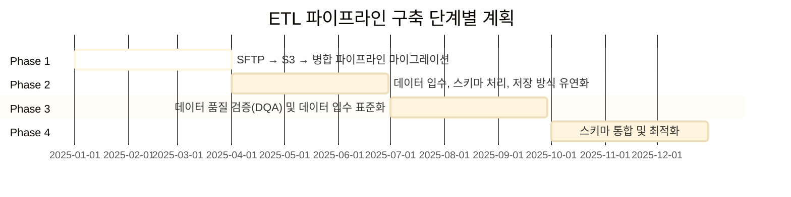
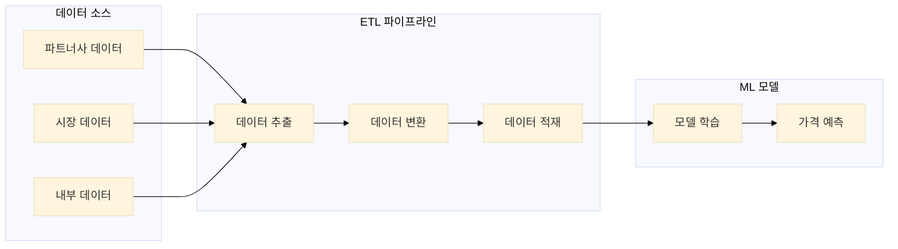
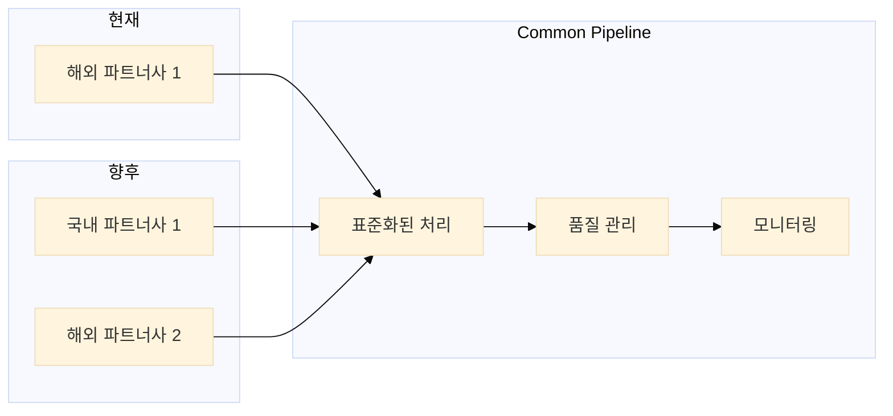
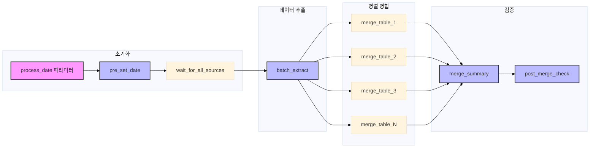
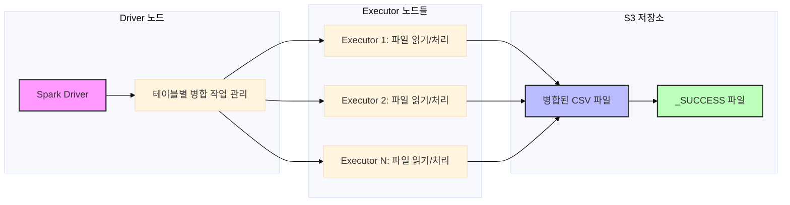
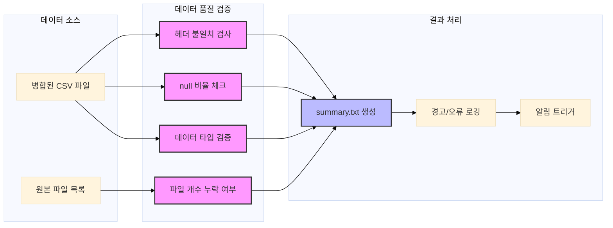
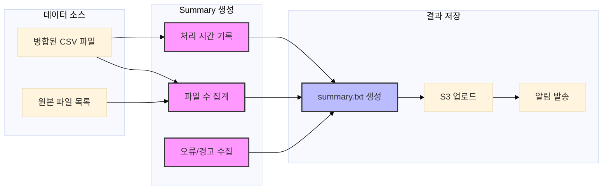

# ETL 파이프라인: 확장 가능한 데이터 처리 시스템 구축기

## 1. 개요 및 배경

### 1.1 프로젝트 배경
호텔 예약 플랫폼의 가격 책정 서비스를 위한 ETL 파이프라인을 구축하는 프로젝트를 진행했습니다. 현재는 해외 파트너사 1곳의 데이터만 처리하고 있지만, 곧 국내 1곳과 해외 1곳이 추가될 예정입니다. 각 파트너사마다 데이터 구조와 형식이 상이하여, 이를 효율적으로 통합 처리할 수 있는 표준화된 파이프라인이 필요한 상황이었습니다.

이전까지는 주로 사내 툴 개발에 집중했기 때문에, 하루 10TB 이상의 데이터를 처리하는 빅데이터 환경은 저에게 새로운 도전이었습니다. 분산 처리 시스템 구축, 작업 병렬화, 대용량 파일 병합과 같은 실제 문제들을 해결해나가면서 이론적 지식을 넘어 실질적인 빅데이터 엔지니어링 경험을 쌓을 수 있었습니다.

> 이 글은 완성된 솔루션을 제시하는 것이 아니라, 데이터 엔지니어링과 대규모 데이터 처리가 처음인 상황에서 대규모 데이터 엔지니어링과 배치 처리에 대해 배우면서 겪은 시행착오와 교훈을 기록한 학습 여정입니다. 각 단계에서 마주친 문제와 해결 과정, 그리고 얻은 인사이트를 공유합니다.

### 1.2 프로젝트 배경 상세

현재 데이터 엔지니어링 팀은 호텔 예약 플랫폼의 핵심 서비스인 동적 가격 책정 시스템을 운영하고 있습니다. 이 서비스는 실시간으로 시장 상황과 경쟁사 가격을 분석하여 최적의 가격을 결정하는 시스템으로, 향후 다양한 파트너사로 서비스 제공을 확대할 계획입니다.

그러나 기존 데이터 파이프라인은 내부 시스템의 데이터 스키마에 맞춰져 있어, 다른 파트너사의 데이터를 동일한 파이프라인을 재사용하여 처리하기 어렵습니다. 이로 인해 다음과 같은 문제점이 발생합니다:

1. **스키마 종속성**: 내부 시스템 전용 스키마로 인해 타 파트너사 데이터 재활용 불가
2. **S3 저장 비용 증가**: 지속적인 원본 데이터 적재로 관리 비용과 스토리지 비용 상승
3. **비효율적 적재 방식**: 변경 감지 메커니즘 부재로 중복 적재 및 리소스 낭비
4. **품질 보장 체계 부재**: 실시간/배치 기반 DQA 체계 미흡

따라서, 다음을 목표로 공통 ETL 파이프라인을 설계하고 있습니다:
- 데이터 입수 → 품질 검증 → 저장까지 전 과정 자동화 및 표준화
- 테이블/스키마 구조가 다른 파트너사 대응 가능한 유연한 구조
- 비용 효율적이고 안정적인 운영 (DQA 포함)

이 기술 설계 문서는 공통된 하나의 데일리 배치 데이터 입수 파이프라인과 DQA(Data Quality Assurance)에 초점을 맞추고 있습니다. 실시간 데이터 입수 및 DQA, Configuration data 관련 사항은 추후 진행될 예정입니다.

### 1.3 기술적 도전 과제

이 프로젝트의 주요 기술적 도전 과제는 다음과 같습니다:

1. **대용량 데이터 처리**: 일일 수만 개의 `.tar.gz` 압축 파일(총 10TB 이상)을 효율적으로 처리
2. **병렬 처리 최적화**: Spark 기반 분산 처리로 처리 시간 단축 및 리소스 효율성 확보
3. **유연한 스키마 처리**: 다양한 파트너사의 상이한 데이터 구조를 동적으로 처리
4. **데이터 품질 보장**: 자동화된 DQA 프로세스로 데이터 신뢰성 확보
5. **확장 가능한 아키텍처**: 새로운 파트너사 추가 시 최소한의 변경으로 통합 가능한 구조

이러한 도전 과제들을 해결하기 위해 단계적 접근 전략을 수립했습니다. 각 도전 과제에 대해 시도한 접근 방식, 실패한 경험, 그리고 그로부터 배운 교훈을 순차적으로 설명하겠습니다.

### 1.4 단계적 접근 전략

이 프로젝트는 문제를 작은 단위로 분해하여 단계적으로 접근하고 있습니다:

#### 1.4.1 1단계: SFTP → S3 → 병합 파이프라인 마이그레이션
- 기존 Airflow 기반 SFTP 수신 및 S3 저장 파이프라인을 Databricks로 마이그레이션
- 40,000개 이상의 파일을 효율적으로 처리하는 병합 작업 구현
- 현재 진행 중인 단계로, 이 문서는 이 단계의 구현 과정과 교훈을 중심으로 작성됨

#### 1.4.2 2단계: 데이터 입수, 스키마 처리, 저장 방식 유연화
- 다양한 파트너사의 데이터 입수 방식을 수용할 수 있도록 파이프라인 리팩토링
- 스키마 처리 로직을 유연하게 설계하여 다양한 데이터 구조 대응
- 저장 방식(CSV, Delta Lake 등)을 선택적으로 사용할 수 있는 구조로 개선
- 타사에서도 활용할 수 있는 모듈화된 구조 구현

#### 1.4.3 3단계: 데이터 품질 검증(DQA) 및 데이터 입수 표준화
- 데이터 품질 검증 프로세스 구현 및 자동화
- 다양한 파트너사의 데이터 입수 방식을 표준화된 방식으로 통합
- 향후 구현 예정

#### 1.4.4 4단계: 스키마 통합 및 최적화
- 파트너사별 상이한 스키마를 통합된 형태로 정리
- 데이터 사이언티스트들과 협력하여 최적의 스키마 설계
- 향후 구현 예정

이러한 단계적 접근을 통해 복잡한 문제를 관리 가능한 크기로 분해하고, 각 단계에서 얻은 교훈을 다음 단계에 적용하여 지속적으로 개선하는 전략을 취하고 있습니다.

### 1.4.5 단계적 접근 전략 시각화


### 1.5 Dynamic Pricing Solution 구조


Dynamic Pricing Solution은 실시간으로 시장 상황과 경쟁사 가격을 분석하여 최적의 가격을 결정하는 시스템입니다. 시스템의 핵심은 정확하고 신뢰할 수 있는 데이터입니다.

### 1.6 ETL 파이프라인의 필요성


ML 모델의 효과적인 학습을 위해서는 다양한 소스에서 수집한 데이터를 정제하고 통합하는 과정이 필수적입니다. 이 과정을 자동화하고 효율적으로 관리하기 위해 ETL 파이프라인을 구축하게 되었습니다. 시장 데이터 = 예약 내역, 내부 데이터 = 내부 호텔, 국가 등 설정 데이터

### 1.7 Common Pipeline이 필요한 이유


현재 해외 파트너사 1곳의 데이터를 처리하고 있으며, 향후 국내 파트너사 1곳과 추가 해외 파트너사 1곳이 추가될 예정입니다. 각 파트너사마다 데이터 제공 방식과 품질 기준이 상이합니다. 이러한 다양한 데이터 소스를 효율적으로 통합 관리하기 위해서는 표준화된 Common Pipeline이 필수적입니다.

### 1.8 현재 파트너사의 데이터 특성
- 현재 해외 파트너사는 특수한 데이터 제공 방식을 사용하고 있어 별도의 처리 로직이 필요합니다.
- 이 파트너사의 데이터 처리 경험은 향후 국내 파트너사와 추가 해외 파트너사 데이터 통합에 도움이 될 것입니다.
- 기본적인 구조는 현재 파트너사 데이터 기준으로 하되, 나중에 최소한의 변경사항이 있도록 설계하려고 신경쓰고 있습니다.
- 데이터 품질과 처리 효율성을 위해 표준화된 방식으로 수집하고 처리하는 것이 중요합니다.

### 1.9 프로젝트 목표
- 해외 파트너사로부터 수신한 `.tar.gz` 압축 데이터를 테이블 단위로 추출 및 병합하고, 최종적으로 `merged_<table>.csv` 파일과 `_SUCCESS` 파일을 S3에 저장하는 공통 ETL 파이프라인을 Databricks Workflow 기반으로 자동화합니다.
- 파이프라인은 확장 가능하고 유지보수가 용이한 구조로 설계하여, 향후 추가 파트너사 데이터 통합에 대비합니다.
- 데이터 품질 검증 및 모니터링 기능을 포함하여 신뢰할 수 있는 데이터 파이프라인을 구축합니다.
- **현재는 1단계로, SFTP에서 S3로 파일을 저장하고 병합하는 작업을 Airflow에서 Databricks로 마이그레이션하는 데 집중하고 있습니다.**

# 2. 문제 정의 및 초기 시도

## 2.1 일일 수신 데이터 특성
- 약 **40,000개 이상의 `.tar.gz` 압축 파일** 수신
- 내부에는 테이블별 `.csv` 파일 수십만 개 포함
- 테이블마다 구조/컬럼 수 다름 → 병합시 스키마 불일치 우려
- 실수로라도 누락되거나 오류 포함 시 ML 파이프라인에 치명적 영향

### 2.1.1 데이터 구조 상세
- 각 `.tar.gz` 파일은 약 100MB~500MB 크기로, 총 일일 데이터량은 10TB 이상
- CSV 파일은 테이블별로 분리되어 있으며, 일부 테이블은 10만 개 이상의 파일로 구성
- 파일명 패턴: `{table_name}_{date}_{batch_id}.csv` 형식으로 제공
- 일부 테이블은 매일 스키마가 변경될 수 있어 동적 스키마 처리 필요

## 2.2 초기 구조 (실패)
- 모든 압축 파일을 로컬로 다운로드 후 Python 병합 → 성능 한계
- Spark에서 전 테이블 한꺼번에 로드 후 병합 → GC overhead, Driver 재시작 발생

### 2.2.1 초기 접근 방식의 한계
- Python `pandas`를 사용한 단일 프로세스 병합: 4만 개 파일 처리 시 메모리 부족으로 OOM 발생
- `multiprocessing`으로 병렬화 시도: 프로세스 간 메모리 공유 문제로 성능 개선 미미
- Spark `coalesce(1)`로 모든 테이블 한 번에 병합: Driver 메모리 부족으로 Job 실패

```text
문제점 요약:
- 단일 Spark Job에서 수십만 개 CSV 병합 시, Driver OOM
- 테이블별 스키마 불일치로 병합 실패
- 실패 시 전체 Job 중단 → Retry 불가능
```

이러한 초기 실패는 데이터 엔지니어링과 대규모 데이터 처리가 처음인 상황에서 중요한 교훈을 주었습니다: 대용량 데이터 처리에는 단순한 접근 방식이 아닌, 데이터 특성에 맞는 분산 처리 아키텍처가 필요하다는 점입니다.

# 3. 구조 개선을 위한 의사결정 과정

## 3.1 Task 분리 아키텍처 도입

### 왜 분리했는가?
- `.tar.gz` 해제는 CPU-bound 작업, 병합은 IO-bound + Spark shuffle → 성격이 다름
- Notebook에서 모든 로직을 실행하면 디버깅 어려움, 의존성 높음
- **병합 실패 시 압축 해제 재시도 불필요 → 단계 분리 필요**

### 어떻게 분리했는가?


- Task 간 입력/출력을 S3로 공유 → 클러스터 간 독립성 확보
- 병합 실패한 테이블만 재실행 가능

### 3.1.1 Task 분리 구현 세부사항
- 압축 해제 Task: Python `tarfile` 모듈 사용, S3에 직접 업로드하여 중간 저장소 최소화
- 병합 Task: 테이블별 메타데이터 파일(`table_metadata.json`) 생성하여 스키마 정보 공유
- 각 Task는 독립적인 Databricks 클러스터에서 실행되어 리소스 경합 방지
- Task 간 데이터 전달은 S3 경로를 매개변수로 전달하여 느슨한 결합 구현

### 3.1.2 Task 분리 아키텍처 상세 다이어그램

```mermaid
%%{init: {'theme': 'base', 'themeVariables': { 'fontSize': '16px'}}}%%
graph LR
    subgraph "데이터 소스"
        direction LR
        S1[SFTP 서버] --> S2[.tar.gz 파일]
    end
    
    subgraph "Task 1: 압축 해제"
        direction LR
        T1[완료 파일 센서] --> T2[압축 해제 프로세스] --> T3[S3 업로드]
    end
    
    subgraph "Task 2: 병합"
        direction LR
        T4[테이블별 병합] --> T5[스키마 검증] --> T6[정합성 로깅]
    end
    
    subgraph "Task 3: 요약"
        direction LR
        T7[summary.txt 생성] --> T8[S3 업로드]
    end
    
    S2 --> T1
    T3 --> T4
    T6 --> T7
    
    style T1 fill:#f9f,stroke:#333,stroke-width:2px
    style T4 fill:#bbf,stroke:#333,stroke-width:2px
    style T7 fill:#bfb,stroke:#333,stroke-width:2px
```


## 3.2 Workflow 기반 전환

### 왜 전환했는가?
- Notebook 단일 실행 시 Task 상태 추적 어려움
- 실패한 테이블만 재시도 불가 → 전체 Notebook 재시작 필요
- 리소스 관리와 병렬 처리의 한계

### 어떻게 전환했는가?
- `Databricks Workflow`를 사용해 각 단계(Task)를 독립적으로 실행
- Python Script로 핵심 로직 분리 (패키징 없이 직접 실행)
- S3 경로와 병합 대상 테이블만 매개변수로 주입

### 3.2.1 Workflow 구성 세부사항
- **초기화 단계**
  - `pre_set_date`: process_date 파라미터가 비어있을 경우 어제 날짜로 설정
  - `wait_for_all_sources`: 모든 소스 파일이 준비되었는지 확인

- **데이터 처리 단계**
  - `batch_extract`: .tar.gz 파일 추출 및 S3 업로드
  - 각 테이블별 `merge_*` task: 독립적인 병합 작업 수행
  - 모든 병합 task는 `batch_extract`에만 의존하여 병렬 실행 가능

- **검증 단계**
  - `merge_summary`: 모든 병합이 완료된 후 summary.txt 생성
  - `post_merge_check`: 최종 결과 검증

- **리소스 관리**
  - 모든 task가 동일한 클러스터 사용으로 리소스 일관성 유지
  - `timeout_seconds: 10800` (3시간)으로 충분한 실행 시간 확보
  - `max_concurrent_runs: 6`으로 동시 실행 제한

- **스케줄링**
  - 매일 오전 9시 27분 실행 (`quartz_cron_expression: 27 0 9 * * ?`)
  - 한국 시간 기준 (`timezone_id: Asia/Seoul`)

### 3.2.2 Databricks Workflow 구조


### 3.2.3 Workflow YAML 구조
```yaml
resources:
  jobs:
    merge_all_tables_complete_flow:
      name: merge_all_tables_complete_flow
      timeout_seconds: 10800
      max_concurrent_runs: 6
      schedule:
        quartz_cron_expression: 27 0 9 * * ?
        timezone_id: Asia/Seoul
      tasks:
        - task_key: pre_set_date
          notebook_task:
            notebook_path: /batch_processor/set_process_date_if_empty
            base_parameters:
              default_to_yesterday: "true"
        
        - task_key: wait_for_all_sources
          depends_on:
            - task_key: pre_set_date
          notebook_task:
            notebook_path: /batch_processor/check_all_4_completed_files
            
        - task_key: batch_extract
          depends_on:
            - task_key: wait_for_all_sources
          spark_python_task:
            python_file: /batch_processor/__main__.py
            parameters:
              - --input
              - s3://bucket/input/{{job.parameters.PROCESS_DATE}}
              - --output
              - s3://bucket/output/{{job.parameters.PROCESS_DATE}}
              
        # 각 테이블별 병합 task
        - task_key: merge_table_1
          depends_on:
            - task_key: batch_extract
          notebook_task:
            notebook_path: /batch_processor/merge_single_table_notebook
            
        # ... 다른 테이블 병합 task들 ...
        
        - task_key: merge_summary
          depends_on:
            - task_key: merge_table_1
            # ... 다른 테이블 의존성 ...
          notebook_task:
            notebook_path: /batch_processor/upload_summary
            
        - task_key: post_merge_check
          depends_on:
            - task_key: merge_summary
          notebook_task:
            notebook_path: /batch_processor/validate_merge_results
```

### 3.2.4 Workflow 전환의 이점
1. **병렬 처리 효율화**
   - 각 테이블 병합을 독립적으로 실행하여 전체 처리 시간 단축
   - 리소스 활용도 최적화

2. **장애 복구 용이성**
   - 실패한 task만 선택적으로 재실행 가능
   - 의존성 기반으로 안전한 재시작 보장

3. **모니터링 강화**
   - 각 task의 상태를 실시간으로 추적 가능
   - 실행 시간, 리소스 사용량 등 상세 모니터링

4. **유지보수성 향상**
   - 각 task의 책임이 명확히 분리됨
   - 코드 변경 시 영향 범위 최소화

5. **확장성**
   - 새로운 테이블 추가가 용이
   - 파라미터화를 통한 유연한 구성 가능

# 4. 성능 최적화 전략

## 4.1 Spark 분산 처리 아키텍처

### 문제
- `pandas` 기반 병합 시 4만 개 파일은 메모리 초과
- Spark도 23개 테이블을 한 번에 처리 시 **Driver가 과부하로 다운**

### 해결책
- 병합 작업을 **테이블 단위로 분할**
- 각 테이블 병합 시 별도 `SparkSession` 생성
- Spark에서 `coalesce(1)`로 단일 CSV로 저장하되, 읽기/shuffle은 분산 처리 유지

### 4.1.1 Spark 분산 처리 구현 세부사항
- `spark.default.parallelism`을 Executor 코어 수의 2배로 설정하여 병렬성 극대화
- `spark.sql.shuffle.partitions`를 데이터 크기에 따라 동적 조정 (기본값: 200)
- `spark.memory.fraction`을 0.8로 증가시켜 shuffle 메모리 할당 최적화
- `spark.sql.adaptive.enabled=true`로 설정하여 동적 파티셔닝 조정 활성화

### 4.1.2 Spark 분산 처리 아키텍처 상세 다이어그램


## 4.2 데이터 처리 최적화

### 문제
- 매일 처리량이 다르고, 고정 노드는 리소스 낭비

### 해결책
- `min_workers=2, max_workers=4`인 Databricks 클러스터 설정
- 트래픽 급증 시 Executor 자동 증가
- 비용 최적화와 성능 사이 균형 확보

### 4.2.1 데이터 처리 최적화 구현 세부사항
- 노드 타입: 표준 가상머신 (32GB 메모리, 8 코어)로 설정하여 비용 대비 성능 최적화
- 자동 스케일링 트리거: CPU 사용률 70% 이상 지속 5분 이상 시 스케일 아웃
- 스케일 다운 지연: 10분으로 설정하여 일시적 부하 감소 시 불필요한 스케일 다운 방지
- 스팟 인스턴스 활용: 비용 절감을 위해 스팟 인스턴스 50% 비율로 구성

### 4.2.2 데이터 처리 최적화 상세 다이어그램

```mermaid
%%{init: {'theme': 'base', 'themeVariables': { 'fontSize': '16px'}}}%%
graph LR
    subgraph "초기 접근"
        direction LR
        A1[단일 Python 스크립트] --> A2[로컬 파일 시스템 사용] --> A3[메모리 부족 오류]
    end
    
    subgraph "Spark 도입"
        direction LR
        B1[Spark 기반 병합] --> B2[Driver OOM 오류] --> B3[테이블별 분리 필요성 발견]
    end
    
    subgraph "Task 분리"
        direction LR
        C1[압축 해제 Task] --> C2[병합 Task] --> C3[요약 Task]
    end
    
    subgraph "Workflow 전환"
        direction LR
        D1[Databricks Workflow] --> D2[파라미터 전달 문제] --> D3[경로 구성 오류]
    end
    
    subgraph "최종 구현"
        direction LR
        E1[병렬 처리 최적화] --> E2[데이터 품질 검증] --> E3[자동화된 Workflow]
    end
    
    A3 --> B1
    B3 --> C1
    C3 --> D1
    D3 --> E1
    
    style A3 fill:#f99,stroke:#333,stroke-width:2px
    style B2 fill:#f99,stroke:#333,stroke-width:2px
    style D2 fill:#f99,stroke:#333,stroke-width:2px
    style D3 fill:#f99,stroke:#333,stroke-width:2px
    style E3 fill:#9f9,stroke:#333,stroke-width:2px
```


# 5. 데이터 품질 검증 및 summary 로깅

## 5.1 데이터 품질 검증
- 병합이 완료되어도, **데이터 손실 여부 확인 불가**
- ex) 컬럼 누락, null 필드 다수 발생, 헤더 불일치 등

### 5.1.1 데이터 품질 검증의 중요성
- ML 모델 학습에 사용되는 데이터의 품질은 최종 예측 정확도에 직접적 영향
- 파트너사 데이터 제공 방식 변경 시 자동으로 감지하여 대응 필요
- 데이터 누락이나 오류는 비즈니스 의사결정에 치명적 영향 가능성

### 5.1.2 데이터 품질 관리의 실제 어려움
처음에는 단순히 "정리가 잘 되어있지 않은 데이터" 정도로만 생각했습니다. 그러나 실제로 파이프라인을 구축하고 운영하면서 데이터 품질 관리의 복잡성을 깨달았습니다. 데이터를 한 번에 "질 좋은" 데이터로 뽑아내는 것은 생각보다 훨씬 어려운 작업이었습니다.

- **데이터 품질의 다면성**: 단순히 null 값이 많거나 컬럼이 누락된 것뿐만 아니라, 데이터 타입 불일치, 비즈니스 로직 위반, 이상치 등 다양한 형태의 품질 이슈가 존재
- **품질 기준의 모호성**: "좋은 데이터"의 정의가 비즈니스 컨텍스트에 따라 달라짐 - 어떤 경우에는 null이 많아도 정상일 수 있고, 어떤 경우에는 하나의 null도 허용되지 않을 수 있음
- **시간에 따른 품질 변화**: 파트너사의 데이터 제공 방식이 시간에 따라 변화하면서 예상치 못한 품질 이슈가 발생
- **대규모 데이터의 검증 어려움**: 수만 개의 파일을 수동으로 검증하는 것은 불가능하며, 자동화된 검증 로직도 완벽하지 않음

이러한 경험을 통해 데이터 품질 관리는 단순한 기술적 문제가 아니라 지속적인 모니터링과 개선이 필요한 복잡한 프로세스라는 것을 배웠습니다.

### 5.1.3 데이터 품질 검증 프로세스


## 5.2 Summary 로깅
- 병합이 완료되어도, **데이터 손실 여부 확인 불가**
- ex) 컬럼 누락, null 필드 다수 발생, 헤더 불일치 등

### 5.2.1 Summary 로깅 구현 세부사항
- 병합 후 자동으로 S3에 업로드되어 워크플로우 오케스트레이션 도구나 알림 시스템으로 트리거 가능

### 5.2.2 Summary 로깅 상세 다이어그램


# 6. 얻은 교훈

## 6.1 기술적 교훈
- 초기 설계 시 확장성을 고려하지 않은 것이 가장 큰 실수: 데이터 양 증가에 대비한 설계 필요
- 단일 책임 원칙(SRP)을 무시한 모놀리식 구조는 유지보수와 디버깅을 어렵게 함
- 성능 테스트 부족: 실제 데이터 규모의 10%로만 테스트하여 실제 운영 시 문제 발생
- 오류 처리 미흡: 예외 상황에 대한 명확한 처리 전략 없이 개발하여 복구 어려움

### 6.1.1 기술적 교훈의 구체적 사례
- **메모리 관리 실패**: 초기에는 단일 프로세스로 모든 파일을 처리하려 했으나, 4만 개의 파일을 처리하는 과정에서 OOM 발생
- **Spark 설정 미흡**: `spark.default.parallelism`과 `spark.sql.shuffle.partitions` 설정을 데이터 특성에 맞게 조정하지 않아 성능 저하
- **리소스 할당 오류**: Driver 노드에 과도한 메모리를 할당하여 Executor 노드의 리소스가 부족했던 경험
- **병렬 처리 한계**: 모든 테이블을 동시에 처리하려 했던 것이 Driver OOM의 주요 원인

## 6.2 프로세스 개선 교훈
- 데이터 품질 검증 프로세스 구현 및 자동화
- 다양한 파트너사의 데이터 입수 방식을 표준화된 방식으로 통합
- 데이터 품질 모니터링 대시보드 구축

### 6.2.1 프로세스 개선의 실제 적용
- **품질 검증 자동화**: 헤더 불일치, null 비율, 파일 개수 등 자동 검증 로직 구현
- **표준화된 입수 프로세스**: 모든 파트너사 데이터에 대해 동일한 검증 단계 적용
- **모니터링 체계**: 처리 시간, 오류율, 데이터 품질 지표 등을 실시간으로 모니터링하는 대시보드 구축
- **알림 시스템**: 데이터 품질 이슈 발생 시 즉시 알림을 받을 수 있는 체계 구축

## 6.3 팀 협업 교훈
- 데이터 엔지니어링 팀과 ML 팀 간의 긴밀한 협업 필요성 발견
- 파트너사와의 데이터 품질 기준 공유 및 합의 과정의 중요성
- 문서화와 지식 공유의 필요성

### 6.3.1 팀 협업 개선 사례
- **크로스 팀 협업**: ML 팀과 함께 데이터 품질 기준을 정의하고 공유하는 프로세스 구축
- **파트너사 커뮤니케이션**: 데이터 제공 방식과 품질 기준에 대한 명확한 가이드라인 수립
- **지식 베이스 구축**: 문제 해결 과정과 교훈을 문서화하여 팀 내 지식 공유 체계 확립
- **정기적인 리뷰**: 주간 기술 리뷰를 통해 지속적인 개선점 도출

# 7. 다음 단계

## 7.1 향후 계획
- 데이터 저장 구조 개선 검토 (Delta Lake 등 고려 중)
- 테이블 간 데이터 정합성 검증 강화
- 데이터 품질 모니터링 대시보드 구축

### 7.1.1 향후 계획 구현 세부사항
- 현재 CSV 기반 저장 구조에서 더 효율적인 저장 방식으로 전환 검토 중
- 스키마 변경에 유연하게 대응할 수 있는 구조 도입 고려
- 데이터 접근 패턴에 맞는 최적화된 파티셔닝 전략 수립
- 데이터 품질 검증 프로세스 개선 및 자동화 방안 모색

## 7.2 결론
- 파이프라인의 확장성과 유지보수성을 강화하여 향후 추가 파트너사 데이터 통합에 대비합니다.

### 7.2.1 결론 구현 세부사항
- 파이프라인의 확장성과 유지보수성을 강화하여 향후 추가 파트너사 데이터 통합에 대비합니다.

# 8. 참고 자료
- [Databricks Docs](https://docs.databricks.com/) - Databricks 관련 공식 문서
- [Spark CSV Merge Best Practice](https://spark.apache.org/docs/latest/sql-data-sources-csv.html) - Spark에서 CSV 병합 시 모범 사례
- [AWS S3 Partitioning Best Practice](https://docs.aws.amazon.com/athena/latest/ug/partitions.html) - S3 파티셔닝 관련 모범 사례
- [Delta Lake Documentation](https://docs.databricks.com/delta/index.html) - Delta Lake에 대한 공식 문서
- [Databricks Workflow Best Practices](https://docs.databricks.com/workflows/index.html) - Databricks Workflow의 모범 사례
- [Airflow Documentation](https://airflow.apache.org/docs/) - 워크플로우 오케스트레이션 관련 학습 자료
- [Spark Documentation](https://spark.apache.org/docs/latest/) - Spark 기반 데이터 처리에 대한 공식 문서
- [Data Engineering Weekly](https://www.dataengineeringweekly.com/) - 데이터 엔지니어링 관련 주간 뉴스레터

# 9. 부록