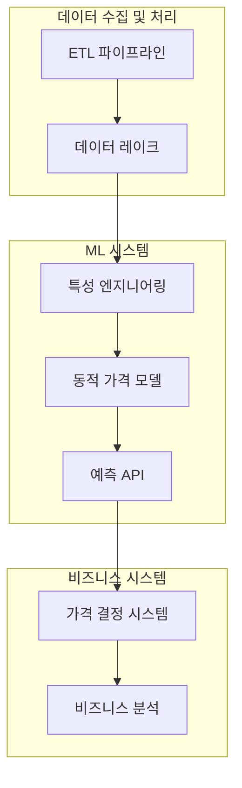
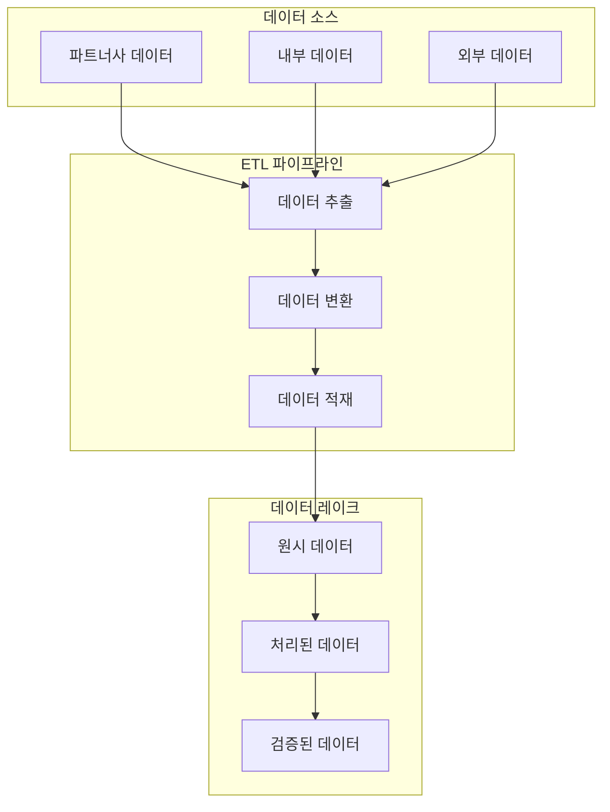
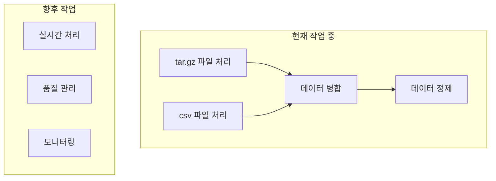
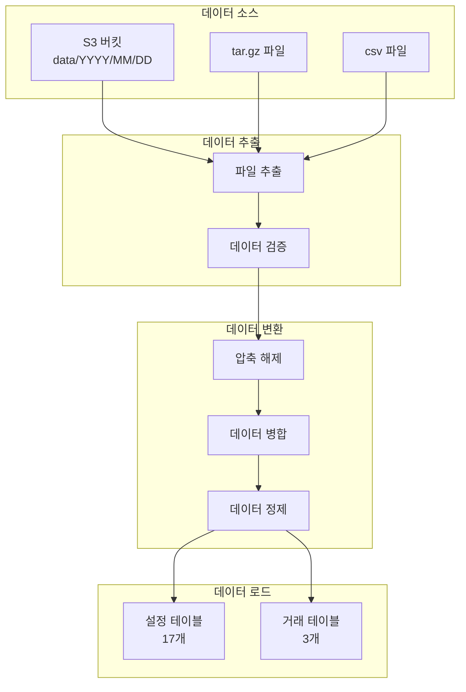

# ETL 파이프라인: 데이터 처리 시스템 구축기 - 초기 단계

## 1. 프로젝트 개요

### 1.1 전체 시스템 구조

### 1.2 ETL 파이프라인의 역할

### 1.3 현재 작업 범위

## 2. 현재 진행 중인 작업

### 2.1 데이터 소스
- **파트너사의 데이터**
  - `.tar.gz` 압축 파일
  - `.csv` 파일
  - 일별 데이터 제공

### 2.2 처리 환경
- **Databricks 클러스터**
  - 대규모 데이터 병렬 처리
  - 자동 스케일링 (2~4 노드)
  - S3 기반 스토리지

### 2.3 주요 작업
- 압축 파일 처리 및 데이터 추출
- 테이블별 데이터 병합
- 중복 제거 및 데이터 정제
- Config 테이블(17개)과 Transaction 테이블(3개) 분류

## 3. 현재 직면한 어려움

### 3.1 데이터 품질 이슈
- 데이터 무결성(Integrity) 문제
  - 단순 append 방식으로 저장 불가
  - 과거 데이터부터 스냅샷 형태로 제공
  - 40,000개 이상의 파일을 scatter하게 받아야 함
  - 이를 다시 하나의 테이블로 병합하는 작업 필요
- 데이터 구조의 불일치
  - 파일명과 실제 데이터 구조의 불일치
  - 테이블별 데이터 포맷 차이
  - 누락된 필드나 잘못된 데이터 타입

### 3.2 기술적 과제
- 처리 효율성 문제
  - 대용량 파일 처리의 어려움
  - 메모리 사용량 최적화 필요
  - 처리 시간 개선 필요
- 시스템 안정성
  - 에러 처리 및 복구 전략
  - 데이터 검증 및 모니터링
  - 시스템 리소스 관리

## 4. 아키텍처 설계

### 4.1 전체 아키텍처

### 4.2 핵심 기술 선택

1. **Databricks + Spark**
   - 대규모 데이터 병렬 처리
   - 분산된 S3 객체 자동 병렬 read
   - 안정적인 메모리 관리

2. **자동 스케일링 클러스터**
   - Worker 노드 2~4개 자동 조정
   - 데이터 양에 따른 유동적 자원 할당
   - 비용 최적화

3. **테이블별 독립 병렬 처리**
   - 테이블 단위 병렬 실행
   - 부분 실패 대응
   - 확장성 확보

## 5. 향후 계획

### 5.1 단기 계획 (3개월)
- 데이터 품질 강화
  - 자동 검증 시스템 구축
  - 품질 메트릭 모니터링
- 성능 최적화
  - 처리 속도 개선
  - 리소스 효율화

### 5.2 중기 계획 (6개월)
- 기능 확장
  - 실시간 처리 지원
  - 다중 데이터 소스 통합
- 운영 효율화
  - 자동 모니터링
  - 예측 유지보수

### 5.3 장기 계획 (1년)
- 시스템 안정화
  - 자동 복구 메커니즘
  - 장애 예방 시스템
- 확장성 강화
  - 새로운 파트너사 통합
  - 새로운 데이터 형식 지원

## 6. 개인적인 소감 및 배운 점

### 6.1 데이터 품질의 중요성

파이프라인을 만드는 것이 주요 작업일 것이라고 생각했는데, 실제로는 데이터 품질 관리(DQA)가 훨씬 더 큰 작업이었다. 코드 몇 줄로 데이터를 A에서 B로 옮기는 것은 상대적으로 쉽지만, 그 데이터가 신뢰할 수 있고 일관된 것인지 확인하는 과정에 더 많은 노력이 필요했다.

### 6.2 확장성과 실용성의 균형

아직 추가되지도 않은 데이터 소스들을 미리 고려하면서 설계하는 것이 생각보다 어려웠다. 코드를 나중에 적게 수정할 수 있도록 만들려고 했는데, 오히려 각 데이터 출처별로 맞춤형 변환기를 만드는 방식을 선택하니 코드가 계속 늘어나는 것 같았다. 확실히 추가될 요소라면 미리 구현하되, 불확실한 미래를 위해 너무 복잡한 설계를 하는 것은 과감히 포기하는 것도 필요하다는 교훈을 얻었다.

### 6.3 데이터를 통한 비즈니스 인사이트

ETL 파이프라인을 구축하면서 가장 흥미로웠던 점은 데이터를 통해 비즈니스의 작동 방식을 들여다볼 수 있다는 것이었다. 수많은 변수들이 실시간으로 데이터에 영향을 미치는 것을 보면서, 비즈니스 규칙들이 실제로 어떻게 동작하는지 목격하는 것 같았다. 기술을 통해 비즈니스의 숨겨진 패턴을 발견하고 이해하는 과정이 마치 퍼즐을 맞추는 것처럼 즐거웠다.

## 용어 정리

### ETL 관련
- **ETL (Extract, Transform, Load)**: 데이터를 추출하고 변환하여 저장하는 과정
- **데이터 파이프라인**: 데이터를 한 지점에서 다른 지점으로 이동하고 처리하는 시스템
- **데이터 품질 검증**: 데이터의 정확성, 완전성, 일관성을 확인하는 과정

### 데이터 처리 관련
- **Config 테이블**: 설정 정보를 저장하는 테이블 (17개)
- **Transaction 테이블**: 거래 정보를 저장하는 테이블 (3개)
- **데이터 병합**: 여러 파일의 데이터를 하나로 통합하는 과정
- **중복 제거**: 동일한 데이터의 중복을 제거하는 과정

### 기술 스택 관련
- **Databricks**: 대규모 데이터 처리와 분석을 위한 통합 플랫폼
- **AWS S3**: 클라우드 기반 객체 스토리지 서비스
- **Python**: 프로그래밍 언어