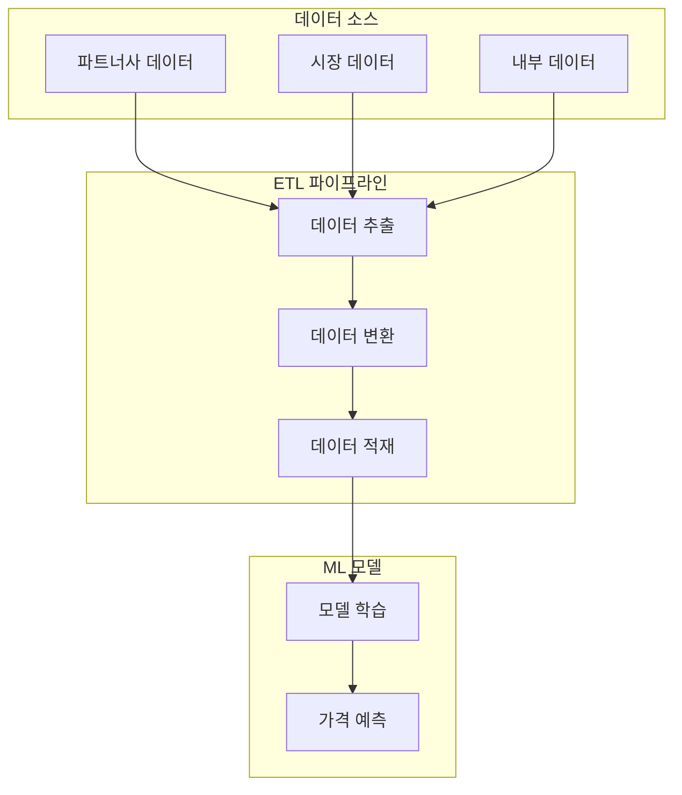
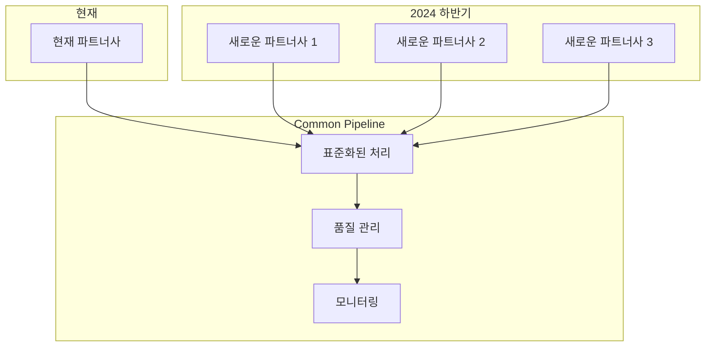

<style>
.mermaid {
  width: 100%;
  max-width: 100%;
  margin: 20px auto;
  font-size: 14px;
  font-family: 'Arial', sans-serif;
  overflow: hidden;
}
.mermaid .node rect, 
.mermaid .node circle, 
.mermaid .node ellipse, 
.mermaid .node polygon, 
.mermaid .node path {
  fill: #f5f9ff;
  stroke: #4a6da7;
  stroke-width: 1.5px;
}
.mermaid .node text {
  font-size: 14px;
  font-weight: 500;
}
.mermaid .edgeLabel {
  font-size: 12px;
  background-color: white;
  padding: 2px 4px;
  border-radius: 4px;
  box-shadow: 0 1px 3px rgba(0,0,0,0.1);
}
.mermaid .cluster rect {
  fill: #f0f8ff;
  stroke: #4a6da7;
  stroke-width: 1px;
  rx: 8px;
  ry: 8px;
}
.mermaid .label {
  font-size: 16px;
  font-weight: bold;
}
.mermaid .timeline-event {
  font-size: 14px;
}
.mermaid .journey-section {
  font-size: 14px;
  font-weight: bold;
}

/* 모바일 최적화를 위한 미디어 쿼리 */
@media screen and (max-width: 768px) {
  .mermaid {
    font-size: 12px;
    margin: 15px 0;
  }
  .mermaid .node text {
    font-size: 12px;
  }
  .mermaid .edgeLabel {
    font-size: 10px;
    padding: 1px 2px;
  }
  .mermaid .label {
    font-size: 14px;
  }
  .mermaid .timeline-event,
  .mermaid .journey-section {
    font-size: 12px;
  }
}
</style>

# ETL 파이프라인: 데이터 처리 시스템 구축기 - 초기 단계

## 1. 프로젝트 배경

### 1.1 Dynamic Pricing Solution이란?


Dynamic Pricing Solution은 실시간으로 시장 상황과 경쟁사 가격을 분석하여 최적의 가격을 결정하는 시스템입니다. 이 시스템의 핵심은 정확하고 신뢰할 수 있는 데이터입니다.

### 1.2 ETL 파이프라인의 필요성


ML 모델의 정확한 학습을 위해서는 다양한 데이터 소스에서 수집된 데이터를 정제하고 통합하는 과정이 필요합니다. 이 과정을 자동화하고 효율적으로 관리하기 위해 ETL 파이프라인이 필요합니다.

### 1.3 Common Pipeline이 필요한 이유


2024년 하반기에 여러 파트너사가 추가될 예정입니다. 각 파트너사마다 다른 데이터 제공 방식과 품질 기준을 가지고 있어, 이를 효율적으로 통합 관리하기 위해서는 Common Pipeline이 필요합니다.

## 2. 대용량 데이터 처리 아키텍처

### 2.1 핵심 과제
이번 ETL 파이프라인의 핵심 과제는 **매일 수신되는 4만 개 이상의 `.tar.gz` 파일과 수십만 개의 CSV 파일을 빠르고 안정적으로 병합**하는 것입니다. 파일 개수가 많은 데다, 내부 데이터의 크기도 커지면서 로컬 단일 노드나 일반적인 병렬 처리만으로는 성능과 안정성에 한계가 있었습니다.

#### 2.1.1 해결이 필요한 문제
- 매일 4만 개 이상의 `.tar.gz` 파일을 S3로 수신
- 내부적으로 수십만 개의 `.csv` 파일을 포함
- 이를 테이블별로 병합하여 ML 학습용 테이블 데이터로 저장

이 과정은 단순한 파일 병합이 아닌 다음과 같은 과제가 동반됩니다:
- CSV 파일 수십만 개로 인한 메모리 과부하 및 OOM 이슈
- 컬럼 불일치, 누락 값, 파일 구조 오류
- 파일 단위 병합 실패 시 전체 작업 실패 가능성

### 2.2 아키텍처 선택과 이유

#### 2.2.1 .tar.gz 해제 Task와 병합 Task 분리

##### 배경 문제
- `.tar.gz` 파일을 직접 Spark로 읽는 것은 불가능하며, 별도 Python 코드로 압축 해제가 필요
- 해제된 파일의 구조 파악 후 병합이 가능하므로 Task 분리가 자연스러움

##### 선택 이유
- Task 분리로 인해 각 단계별 실패 지점 파악이 용이
- 압축 해제 이후 경량화된 메타 파일(summary.txt)로 병합 Task 구성 가능

#### 2.2.2 Notebook → Workflow 전환

##### 배경 문제
- 초기에는 Databricks Notebook으로 수동 실행
- 점차 운영 자동화를 위해 Workflow로 전환 필요

##### 선택 이유
- Airflow처럼 Job 의존성 구성 가능
- 각 Task의 재시도 정책, 알림 설정, 병렬 실행이 가능해짐

#### 2.2.3 Databricks 클러스터 기반 Spark 분산 처리

##### 배경 문제
- `.tar.gz` 내부의 CSV 파일 수가 수천 개에 달하며, 압축 해제 후 S3에서 읽어야 할 전체 파일 수가 **10만 개 이상**
- CSV 병합 작업에서 **단일 머신 메모리 초과 (Driver 재시작) 현상 발생**
- 모든 테이블을 한 번에 처리하려다 **Spark Job이 timeout 또는 GC overhead**로 실패

##### 선택 이유
- Databricks는 Apache Spark 기반으로 **대규모 데이터를 병렬로 읽고 병합** 가능
- `spark.read.option(...).csv(...)`는 분산된 S3 객체를 자동으로 병렬 read
- `coalesce(1)`로 단일 파일로 병합하되, **read와 shuffle까지는 분산 처리**되므로 성능 유지 가능

##### 효과
- 병합 작업 시간이 기존 대비 **50% 이상 감소**
- 병합 중단 없이 OOM이나 GC 에러 없이 안정적 처리 가능

#### 2.2.4 Worker 노드 자동 스케일링 (2~4개로 설정)

##### 배경 문제
- 고정 노드로 구성할 경우, 일별 데이터 편차에 따라 **과소 혹은 과잉 할당 발생**
- 비용 최적화와 처리 속도 간의 균형 필요

##### 선택 이유
- Databricks 클러스터에 **Autoscaling(자동 스케일링)** 기능을 적용
- 초기에는 2개로 시작, 필요 시 최대 4개까지 자동 확장
- 병합 Task 개수에 따라 Executor 개수가 유동적으로 증가

##### 효과
- 데이터 양이 많을 때만 자원을 늘려 비용 최소화
- 처리량 급증 시에도 스케일 업을 통해 SLA 지연 방지

#### 2.2.5 테이블별 독립 병렬 처리 구조

##### 배경 문제
- 테이블 간 파일 수와 구조가 상이하여 **일괄 처리 시 특정 테이블이 병목 요인**
- 전체 병합이 한 테이블 실패로 중단되는 **single point of failure** 구조

##### 선택 이유
- 테이블별 병합을 `ThreadPoolExecutor`로 병렬 실행
- 병합 작업 실패 시 **해당 테이블만 실패 로그로 출력**, 나머지는 계속 처리
- Spark App도 테이블별 `SparkSession`으로 구성하여 독립 실행

##### 효과
- 23개 테이블 기준 평균 6~8개 병렬 처리 → 전체 수행 시간 30% 이상 단축
- 특정 테이블 장애 발생 시, 재처리 대상만 선별 가능 (재시도 비용 최소화)
- 이후 다른 파트너사 구조로 확장할 때, 테이블 단위 병합 재사용 가능

### 2.3 아키텍처 효과 요약

| 항목 | 선택 | 기대 효과 |
|------|------|-----------|
| 분산 처리 | Spark + Databricks | 대량 CSV 읽기/병합 안정성 확보 |
| 클러스터 구성 | 자동 스케일링 (2~4 노드) | 비용 최적화 + 유동적 자원 할당 |
| 병합 구조 | 테이블별 독립 병렬 처리 | 부분 실패 대응 + 확장성 확보 |

### 2.4 구조도: Task 분리 + 병렬 병합 처리
```mermaid
graph TD
    A[Start: Completed 파일 4개 감지] --> B[압축 해제 Task (Python Wheel)]
    B --> C[summary.txt 생성]
    C --> D[병합 Task (Spark 기반)]
    D --> E[merged_<table>.csv 저장 및 리네이밍]
    E --> F[summary.txt 업로드 및 알림]
```

### 2.5 테이블별 정합성 검사 및 summary 기록

자동 병합 시 다음 항목 검증 및 summary에 기록:

| 항목 | 설명 |
|------|------|
| 컬럼 수 불일치 | 병합 대상 파일 간 컬럼 수가 다른 경우 |
| 컬럼 이름 불일치 | 병합 대상 파일 간 컬럼명이 다른 경우 |
| Null 필드 존재 | 특정 필드에 null이 다수 존재하는 경우 |
| 병합 실패 여부 | 파일 읽기 실패 등 병합 실패 시 이유 기록 |

예시:
```
=== Merge Summary (2025-04-01) ===
Table: fdrentalinfo
 - Files merged: 32
 - Column mismatch: No
 - Null fields: rental_price (12 nulls)
 - Merge status: SUCCESS

Table: fdrateplanchannelmapping
 - Files merged: 5
 - Column mismatch: Yes (3 unique schemas)
 - Merge status: FAILED (Column mismatch)
```

활용 방식:
- summary.txt는 S3 업로드 후 Slack/Webhook으로 자동 전달
- 이상 징후 탐지 및 재처리 기준 마련에 활용

## 3. 현재 작업 내용

### 3.1 데이터 처리 현황
- **데이터 소스**: 현재 파트너사의 데이터
  - `.tar.gz` 압축 파일 (4만 개 이상)
  - `.csv` 파일 (수십만 개)
  - 일별 데이터 제공

- **처리 환경**
  - Databricks 클러스터
  - 자동 스케일링 (2~4 노드)
  - S3 기반 스토리지

### 3.2 주요 작업


- 압축 파일 처리 및 데이터 추출
- 테이블별 데이터 병합
- 중복 제거 및 데이터 정제
- Config 테이블(17개)과 Transaction 테이블(3개) 분류

### 3.3 직면한 과제

#### 3.3.1 데이터 품질 이슈
- **데이터 무결성(Integrity) 문제**
  - 단순 append 방식으로 저장 불가
  - 과거 데이터부터 스냅샷 형태로 제공
  - 40,000개 이상의 파일을 scatter하게 받아야 함
  - 이를 다시 하나의 테이블로 병합하는 작업 필요
  - 데이터 구조의 불일치
  - 파일명과 실제 데이터 구조의 불일치
  - 테이블별 데이터 포맷 차이
  - 누락된 필드나 잘못된 데이터 타입

#### 3.3.2 기술적 과제
- **처리 효율성 문제**
  - 대용량 파일 처리의 어려움
  - 메모리 사용량 최적화 필요
  - 처리 시간 개선 필요
- **시스템 안정성**
  - 에러 처리 및 복구 전략
  - 데이터 검증 및 모니터링
  - 시스템 리소스 관리

#### 3.3.3 다중 파트너사 데이터 품질 관리의 어려움

현재 우리가 처리하고 있는 파트너사의 데이터는 향후 추가될 여러 파트너사들 중 하나일 뿐입니다. 각 파트너사마다 다른 데이터 제공 방식과 품질 기준을 가지고 있어, 이를 통합적으로 관리하는 것이 주요 과제입니다.

##### 현재 파트너사의 데이터 특성
- **데이터 제공 방식**
  - `.tar.gz` 압축 파일과 개별 `.csv` 파일 혼합
  - 일별 데이터 제공
  - 스냅샷 형태의 전체 데이터 제공

##### 향후 파트너사 확장 시 고려사항
- **데이터 제공 방식의 다양성**
  - API 기반 실시간 데이터 제공
  - 파일 기반 배치 데이터 제공
  - 데이터베이스 직접 접근
  - 클라우드 스토리지 연동

- **데이터 품질 기준의 차이**
  - 데이터 정합성 검증 기준
  - 필수 필드 정의
  - 데이터 타입과 포맷
  - 업데이트 주기와 방식

##### 통합 품질 관리 전략
- **표준화된 검증 프로세스**
  - 파트너사별 데이터 매핑 규칙 정의
  - 공통 데이터 품질 메트릭 설정
  - 자동화된 검증 파이프라인 구축

- **유연한 처리 구조**
  - 파트너사별 커스텀 프로세서 구현
  - 공통 인터페이스 정의
  - 확장 가능한 검증 규칙 엔진

- **모니터링과 알림**
  - 파트너사별 품질 지표 모니터링
  - 이상 징후 조기 감지
  - 자동화된 문제 보고 시스템

## 4. 향후 계획

### 4.1 단기 계획 (3개월)
- **데이터 품질 강화**
  - 자동 검증 시스템 구축
  - 품질 메트릭 모니터링
- **성능 최적화**
  - 처리 속도 개선
  - 리소스 효율화

### 4.2 중기 계획 (6개월)
- **기능 확장**
  - 실시간 처리 지원
  - 다중 데이터 소스 통합
- **운영 효율화**
  - 자동 모니터링
  - 예측 유지보수

### 4.3 장기 계획 (1년)
- **시스템 안정화**
  - 자동 복구 메커니즘
  - 장애 예방 시스템
- **확장성 강화**
  - 새로운 파트너사 통합
  - 새로운 데이터 형식 지원

## 5. 개인적인 소감

### 5.1 데이터 품질의 중요성
파이프라인을 만드는 것이 주요 작업일 것이라고 생각했는데, 실제로는 데이터 품질 관리(DQA)가 훨씬 더 큰 작업이었다. 코드 몇 줄로 데이터를 A에서 B로 옮기는 것은 상대적으로 쉽지만, 그 데이터가 신뢰할 수 있고 일관된 것인지 확인하는 과정에 더 많은 노력이 필요했다.

### 5.2 확장성과 실용성의 균형
아직 추가되지도 않은 데이터 소스들을 미리 고려하면서 설계하는 것이 생각보다 어려웠다. 코드를 나중에 적게 수정할 수 있도록 만들려고 했는데, 오히려 각 데이터 출처별로 맞춤형 변환기를 만드는 방식을 선택하니 코드가 계속 늘어나는 것 같았다. 확실히 추가될 요소라면 미리 구현하되, 불확실한 미래를 위해 너무 복잡한 설계를 하는 것은 과감히 포기하는 것도 필요하다는 교훈을 얻었다.

### 5.3 데이터를 통한 비즈니스 인사이트
ETL 파이프라인을 구축하면서 가장 흥미로웠던 점은 데이터를 통해 비즈니스의 작동 방식을 들여다볼 수 있다는 것이었다. 수많은 변수들이 실시간으로 데이터에 영향을 미치는 것을 보면서, 비즈니스 규칙들이 실제로 어떻게 동작하는지 목격하는 것 같았다. 기술을 통해 비즈니스의 숨겨진 패턴을 발견하고 이해하는 과정이 마치 퍼즐을 맞추는 것처럼 즐거웠다.

## 용어 정리

### ETL 관련
- **ETL (Extract, Transform, Load)**: 데이터를 추출하고 변환하여 저장하는 과정
- **데이터 파이프라인**: 데이터를 한 지점에서 다른 지점으로 이동하고 처리하는 시스템
- **데이터 품질 검증**: 데이터의 정확성, 완전성, 일관성을 확인하는 과정

### 데이터 처리 관련
- **Config 테이블**: 설정 정보를 저장하는 테이블 (17개)
- **Transaction 테이블**: 거래 정보를 저장하는 테이블 (3개)
- **데이터 병합**: 여러 파일의 데이터를 하나로 통합하는 과정
- **중복 제거**: 동일한 데이터의 중복을 제거하는 과정

### 기술 스택 관련
- **Databricks**: 대규모 데이터 처리와 분석을 위한 통합 플랫폼
- **AWS S3**: 클라우드 기반 객체 스토리지 서비스
- **Python**: 프로그래밍 언어