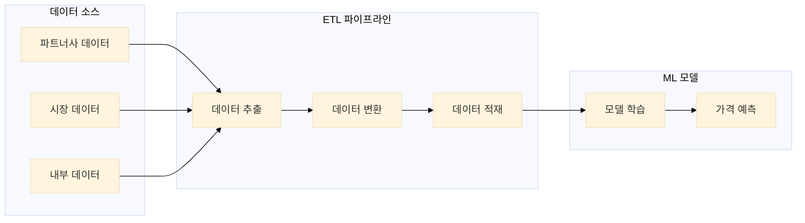
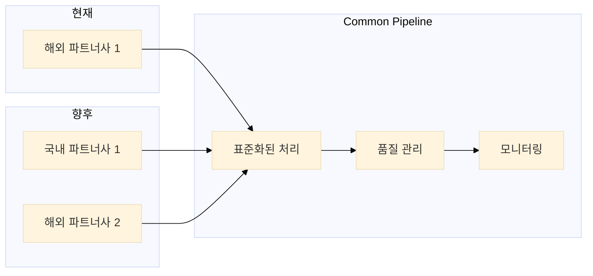
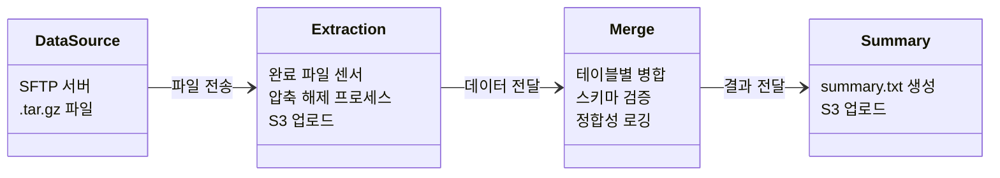
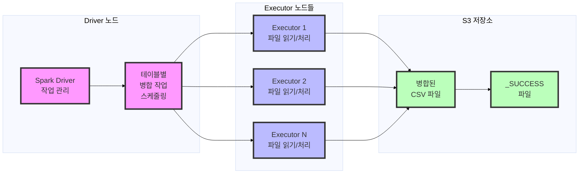
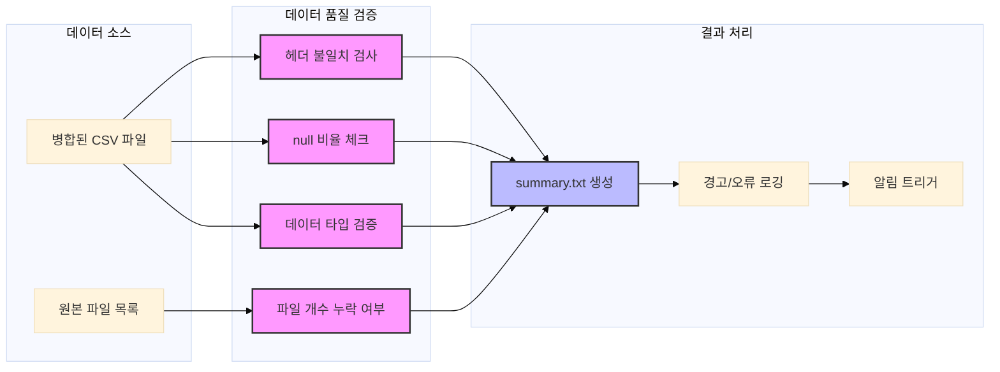
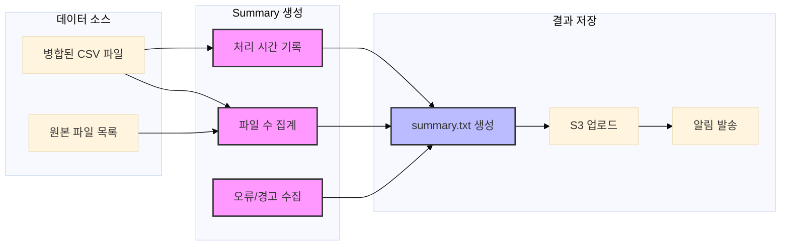
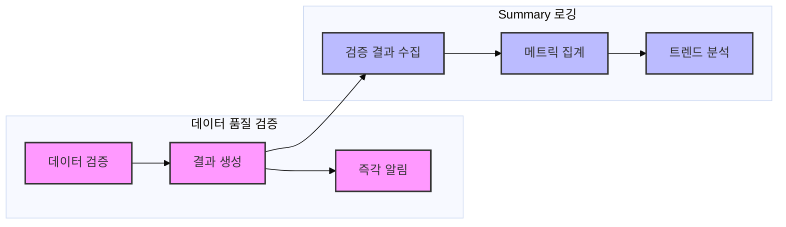

## 1. 개요 및 배경

작년에 저희 팀은 호텔 예약 플랫폼에 다이나믹 프라이싱 서비스를 런칭했고, 올해 저는 파이프라인 구축 담당으로 투입되었습니다. 다이나믹 프라이싱이란 시장 상황, 수요 변화, 경쟁사 가격 등 다양한 요소를 실시간으로 분석하여 최적의 호텔 객실 가격을 자동으로 책정하는 시스템입니다. 현재는 해외 파트너사 하나의 데이터만 처리하고 있지만, 곧 국내외 파트너사가 추가로 합류할 예정입니다. 문제는 각 파트너마다 데이터 구조와 형식이 제각각이라, 이를 효율적으로 통합 처리할 수 있는 표준화된 파이프라인이 필요했습니다.

그동안 저는 주로 사내 툴 개발만 해왔기 때문에, 하루에 4만 개가 넘는 파일을 처리하는 빅데이터 환경은 완전히 새로운 세계였습니다. 분산 처리 시스템을 구축하고, 작업을 병렬화하며, 대용량 파일을 병합하는 등 실제 문제를 해결하면서 이론으로만 알고 있던 빅데이터 개념들을 직접 구현해보는 재미를 느낄 수 있었습니다. 특히 책이나 강의에서 배웠던 분산 컴퓨팅 원리가 실제 환경에서 어떻게 적용되는지 경험하고, 그 과정에서 발생하는 다양한 도전 과제들을 해결하며 데이터 엔지니어링에 대한 실전 역량을 키울 수 있었습니다.

> 이 글은 완성된 솔루션을 제시하는 것이 아니라, 대규모 데이터 엔지니어링과 배치 프로세싱 도입 과정에서 겪은 시행착오와 교훈을 기록한 학습 여정입니다.

## 2. 프로젝트 배경 상세

호텔 예약 플랫폼의 핵심 서비스인 다이나믹 프라이싱 시스템을 운영하고 있습니다. 이 서비스는 실시간으로 시장 상황과 경쟁사 가격을 분석하여 최적의 가격을 결정하는 시스템으로, 향후 다양한 파트너사로 서비스 제공을 확대할 계획입니다.

기존 데이터 파이프라인의 주요 문제점:
1. **스키마 종속성**: 레거시 시스템 전용 스키마로 타 파트너사 데이터 재활용 불가
2. **스토리지 비용 상승**: 지속적인 원본 데이터 적재로 관리 비용과 스토리지 비용 증가
3. **비효율적인 인제스트 방식**: 변경 감지 메커니즘 부재로 중복 적재 및 리소스 낭비
4. **DQA 체계 부재**: 실시간/배치 기반 데이터 품질 검증 체계 미흡

현재 파트너사의 데이터는 CSV 파일로 단편화되어 있고, 테이블명과 컬럼이 불명확하여 의미를 파악하기 어렵습니다. NULL 값과 중복 레코드가 다수 존재하며, 프라이머리 키 충돌이 빈번하여 데이터 무결성이 떨어져 증분 적재(incremental append)도 불가능하고 일일 스냅샷으로 전체 데이터를 오버라이트하고 있는 상황입니다.

### 1.5 Dynamic Pricing Solution 구조


Dynamic Pricing Solution은 실시간으로 시장 상황과 경쟁사 가격을 분석하여 최적의 가격을 결정하는 시스템입니다. 시스템의 핵심은 정확하고 신뢰할 수 있는 데이터입니다.

### 1.6 ETL 파이프라인의 필요성


ML 모델의 효과적인 학습을 위해서는 다양한 출처에서 수집된 데이터를 정제하고 통합하는 과정이 필수적입니다. 이를 통해 데이터의 품질을 높이고, 모델의 예측 정확도를 향상시킬 수 있습니다. 이러한 데이터 정제 및 통합 과정을 자동화하고 효율적으로 관리하기 위해 ETL 파이프라인을 구축하게 되었습니다. 여기서 시장 데이터는 예약 내역을 포함하며, 내부 데이터는 호텔 정보, 국가 설정 등 다양한 설정 데이터를 포함합니다.

### 1.7 Common Pipeline이 필요한 이유


현재 해외 파트너사 1곳의 데이터를 처리하고 있으며, 향후 국내 파트너사 1곳과 추가 해외 파트너사 1곳이 추가될 예정입니다. 각 파트너사마다 데이터 제공 방식과 품질 기준이 상이합니다. 이러한 다양한 데이터 소스를 효율적으로 통합 관리하기 위해서는 표준화된 Common Pipeline이 필수적입니다.

## 3. 단계적 접근 전략

이 프로젝트는 문제를 모듈화하여 단계적으로 접근했습니다:

| Phase | 설명 |
|------|------|
| **Phase 1** | SFTP → S3 → 병합 파이프라인 마이그레이션<br>- 기존 Airflow 기반 SFTP 수신 및 S3 저장 파이프라인을 Databricks로 마이그레이션<br>- 40,000개 이상의 파일을 효율적으로 처리하는 병합 작업 구현 |
| **Phase 2** | 데이터 인제스트, 스키마 정규화, 스토리지 최적화<br>- 다양한 파트너사의 데이터 인제스트 방식을 수용할 수 있도록 파이프라인 리팩토링<br>- 스키마 처리 로직을 유연하게 설계하여 이기종 데이터 구조 대응 |
| **Phase 3** | DQA(Data Quality Assurance) 및 데이터 인제스트 표준화<br>- 데이터 품질 검증 프로세스 구현 및 자동화<br>- 다양한 파트너사의 데이터 인제스트 방식을 표준화된 방식으로 통합 |
| **Phase 4** | 스키마 통합 및 최적화<br>- 파트너사별 상이한 스키마를 통합된 형태로 정규화<br>- 데이터 사이언티스트들과 협력하여 최적의 스키마 설계 |

## 4. 현재 파트너사의 데이터 특성

현재 해외 파트너사로부터 수신하는 데이터는 다음과 같은 특성을 갖고 있습니다:

- **데이터 볼륨**
  - 일일 약 40,000개 이상의 `.tar.gz` 압축 파일 수신
  - 각 압축 파일은 약 100MB~500MB 크기
  - 압축 파일 내부에는 테이블별 `.csv` 파일 수십만 개 포함

- **데이터 스키마**
  - 파일명 패턴: `{table_name}_{date}_{batch_id}.csv` 형식으로 제공
  - 테이블마다 스키마와 컬럼 수가 상이 → 병합시 스키마 불일치 이슈
  - 일부 테이블은 일자별 스키마 변동 가능성으로 다이나믹 스키마 핸들링 필요

- **데이터 품질 관리 요건**
  - 데이터 누락/오류 발생 시 ML 파이프라인에 치명적 영향
  - 데이터 정합성과 처리 효율성을 위한 표준화된 프로세싱 필요

## 5. 문제 정의와 구조 개선 과정

### 5.1 초기 접근의 실패

처음에는 문제를 단순하게 접근했습니다. "파일을 읽어서 병합하면 되겠지"라는 생각으로 시작했지만, 실제로는 여러 기술적 한계에 부딪혔습니다.

로컬 환경에서 간단한 Python 스크립트로 접근했으나, 데이터 볼륨이 과도하여 처리 시간이 지나치게 길어지고 리소스 부족으로 프로세스가 종료되는 이슈가 발생했습니다. 확장성을 고려한 복잡한 로직을 구현하다 보니 실행조차 되지 않는 코드만 늘어나는 문제에 직면했습니다.

마침 데이터팀 전체가 Airflow에서 Databricks로 워크플로우 플랫폼을 마이그레이션하는 중이었기 때문에, 이 기회에 바로 Databricks 환경으로 개발을 전환했습니다.

- **메모리 제한**: Python `pandas`로 4만 개 파일 처리 시도 → OOM(Out of Memory) 오류 발생
- **병렬화 시도**: `multiprocessing` 도입 → 프로세스 간 메모리 공유 제약으로 성능 향상 미미
- **Spark 도입**: `coalesce(1)`로 모든 테이블 일괄 병합 시도 → Driver 메모리 부족으로 Job 실패

### 5.2 구조 개선 과정

초기 실패를 통해 다음과 같은 인사이트를 얻었습니다:

1. **워크로드 특성 차이**
   - `.tar.gz` 압축 해제: CPU-bound 작업
   - 파일 병합: IO-bound + Spark shuffle 오퍼레이션
   - 상이한 특성을 가진 작업은 분리 필요

2. **디버깅 복잡성**
   - 단일 Notebook에서 모든 로직 실행
   - 오류 발생 시 근본 원인 분석 어려움
   - 높은 결합도로 인한 부분 수정 어려움

3. **장애 복구 비효율성**
   - 병합 작업 실패 시 압축 해제부터 재실행 필요
   - 이미 성공한 작업도 반복 실행

### 5.2.2 Task 분리 아키텍처 도입


### 5.3 Task 분리 아키텍처 도입

문제 해결을 위해 파이프라인을 독립적인 Task들로 분리했습니다:

- **압축 해제 Task**: Python `tarfile` 모듈 활용, S3에 직접 업로드하여 중간 스토리지 최소화
- **병합 Task**: 테이블별 메타데이터 파일(`table_metadata.json`) 생성하여 스키마 정보 공유
- **Task 간 독립성**: 각 Task는 독립적인 Databricks 클러스터에서 실행, 리소스 경합 방지
- **느슨한 결합(Loose Coupling)**: Task 간 데이터는 S3 경로를 파라미터로 전달

### 5.4 Workflow 기반 전환

Task 분리 후, 더 나은 관리와 자동화를 위해 Databricks Workflow로 전환했습니다:

- **Workflow 구성 세부사항**
  - `pre_set_date`: process_date 파라미터가 미설정 시 어제 날짜로 디폴트 설정
  - `wait_for_all_sources`: 모든 소스 파일 Readiness 체크
  - `batch_extract`: .tar.gz 파일 압축 해제 및 S3 업로드
  - 각 테이블별 `merge_*` task: 독립적인 병합 작업 수행
  - `merge_summary`: 모든 병합 완료 후 summary.txt 생성
  - `post_merge_check`: 최종 결과 검증

- **Workflow 전환의 이점**
  - 병렬 프로세싱 최적화: 각 테이블 병합을 독립적으로 실행하여 전체 처리 시간 단축
  - 장애 복구 효율화: 실패한 task만 선택적 재실행 가능
  - 모니터링 고도화: 태스크별 상태 실시간 트래킹
  - 유지보수성 향상: 태스크별 책임 명확화
  - 스케일 아웃: 새로운 테이블 통합 용이성

## 6. 성능 최적화 전략

### 6.1 Spark 분산 처리 아키텍처

- **문제**: `pandas` 기반 병합 시 4만 개 파일은 메모리 한계 초과, Spark도 23개 테이블 일괄 처리 시 Driver 과부하로 종료

- **솔루션**:
  - 병합 작업을 **테이블 단위로 샤딩**
  - 테이블별 개별 `SparkSession` 생성
  - Spark에서 `coalesce(1)`로 단일 CSV로 저장하되, 읽기/셔플은 분산 처리 유지

- **Spark 튜닝 파라미터**:
  - `spark.default.parallelism`: Executor 코어 수의 2배로 설정하여 병렬성 극대화
  - `spark.sql.shuffle.partitions`: 데이터 볼륨에 최적화된 파티션 수로 동적 조정
  - `spark.memory.fraction`: 0.8로 상향 조정하여 셔플 메모리 할당 최적화
  - `spark.sql.adaptive.enabled=true`: AQE(Adaptive Query Execution) 활성화로 동적 최적화

### 6.1.2 Spark 분산 처리 아키텍처 상세 다이어그램


### 6.2 리소스 최적화

- **솔루션**:
  - `min_workers=2, max_workers=4`의 Auto-scaling Databricks 클러스터 구성
  - 워크로드 증가 시 자동 스케일 아웃
  - 비용 효율성과 성능 사이의 균형점 확보

- **클러스터 컨피그레이션**:
  - 인스턴스 타입: 표준 VM (32GB RAM, 8 코어)로 설정하여 비용 대비 성능 최적화
  - 오토스케일링 트리거: CPU 사용률 70% 이상 지속 5분 초과 시 스케일 아웃
  - 스케일 다운 지연: 10분으로 설정하여 일시적 부하 변동 시 불필요한 스케일 다운 방지
  - 스팟 인스턴스: 비용 절감을 위해 스팟 인스턴스 50% 비율로 구성

### 6.2.2 데이터 처리 최적화 상세 다이어그램

```mermaid
%%{init: {
  'theme': 'base',
  'themeVariables': {
    'fontSize': '20px',
    'fontFamily': 'arial',
    'lineHeight': '1.5',
    'textAlignment': 'center'
  }
}}%%
graph LR
    subgraph "Phase 1: 초기 구현"
        direction LR
        P1[로컬 Python<br/>단일 프로세스] --> P2[메모리 부족<br/>OOM 발생]
    end

    subgraph "Phase 2: 분산 처리"
        direction LR
        S1[Spark 도입<br/>분산 처리] --> S2[Driver 노드<br/>과부하]
    end

    subgraph "Phase 3: 최적화"
        direction LR
        O1[테이블별<br/>독립 처리] --> O2[Spark 튜닝<br/>파라미터 최적화] --> O3[Auto-scaling<br/>클러스터]
    end

    P2 ==> S1
    S2 ==> O1

    style P1 fill:#ffcccc,stroke:#333,stroke-width:2px
    style P2 fill:#ffcccc,stroke:#333,stroke-width:2px
    style S1 fill:#ffffcc,stroke:#333,stroke-width:2px
    style S2 fill:#ffffcc,stroke:#333,stroke-width:2px
    style O1 fill:#ccffcc,stroke:#333,stroke-width:2px
    style O2 fill:#ccffcc,stroke:#333,stroke-width:2px
    style O3 fill:#ccffcc,stroke:#333,stroke-width:2px

    classDef phase1 fill:#ffcccc,stroke:#333,stroke-width:2px;
    classDef phase2 fill:#ffffcc,stroke:#333,stroke-width:2px;
    classDef phase3 fill:#ccffcc,stroke:#333,stroke-width:2px;
```


## 7. 데이터 품질 검증 및 summary 로깅

### 7.1 데이터 품질 검증

데이터 품질 검증의 중요성:
- ML 모델 학습 데이터 품질은 예측 정확도에 직결
- 파트너사 데이터 제공 방식 변경 시 자동 감지 필요
- 데이터 누락/오류는 의사결정에 치명적 영향 가능

데이터 품질 관리의 실제 도전 과제:
- **품질 차원의 다양성**: NULL 값, 컬럼 누락 외에도 데이터 타입 불일치, 비즈니스 룰 위반, 이상치(outlier) 등 다양한 품질 이슈 존재
- **품질 메트릭의 컨텍스트 종속성**: 비즈니스 컨텍스트에 따라 품질 기준이 상이함
- **시계열적 품질 변동**: 파트너사 데이터 제공 패턴 변화로 예측 불가능한 품질 이슈 발생
- **대규모 데이터 검증의 오버헤드**: 수만 개 파일의 자동화된 검증 체계 구축 난이도

### 7.1.3 데이터 품질 검증 프로세스

이 프로세스는 데이터의 품질을 검증하는 핵심 단계를 보여줍니다:



**데이터 품질 검증 프로세스의 특징**:
1. **검증 범위**: 데이터의 구조적, 의미적 품질을 모두 검사
   - 헤더 불일치: 스키마 정합성 검증
   - NULL 비율: 데이터 완전성 검증
   - 파일 개수: 데이터 누락 여부 확인
   - 데이터 타입: 값의 유효성 검증

2. **검증 방식**: 다각도의 동시 검증 수행
   - 병합된 CSV 파일에 대한 다중 검증
   - 원본 파일과의 비교 검증

3. **결과 처리**: 단계적 에스컬레이션
   - 검증 결과를 summary.txt에 기록
   - 이슈 발생 시 경고/오류 로깅
   - 심각한 문제 발생 시 알림 트리거

### 7.2 Summary 로깅

Summary 로깅은 전체 ETL 프로세스의 실행 메트릭과 성능을 모니터링하기 위한 메타데이터를 수집하고 기록하는 프로세스입니다:

- **파일 카운트 집계**: 원본 및 병합 후 파일 수 검증
- **레이턴시 측정**: 단계별 처리 소요 시간 트래킹
- **오류/경고 집계**: 모든 예외 상황 및 경고 로깅
- **알람 트리거링**: 임계치 초과 시 담당자 자동 알림

### 7.2.2 Summary 로깅 상세 다이어그램

이 프로세스는 ETL 파이프라인의 실행 결과와 성능 메트릭을 기록하는 과정을 보여줍니다:



**Summary 로깅의 특징**:
1. **메트릭 수집**: 파이프라인 실행에 대한 종합적인 정보 수집
   - 파일 수 집계: 입력/출력 파일 수 비교
   - 처리 시간: 각 단계별 소요 시간 측정
   - 오류/경고: 발생한 모든 이슈 수집

2. **결과 저장**: 영구 스토리지에 기록
   - summary.txt 생성
   - S3에 영구 보관
   - 필요 시 알림 발송

**두 프로세스의 주요 차이점**:
1. **목적의 차이**
   - 데이터 품질 검증: "데이터가 올바른가?"라는 질문에 답변
   - Summary 로깅: "파이프라인이 제대로 작동하는가?"라는 질문에 답변
- 두 프로세스를 통해 데이터와 시스템 모두의 신뢰성 확보

**3. 실제 활용 사례**

예를 들어, 특정 테이블의 NULL 비율이 높게 감지되는 경우:
```
1. 데이터 품질 검증
   - NULL 비율 임계치 초과 감지
   - 담당자에게 즉시 알림 발송
   - 검증 결과를 로그에 기록

2. Summary 로깅
   - 품질 검증 결과 수집
   - NULL 비율 추이 기록
   - 장기적인 품질 지표 산출
```

**4. 통합 모니터링 효과**
- **단기적 관점**: 데이터 품질 검증을 통한 즉각적인 문제 감지와 대응
- **장기적 관점**: Summary 로깅을 통한 시스템 개선 포인트 도출
- **종합적 분석**: 두 프로세스의 결과를 종합하여 데이터 파이프라인의 전반적인 건강도 평가

이처럼 두 프로세스는 서로 다른 시간 범위와 목적을 가지고 있지만, 전체 시스템의 안정성과 신뢰성을 보장하는 데 상호 보완적으로 기여합니다. 이러한 이중 검증 구조를 통해 데이터 품질 문제를 조기에 발견하고, 장기적인 개선 방향을 수립할 수 있습니다.

### 7.2.3 데이터 품질 검증과 Summary 로깅의 관계

현재는 데이터 품질 검증과 Summary 로깅이 각각 독립적으로 구현되어 있지만, 향후 다음과 같은 통합 프로세스를 구축할 계획입니다:



## 8. 현재까지의 구현과 향후 계획

### 8.1 현재 구현 상태

**1. 기본 파이프라인 구축**
- Airflow에서 Databricks로 워크플로우 마이그레이션 완료
- 테이블별 독립 처리를 통한 OOM 문제 해결
- 기본적인 에러 로깅 구현

**2. 실제 적용 중인 기능**
- 압축 파일 해제 및 S3 업로드
- 테이블별 병합 작업 수행
- 기본적인 파일 수 검증

### 8.2 개선이 필요한 부분

**1. 아키텍처 관점**
- 현재는 모놀리식에 가까운 구조
- 테이블 간 의존성 처리 로직 부재
- 장애 복구 전략 미흡

**2. 성능 관점**
- Spark 튜닝 최적화 필요
- 리소스 사용량 모니터링 체계 부재
- 병렬 처리 효율 개선 필요

### 8.3 향후 개선 계획

**1. 아키텍처 개선**
- 마이크로서비스 아키텍처 도입 검토
- 이벤트 기반 아키텍처로 전환
- 멀티 테넌시 지원을 위한 구조 개선

**2. 모니터링 강화**
- Datadog 기반 모니터링 대시보드 구축
- SLO/SLA 정의 및 모니터링
- 알림 체계 고도화

**3. 데이터 품질 관리**
- 자동화된 데이터 검증 파이프라인 구축
- 품질 메트릭 정의 및 측정
- 실시간 이상 감지 시스템 도입

**4. 개발 프로세스 개선**
- CI/CD 파이프라인 구축
- 테스트 자동화
- 코드 품질 관리 도구 도입

## 9. SWE 관점에서의 교훈

### 9.1 기술적 교훈

현재까지 경험한 주요 문제점:
- 초기 설계 시 확장성 고려 부족
- 테스트 코드 부재로 인한 신뢰성 저하
- 모니터링/알림 체계 미비

향후 적용할 개선 방안:
- 설계 단계부터 확장성 고려
- TDD 기반 개발 프로세스 도입
- 체계적인 코드 리뷰 프로세스 수립

### 9.2 협업 관점의 교훈

현재 상태:
- ML팀과의 비정기적 커뮤니케이션
- 문서화 부족으로 인한 지식 공유 어려움

개선 계획:
- API 계약 기반 협업 체계 수립
- 기술 문서화 프로세스 정립
- 정기적인 크로스팀 리뷰 세션 운영

## 10. 결론

이번 프로젝트를 통해 SWE로서 대규모 데이터 처리 시스템을 설계하고 구현하는 과정에서 많은 교훈을 얻었습니다. 특히 초기 설계의 중요성과 점진적인 개선의 필요성을 체감했습니다.

현재는 기본적인 파이프라인만 구축된 상태이지만, 앞으로 마이크로서비스 아키텍처 도입, 테스트 자동화, 모니터링 체계 구축 등을 통해 더 견고하고 확장 가능한 시스템으로 발전시켜 나갈 계획입니다.