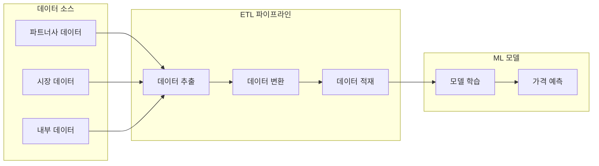
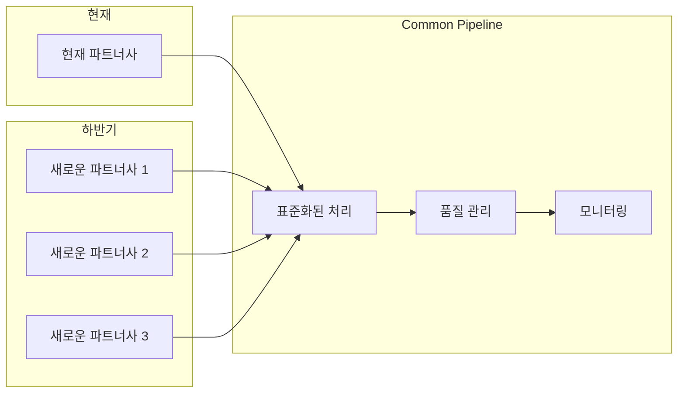
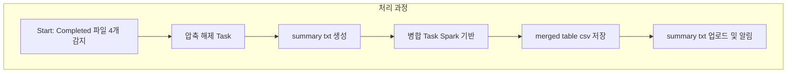

# ETL 파이프라인: 데이터 처리 시스템 구축기 - 초기 단계

## 1. 프로젝트 배경

### 1.1 Dynamic Pricing Solution이란?


Dynamic Pricing Solution은 실시간으로 시장 상황과 경쟁사 가격을 분석하여 최적의 가격을 결정하는 시스템입니다. 시스템의 핵심은 정확하고 신뢰할 수 있는 데이터입니다.

### 1.2 ETL 파이프라인의 필요성


ML 모델의 효과적인 학습을 위해서는 다양한 소스에서 수집한 데이터를 정제하고 통합하는 과정이 필수적입니다. 이 과정을 자동화하고 효율적으로 관리하기 위해 ETL 파이프라인을 구축하게 되었습니다.

### 1.3 Common Pipeline이 필요한 이유


하반기에 여러 파트너사가 추가될 예정이며, 각 파트너사마다 데이터 제공 방식과 품질 기준이 상이합니다. 이러한 다양한 데이터 소스를 효율적으로 통합 관리하기 위해서는 표준화된 Common Pipeline이 필수적입니다.

## 2. 대용량 데이터 처리 아키텍처

### 2.1 핵심 과제
이번 ETL 파이프라인의 첫 단계는 **데이터 수집(Extract) 이전의 데이터 준비 작업**입니다. ML 모델 학습을 위해서는 먼저 파트너사로부터 받은 원본 데이터를 정리해야 합니다.

현재 해결해야 할 과제는 **현재 파트너사의 특수한 데이터 구조**를 처리하는 것입니다. 이 파트너사는 매일 4만 개 이상의 `.tar.gz` 파일을 제공하며, 각 파일 안에는 수십만 개의 CSV 파일이 포함되어 있습니다. 이는 ETL의 Extract 단계를 위한 기초 작업이며, 이후 변환(Transform)과 적재(Load)의 첫걸음입니다.

다른 파트너사들은 API나 데이터베이스 직접 접근 등 다른 방식으로 데이터를 제공할 것으로 예상됩니다. 데이터 품질과 처리 효율성을 위해 표준화된 방식으로 수집하고 처리하는 것이 중요합니다. 현재 파트너사의 복잡한 구조 처리 경험은 향후 다른 파트너사 데이터 통합에 도움이 될 것입니다.

파일 개수가 많고 내부 데이터 크기도 커서 로컬 단일 노드나 일반적인 병렬 처리만으로는 한계가 있었습니다.

#### 2.1.1 해결이 필요한 문제
- CSV 파일 수십만 개 처리 시 메모리 과부하 및 OOM 에러 발생
- 컬럼 불일치, 누락 값, 파일 구조 오류로 인한 데이터 정합성 문제
- 파일 단위 병합 실패 시 전체 작업 실패 위험

### 2.2 아키텍처 선택과 이유

#### 2.2.1 .tar.gz 해제 Task와 병합 Task 분리

##### 배경 문제
- `.tar.gz` 파일을 Spark로 직접 읽는 것은 불가능하며, 별도의 Python 코드로 압축 해제가 필요합니다
- 파일 구조 파악 후 병합이 가능하므로 Task 분리가 필수적입니다

##### 선택 이유
- Task 분리를 통해 각 단계별 실패 지점 파악이 용이합니다
- 압축 해제 이후 경량화된 메타 파일(summary.txt)로 병합 Task 구성이 가능합니다

#### 2.2.2 Notebook → Workflow 전환

##### 실제 문제
- 초기에는 Databricks Notebook으로 수동 실행을 수행했습니다
- 운영 자동화를 위해 Workflow로 전환이 필요했습니다

##### 선택 이유
- Airflow와 유사하게 Job 의존성을 구성할 수 있습니다
- 각 Task마다 재시도 정책, 알림, 병렬 실행이 가능합니다

#### 2.2.3 Databricks 클러스터 기반 Spark 분산 처리

##### 실제 문제
- `.tar.gz` 파일 내부에 수천 개의 CSV 파일이 포함되어 있으며, 전체 파일 수가 10만 개 이상에 달합니다
- CSV 병합 과정에서 단일 머신의 메모리 한계로 인해 Driver가 재시작되는 현상이 빈번하게 발생했습니다
- 테이블을 한꺼번에 처리하려다 Spark Job이 timeout되거나 GC overhead로 인해 실패하는 문제가 발생했습니다

##### 선택 이유
- Databricks는 Spark 기반으로 대규모 데이터를 병렬로 읽고 병합할 수 있습니다
- `spark.read.option(...).csv(...)`를 통해 S3 객체를 자동으로 병렬 read할 수 있습니다
- `coalesce(1)`로 단일 파일로 병합하더라도 read와 shuffle 과정은 분산 처리되어 성능이 유지됩니다

##### 실제 효과
- 병합 작업 시간이 50% 이상 단축되었습니다
- OOM이나 GC 에러 없이 안정적인 처리가 가능해졌습니다

#### 2.2.4 Worker 노드 자동 스케일링 (2~4개로 설정)

##### 실제 문제
- 노드 수를 고정하면 데이터 양에 따라 자원 부족 또는 낭비가 발생합니다
- 비용과 처리 속도 사이의 최적화가 필요했습니다

##### 선택 이유
- Databricks 클러스터의 Autoscaling 기능을 활용했습니다
- 초기 2개 노드로 시작하여 필요에 따라 최대 4개까지 확장합니다
- 병합 Task 개수에 따라 Executor 수가 자동으로 증가합니다

##### 실제 효과
- 데이터 처리량에 따라 자원을 조절하여 비용을 최적화했습니다
- 처리량이 급증해도 스케일 업을 통해 SLA 지연을 방지했습니다

#### 2.2.5 테이블별 독립 병렬 처리 구조

##### 실제 문제
- 테이블별로 파일 수와 구조가 달라 한 테이블이 병목 현상을 일으킬 수 있습니다
- 단일 테이블 실패가 전체 프로세스 실패로 이어질 수 있는 구조였습니다

##### 선택 이유
- 테이블별 병합을 `ThreadPoolExecutor`로 병렬 실행합니다
- 병합 실패 시 해당 테이블만 실패 로그를 남기고 나머지는 계속 처리합니다
- Spark App도 테이블별 `SparkSession`으로 구성하여 독립적으로 실행합니다

##### 실제 효과
- 23개 테이블 기준 평균 6~8개 병렬 처리로 전체 처리 시간이 30% 이상 단축되었습니다
- 테이블 단위 실패 시 해당 테이블만 재처리하면 됩니다
- 향후 다른 파트너사 데이터 처리 시에도 테이블 단위 병합 구조를 재사용할 수 있습니다

### 2.3 아키텍처 효과 요약

| 항목 | 선택 | 기대 효과 |
|------|------|-----------|
| 분산 처리 | Spark + Databricks | 대량 CSV 읽기/병합 안정성 확보 |
| 클러스터 구성 | 자동 스케일링 (2~4 노드) | 비용 최적화 + 유동적 자원 할당 |
| 병합 구조 | 테이블별 독립 병렬 처리 | 부분 실패 대응 + 확장성 확보 |

### 2.4 구조도: Task 분리 + 병렬 병합 처리


### 2.5 테이블별 정합성 검사 및 summary 기록

자동 병합할 때 다음 항목 검증하고 summary에 기록해요:

| 항목 | 설명 |
|------|------|
| 컬럼 수 불일치 | 파일마다 컬럼 수가 다르면 기록 |
| 컬럼 이름 불일치 | 파일마다 컬럼명이 다르면 기록 |
| Null 필드 존재 | 특정 필드에 null이 많으면 기록 |
| 병합 실패 여부 | 파일 읽기 실패 등 병합 실패 이유 기록 |

예시:
```
=== Merge Summary (2025-04-01) ===
Table: fdrentalinfo
 - Files merged: 32
 - Column mismatch: No
 - Null fields: rental_price (12 nulls)
 - Merge status: SUCCESS

Table: fdrateplanchannelmapping
 - Files merged: 5
 - Column mismatch: Yes (3 unique schemas)
 - Merge status: FAILED (Column mismatch)
```

활용 방식:
- summary.txt는 S3 올리고 Slack/Webhook으로 자동 알림
- 이상한 패턴 감지하고 재처리할지 결정하는 데 활용

## 3. 현재 작업 내용

### 3.1 데이터 처리 현황
- **데이터 소스**: 현재 파트너사 데이터
  - `.tar.gz` 압축 파일 (일일 4만 개 이상)
  - `.csv` 파일 (수십만 개)
  - 일일 데이터 수신

- **처리 환경**
  - Databricks 클러스터
  - 자동 스케일링 (2~4 노드)
  - S3 기반 스토리지

### 3.2 주요 작업


- 압축 파일 해제 및 데이터 추출
- 테이블별 데이터 병합 수행
- 중복 제거 및 데이터 정제
- Config 테이블(17개)과 Transaction 테이블(3개) 분류

### 3.3 직면한 과제

#### 3.3.1 데이터 품질 이슈
- **데이터 무결성 문제**
  - 단순 append 방식으로는 저장이 불가능
  - 과거 데이터부터 스냅샷 형태로 제공됨
  - 40,000개 이상의 파일을 분산된 형태로 수신
  - 이를 단일 테이블로 병합하는 과정의 복잡성
  - 파일별 데이터 구조의 불일치
  - 파일명과 실제 데이터 구조의 불일치
  - 테이블별 데이터 포맷의 비일관성
  - 필드 누락 및 데이터 타입 불일치 문제

#### 3.3.2 기술적 과제
- **처리 효율성 문제**
  - 대용량 파일 처리의 한계
  - 메모리 최적화 필요성
  - 처리 시간 개선 과제
- **시스템 안정성**
  - 에러 복구 전략 수립
  - 데이터 검증 체계 구축
  - 시스템 리소스 관리 방안

#### 3.3.3 다중 파트너사 데이터 품질 관리의 과제

현재 처리 중인 파트너사의 데이터는 향후 추가될 여러 파트너사 중 하나입니다. 각 파트너사마다 데이터 제공 방식과 품질 기준이 상이하여, 이를 통합적으로 관리하는 것이 주요 과제입니다.

##### 현재 파트너사의 데이터 특성
- **데이터 제공 방식**
  - `.tar.gz` 압축 파일과 개별 `.csv` 파일 혼합 구조
  - 일별 데이터 제공
  - 전체 데이터의 스냅샷 방식 제공

##### 향후 파트너사 확장 시 고려사항
- **데이터 제공 방식의 다양성**
  - API 기반 실시간 데이터 제공
  - 파일 기반 배치 데이터 제공
  - 데이터베이스 직접 접근
  - 클라우드 스토리지 연동

- **데이터 품질 기준의 차이**
  - 데이터 정합성 검증 기준
  - 필수 필드 정의
  - 데이터 타입과 포맷
  - 업데이트 주기와 방식

##### 통합 품질 관리 전략
- **표준화된 검증 프로세스**
  - 파트너사별 데이터 매핑 규칙 정의
  - 공통 데이터 품질 지표 설정
  - 자동화된 검증 파이프라인 구축

- **유연한 처리 구조**
  - 파트너사별 커스텀 프로세서 구현
  - 공통 인터페이스 정의
  - 확장 가능한 검증 규칙 엔진 구축

- **모니터링과 알림**
  - 파트너사별 품질 지표 모니터링
  - 이상 징후 조기 감지
  - 자동화된 문제 보고 시스템

## 4. 개인적인 소감

### 4.1 데이터 품질 관리의 중요성
ETL 파이프라인 구축 초기에는 데이터 이동과 변환에 중점을 두었으나, 실제 운영 과정에서 데이터 품질 관리가 더욱 중요한 과제임을 확인했습니다. 데이터의 정확성과 일관성을 검증하는 과정에서 예상보다 많은 시간과 노력이 소요되었습니다.

### 4.2 확장성과 실용성의 균형
시스템 확장성을 고려한 설계 과정에서 어려움을 겪었습니다. 과도한 추상화와 유연성 확보를 시도하다 보니 코드의 복잡도가 증가하고 유지보수가 어려워졌습니다. 실제 요구사항에 집중하고, 확실한 기능만을 우선 구현하는 것이 더욱 효율적임을 확인했습니다.

### 4.3 데이터 분석의 가치
ETL 파이프라인 구축 과정에서 데이터 흐름을 분석하면서 비즈니스 규칙과 패턴을 자연스럽게 파악할 수 있었습니다. 기술적인 작업이었지만, 비즈니스 인사이트를 얻을 수 있는 중요한 기회였습니다.

## 5. 용어 정리

### 5.1 ETL 관련
- **ETL (Extract, Transform, Load)**: 데이터를 추출, 변환, 저장하는 일련의 프로세스
- **데이터 파이프라인**: 데이터의 수집부터 저장까지 전체 처리 과정을 자동화한 시스템
- **데이터 품질 검증**: 데이터의 정확성, 완전성, 일관성을 검증하는 프로세스

### 5.2 데이터 처리 관련
- **Config 테이블**: 시스템 설정 및 기준 정보를 저장하는 테이블 (17개)
- **Transaction 테이블**: 실시간 거래 정보를 저장하는 테이블 (3개)
- **데이터 병합**: 분산된 데이터 파일들을 단일 데이터셋으로 통합하는 프로세스
- **중복 제거**: 동일한 레코드의 중복 발생을 방지하는 데이터 정제 과정

### 5.3 기술 스택 관련
- **Databricks**: 대규모 데이터 처리와 분석을 위한 통합 플랫폼
- **AWS S3**: 클라우드 기반의 확장 가능한 객체 스토리지 서비스
- **Python**: 데이터 처리 및 분석을 위한 프로그래밍 언어