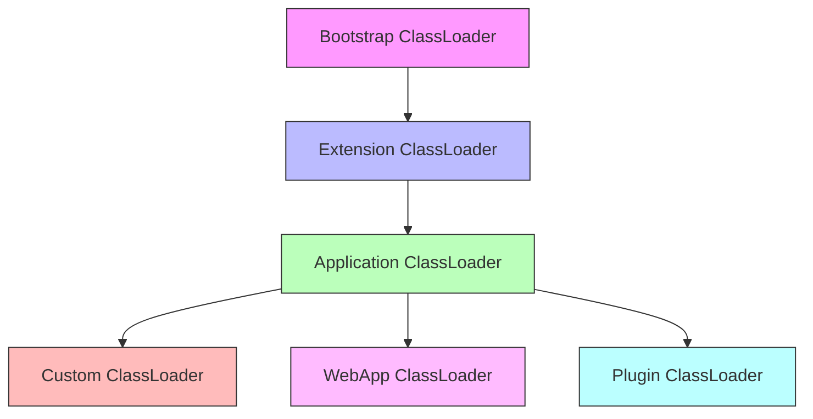

> 💡 *Feature Flag의 개념이 낯설다면 [1부에서 설명한 개념 정리](../feature-flag-part1) 를 참고하세요.*
---
layout: post
title: "Feature Flag 시스템 구축하기 (3부): 멀티모듈 환경에서의 ClassLoader 문제와 해결, 그리고 개선점"
date: 2025-03-16 14:00:00 +0900
categories: [개발, 아키텍처]
tags: [feature-flag, java, 시스템설계]
series: feature-flag
series_order: 3
---

<style>
  /* Custom styles to override theme */
  .post {
    width: 100%;
    max-width: 900px;  /* 데스크톱에서의 최대 너비 */
    margin: 0 auto;
    padding: 20px;     /* 기본 패딩 */
    font-family: -apple-system, BlinkMacSystemFont, "Segoe UI", Roboto, Helvetica, Arial, sans-serif;
    font-size: 16px;   /* 기본 글씨 크기 */
    line-height: 1.6;
  }

  /* 개별 요소 크기 설정 - 중첩된 증가 대신 명확한 크기 지정 */
  p, li { 
    font-size: 16px; 
    margin-bottom: 0.8em;
  }
  
  h1 { font-size: 28px; margin-top: 1.8em; margin-bottom: 0.8em; }
  h2 { font-size: 24px; margin-top: 1.6em; margin-bottom: 0.7em; }
  h3 { font-size: 20px; margin-top: 1.4em; margin-bottom: 0.6em; }
  h4 { font-size: 18px; margin-top: 1.2em; margin-bottom: 0.5em; }
  h5 { font-size: 16px; margin-top: 1.1em; margin-bottom: 0.4em; }
  h6 { font-size: 15px; margin-top: 1em; margin-bottom: 0.3em; }
  
  code {
    font-size: 14px;
  }

  /* 다이어그램 스타일 조정 */
  .alternative-diagram {
    text-align: center !important;
    margin: 20px auto !important;
  }
  
  .alternative-diagram img {
    max-width: 100% !important;
    height: auto !important;
    border: 1px solid #ddd !important;
    border-radius: 4px !important;
  }

  /* 모바일 최적화 */
  @media screen and (max-width: 767px) {
    .post {
      padding: 10px 5px;
      font-size: 15px;
    }
    
    h1 { font-size: 26px; }
    h2 { font-size: 22px; }
    h3 { font-size: 19px; }
  }
</style>

*이 글은 Feature Flag 시스템 구축에 관한 시리즈 중 3부입니다. [1부: 개념, 설계 고민, 그리고 Java SDK 개발 여정](../feature-flag-part1), [2부: 복잡한 엔터프라이즈 환경에서의 기술적 도전기](../feature-flag-part2)도 확인해보세요.*


### 6.1 시스템 구성 및 JVM 메모리 관리

**핵심 구성 요소와 JVM 내 위치**
- `@FeatureFlag`: 클래스 메타정보로 Method Area에 저장
- `FeatureFlagManager`: 애플리케이션 시작 시 reflection을 통해 모든 플래그를 수집하고 초기화
- `ConcurrentHashMap<String, FlagMeta>`: Heap 영역에 저장
- Static primitive 필드: Method Area(필드 참조)와 값은 해당 타입에 따라 저장

이러한 메모리 관리 방식을 통해 플래그 값을 런타임에 동적으로 변경하면서도 메모리 효율성과 성능을 모두 확보할 수 있었다.

### 6.2 FeatureFlagManager의 동작 방식

```java
public class FeatureFlagManager {
    private static final ConcurrentHashMap<String, FlagMeta> flags = new ConcurrentHashMap<>();

    public static void initializeFlags(Class<?>... classesToScan) {
        for (Class<?> clazz : classesToScan) {
            for (Field field : clazz.getDeclaredFields()) {
                if (field.isAnnotationPresent(FeatureFlag.class)) {
                    FeatureFlag annotation = field.getAnnotation(FeatureFlag.class);
                    String flagName = annotation.flagName();

                    field.setAccessible(true);
                    try {
                        // 필드 타입에 따라 다르게 처리
                        Object value = field.get(null);  // static 필드
                        flags.put(flagName, new FlagMeta(field, value, annotation));
                    } catch (Exception e) {
                        throw new RuntimeException(e);
                    }
                }
            }
        }
    }
...
}
```

이 코드는 reflection을 사용하여 어노테이션이 부착된 필드를 찾고, 그 값을 관리하는 핵심 매니저 클래스의 구현이다. 특히 `field.set(null, value)` 부분은 static 필드의 값을 런타임에 동적으로 변경하는 핵심 기능을 담당한다.

## 7. 트러블슈팅: 배포 환경별 ClassLoader 문제

Feature Flag Java SDK를 설계하고 개발하는 과정에서 다양한 기술적 도전 과제들이 있었지만, 그중에서도 현업 배포 환경에서 발생한 ClassLoader 관련 문제는 특히 기억에 남는다. 이 문제는 실제 프로덕션 환경에서의 예상치 못한 변수를 고려하는 것의 중요성을 일깨워주는 소중한 경험이었다.

### 7.1 문제 상황

SDK 개발 완료 후 첫 번째 사용자였던 검색팀으로부터 "Feature Flag를 인식하는 리플렉션이 제대로 동작하지 않는다"는 피드백을 받았다. 개발 환경과 우리 팀의 프로덕션 환경에서는 정상적으로 작동했기 때문에 처음에는 문제의 원인을 파악하기 어려웠다. 로그 분석을 통해 문제 현상을 확인한 결과, 검색팀의 서비스에서는 `@FeatureFlag` 어노테이션이 붙은 필드들이 전혀 인식되지 않았다.

```java
// SDK 내 리플렉션 코드 (문제 발생 전)
private void scanPackages() {
    for (String packageName : packageNames) {
        try {
            Class<?>[] classes = getClasses(packageName);
            for (Class<?> clazz : classes) {
                scanFieldsInClass(clazz);
            }
        } catch (Exception e) {
            logger.error("Error scanning package: " + packageName, e);
        }
    }
}

private Class<?>[] getClasses(String packageName) throws Exception {
    ClassLoader classLoader = Thread.currentThread().getContextClassLoader();
    String path = packageName.replace('.', '/');
    Enumeration<URL> resources = classLoader.getResources(path);
    
    // 패키지 내 클래스 찾기 로직
    // ...
}
```

### 7.2 원인 분석

수일간의 디버깅과 검색팀과의 협업을 통해 문제의 핵심 원인을 파악할 수 있었다:

33. **배포 방식의 차이**: 우리 팀은 Jib을 사용하여 컨테이너 이미지를 만들어 배포했지만, 검색팀은 Executable JAR(fat JAR)로 패키징하여 배포하고 있었다.

34. **ClassLoader 구조와 클래스 이름 변환의 차이**: 
   - 일반적인 JAR 또는 컨테이너 배포에서는 모든 클래스가 같은 ClassLoader에 로드되며 원래의 패키지 이름과 클래스 이름이 그대로 유지된다.
   - 반면 Executable JAR(Spring Boot의 Fat JAR 포함)는 내장된 의존성 JAR 파일들마다 별도의 ClassLoader를 사용하는 구조를 가진다. 검색해본 바로는 Spring Boot의 내장 로더가 의존성 JAR 내부의 클래스를 로드할 때 클래스 이름 앞에 특별한 prefix를 붙인다는 점이 가장 큰 차이였다. 예를 들어, 원래 `com.company.service.MyClass`였던 클래스가 `BOOT-INF.classes.com.company.service.MyClass`와 같은 형태로 변환되었다. 이로 인해 패키지 기반 스캔 시 클래스를 찾지 못하는 문제가 발생했다.

35. **멀티 모듈 프로젝트 문제**: 추가 조사를 통해 다른 팀의 멀티 모듈 프로젝트에서도 모듈 간 ClassLoader 차이로 어노테이션 스캔이 실패하는 유사한 문제가 있음을 확인했다.

<!-- ClassLoader 계층 구조 다이어그램 -->
<div style="text-align:center; margin:20px auto;">

<p style="text-align:center;"><small><i>Java ClassLoader 계층 구조 - 다양한 배포 환경에서 추가 ClassLoader가 생성될 수 있음</i></small></p>
</div>

이러한 클래스 이름 변환은 Spring Boot의 LaunchedURLClassLoader가 수행하며, `Class.forName()`이나 패키지 스캔 시 이러한 변환된 이름을 고려하지 않으면 클래스를 찾지 못하게 된다.

### 7.3 해결 과정

문제를 더 자세히 이해하기 위해 Spring Boot의 Executable JAR 구조를 확인해보았다. 검색 결과, Spring Boot는 JAR 파일 내부에 모든 의존성을 포함하는 "nested JAR" 구조를 사용하며, 이를 실행하기 위해 특별한 ClassLoader와 로딩 메커니즘을 사용한다는 것을 알게 되었다.

```
my-application.jar
├── META-INF
│   └── MANIFEST.MF (Main-Class: org.springframework.boot.loader.JarLauncher)
├── BOOT-INF
│   ├── classes
│   │   └── com
│   │       └── company
│   │           └── service
│   │               └── SearchService.class
│   └── lib
│       ├── dependency1.jar
│       └── dependency2.jar
└── org
    └── springframework
        └── boot
            └── loader
                ├── JarLauncher.class
                └── ...
```

이 구조에서 `BOOT-INF/classes`에는 애플리케이션 클래스가, `BOOT-INF/lib`에는 의존성 JAR 파일들이, 그리고 `org/springframework/boot/loader`에는 이 모든 것을 로드하기 위한 부트스트랩 코드가 포함된다. 이로 인해 클래스 이름이 원래의 패키지 이름에 `BOOT-INF.classes.` 접두어가 붙는 형태로 변환되는 것이었다.

문제 해결을 위해 여러 접근법을 시도했다:

36. **여러 ClassLoader 활용**: 단일 ClassLoader에 의존하지 않고, 접근 가능한 여러 ClassLoader를 조합하여 사용하는 방식으로 코드를 개선했다.

```java
// 개선된 ClassLoader 처리 코드
private List<Class<?>> getAllClasses(String packageName) throws Exception {
    List<Class<?>> classes = new ArrayList<>();
    
    // 1. 현재 스레드의 ContextClassLoader 사용
    ClassLoader contextClassLoader = Thread.currentThread().getContextClassLoader();
    classes.addAll(getClassesFromLoader(packageName, contextClassLoader));
    
    // 2. 현재 클래스의 ClassLoader 사용
    ClassLoader thisClassLoader = this.getClass().getClassLoader();
    if (thisClassLoader != contextClassLoader) {
        classes.addAll(getClassesFromLoader(packageName, thisClassLoader));
    }
    
    // 3. 시스템 ClassLoader 사용
    ClassLoader systemClassLoader = ClassLoader.getSystemClassLoader();
    if (systemClassLoader != contextClassLoader && systemClassLoader != thisClassLoader) {
        classes.addAll(getClassesFromLoader(packageName, systemClassLoader));
    }
    
    return classes;
}
```

37. **직접 클래스 지정 옵션 추가**: 패키지 스캔이 불가능한 상황을 대비해, 사용자가 직접 Flag 클래스를 지정할 수 있는 대체 메서드를 제공했다.

```java
// 직접 클래스를 지정하는 API 추가
public static void registerFlagClasses(Class<?>... classes) {
    for (Class<?> clazz : classes) {
        scanFieldsInClass(clazz);
    }
}
```

38. **클래스 참조 대신 문자열 기반 리플렉션**: Spring Boot의 클래스 이름 변환을 고려하여, 클래스 참조 대신 문자열 기반 클래스 로딩을 활용했다.

```java
// 문자열 기반 클래스 로딩
private Class<?> loadClass(String className, ClassLoader classLoader) {
    try {
        return classLoader.loadClass(className);
    } catch (ClassNotFoundException e) {
        // Spring Boot 패키징을 고려한 대체 시도
        try {
            return classLoader.loadClass("BOOT-INF.classes." + className);
        } catch (ClassNotFoundException ex) {
            logger.debug("Class not found: " + className, ex);
            return null;
        }
    }
}
```

39. **사용자 설정 개선**: SDK 사용자가 자신의 환경에 맞는 ClassLoader를 직접 설정할 수 있는 옵션을 추가했다.

```java
// 사용자 지정 ClassLoader 설정 API
public FeatureFlagManager setCustomClassLoader(ClassLoader classLoader) {
    this.customClassLoader = classLoader;
    return this;
}
```

다양한 해결책을 시도한 결과, 최종적으로는 다양한 ClassLoader를 중첩해서 사용하는 방식이 가장 효과적이었다. 이를 통해 서로 다른 배포 환경과 프로젝트 구조에서도 안정적으로 어노테이션을 스캔할 수 있었다.

### 7.4 배운 점

이 문제를 해결하면서 얻은 핵심 교훈은 다음과 같다:

40. **실제 배포 환경 테스트의 중요성**: 개발 환경과 프로덕션 환경은 종종 예상치 못한 차이가 있으므로, 실제 사용자의 배포 환경과 동일한 조건에서 테스트하는 것이 중요하다.

41. **ClassLoader 계층에 대한 이해**: Java의 ClassLoader는 단순한 구조가 아니며, 프레임워크나 컨테이너에 따라 복잡한 계층을 가질 수 있다. 특히 리플렉션을 사용하는 라이브러리 개발 시 이에 대한 이해가 필수적이다.

42. **우아한 실패보다 강건한 성공을 목표로**: 문제 해결 과정에서 "가능한 모든 방법을 시도해 성공하는" 전략이 "문제 발생 시 우아하게 실패하는" 전략보다 실용적임을 깨달았다.

43. **사용자에게 더 많은 제어권 제공**: 프레임워크나 라이브러리 개발 시, 예상치 못한 상황을 사용자가 직접 해결할 수 있도록 충분한 확장점과 설정 옵션을 제공하는 것이 중요하다.

44. **환경에 따른 차이점 문서화**: 서로 다른 배포 환경에서 발생할 수 있는 문제와 그 해결책을 명확하게 문서화하여, 사용자가 자신의 환경에 맞게 라이브러리를 설정할 수 있도록 지원해야 한다.

이 경험을 통해 라이브러리 개발 시 다양한 사용 환경을 고려하는 것의 중요성을 깊이 이해하게 되었으며, 이는 이후 다른 프로젝트에서도 큰 자산이 되었다.

## 8. 개선 필요사항 및 기술적 아쉬움

Feature Flag 시스템을 개발하고 운영하면서 몇 가지 아쉬운 점과 개선이 필요한 부분을 발견했다. 이러한 부분들은 시간과 리소스 제약으로 구현하지 못했지만, 향후 유사한 시스템을 개발할 때 참고할 만한 중요한 교훈이다.

45. **세밀한 타겟팅 기능**: 현재는 단순 ON/OFF 전환만 가능하다. 사용자 속성(국가, 디바이스 등)에 따라 다른 Flag 값을 제공할 수 있는 기능이 필요하다.

46. **점진적 롤아웃 기능**: 트래픽의 일정 비율(5%, 10%, 50%)에 대해 단계적으로 기능을 적용할 수 있는 기능이 필요하다.

47. **조건부 Flag 활성화**: 특정 조건(시간, 서버 부하 등)에 따라 자동으로 Flag 값이 변경되는 규칙 기반 시스템이 있으면 더욱 유연한 기능 관리가 가능하다.

48. **실험 플랫폼과의 통합**: Feature Flag 시스템과 A/B 테스트 플랫폼을 통합하여 데이터 기반 의사결정으로 확장할 수 있다.

49. **Flag 종속성 관리**: 여러 Flag 간의 종속성을 관리할 수 있는 기능이 필요하다. 특정 Flag가 활성화되면 다른 Flag도 자동으로 변경되는 규칙을 설정할 수 있다면 복잡한 기능 출시를 더 안전하게 관리할 수 있다.

50. **성능 최적화**: Java의 Reflection API 사용으로 인한 성능 영향을 최소화하고, 더 정교한 캐시 무효화 메커니즘을 구현했다면 더 효율적이었을 것이다.

## 결론

Feature Flag 시스템 구축 시리즈의 마지막 3부에서는 멀티모듈 환경에서 발생한 ClassLoader 문제와 그 해결 과정을 자세히 살펴보았다. 이 과정에서 우리는 실제 배포 환경 테스트의 중요성, ClassLoader 계층 구조에 대한 깊은 이해의 필요성, 그리고 라이브러리 사용자에게 충분한 제어권을 제공하는 것의 가치를 배웠다. 현재 시스템은 세밀한 타겟팅, 점진적 롤아웃, 조건부 Flag 활성화 등 여러 개선 포인트가 있지만, 이미 안정적으로 운영되며 우리 조직의 기능 출시 프로세스를 크게 개선했다. 이러한 경험과 교훈은 향후 유사한 시스템을 구축할 때 귀중한 참고자료가 될 것이다.


## 참고자료

Martin Fowler의 ["Feature Toggles (Feature Flags)"](https://martinfowler.com/articles/feature-toggles.html) - Feature Flag의 개념과 사용 패턴